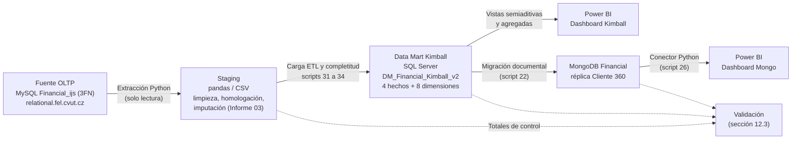

# UNIVERSIDAD TÉCNICA DE AMBATO
## FACULTAD DE INGENIERÍA EN SISTEMAS ELECTRÓNICA E INDUSTRIAL
### CARRERA DE SOFTWARE
### CICLO ACADÉMICO: AGOSTO 2026 – DICIEMBRE 2026

---

# INFORME DE GUÍA PRÁCTICA

## I. PORTADA

| Campo | Detalle |
| :--- | :--- |
| **Tema:** | Carta de Diseño (v8 — Problemas de negocio sustentados con evidencia, declaración de granularidad, relaciones multivaluadas resueltas, arquitectura, plan de implementación y plan de validación del modelo OLAP Kimball) |
| **Unidad de Organización Curricular:** | PROFESIONAL |
| **Nivel y Paralelo:** | 6to Software "A" |
| **Alumnos participantes:** | Cobos Taco Alison Marcela / Lagua Flores Henry Daniel |
| **Asignatura:** | Inteligencia de Negocios |
| **Docente:** | Ing. Ruben Nogales, Mg. |

---

## II. INFORME DE GUÍA PRÁCTICA

### 2.1 Objetivos

#### General:
Diseñar una solución de Inteligencia de Negocios sobre la base `Financial_ijs` que permita medir la morosidad, explicar el impago a partir de la capacidad de pago del cliente y dar seguimiento consistente a la posición de saldos, formulando la Carta de Diseño y el modelo dimensional de Ralph Kimball que la implementa.

#### Específicos:
1. **Sustentar cada problema de negocio con evidencia cuantitativa** obtenida por consulta directa a la fuente, y derivar de él las preguntas, indicadores y tablas de hechos del modelo.
2. **Declarar la granularidad de cada tabla de hechos** y las reglas que impiden mezclar granos en una misma medida, resolviendo explícitamente las relaciones multivaluadas cuenta–cliente, cuenta–préstamo, cuenta–orden y cuenta–tarjeta.
3. **Definir la arquitectura, la Matriz de Bus y el plan de implementación** del Data Mart Kimball, justificando su elección frente a Bill Inmon.
4. **Establecer un plan de validación reproducible** con totales de control por conteo, monto y desglose (año, región y categoría), incluidas las medidas semiaditivas.

### 2.2 Modalidad
Presencial

### 2.3 Tiempo de duración
* **Presenciales:** 6 horas
* **No presenciales:** 0 horas

### 2.4 Instrucciones
Seguir el formato oficial de levantamiento de datos para la planificación de un modelo OLAP e ir completando las secciones correspondientes al trabajo desarrollado, aplicando los estándares de modelado dimensional sobre el caso de estudio bancario `Financial_ijs`.

### 2.5 Listado de equipos, materiales y recursos
* **Materiales generales:** Computador, Internet, Apuntes de clase, Herramientas de consulta SQL (SSMS, Python, DBeaver).
* **TAC (Tecnologías para el Aprendizaje y Conocimiento):**
  * [x] Plataformas educativas
  * [ ] Simuladores y laboratorios virtuales
  * [x] Aplicaciones educativas (SQL Server Developer, Python/pandas/SciPy, Visual Studio Code, Power BI Desktop)
  * [ ] Recursos audiovisuales
  * [ ] Gamificación
  * [x] Inteligencia Artificial
  * [ ] Otros

### 2.6 Actividades por desarrollar
Detalladas en la guía práctica provista por el docente de la cátedra.

---

### 2.7 Resultados obtenidos

> [!NOTE]
> **Fuente de todas las cifras.** Cada número de esta carta se obtuvo por consulta directa al servidor `relational.fel.cvut.cz` (base `Financial_ijs`, usuario `guest`) el 28/09/2026. Las pruebas estadísticas se calcularon con SciPy sobre esos mismos datos. La sección **13. Respuesta a las observaciones de la versión 1.0** indica dónde se resuelve cada observación del docente.

---

#### 1. Datos generales del levantamiento

| Campo | Detalle | Campo | Detalle |
| :--- | :--- | :--- | :--- |
| **Institución / Empresa** | Banco Comercial Checo / `Financial_ijs` | **Área analizada** | Gestión de Riesgo Crediticio, Cartera de Préstamos y Operaciones Financieras |
| **Carrera / Asignatura** | Ingeniería de Software / Inteligencia de Negocios | **Periodo académico** | Agosto 2026 – Diciembre 2026 |
| **Integrantes** | Henry Daniel Lagua Flores; Alison Marcela Cobos Taco | **Docente** | Ing. Ruben Nogales, Mg. |
| **Fecha de levantamiento** | 24 de agosto de 2026 (v1.0). Revisión v8: 28 de septiembre de 2026 | **Versión** | 8.0 |
| **Persona entrevistada** | N/A — Proyecto basado en dataset benchmark público (CTU Prague / PKDD 1999) | **Cargo** | N/A |
| **Proceso o unidad de negocio** | Colocación y seguimiento de cartera de crédito, órdenes de pago permanentes y movimientos de las cuentas corrientes | | |

---

#### 2. Necesidad del negocio o problema a resolver

##### 2.1 Problemas detectados

Los tres problemas se formulan a partir de lo que muestran los datos, y cada uno da origen a una parte del modelo dimensional (ver 2.3).

**Problema 1 — La cartera tiene un nivel de impago relevante y los casos en mora crecen con el volumen colocado.**

| Evidencia | Valor | Cómo se obtuvo |
| :--- | :--- | :--- |
| Préstamos en mora activa (D) sobre la cartera vigente (C + D) | **45 de 448 = 10.04%** | `COUNT(status='D') / COUNT(status IN ('C','D'))` |
| Préstamos cerrados con deuda impaga (B) sobre los cerrados (A + B) | **31 de 234 = 13.25%** | `COUNT(status='B') / COUNT(status IN ('A','B'))` |
| Préstamos con problemas de pago (B o D) sobre el total | **76 de 682 = 11.14%** | `COUNT(status IN ('B','D')) / COUNT(*)` |
| Monto original de los préstamos B y D | **$15,580,152** | `SUM(amount)` de B y D |
| Préstamos en mora por año de otorgamiento (1994 → 1997) | **2 → 23** | Conteo por `YEAR(loans.date)` |
| Préstamos otorgados por año (1994 → 1997) | **101 → 196** | Conteo por `YEAR(loans.date)` |
| Tasa de mora por año de otorgamiento, 1994–1997 | **12.5%, 15.4%, 12.2%, 15.0%** | D / (C + D) por año |
| ¿La tasa cambia entre esos años? | **No: χ² = 0.44, gl = 3, p = 0.93** | Prueba χ² de independencia año × estado (C/D) |

*Lectura:* el número de préstamos en mora creció porque se colocaron más préstamos, no porque cada préstamo sea más riesgoso. El riesgo por préstamo es estable y alto: uno de cada nueve préstamos tiene problemas de pago.

*Limitación declarada:* `loans.status` es el estado **al corte de 1998**, no un historial. Los préstamos de 1998 tuvieron pocos meses para caer en mora (tasa 2.53%) y no son comparables con años anteriores. Por eso el modelo guarda la antigüedad del préstamo al corte.

**Problema 2 — El impago depende de la capacidad de pago del cliente, y esa capacidad no se ve en ninguna tabla por separado.**

Para cada préstamo se calculó la **relación cuota / saldo previo**: la cuota mensual (`loans.payments`) dividida entre el saldo promedio de la cuenta en todas sus transacciones anteriores a la fecha del préstamo. Los 682 préstamos tienen historial previo (mínimo 2 movimientos, mediana 77; mediana de 13 meses entre la apertura de la cuenta y el préstamo).

| Cuartil de cuota / saldo previo | Rango | Préstamos | Con impago (B o D) | Tasa de impago |
| :--- | :--- | ---: | ---: | ---: |
| Q1 (cuota baja frente al saldo) | 0.5% – 5.7% | 171 | 5 | **2.9%** |
| Q2 | 5.7% – 9.0% | 170 | 16 | 9.4% |
| Q3 | 9.0% – 12.3% | 170 | 15 | 8.8% |
| Q4 (cuota alta frente al saldo) | 12.3% – 139.4% | 171 | 40 | **23.4%** |

| Prueba | Resultado |
| :--- | :--- |
| χ² de independencia cuartil × impago | χ² = 39.01, gl = 3, **p < 0.001** (frecuencia esperada mínima 18.9; cumple la regla de Cochran) |
| Tendencia creciente (Cochran-Armitage) | z = 5.65, **p < 0.001** |
| Q4 frente a Q1 (Fisher exacto) | Razón de probabilidades = 10.1, **p < 0.001** |
| Mediana de cuota / saldo previo | 12.8% en préstamos con impago frente a 8.8% en préstamos sin impago (Mann-Whitney, **p < 0.001**) |
| ¿Se cumple en los dos tipos de cartera? | Sí. Cerrados: impago B de 1.9% (Q1) a 24.6% (Q4). Vigentes: mora D de 3.4% (Q1) a 22.5% (Q4) |

A esto se suma el **compromiso fijo mensual** de las cuentas: las órdenes permanentes (`orders`) incluyen la cuota del préstamo (la orden `UVER` coincide con la cuota en 650 de 682 préstamos) y otros pagos fijos. Además, **35 cuentas pagan cuotas de préstamo (`UVER`, $177,154 al mes en total) sin tener un préstamo en este banco**: es deuda con otras entidades que no aparece en la cartera.

*Lectura:* la capacidad de pago previa separa a los clientes que caen en impago con mucha más fuerza que el año o la región. Pero para calcularla hay que combinar préstamos, transacciones y órdenes: ninguna tabla de la fuente la contiene.

**Problema 3 — La posición de saldos no tiene una medición única y confiable.**

| Evidencia | Valor |
| :--- | :--- |
| Saldo total al corte tomando el último movimiento por cuenta y desempatando por el `trans.id` mayor | **$197,140,434** |
| Mismo cálculo desempatando por el `trans.id` menor (cifra usada en la versión 1.0) | $197,140,249 |
| Sumando todos los movimientos del último día de cada cuenta | $204,793,819 |
| Cuentas con saldo negativo al corte / en algún cierre de mes entre 1993 y 1998 | 39 (−$265,470) / 193 |
| Cobros de interés sancionatorio por sobregiro (`SANKC. UROK`) | 1,577 movimientos |
| Cuentas cuyo último movimiento es anterior a diciembre de 1998 | 76 |
| Cartera vigente (C + D) sobre el saldo neto al corte | **$80,296,176 / $197,140,434 = 40.73%** |

*Lectura:* el saldo es una medida **semiaditiva** y tres cálculos razonables dan tres resultados distintos. Además, hay cuentas sin movimientos recientes y cuentas que entran y salen de sobregiro. Sin una regla única, el indicador de liquidez cambia según quién lo calcule. El nivel de absorción de 40.73% es moderado y **no evidencia por sí solo una crisis de liquidez**; el problema es de medición y seguimiento.

##### 2.2 Campos de la necesidad

| Campo | Contenido |
| :--- | :--- |
| **Decisión que se desea mejorar** | (1) Otorgamiento de crédito: incorporar la capacidad de pago previa (cuota / saldo y compromisos fijos) como criterio de aprobación y de monto. (2) Cobranza: priorizar préstamos vigentes con cuota alta frente al saldo y regiones con más mora. (3) Seguimiento de saldos: medir la posición de las cuentas con una sola regla y vigilar sobregiros. |
| **Usuarios del análisis** | Gerencia de Riesgo y Crédito, Oficiales de Cobranza, Gerencia de Operaciones y Tesorería, Analistas de Inteligencia de Negocios. En el dataset no se identifica un usuario real del banco. |
| **Preguntas clave que debe responder el sistema** | 1. ¿Cómo evolucionan la cantidad y la tasa de préstamos en mora por año de otorgamiento, y cuál es la pérdida en préstamos cerrados? 2. ¿Qué regiones y distritos concentran la cartera y la mora? 3. ¿Qué proporción del saldo de las cuentas está comprometida en la cartera vigente y cómo evoluciona el saldo mes a mes? 4. ¿Qué operaciones concentran el flujo monetario, cómo varía el saldo promedio y cuántas cuentas caen en sobregiro? 5. ¿Qué cuentas comprometen en cuotas y órdenes fijas una proporción alta de su saldo habitual, incluidas deudas con otras entidades? 6. ¿Qué clientes tienen impago histórico y en qué medida la capacidad de pago previa anticipa el impago? |
| **Alcance del análisis** | Base `Financial_ijs`, 1993–1998: 4,500 cuentas, 5,369 clientes, 682 préstamos, 6,471 órdenes permanentes, 1,056,320 transacciones y 77 distritos. Las tarjetas (`cards`, 892) quedan fuera de esta iteración. |
| **Beneficio esperado** | Una regla de aprobación basada en capacidad de pago (en los datos, el cuartil más alto de cuota / saldo tiene 8 veces la tasa de impago del más bajo); una lista priorizada de cobranza; y un indicador de saldo único y reproducible. |

##### 2.3 Trazabilidad: problema → pregunta → modelo

| Problema | Preguntas | Proceso de negocio | Tabla de hechos | Medidas principales |
| :--- | :--- | :--- | :--- | :--- |
| 1. Impago y mora | 1, 2, 6 | Colocación de cartera | `Fact_Prestamos` | Cantidad y tasa de mora, tasa de incumplimiento, monto en riesgo, antigüedad al corte |
| 2. Capacidad de pago | 5, 6 | Cruce de colocación, movimientos y órdenes | `Fact_Prestamos` + `Fact_Ordenes` + `Fact_Saldo_Cuenta_Mensual` (integrados por `Dim_Cuenta`) | Cuota / saldo previo, tasa de impago por banda de capacidad, índice de saturación, crédito externo |
| 3. Medición de saldos | 3, 4 | Movimientos de cuenta | `Fact_Transacciones` + `Fact_Saldo_Cuenta_Mensual` | Saldo al corte, saldo fin de mes, ratio de absorción, cuentas en sobregiro, flujo por operación |

---

#### 3. Objetivos analíticos del modelo OLAP

| Objetivo específico | Pregunta de negocio | Indicador asociado |
| :--- | :--- | :--- |
| Analizar la evolución de la mora | ¿Cómo cambian la cantidad y la tasa de mora por año de otorgamiento? | Préstamos en mora D; Tasa de Mora Vigente (10.04%) por año con error estándar |
| Medir la calidad de los préstamos cerrados | ¿Qué proporción de los préstamos cerrados terminó con deuda impaga? | Tasa de Incumplimiento Histórico (13.25%) |
| Evaluar la concentración geográfica | ¿Qué regiones y distritos concentran cartera y mora? | Cartera, préstamos y tasa de mora por región (inferencial) y distrito (descriptivo, con *n*) |
| Medir la capacidad de pago | ¿La relación cuota / saldo previo anticipa el impago? | Cuota / saldo previo; tasa de impago por banda de capacidad |
| Monitorear los compromisos fijos | ¿Qué cuentas comprometen más de su saldo en pagos fijos? | Índice de saturación (órdenes / saldo promedio); cuentas con crédito externo |
| Dar seguimiento a los saldos | ¿Cuál es la posición de saldos y cuánto está comprometido en cartera vigente? | Saldo neto al corte; saldo fin de mes; Ratio de Absorción de Cartera Vigente (40.73%); cuentas en sobregiro |
| Caracterizar el flujo transaccional | ¿Qué operaciones concentran el flujo y cómo varía el saldo promedio? | Conteo, monto total y ticket promedio por categoría de operación |

---

#### 4. Procesos del negocio a modelar

| Proceso | Descripción breve | Evento medible | Sistema fuente | Prioridad |
| :--- | :--- | :--- | :--- | :--- |
| **1. Colocación y seguimiento de cartera** | Otorgamiento de préstamos y estado de pago al corte (A, B, C, D). | Otorgamiento del préstamo | `loans` | **Alta** |
| **2. Movimientos de cuenta** | Depósitos, retiros, transferencias, abono de intereses, comisiones y sanciones. | Débito o crédito asentado en la cuenta | `trans` | **Alta** |
| **3. Posición de saldos** | Saldo de cada cuenta al cierre de cada mes, derivado de los movimientos. | Cierre de mes | `trans` (derivado) | **Alta** |
| **4. Órdenes permanentes de pago** | Pagos fijos registrados en la cuenta (servicios, cuotas, leasing, seguros). La fuente es una foto de las órdenes vigentes, **sin fecha**. | Orden permanente registrada | `orders` | **Media-Alta** |
| **5. Administración de cuentas y clientes** | Apertura de cuentas y vinculación de titulares y cotitulares. | Apertura de cuenta | `accounts`, `clients`, `disps` | **Media** (se modela como dimensiones) |

> [!NOTE]
> **Tarjetas fuera de alcance:** `cards` (892 tarjetas: 659 *classic*, 145 *junior*, 88 *gold*, todas emitidas a titulares OWNER) no responde a ninguno de los tres problemas. Se incorporará como `Dim_Tarjeta` en una iteración posterior mediante `cards.disp_id → disps.id`.

---

#### 5. Datos requeridos para el análisis

| Categoría | Dato requerido | Campo o atributo origen | Unidad / Formato | Periodicidad | Observaciones metodológicas |
| :--- | :--- | :--- | :--- | :--- | :--- |
| **Colocación** | Monto otorgado | `loans.amount` | Monetario entero (`decimal(10,0)`) | Por préstamo | En la fuente siempre se cumple `amount = payments × duration`: es el total a reembolsar. |
| **Colocación** | Plazo | `loans.duration` | Meses | Por préstamo | 12, 24, 36, 48 o 60. |
| **Colocación** | Cuota mensual | `loans.payments` | Monetario entero | Por préstamo | Numerador de cuota / saldo previo y base del saldo por cobrar. |
| **Cartera** | Estado del préstamo | `loans.status` | A, B, C, D | Por préstamo | Estado al corte de 1998. |
| **Cartera** | Fecha de otorgamiento | `loans.date` | `DATE` | Por préstamo | 1993-07-05 a 1998-12-08. |
| **Cuentas** | Apertura, frecuencia de extracto y distrito | `accounts.date`, `accounts.frequency`, `accounts.district_id` | `DATE` / Categórico | Por cuenta | `district_id` es el distrito que se asigna a los hechos. |
| **Clientes** | Fecha de nacimiento y sexo | `clients.birth_number` | Texto `AAMMDD` (+50 al mes en mujeres) | Por cliente | Se descompone en staging; no pasa al modelo. |
| **Clientes** | Rol en la cuenta | `disps.type` | `OWNER` / `DISPONENT` | Por vinculación | Resuelve la relación cuenta–cliente. |
| **Clientes** | Antecedente de pago | `tkeys.goodClient` (vía `clients.tkey_id`) | `0` / `1` | Por préstamo cerrado | Verificado: `1` = los 31 préstamos B, `0` = los 203 préstamos A. |
| **Movimientos** | Tipo, operación y concepto | `trans.type`, `trans.operation`, `trans.k_symbol` | Categórico (checo) | Por transacción | Homologación en la sección 11. |
| **Movimientos** | Fecha, monto y saldo resultante | `trans.date`, `trans.amount`, `trans.balance` | `DATE` / monetario entero | Por transacción | `balance` es el saldo después del movimiento: medida semiaditiva. |
| **Órdenes** | Monto y propósito | `orders.amount`, `orders.k_symbol` | Monetario entero / Categórico | Por orden | Total $21,229,041; 1,379 órdenes sin propósito. No tienen fecha. |
| **Geografía** | Indicadores del distrito | `districts.A2` a `A16` | Categórico / Numérico | Por distrito | Desempleo y criminalidad de 1995 y 1996. |

---

#### 6. Fuentes de información

| Fuente | Tipo | Responsable | Acceso | Calidad percibida | Notas |
| :--- | :--- | :--- | :--- | :--- | :--- |
| ERP | No aplica | N/A | N/A | N/A | No existe ERP en el benchmark. |
| CRM | No aplica como sistema independiente | N/A | N/A | N/A | La información de clientes está en `clients`, `disps` y `cards`. |
| **Base de datos operativa** | MySQL / MariaDB relacional en 3FN (`Financial_ijs`) | CTU Prague (repositorio académico) | Remoto: `relational.fel.cvut.cz:3306`, usuario `guest`, solo lectura | Alta para benchmark, con las limitaciones de la sección 10 | 9 tablas: `accounts`, `clients`, `disps`, `loans`, `orders`, `trans`, `cards`, `districts`, `tkeys`. |
| Hoja de cálculo | No es fuente primaria | N/A | N/A | N/A | Solo para validación manual. |
| API / web | No aplica | N/A | N/A | N/A | No requerida. |
| **Fuente pública de referencia** | PKDD-ECML 1999 Discovery Challenge (Berka, 2000) | CTU Prague | Pública | Alta | Documenta el significado de los códigos. |

---

#### 7. Métricas e indicadores preliminares

| Categoría | Indicador / KPI | Fórmula o definición | Grano de origen | Nivel de análisis | Agregación / Tipo |
| :--- | :--- | :--- | :--- | :--- | :--- |
| Colocación | Monto Total Colocado | $\sum \text{monto\_prestamo}$ | Préstamo | Año / Región / Distrito | SUM · Aditiva ($103,261,740) |
| Colocación | Ticket Promedio | $\text{AVG}(\text{monto\_prestamo})$ | Préstamo | Año / Región | AVG · No aditiva |
| Cartera | Cartera Vigente | $\sum \text{monto\_prestamo}$ con estado C o D | Préstamo | Región / Distrito | SUM · Aditiva ($80,296,176) |
| Cartera | Tasa de Mora Vigente | $\frac{\text{COUNT}(D)}{\text{COUNT}(C+D)}$ | Préstamo | Año de otorgamiento / Región / Distrito | Razón de conteos (10.04%) |
| Cartera | Tasa de Incumplimiento Histórico | $\frac{\text{COUNT}(B)}{\text{COUNT}(A+B)}$ | Préstamo | Año / Región | Razón de conteos (13.25%) |
| Cartera | Monto Original en Riesgo | $\sum \text{monto\_prestamo}$ con estado B o D | Préstamo | Región / Distrito | SUM · Aditiva ($15,580,152) |
| Cartera | Saldo por Cobrar Estimado | $\max(0,\ \text{monto} - \text{cuota} \times \min(\text{plazo},\ m))$, con $m$ = meses entre el mes de otorgamiento y diciembre de 1998 | Préstamo | Región / Estado | SUM · Aditiva (C + D: $46,620,926; D: $5,882,185) |
| Capacidad | Cuota / Saldo Previo | $\frac{\text{cuota}}{\text{saldo promedio de la cuenta antes del préstamo}}$ | Préstamo | Banda de capacidad / Estado | MEDIANA o AVG · **No aditiva** (nunca se suma) |
| Capacidad | Tasa de Impago por Banda | $\frac{\text{COUNT}(B+D)}{\text{COUNT}(*)}$ dentro de cada banda | Préstamo | Banda de capacidad | Razón de conteos |
| Capacidad | Índice de Saturación | $\frac{\sum \text{órdenes de la cuenta}}{\text{saldo promedio de la cuenta}}$ | Cuenta (órdenes agregadas / saldo agregado) | Cuenta | Razón · No aditiva (alerta > 0.5) |
| Capacidad | Cuentas con Crédito Externo | Cuentas con orden `UVER` y sin préstamo en `loans` | Cuenta | Región | COUNT (35) |
| Saldos | Saldo Neto al Corte | $\sum$ saldo del último movimiento por cuenta (desempate por `trans.id` mayor) | Cuenta × mes (foto) | Región / Distrito | **Semiaditiva**: suma entre cuentas, nunca entre meses ($197,140,434) |
| Saldos | Ratio de Absorción de Cartera Vigente | $\frac{\text{Cartera Vigente}}{\text{Saldo Neto al Corte}}$ | Se agregan por separado y luego se dividen | Institución / Región | Razón (40.73%) |
| Saldos | Cuentas en Sobregiro | Cuentas con saldo fin de mes < 0 | Cuenta × mes | Mes / Región | COUNT DISTINCT (39 al corte) |
| Movimientos | Flujo Transaccional | $\sum \text{monto\_transaccion}$ | Transacción | Año / Categoría de operación | SUM · Aditiva ($6,257,862,197) |
| Movimientos | Ticket Promedio por Transacción | $\text{AVG}(\text{monto\_transaccion})$ | Transacción | Año / Categoría de operación | AVG · No aditiva |
| Órdenes | Compromiso de Débitos Automáticos | $\sum \text{monto\_orden}$ | Orden | Propósito / Región | SUM · Aditiva ($21,229,041) |

**Bandas de capacidad** (atributo `banda_capacidad` de `Fact_Prestamos`): límites fijos tomados de los cuartiles observados en 1993–1998 y redondeados a un decimal: **Baja** ≤ 5.7%, **Media-baja** ≤ 9.0%, **Media-alta** ≤ 12.3%, **Alta** > 12.3%. Con esos límites las bandas tienen 171, 167, 172 y 172 préstamos, con tasas de impago de 2.9%, 9.6%, 8.7% y 23.3%. Se fijan como constantes para que un préstamo nuevo no cambie la banda de los anteriores.

> [!IMPORTANT]
> **Reglas de cálculo:**
> 1. **Último saldo por cuenta:** movimiento con la fecha más reciente y, si hay varios ese día, el de mayor `trans.id`.
> 2. **Saldos negativos:** el saldo neto incluye los sobregiros. La suma solo de saldos positivos ($197,405,904) es un dato complementario.
> 3. **Fecha de corte:** 31/12/1998. Las 76 cuentas sin movimientos en diciembre de 1998 arrastran su último saldo.
> 4. **Tamaño mínimo de muestra:** 70 de los 77 distritos tienen menos de 10 préstamos vigentes. Las conclusiones inferenciales sobre tasas se hacen por **región** (35 a 88 préstamos vigentes) con su error estándar $\sqrt{p(1-p)/n}$; por distrito, la tasa es descriptiva y se muestra con su *n*.
> 5. **Razones entre granos distintos:** numerador y denominador se agregan por separado al mismo nivel (institución, región o cuenta) y solo después se dividen. Nunca se divide fila a fila entre hechos de distinto grano.

---

#### 8. Definición de hechos y dimensiones (Modelo Dimensional Kimball)

| Elemento | Nombre | Descripción | Jerarquías o niveles | Claves | Observaciones / SCD |
| :--- | :--- | :--- | :--- | :--- | :--- |
| **Hecho** | `Fact_Prestamos` | Un préstamo otorgado (682 filas). Medidas: `monto_prestamo`, `pago_mensual`, `plazo_meses`, `saldo_pendiente_estimado`, `meses_transcurridos_al_corte`, `saldo_promedio_previo`, `ratio_cuota_saldo_previo`; atributo `banda_capacidad`. | Tiempo (otorgamiento) > Año > Mes; Región > Distrito | `sk_prestamo` (PK), `sk_tiempo`, `sk_cuenta`, `sk_cliente`, `sk_distrito`, `sk_estado_prestamo` | Hecho de evento con estado al corte de 1998 |
| **Hecho** | `Fact_Transacciones` | Un movimiento en cuenta (1,056,320 filas). Medidas: `monto_transaccion` (aditiva) y `saldo_cuenta` (semiaditiva). | Tiempo > Año > Mes > Día; Categoría de operación > Operación > Concepto | `sk_transaccion` (PK), `sk_tiempo`, `sk_cuenta`, `sk_cliente`, `sk_distrito`, `sk_operacion` | Hecho transaccional |
| **Hecho** | `Fact_Saldo_Cuenta_Mensual` | Saldo de una cuenta al cierre de un mes (185,615 filas: cada cuenta desde su primer mes con movimientos hasta diciembre de 1998). Medidas: `saldo_fin_mes`, `saldo_promedio_mes`, `num_movimientos_mes`, `en_sobregiro`. | Tiempo (mes) > Año; Región > Distrito | `sk_cuenta`, `sk_mes` (PK compuesta), `sk_cliente`, `sk_distrito` | **Foto periódica.** Control: diciembre de 1998 suma $197,140,434 |
| **Hecho** | `Fact_Ordenes` | Una orden permanente vigente (6,471 filas). Medida: `monto_orden`. | Propósito > Símbolo; Región > Distrito | `sk_orden` (PK), `sk_cuenta`, `sk_cliente`, `sk_distrito`, `sk_orden_tipo`, `sk_tiempo_apertura_cuenta` | Foto sin fecha de evento. `sk_tiempo_apertura_cuenta` es la fecha de apertura de la cuenta (rol de `Dim_Tiempo`) y **no sirve para series temporales de órdenes** |
| **Dimensión** | `Dim_Tiempo` | Calendario diario 1993-01-01 a 1998-12-31 (2,191 días), con nivel mes para la foto periódica. | Año > Semestre > Trimestre > Mes > Día | `sk_tiempo` | Conformada |
| **Dimensión** | `Dim_Cliente` | Los 5,369 clientes (titulares y cotitulares): sexo, fecha de nacimiento, edad al 31/12/1998, rol, etiqueta de buen pagador y distrito de residencia. | Región > Distrito de residencia > Cliente | `sk_cliente`, `id_cliente_bk` | Conformada · SCD 1 |
| **Dimensión** | `Dim_Cuenta` | Las 4,500 cuentas: fecha de apertura, frecuencia de extracto traducida, distrito de la cuenta, `tiene_credito_externo` y `monto_credito_externo`. | Región > Distrito > Cuenta | `sk_cuenta`, `id_cuenta_bk` | Conformada · SCD 1. Integra los procesos (*drill-across*) |
| **Dimensión** | `Dim_Distrito` | Los 77 distritos con indicadores socioeconómicos 1995 y 1996. | Región > Distrito | `sk_distrito`, `id_distrito_bk` | Conformada · SCD 0 |
| **Dimensión** | `Dim_Estado_Prestamo` | Catálogo fijo A, B, C, D. | Condición (Vigente / Cerrado) > Estado | `sk_estado_prestamo` | SCD 0 |
| **Dimensión** | `Dim_Operacion` | Una fila por combinación real `type` + `operation` + `k_symbol` normalizado (15 filas), con la categoría analítica de 4 valores. | Categoría analítica > Tipo > Operación > Concepto | `sk_operacion` | SCD 0 |
| **Dimensión** | `Dim_Orden` | Propósito de la orden (5 valores). | Categoría > Símbolo | `sk_orden_tipo` | SCD 0 |
| **Puente** | `Puente_Cuenta_Cliente` | Una fila por cliente (5,369: 4,500 titulares y 869 cotitulares) con su cuenta y su rol. | — | `sk_cuenta`, `sk_cliente` (PK compuesta) | Resuelve la relación multivaluada cuenta–cliente (sección 9.2) |
| **Dimensión** | `Dim_Concepto_Movimiento` | Concepto de cada transacción **después de la completitud** (19 combinaciones de concepto × método × contraparte). Complementa a `Dim_Operacion`, que conserva el dato original. | Concepto > Método (fuente / inferido) > Contraparte | `sk_concepto` | SCD 0. Se asigna en la etapa de completitud (Informe 10) |

**Matriz de Bus (procesos × dimensiones conformadas):**

| Proceso / Hecho | Tiempo | Cliente | Cuenta | Distrito | Estado préstamo | Operación | Concepto | Orden |
| :--- | :-: | :-: | :-: | :-: | :-: | :-: | :-: | :-: |
| Colocación de cartera (`Fact_Prestamos`) | ✔ (otorgamiento) | ✔ (titular) | ✔ | ✔ (de la cuenta) | ✔ | | | |
| Movimientos de cuenta (`Fact_Transacciones`) | ✔ (día) | ✔ (titular) | ✔ | ✔ (de la cuenta) | | ✔ (fuente) | ✔ (completado) | |
| Posición de saldos (`Fact_Saldo_Cuenta_Mensual`) | ✔ (mes) | ✔ (titular) | ✔ | ✔ (de la cuenta) | | | | |
| Órdenes permanentes (`Fact_Ordenes`) | ✔ (apertura de cuenta, rol) | ✔ (titular) | ✔ | ✔ (de la cuenta) | | | | ✔ |

`Dim_Cuenta`, `Dim_Cliente`, `Dim_Distrito` y `Dim_Tiempo` son **conformadas**: tienen el mismo significado en todos los hechos. Esto permite responder el problema 2 combinando hechos por cuenta sin unirlos fila a fila.

---

#### 9. Granularidad del modelo

##### 9.1 Declaración de grano por tabla de hechos

| Tabla de hechos | Grano (una fila por…) | Tipo de hecho | Medidas aditivas | Medidas semiaditivas | Medidas no aditivas | Clave natural que garantiza el grano |
| :--- | :--- | :--- | :--- | :--- | :--- | :--- |
| `Fact_Prestamos` | préstamo | Evento (otorgamiento) con estado al corte | `monto_prestamo`, `pago_mensual`, `saldo_pendiente_estimado` | — | `plazo_meses`, `meses_transcurridos_al_corte`, `saldo_promedio_previo`, `ratio_cuota_saldo_previo` | `loans.id` (682 únicos; 1 préstamo por cuenta como máximo) |
| `Fact_Transacciones` | movimiento en cuenta | Transaccional | `monto_transaccion` | `saldo_cuenta` (no se suma en el tiempo) | — | `trans.id` (1,056,320 únicos) |
| `Fact_Saldo_Cuenta_Mensual` | cuenta × mes | Foto periódica | `num_movimientos_mes` | `saldo_fin_mes`, `saldo_promedio_mes` | `en_sobregiro` (se cuenta, no se suma) | (`account_id`, mes) |
| `Fact_Ordenes` | orden permanente vigente | Foto sin fecha | `monto_orden` | — | — | `orders.id` (6,471 únicos) |

##### 9.2 Relaciones multivaluadas resueltas (verificadas en la fuente)

En banca, el equivalente del "pedido – producto – vendedor" del comercio es **cuenta – cliente – préstamo / orden / tarjeta**. Estas son las cardinalidades reales:

| Relación | Cardinalidad verificada | Riesgo si no se resuelve | Resolución en el modelo |
| :--- | :--- | :--- | :--- |
| Cliente – Cuenta (`disps`) | Cada cliente tiene exactamente 1 cuenta. Cada cuenta tiene exactamente 1 titular (OWNER) y 0 o 1 cotitular (DISPONENT): 3,631 cuentas individuales y 869 mancomunadas | Unir hechos con `disps` duplica montos en 869 cuentas | Los hechos se unen **solo al titular**. `Dim_Cliente` guarda a los 5,369 clientes con su rol, y la tabla `Puente_Cuenta_Cliente` vincula a cada cliente, incluidos los cotitulares, con su cuenta |
| Cuenta – Préstamo | 0 o 1 préstamo por cuenta (682 préstamos en 682 cuentas) | Ninguno | `Fact_Prestamos` se une por cuenta sin duplicación |
| Cuenta – Orden | 0 a 5 órdenes por cuenta (3,758 cuentas con órdenes) | Unir órdenes con préstamos a nivel de fila multiplica el préstamo | Se combinan por *drill-across*: cada hecho se agrega por cuenta y luego se relacionan |
| Cuenta – Transacción | 1 a N movimientos por cuenta | Sumar saldos de varios movimientos | Saldo semiaditivo en `Fact_Saldo_Cuenta_Mensual` |
| Cliente – `tkeys` | 289 clientes con `tkey_id` (titulares y cotitulares de cuentas con préstamo cerrado) para 234 claves. **Una clave rota:** el cliente 6275 apunta a `tkey_id = 234`, que no existe (los `tkeys.id` van de 0 a 233) | Contar clientes en lugar de préstamos duplica 55 casos; la clave rota pierde un caso | La etiqueta se deriva al grano del préstamo desde `loans.status` (equivalencia verificada en los 288 enlaces válidos). La clave 234 se carga como `NULL` y se registra en la auditoría |
| Distrito de la cuenta vs. residencia del titular | Distintos en **409 de 4,500** titulares (9.1%) | Totales por región diferentes según la tabla usada | `sk_distrito` de los hechos es siempre el distrito de la cuenta; la residencia está en `Dim_Cliente` |
| Disposición – Tarjeta | 0 o 1 tarjeta por disposición; las 892 son de titulares | Ninguno en esta iteración | Fuera de alcance |

##### 9.3 Campos del formato

| Campo | Definición |
| :--- | :--- |
| Grano de la tabla de hechos | Préstamo (`Fact_Prestamos`), movimiento (`Fact_Transacciones`), cuenta × mes (`Fact_Saldo_Cuenta_Mensual`) y orden vigente (`Fact_Ordenes`), según 9.1. |
| Nivel mínimo de detalle disponible | Movimiento individual en cuenta (día) y préstamo individual. Las órdenes no tienen fecha. |
| Nivel máximo de agregación requerido | Institución → región → distrito → cuenta / cliente / préstamo; en tiempo, año → mes (→ día solo para movimientos). |
| Horizonte histórico | 1993–1998 (movimientos desde 1993-01-01; préstamos desde 1993-07-05). |
| Frecuencia de actualización | Carga única (dataset histórico). En operación real: movimientos diarios, foto de saldos mensual, estado de préstamos al cierre de mes. |

---

#### 10. Calidad y preparación de datos

| Criterio | Estado en `Financial_ijs` | Riesgo | Acción |
| :--- | :--- | :--- | :--- |
| Distrito incompleto | Distrito 69 (Jesenik) con `NULL` en desempleo y criminalidad 1995 (`A12`, `A15`); tiene los de 1996 (`A13 = 7`, `A16 = 1,358`) | Tasas regionales incompletas | Imputar con el valor de 1996 del propio distrito × razón mediana 1995/1996 de los demás (desempleo 5.83, criminalidad 1,326; Informes 03 y 10) y marcar `es_imputado`. No se copia Šumperk: su cifra de 1995 incluye el territorio de Jesenik |
| Precisión reducida | `A10`, `A12`, `A13` redondeados a enteros (Praga con 0% de desempleo); todos los montos son enteros | Comparaciones finas entre distritos poco confiables | Declararlo como limitación; montos en `DECIMAL(12,2)` en el Data Mart |
| Valores faltantes en conceptos | `orders.k_symbol` vacío en 1,379 órdenes; en `trans`, `k_symbol` como `NULL` o `''`; `operation` `NULL` en los 183,114 abonos de intereses | Categorías duplicadas o sin clasificar | Normalizar `NULL` y `''` a "Sin especificar"; clasificar intereses por `k_symbol = 'UROK'` |
| Idioma | `type`, `operation`, `k_symbol`, `frequency` en checo | Reportes ilegibles | Matrices de homologación (sección 11) |
| Fechas | Ya son `DATE`; `orders` no tiene fecha | Suponer una fecha inexistente | Órdenes como foto sin fecha |
| Integridad referencial de `tkeys` | `clients.tkey_id = 234` (cliente 6275, préstamo A) no existe en `tkeys`, y `tkeys.id = 0` no es referenciado por ningún cliente | Una clave foránea rota impide cargar el vínculo en un modelo con restricciones | Cargar ese vínculo como `NULL`, registrarlo en la auditoría y derivar la etiqueta desde `loans.status` |
| Dato personal codificado | `birth_number` codifica fecha de nacimiento y sexo | Exposición de datos personales | Derivar `fecha_nacimiento`, `sexo` y `edad_corte` en staging; no cargar `birth_number` |
| Saldo semiaditivo | Tres cálculos plausibles dan tres totales distintos (problema 3) | Indicadores de liquidez no reproducibles | Reglas de la sección 7 y `Fact_Saldo_Cuenta_Mensual` |

---

#### 11. Matrices de homologación (checo → español)

##### Operaciones (`Dim_Operacion`)

| `type` | `operation` | `k_symbol` | Movimientos | Monto | Operación | Concepto | Categoría analítica |
| :--- | :--- | :--- | ---: | ---: | :--- | :--- | :--- |
| `PRIJEM` | `VKLAD` | — | 156,743 | $2,418,522,949 | Depósito en efectivo | Sin especificar | Ingreso / Depósito |
| `PRIJEM` | `PREVOD Z UCTU` | — | 34,888 | $614,007,835 | Transferencia entrante | Sin especificar | Ingreso / Depósito |
| `PRIJEM` | `PREVOD Z UCTU` | `DUCHOD` | 30,338 | $167,472,118 | Transferencia entrante | Pensión | Ingreso / Depósito |
| `PRIJEM` | `NULL` | `UROK` | 183,114 | $27,479,762 | Abono bancario | Intereses ganados | Intereses Ganados |
| `VYDAJ` | `VYBER` | — | 258,009 | $2,105,758,410 | Retiro en efectivo | Sin especificar | Egreso / Gasto |
| `VYDAJ` | `VYBER` | `SLUZBY` | 155,832 | $2,744,045 | Cargo bancario | Comisión por servicios | Egreso / Gasto |
| `VYDAJ` | `VYBER` | `SIPO` | 2,811 | $22,402,800 | Retiro en efectivo | Servicios del hogar | Egreso / Gasto |
| `VYDAJ` | `VYBER` | `SANKC. UROK` | 1,577 | $37,736 | Cargo bancario | Interés sancionatorio por sobregiro | Egreso / Gasto |
| `VYDAJ` | `VYBER` | `POJISTNE` | 23 | $23,900 | Retiro en efectivo | Pago de seguro | Egreso / Gasto |
| `VYDAJ` | `PREVOD NA UCET` | — | 60,972 | $117,130,574 | Transferencia saliente | Sin especificar | Egreso / Gasto |
| `VYDAJ` | `PREVOD NA UCET` | `SIPO` | 115,254 | $476,103,616 | Transferencia saliente | Servicios del hogar | Egreso / Gasto |
| `VYDAJ` | `PREVOD NA UCET` | `POJISTNE` | 18,477 | $24,151,293 | Transferencia saliente | Pago de seguro | Egreso / Gasto |
| `VYDAJ` | `PREVOD NA UCET` | `UVER` | 13,580 | $55,253,001 | Transferencia saliente | Cuota de préstamo | Egreso / Gasto |
| `VYDAJ` | `VYBER KARTOU` | — | 8,036 | $18,170,400 | Retiro con tarjeta | Sin especificar | Egreso / Gasto |
| `VYBER` | `VYBER` | — | 16,666 | $208,603,758 | Retiro en efectivo | Sin especificar | Retiro en Efectivo |
| | | | **1,056,320** | **$6,257,862,197** | | | |

| Categoría analítica | Regla | Movimientos | Monto |
| :--- | :--- | ---: | ---: |
| Ingreso / Depósito | `type = 'PRIJEM'` y `k_symbol <> 'UROK'` | 221,969 | $3,200,002,902 |
| Intereses Ganados | `type = 'PRIJEM'` y `k_symbol = 'UROK'` | 183,114 | $27,479,762 |
| Egreso / Gasto | `type = 'VYDAJ'` | 634,571 | $2,821,775,775 |
| Retiro en Efectivo | `type = 'VYBER'` | 16,666 | $208,603,758 |

Los intereses se separan porque son muchos movimientos de monto muy pequeño (promedio ≈ $150): mezclados con los depósitos bajan el ticket promedio de ingreso de $14,416 a $7,967.

##### Propósito de órdenes (`Dim_Orden`)

| `k_symbol` | Categoría | Órdenes | Monto mensual |
| :--- | :--- | ---: | ---: |
| `SIPO` | Servicios del Hogar | 3,502 | $13,965,417 |
| `UVER` | Cuota de Préstamo | 717 | $3,035,219 |
| `POJISTNE` | Pago de Seguros | 532 | $686,927 |
| `LEASING` | Arrendamiento / Leasing | 341 | $759,540 |
| `''` (vacío) | Sin Especificar | 1,379 | $2,781,938 |
| | | **6,471** | **$21,229,041** |

##### Frecuencia de extracto (`Dim_Cuenta`)

| `accounts.frequency` | Traducción | Cuentas |
| :--- | :--- | ---: |
| `POPLATEK MESICNE` | Extracto mensual | 4,167 |
| `POPLATEK TYDNE` | Extracto semanal | 240 |
| `POPLATEK PO OBRATU` | Extracto después de cada transacción | 93 |

##### Semántica de `tkeys` y SCD

* **`tkeys`:** la clave foránea es `clients.tkey_id → tkeys.id` (con una clave rota: `tkey_id = 234`, ver sección 10). El cruce con `loans.status` confirma que `goodClient = 1` son los 31 préstamos B y `goodClient = 0` los préstamos A, sin casos cruzados: el `1` es el evento de riesgo, pese al nombre. En el modelo: `etiqueta_buen_pagador` = 1 si el préstamo terminó en A, 0 si terminó en B, `NULL` si está vigente o la cuenta no tiene préstamo.
* **SCD:** `Dim_Estado_Prestamo`, `Dim_Operacion`, `Dim_Orden` y `Dim_Distrito` son **Tipo 0** (catálogos o foto fija del benchmark; los años 1995 y 1996 del distrito son columnas, no versiones). `Dim_Cliente` y `Dim_Cuenta` son **Tipo 1**: la fuente no guarda historial de cambios.

---

#### 12. Arquitectura, plan de implementación y plan de validación

##### 12.1 Arquitectura de la solución

| Capa | Responsabilidad | Tecnología |
| :--- | :--- | :--- |
| Fuente | Datos operativos originales, sin modificar | MySQL remoto (solo lectura) |
| Staging | Limpieza, normalización de nulos, homologación, derivación de edad y sexo, imputación | Python / pandas |
| Data Mart | Modelo en constelación: 4 hechos y 8 dimensiones con claves sustitutas | SQL Server |
| Presentación | Vistas para medidas semiaditivas y tableros | SQL Server + Power BI |
| Réplica NoSQL | Mismo contenido en modelo documental, con las mismas reglas de grano y distrito | MongoDB |

##### 12.2 Plan de implementación

| Fase | Actividad | Entregable | Estado al 28/09/2026 |
| :-: | :--- | :--- | :--- |
| 1 | Levantamiento de requisitos y perfilado de la fuente | Esta Carta de Diseño (v8) | Completado |
| 2 | Limpieza y preparación de datos | Informe 03 y DataFrames en `dataframes/` | Completado |
| 3 | Diseño dimensional | DDL `sql/01_DDL_Kimball_DM_Financial.sql` | Completado: 4 hechos, 8 dimensiones, tabla puente y auditoría (Informe 02) |
| 4 | Carga ETL y completitud | `scripts/31` a `scripts/34` | Completado (Informes 09 y 10) |
| 5 | Validación de la carga | Resultados del plan 12.3 | Completado: las 8 pruebas superadas (23/23 en el ETL, 12/12 en la completitud) |
| 6 | Réplica documental | MongoDB `Financial` (`scripts/35`, `scripts/36`) | Completado: reconciliación por desgloses 33/33 (Informe 05 v2) |
| 7 | Tableros | Proyectos `.pbip` Kimball y Mongo | Requiere ajustar medidas (ratio de absorción, capacidad de pago) |
| 8 | Defensa | Guía 07 y Dossier 08 | Requiere actualizar cifras a esta carta |

##### 12.3 Plan de validación

| # | Prueba | Regla de aceptación | Resultado |
| :-: | :--- | :--- | :--- |
| 1 | Conteos origen = Data Mart | 682 préstamos (A 203 · B 31 · C 403 · D 45); 1,056,320 movimientos; 6,471 órdenes; 5,369 clientes; 4,500 cuentas; 77 distritos | ✔ Coinciden (verificado contra `DM_Financial_Kimball_v2`) |
| 2 | Totales monetarios | Préstamos $103,261,740 · movimientos $6,257,862,197 · órdenes $21,229,041 | ✔ Diferencia $0 |
| 3 | Medida semiaditiva | Saldo neto al corte $197,140,434 con desempate por `trans.id` mayor | ✔ Coincide |
| 4 | Integridad referencial | Cero claves huérfanas en los hechos | ✔ Sin huérfanos |
| 5 | Desglose por categoría de operación | 221,969 / 183,114 / 634,571 / 16,666 movimientos | Pendiente: el Data Mart actual usa 3 categorías |
| 6 | Desglose por región | Cartera, saldo y órdenes por región iguales entre origen, Data Mart y réplica, usando el distrito de la cuenta | Pendiente: la réplica actual asigna otro distrito a 349 cuentas |
| 7 | Nuevas medidas de capacidad | 682 préstamos con `ratio_cuota_saldo_previo`; conteos por banda 171 / 167 / 172 / 172 con 5 / 16 / 15 / 40 impagos; foto mensual de 185,615 filas que en dic-1998 suma $197,140,434 | Pendiente de la fase 4 |
| 8 | Reproducibilidad estadística | χ² año (p = 0.93) y χ² capacidad (χ² = 39.01) recalculados desde el Data Mart | Pendiente de la fase 4 |

Cada carga registra en una tabla de auditoría: fecha, filas por tabla, totales de control y resultado de cada prueba.

---

#### 13. Respuesta a las observaciones de la versión 1.0

| Observación del docente | Qué había en la v1.0 | Cómo se resuelve en esta versión |
| :--- | :--- | :--- |
| **Inconsistencia potencial de granularidad** | El KPI "Ratio exposición / balance" usaba `SUM(accounts.balance)`, un campo que **no existe** (el saldo está en `trans.balance`, a nivel de movimiento), y dividía hechos de distinto grano. El saldo reportado ($197,140,249) dependía de un desempate no declarado. Las órdenes tenían evento "cobro de cuota", pero la fuente no registra cobros ni fechas. `tkeys` se definía por préstamo, aunque se enlaza por cliente. | Grano declarado por hecho con tipo de medida (9.1); regla de razones entre granos (sección 7, regla 5); hecho de foto mensual para el saldo semiaditivo; órdenes como foto sin fecha; etiqueta de pago derivada al grano del préstamo (9.2) |
| **Ausencia de arquitectura / plan / validación** | No había arquitectura, plan ni pruebas de aceptación. | Arquitectura por capas (12.1), Matriz de Bus (sección 8), plan por fases con estado (12.2) y plan de validación con reglas de aceptación y resultados (12.3) |
| **Replantear el hecho principal al nivel de ítem o resolver la relación multivaluada** | La relación cuenta–cliente (`disps`) y la combinación préstamo–orden–transacción no estaban resueltas. | Cardinalidades verificadas y resolución de cada relación (9.2): hechos unidos al titular, un préstamo por cuenta como máximo, combinación entre hechos por *drill-across* sobre `Dim_Cuenta` y distrito único por cuenta. Cada hecho está en su nivel atómico (préstamo, movimiento, orden) |

---

#### 14. Comparativa arquitectónica: Kimball vs. Inmon

| Criterio | Kimball (adoptada) | Inmon | Justificación |
| :--- | :--- | :--- | :--- |
| Filosofía | Bottom-up: data marts por proceso integrados por dimensiones conformadas (Matriz de Bus) | Top-down: EDW corporativo en 3FN y data marts derivados | Se modela primero lo que responde a los tres problemas, sin esperar a integrar toda la institución |
| Modelo físico | Estrella / constelación | 3FN | Consultas analíticas directas en Power BI con un nivel de `JOIN` |
| Realidad de la fuente | Transforma la fuente en 3FN directamente a modelo dimensional | Exige un EDW en 3FN sobre una fuente que **ya está en 3FN** | Inmon duplicaría una normalización existente sin aportar valor |
| Estado en el proyecto | Implementado en `DM_Financial_Kimball_v2` con ETL en Python | Diseñado como referencia en `sql/02_DDL_Inmon_EDW_Financial.sql` | Kimball cumple factibilidad técnica y plazos |

---

#### 15. Registro de cambios

| Versión | Cambios principales |
| :--- | :--- |
| v1.0 (24/08/2026) | Formato OLAP inicial: 2 hechos (préstamos, órdenes), KPI de exposición sobre `accounts.balance`, sin arquitectura ni validación |
| v6 (12/09/2026) | Tres hechos, SCD, `tkeys`, homologación y validación de totales |
| v7 (28/09/2026) | Verificación contra el servidor: fechas `DATE`, montos enteros, total de órdenes $21,229,041, homologación real de 15 combinaciones, ratio sobre cartera vigente, regla de desempate |
| **v8 (28/09/2026)** | Problemas reformulados con evidencia estadística (mora por volumen, capacidad de pago, medición de saldos); trazabilidad problema → hecho; `Fact_Saldo_Cuenta_Mensual`; nuevas medidas de capacidad y crédito externo; declaración de grano; relaciones multivaluadas verificadas; arquitectura, plan de implementación y plan de validación; respuesta a las observaciones de la v1.0 |

---

### 2.8 Habilidades blandas empleadas en la práctica
* [ ] Liderazgo
* [x] Trabajo en equipo
* [ ] Comunicación asertiva
* [ ] La empatía
* [x] Pensamiento crítico
* [ ] Flexibilidad
* [ ] La resolución de conflictos
* [ ] Adaptabilidad
* [x] Responsabilidad

---

### 2.9 Conclusiones

1. **Los problemas de negocio deben demostrarse con los datos antes de modelar.** De los problemas iniciales, solo la morosidad estaba respaldada tal como se formuló. La capacidad de pago surgió del análisis de la fuente y es el hallazgo con más fuerza estadística (impago de 2.9% a 23.4% entre cuartiles; χ² = 39.01, p < 0.001).
2. **La mora creció por volumen, no por deterioro.** Los casos en mora subieron de 2 a 23 entre las cosechas de 1994 y 1997, pero la tasa se mantuvo entre 12.2% y 15.4% (p = 0.93). La acción adecuada es seleccionar mejor a quién prestar, no endurecer el crédito por año.
3. **La granularidad explícita evita cifras contradictorias.** El mismo saldo dio $197,140,249, $197,140,434 o $204,793,819 según la regla usada. Declarar el grano de cada hecho, tratar el saldo como semiaditivo en una foto mensual y dividir solo agregados del mismo nivel hace que el indicador sea único y reproducible.
4. **Las relaciones multivaluadas se resuelven con la cuenta como eje.** Unir los hechos al titular, mantener cada hecho en su nivel atómico y combinarlos por *drill-across* sobre `Dim_Cuenta` permite cruzar préstamos, movimientos y órdenes sin duplicar montos. Así se construye la medida de capacidad de pago.

---

### 2.10 Recomendaciones

1. **Incorporar la relación cuota / saldo previo en la política de crédito**, como mínimo como alerta para la banda alta (> 12.3%), y validarla con préstamos nuevos antes de usarla como regla de rechazo.
2. **Automatizar el plan de validación 12.3** en cada carga, incluidos los desgloses por región y categoría, y no solo los totales.
3. **Presentar siempre las tasas con su tamaño de muestra y error estándar**, en especial a nivel de distrito.
4. **Calcular la edad con la fecha de corte 31/12/1998**, nunca con la fecha del sistema.
5. **Aplicar minimización de datos personales**: `birth_number` solo se usa en staging, conforme a la Ley Orgánica de Protección de Datos Personales [5].

---

### 2.11 Referencias bibliográficas

* [1] R. Kimball and M. Ross, *The Data Warehouse Toolkit: The Definitive Guide to Dimensional Modeling*, 3rd ed. Indianapolis, IN, USA: Wiley, 2013.
* [2] W. H. Inmon, *Building the Data Warehouse*, 4th ed. Indianapolis, IN, USA: Wiley, 2005.
* [3] P. Berka, "Guide to the financial data set," in *PKDD'99 / PKDD 2000 Discovery Challenge Workshop Notes*, Prague, Czech Republic, 2000.
* [4] C. Ballard et al., *Dimensional Modeling: In a Business Intelligence Environment*, IBM Redbooks, 2006.
* [5] Asamblea Nacional del Ecuador, *Ley Orgánica de Protección de Datos Personales*, Registro Oficial Suplemento N.° 459, 26 de mayo de 2021.
* [6] W. G. Cochran, "Some methods for strengthening the common χ² tests," *Biometrics*, vol. 10, no. 4, pp. 417–451, 1954.
* [7] P. Armitage, "Tests for linear trends in proportions and frequencies," *Biometrics*, vol. 11, no. 3, pp. 375–386, 1955.
