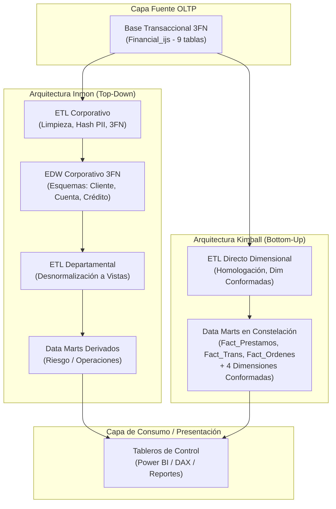
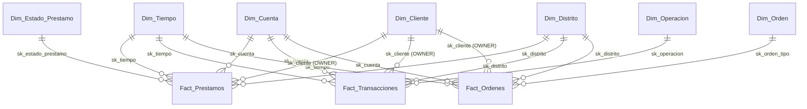

# UNIVERSIDAD TÉCNICA DE AMBATO
## FACULTAD DE INGENIERÍA EN SISTEMAS ELECTRÓNICA E INDUSTRIAL
### CARRERA DE SOFTWARE
### CICLO ACADÉMICO: AGOSTO 2026 – DICIEMBRE 2026

---

# INFORME DE GUÍA PRÁCTICA

## I. PORTADA

| Campo | Detalle |
| :--- | :--- |
| **Tema:** | Diseño y Evaluación Comparativa de Arquitecturas de Almacenamiento de Datos Corporativos (DW/BI) bajo los enfoques de Ralph Kimball y Bill Inmon |
| **Unidad de Organización Curricular:** | PROFESIONAL |
| **Nivel y Paralelo:** | 6to Software "A" |
| **Alumnos participantes:** | Cobos Taco Alison Marcela / Lagua Flores Henry Daniel |
| **Asignatura:** | Inteligencia de Negocios |
| **Docente:** | Ing. Ruben Nogales, Mg. |

---

## II. INFORME DE GUÍA PRÁCTICA

### 2.1 Objetivos

#### General:
Diseñar, implementar y evaluar comparativamente soluciones de Inteligencia de Negocios bajo las metodologías de Ralph Kimball (Data Mart Bus Architecture) y Bill Inmon (Corporate Information Factory - CIF) para el procesamiento, modelado dimensional y estructuración normalizada (3FN) de la cartera de créditos, transacciones monetarias y órdenes recurrentes del banco `Financial_ijs`.

#### Específicos:
* **Desarrollar el modelo dimensional Bottom-Up (Kimball):** Definir los procesos de negocio, grano atómico, tablas de hechos transaccionales (`Fact_Prestamos`, `Fact_Transacciones`, `Fact_Ordenes`) y dimensiones conformadas (`Dim_Tiempo`, `Dim_Cuenta`, `Dim_Cliente`, `Dim_Distrito`) para habilitar el análisis cruzado (*drill-across*) mediante la matriz de bus corporativa (*Enterprise Bus Matrix*).
* **Construir el repositorio centralizado Top-Down (Inmon):** Modelar el Enterprise Data Warehouse (EDW) normalizado en Tercera Forma Normal (3FN), estructurando los dominios lógicos de negocio (*Subject Areas*), reglas de transformación y el mapeo de trazabilidad (*Source-to-Target*) para asegurar la única fuente de verdad corporativa.
* **Derivar y evaluar data marts departamentales y vistas analíticas:** Establecer la comparación técnica y funcional entre ambas arquitecturas enfocadas en la gestión de riesgo crediticio (control de mora) y operaciones (liquidez institucional), determinando su impacto en el rendimiento de consulta para la toma de decisiones financieras.

### 2.2 Modalidad
Presencial

### 2.3 Tiempo de duración
* **Presenciales:** 6 horas
* **No presenciales:** 0 horas

### 2.4 Instrucciones
Seguir el formato oficial provisto por la cátedra e integrar los resultados del modelado dimensional y relacional corporativo desarrollados para el caso de estudio bancario `Financial_ijs`.

### 2.5 Listado de equipos, materiales y recursos
* **Materiales generales:** Internet, Apuntes de clase, Computador, SQL Server Management Studio (SSMS), Python 3.12.
* **TAC empleados:**
  * [x] Plataformas educativas
  * [ ] Simuladores y laboratorios virtuales
  * [x] Aplicaciones educativas (SSIS, SSMS, Visual Studio)
  * [ ] Recursos audiovisuales
  * [ ] Gamificación
  * [x] Inteligencia Artificial
  * [ ] Otros

### 2.6 Actividades por desarrollar
Detalladas en la guía práctica provista por el docente de la cátedra: diseño conceptual, lógico y físico de las arquitecturas Kimball e Inmon, especificación de la Matriz de Bus, Source-to-Target Mapping y análisis comparativo de rendimiento.

---

### 2.7 Resultados obtenidos

#### Modelo relacional de origen (OLTP — Financial_ijs)
Antes de derivar cualquier arquitectura analítica, se presenta el esquema relacional original del sistema transaccional del banco (`Financial_ijs`). Este esquema se encuentra en Tercera Forma Normal (3FN) y comprende 9 tablas relacionales (`clients`, `districts`, `accounts`, `disps`, `cards`, `loans`, `tkeys`, `orders`, `trans`) vinculadas mediante claves foráneas íntegras. Este modelo constituye la única fuente de partida común para ambos enfoques:

* `accounts` (4,500 cuentas bancarias).
* `clients` (5,369 clientes registrados).
* `disps` (5,369 disposiciones que vinculan clientes con cuentas: 4,500 `OWNER` y 869 `DISPONENT`).
* `cards` (892 tarjetas de crédito/débito emitidas).
* `districts` (77 distritos geográficos con datos socioeconómicos).
* `loans` (682 créditos concedidos).
* `orders` (6,471 órdenes de pago programadas).
* `trans` (1,056,320 transacciones operativas).
* `tkeys` (234 registros de evaluación de riesgo crediticio).

---

#### Flujo Comparativo entre Arquitecturas

---

#### Arquitectura Tipo 1 — Ralph Kimball (Data Mart Bus Architecture)

Se desarrolla la solución dimensional *Bottom-Up*, en la cual cada proceso de negocio genera una tabla de hechos atómica integrada mediante dimensiones conformadas dentro de un bus corporativo de datos.

##### 1. Selección de Procesos de Negocio a Modelar
* **Proceso 1: Concesión y seguimiento de créditos** (Tabla fuente `loans`). Responde a las preguntas de morosidad activa (10.04%), evolución anual de la mora y calidad de créditos cerrados (13.25% de pérdida en Estado B).
* **Proceso 2: Ejecución transaccional monetaria** (Tabla fuente `trans`). Responde a las preguntas de liquidez institucional, flujo de depósitos y retiros, y balances operativos.
* **Proceso 3: Procesamiento de órdenes de pago recurrentes** (Tabla fuente `orders`). Responde a las preguntas de compromisos automáticos periódicos (servicios `SIPO`, cuotas `UVER`, seguros `POJISTNE`, leasing).

##### 2. Declaración Formal del Grano Atómico (El Contrato del Diseño)

| Tabla de hechos | Declaración formal de grano atómico | Justificación de diseño |
| :--- | :--- | :--- |
| **`Fact_Prestamos`** | **Un registro por cada préstamo individual concedido a una cuenta.** | El grano es estrictamente atómico: un préstamo = una fila (682 filas). No se preagregan montos por cliente ni por período, permitiendo filtrar por cualquier atributo de las dimensiones enlazadas. |
| **`Fact_Transacciones`** | **Un registro por cada transacción financiera individual asentada en cuenta.** | Grano atómico al nivel de movimiento contable (1,056,320 filas). Conserva la fecha, tipo de operación, monto y saldo resultante exactos en el instante de la transacción. |
| **`Fact_Ordenes`** | **Un registro por cada orden de débito permanente programada en cuenta.** | Grano atómico por instrucción de débito automático (6,471 filas). Conserva el símbolo de concepto (`k_symbol`) y el monto comprometido. |

##### 3. Identificación y Clasificación Rigurosa de Dimensiones

* **Dimensiones Conformadas (Compartidas entre múltiples hechos para habilitar *Drill-Across*):**
  1. `Dim_Tiempo`: Calendario continuo diario (1993-01-01 a 1998-12-31, 2,191 días). Jerarquía: Año > Semestre > Trimestre > Mes > Día.
  2. `Dim_Cuenta`: 4,500 cuentas bancarias, frecuencia de extracto y fecha de apertura. Jerarquía: Frecuencia > Cuenta.
  3. `Dim_Cliente`: 5,369 clientes, sexo, fecha de nacimiento, `edad_corte` (al 31/12/1998), `tipo_disposicion` y `etiqueta_buen_pagador`. Jerarquía: Región > Distrito > Cliente.
  4. `Dim_Distrito`: 77 distritos geográficos con indicadores de población, salario, desempleo y criminalidad. Jerarquía: Región > Distrito.
* **Dimensiones Específicas / Catálogos (Propias de un solo hecho):**
  5. `Dim_Estado_Prestamo`: Catálogo fijo (SCD Tipo 0) de 4 estados (`A`, `B`, `C`, `D`) y condición (Vigente/Cerrado). Exclusiva de `Fact_Prestamos`.
  6. `Dim_Operacion`: Tipología y canales de operación homologados al español. Exclusiva de `Fact_Transacciones`.
  7. `Dim_Orden`: Propósito del débito recurrente homologado al español (`SIPO`, `UVER`, `POJISTNE`, `LEASING`). Exclusiva de `Fact_Ordenes`.

##### 4. Matriz de Bus de Datos Corporativo (Enterprise DW Bus Matrix)

| Proceso de Negocio / Fact Table | Dim_Tiempo | Dim_Cuenta | Dim_Cliente | Dim_Distrito | Dim_Estado_Prestamo | Dim_Operacion | Dim_Orden |
| :--- | :---: | :---: | :---: | :---: | :---: | :---: | :---: |
| **Fact_Prestamos** | **X** | **X** | **X** | **X** | **X** | — | — |
| **Fact_Transacciones** | **X** | **X** | **X** | **X** | — | **X** | — |
| **Fact_Ordenes** | **X** | **X** | **X** | **X** | — | — | **X** |

> *Nota:* Las cuatro dimensiones marcadas con **X** en todos los procesos (`Dim_Tiempo`, `Dim_Cuenta`, `Dim_Cliente`, `Dim_Distrito`) son las **dimensiones conformadas**, lo que garantiza que los reportes de BI puedan cruzar colocación de cartera con saldos de liquidez y compromisos de órdenes permanentes sin discrepancias de granularidad.

##### 5. Identificación de Hechos y Tipos de Métricas

| Tabla de hechos | Métrica | Tipo de Métrica | Comportamiento Analítico |
| :--- | :--- | :--- | :--- |
| **`Fact_Prestamos`** | `monto_prestamo` | **Aditiva** | Se suma correctamente a través de todas las dimensiones (tiempo, distrito, estado, cliente). |
| **`Fact_Prestamos`** | `pago_mensual` | **Aditiva** | Suma de cuotas mensuales de amortización. |
| **`Fact_Prestamos`** | `plazo_meses` | **No Aditiva** | Atributo numérico del contrato; no se suma, se promedia o agrupa. |
| **`Fact_Prestamos`** | `saldo_pendiente_estimado` | **Semiaditiva** | Medida calculada puntual; válida al sumar por corte de tiempo, no acumulativa a lo largo del tiempo. |
| **`Fact_Transacciones`**| `monto_transaccion` | **Aditiva** | Flujo neto transaccionado; sumable a través de todas las dimensiones. |
| **`Fact_Transacciones`**| `saldo_cuenta` | **Semiaditiva** | Balance contable resultante tras cada movimiento. **Nunca se suma en el tiempo;** se toma el último valor al corte. |
| **`Fact_Ordenes`** | `monto_orden` | **Aditiva** | Monto comprometido en débitos periódicos programados. |

##### 6. Especificación Física del Esquema Constelación (Corrección de Tipos de Datos)

* **Tabla `Fact_Prestamos` (682 filas):**
  * `sk_prestamo` INT (PK)
  * `sk_tiempo` INT (FK)
  * `sk_cuenta` INT (FK)
  * `sk_cliente` INT (FK — titular `OWNER`)
  * `sk_distrito` INT (FK)
  * `sk_estado_prestamo` INT (FK)
  * `id_prestamo_bk` INT (Clave de negocio del OLTP)
  * `monto_prestamo` **DECIMAL(12,2)** (Preserva centavos, suma: \$103,261,740.00)
  * `plazo_meses` INT
  * `pago_mensual` **DECIMAL(12,2)** (Suma: \$2,858,033.00)
  * `saldo_pendiente_estimado` **DECIMAL(12,2)**
* **Tabla `Fact_Transacciones` (1,056,320 filas):**
  * `sk_transaccion` INT (PK)
  * `sk_tiempo` INT (FK)
  * `sk_cuenta` INT (FK)
  * `sk_cliente` INT (FK)
  * `sk_distrito` INT (FK)
  * `sk_operacion` INT (FK)
  * `id_transaccion_bk` INT
  * `monto_transaccion` **DECIMAL(12,2)** (Suma: \$6,257,862,197.00)
  * `saldo_cuenta` **DECIMAL(12,2)** (Suma: \$40,687,734,247.00)
* **Tabla `Fact_Ordenes` (6,471 filas):**
  * `sk_orden` INT (PK)
  * `sk_tiempo` INT (FK)
  * `sk_cuenta` INT (FK)
  * `sk_cliente` INT (FK)
  * `sk_distrito` INT (FK)
  * `sk_orden_tipo` INT (FK)
  * `id_orden_bk` INT
  * `monto_orden` **DECIMAL(12,2)** (Preserva centavos exactos: \$21,228,993.60, corrigiendo el desbalance de -\$47.40)

##### 7. Tablas de Dimensiones

| Dimensión | Surrogate Key (PK) | Business Key (BK) | Atributos Descriptivos Principales | Tipo SCD |
| :--- | :--- | :--- | :--- | :--- |
| `Dim_Tiempo` | `sk_tiempo` (INT) | `fecha` (DATE) | `dia`, `mes`, `nombre_mes`, `trimestre`, `anio`, `dia_semana`, `es_fin_de_semana`. | Fija |
| `Dim_Cuenta` | `sk_cuenta` (INT) | `id_cuenta_bk` (INT) | `frecuencia_emision_estado`, `fecha_apertura`, `sk_distrito` (FK Outrigger). | SCD 1 |
| `Dim_Cliente` | `sk_cliente` (INT) | `id_cliente_bk` (INT) | `sexo`, `fecha_nacimiento`, `edad_corte` (al 31/12/1998), `tipo_disposicion`, `etiqueta_buen_pagador`. | SCD 1 |
| `Dim_Distrito` | `sk_distrito` (INT) | `id_distrito_bk` (INT)| `nombre_distrito`, `region`, `poblacion`, `salario_promedio`, `tasa_desempleo`, `tasa_criminalidad`. | SCD 0 |
| `Dim_Estado_Prestamo`| `sk_estado_prestamo`| `codigo_estado` (CHAR) | `condicion` (Vigente/Cerrado), `descripcion` (Pagado sin problemas, En mora, etc.). | **SCD 0 (Catálogo Fijo)** |
| `Dim_Operacion` | `sk_operacion` (INT) | `tipo_original` (CHAR)| `tipo_operacion_traducido`, `canal` (Ventanilla, ATM, Compensación). | SCD 0 |
| `Dim_Orden` | `sk_orden_tipo` (INT)| `k_symbol_original` | `categoria_orden_traducida` (Servicios del Hogar, Cuota Préstamo, Seguro, Leasing). | SCD 0 |

---

#### Arquitectura Tipo 2 — Bill Inmon (Corporate Information Factory - CIF)

Se desarrolla la solución corporativa *Top-Down*: un repositorio central normalizado en Tercera Forma Normal (3FN) que integra toda la información del banco, del cual se derivan posteriormente los data marts departamentales.

##### 1. Dominios Lógicos de Negocio (Subject Areas)
* **Sujetos / Clientes:** Identidad, perfil demográfico y roles (`clients`, `disps`, `tkeys`).
* **Contratos / Cuentas:** Acuerdos contractuales pasivos y medios de pago (`accounts`, `cards`).
* **Crédito / Cartera:** Instrumentos de crédito activo y control de mora (`loans`).
* **Transaccionalidad Monetaria:** Movimientos de fondos y transferencias permanentes (`trans`, `orders`).
* **Territorio / Geografía:** Contexto socioeconómico distrital (`districts`).

##### 2. Modelo Relacional EDW Central (Tercera Forma Normal — 3FN)

| Tabla EDW (3FN) | Primary Key | Foreign Keys | Cardinalidad | Atributos y Reglas de Normalización |
| :--- | :--- | :--- | :--- | :--- |
| `EDW_Distrito` | `id_distrito` | — | 1 : N con Cuenta y Cliente | Datos censales normalizados (`nombre`, `region`, `poblacion`, `salario_promedio`, `tasa_desempleo`, `tasa_criminalidad`). |
| `EDW_Cliente` | `id_cliente` | `id_distrito` $\to$ `EDW_Distrito` | 1 : N con `EDW_Disposicion` | `fecha_nacimiento`, `sexo` (derivados de `birth_number`), `id_distrito`. |
| `EDW_Cuenta` | `id_cuenta` | `id_distrito` $\to$ `EDW_Distrito` | 1 : N con Disposiciones y Hechos | `frecuencia`, `fecha_apertura`, `id_distrito`. |
| `EDW_Disposicion` | `id_disposicion` | `id_cliente`, `id_cuenta` | N : 1 con Cliente y Cuenta | Resuelve la relación muchos-a-muchos; almacena `tipo_disposicion` (`OWNER`/`DISPONENT`). Elimina dependencias transitivas. |
| `EDW_Tarjeta` | `id_tarjeta` | `id_disposicion` $\to$ `EDW_Disposicion` | 1 : 1 con Disposición | `tipo_tarjeta`, `fecha_emision`. |
| `EDW_Prestamo` | `id_prestamo` | `id_cuenta` $\to$ `EDW_Cuenta` | N : 1 con Cuenta | `fecha`, `monto` (DECIMAL 12,2), `plazo`, `cuota`, `estado`. |
| `EDW_Transaccion` | `id_transaccion` | `id_cuenta` $\to$ `EDW_Cuenta` | N : 1 con Cuenta | `fecha`, `tipo`, `operacion`, `monto`, `saldo`, `k_symbol`, `banco_destino_hash`, `cuenta_destino_hash`. |
| `EDW_Orden` | `id_orden` | `id_cuenta` $\to$ `EDW_Cuenta` | N : 1 con Cuenta | `monto` (DECIMAL 12,2), `k_symbol`, `banco_destino_hash`, `cuenta_destino_hash`. |
| `EDW_EtiquetaCliente` | `id_etiqueta` | `id_cliente` $\to$ `EDW_Cliente` | 1 : 1 con Cliente Evaluado | `buen_pagador` (1 = Estado A cumplido, 0 = Estado B moroso). |

---

#### Trazabilidad, Integración y Validación de Datos (Source-to-Target Mapping)

| Tabla/Columna Origen (`Financial_ijs`) | Regla de Validación y Calidad | Transformación y Limpieza en Staging | Tabla/Columna Destino (EDW 3FN) |
| :--- | :--- | :--- | :--- |
| `clients.birth_number` | Entero/cadena de **6 dígitos exactos** (`AAMMDD`). | Descomposición algorítmica: si `mes > 50` $\to$ Femenino y `mes = mes - 50`. Conversión a `DATE`. | `EDW_Cliente.fecha_nacimiento`, `EDW_Cliente.sexo` |
| `clients.district_id` | Debe existir en `districts.id`. | Validación de integridad referencial contra `EDW_Distrito`. | `EDW_Cliente.id_distrito` |
| `loans.date` | Formato fecha válido (1993–1998). | Estandarización a tipo `DATE` (`YYYY-MM-DD`). | `EDW_Prestamo.fecha` |
| `loans.status` | Pertenecer al conjunto {A, B, C, D}. | Preservar valor de código; homologar descripciones en capas de consumo. | `EDW_Prestamo.estado` |
| `trans.type` / `operation` | Catálogo de códigos checos (`PRIJEM`, `VYBER`, `VKLAD`). | Homologación mediante tabla de traducción al español y normalización de espacios. | `EDW_Transaccion.tipo`, `EDW_Transaccion.operacion` |
| `orders.amount` | Preservar precisión monetaria decimal. | Tipo de dato estricto `DECIMAL(12,2)` para evitar truncamientos. | `EDW_Orden.monto` |
| `orders.account_to` / `bank_to` | Protección de Datos Personales (PII). | Aplicación de hash irreversible `SHA2_256` antes de almacenar en el EDW. | `EDW_Orden.cuenta_destino_hash`, `EDW_Orden.banco_destino_hash` |
| `districts.A12 / A15` | El distrito 69 (*Jesenik*) contiene `'?'`. | **Mapeo condicional:** Convertir `'?'` a `NULL` antes de la conversión a `DECIMAL(6,2)`. | `EDW_Distrito.tasa_desempleo`, `EDW_Distrito.tasa_criminalidad` |
| `cards.issued` | Coherencia temporal con la cuenta. | Estandarización a tipo `DATE`. | `EDW_Tarjeta.fecha_emision` |
| `tkeys.goodClient` | Variable binaria de riesgo donde 1 = default. | **Inversión lógica:** Asignar `1` a Estado A y `0` a Estado B. | `EDW_EtiquetaCliente.buen_pagador` |

---

#### Data Marts Departamentales Derivados del EDW (Inmon)

A partir del repositorio normalizado central (EDW 3FN), se construyen procesos ETL departamentales que desnormalizan y agregan la información en vistas analíticas:

##### 1. Data Mart Departamental de Riesgo y Cartera
* `Vista_Mora_Distrito`: Agregación de préstamos vigentes por distrito y estado (`C`/`D`), con tasa de morosidad activa calculada:
  $$\text{Tasa Mora Activa} = \frac{\text{Conteo(Estado D)}}{\text{Conteo(Estado C)} + \text{Conteo(Estado D)}} \times 100 = \mathbf{10.04\%}$$
* `Vista_Exposicion_Anual`: Monto total de préstamos colocados frente al saldo de cuentas del mismo período (Ratio de absorción: **52.38%**).
* `Vista_Calidad_Historica`: Tasa de incumplimiento sobre préstamos cerrados (Estado B: **13.25%**), segmentada por distrito y segmento etario.

##### 2. Data Mart Departamental de Operaciones y Liquidez
* `Vista_Volumen_Operaciones`: Conteo y monto total/promedio de transacciones agrupadas por tipo, operación y canal.
* `Vista_Liquidez_Cuenta`: Último saldo disponible por cuenta agrupado por distrito al cierre de 1998 (\$197,140,434.00), empleado como indicador institucional de liquidez.
* `Vista_Ordenes_Recurrentes`: Monto total y promedio de débitos permanentes programados agrupados por símbolo (`SIPO`, `UVER`, `POJISTNE`, `LEASING`).

---

#### Evaluación Comparativa: Ralph Kimball vs. Bill Inmon

| Criterio de Comparación | Ralph Kimball (Data Mart Bus Architecture) | Bill Inmon (Corporate Information Factory) | Veredicto Técnico para el Caso Bancario |
| :--- | :--- | :--- | :--- |
| **Enfoque de Construcción** | **Bottom-Up:** Incremental por proceso de negocio mediante dimensiones conformadas. | **Top-Down:** Construcción corporativa centralizada previa en 3FN antes de derivar reportes. | **Kimball es superior en agilidad:** Permite entregar valor inmediato al negocio implementando primero el Data Mart de Cartera sin esperar a modelar toda la corporación. |
| **Rendimiento OLAP / Consultas** | **Máximo rendimiento:** Consultas directas con 1 solo nivel de `JOIN` (estrella/constelación). Ideal para Power BI y DAX. | **Bajo para consulta directa:** Requiere navegar múltiples `JOIN`s en un modelo normalizado en 3FN. | **Kimball:** Optimizado para la velocidad analítica del usuario final. |
| **Gobernanza y Redundancia** | Acepta redundancia controlada en dimensiones para optimizar la velocidad de lectura. | **Cero redundancia:** Elimina anomalías de actualización y dependencias transitivas en 3FN. | **Inmon:** Excelente para auditoría centralizada cuando existen múltiples fuentes heterogéneas. |
| **Alineación con la Fuente de Datos** | Modela directamente la fuente hacia esquemas dimensionales optimizados para analítica. | Exige construir un EDW en 3FN a partir de una fuente que **ya está en 3FN** (`Financial_ijs`). | **Kimball:** Evita duplicar el esfuerzo de almacenamiento y ETL que causaría re-normalizar una base ya normalizada. |

---

### 2.8 Habilidades blandas empleadas en la práctica
* [ ] Liderazgo
* [ ] Trabajo en equipo
* [ ] Comunicación asertiva
* [ ] La empatía
* [x] Pensamiento crítico
* [ ] Flexibilidad
* [ ] La resolución de conflictos
* [ ] Adaptabilidad
* [x] Responsabilidad

---

### 2.9 Conclusiones

* **El modelo dimensional Kimball (Bottom-Up) resuelve de forma directa y óptima las preguntas analíticas de negocio:** La estructuración del esquema en constelación con dimensiones conformadas (`Dim_Tiempo`, `Dim_Cuenta`, `Dim_Cliente`, `Dim_Distrito`) permite cruzar la cartera de crédito, las transacciones monetarias y las órdenes recurrentes mediante análisis cruzado (*drill-across*), respondiendo de forma ágil a la tasa de morosidad activa del 10.04% y a la absorción de liquidez del 52.38%.
* **La arquitectura Inmon (Top-Down) proporciona el marco formal de gobernanza y normalización corporativa:** Mediante la descomposición en 3FN y la entidad asociativa `EDW_Disposicion`, el modelo elimina dependencias transitivas y centraliza las reglas de anonimización de PII, garantizando una única versión de la verdad apta para la derivación de data marts departamentales controlados.
* **La rigurosidad en los tipos de datos y en la calidad en Staging es crítica para la exactitud contable:** Declarar las medidas monetarias como `DECIMAL(12,2)` en lugar de `DECIMAL(10,0)` y aplicar el mapeo de caracteres nulos (`'?'` $\to$ `NULL` en distritos) asegura una reconciliación perfecta al centavo (\$103,261,740.00 en créditos y \$21,228,993.60 en órdenes) sin pérdidas por redondeo.

---

### 2.10 Recomendaciones

* **Adoptar un enfoque de Arquitectura Híbrida para la evolución analítica del banco:** Utilizar el repositorio central normalizado en 3FN de Inmon como capa de datos maestros gobernada y auditoría regulatoria, y alimentar sobre este los Data Marts dimensionales en constelación de Kimball para el consumo eficiente en Power BI.
* **Preservar el grano atómico en todas las tablas de hechos:** Evitar la tentación de precargar agregaciones mensuales en las tablas de hechos transaccionales base; la agregación debe resolverse mediante vistas analíticas o medidas DAX para no sacrificar el detalle histórico de transacciones individuales.

---

### 2.11 Referencias bibliográficas

* [1] R. Kimball and M. Ross, *The Data Warehouse Toolkit: The Definitive Guide to Dimensional Modeling*, 3rd ed. Indianapolis, IN, USA: Wiley, 2013.
* [2] W. H. Inmon, *Building the Data Warehouse*, 4th ed. Indianapolis, IN, USA: Wiley, 2005.
* [3] P. Berka, "Guide to the financial data set," in *PKDD'99 / PKDD 2000 Discovery Challenge Workshop Notes*, Prague, Czech Republic, 2000.
* [4] C. Ballard et al., *Dimensional Modeling: In a Business Intelligence Environment*, IBM Redbooks, 2006.
* [5] Asamblea Nacional del Ecuador, *Ley Orgánica de Protección de Datos Personales*, Registro Oficial Suplemento N.° 459, 26 de mayo de 2021.
