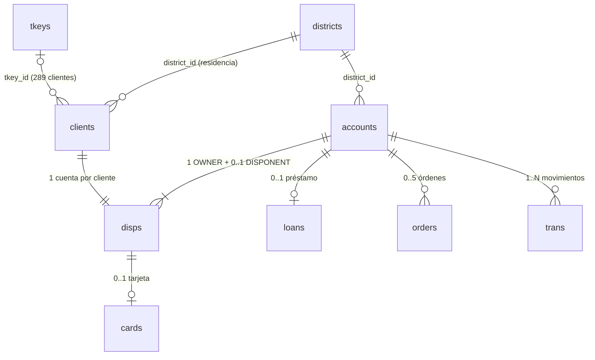
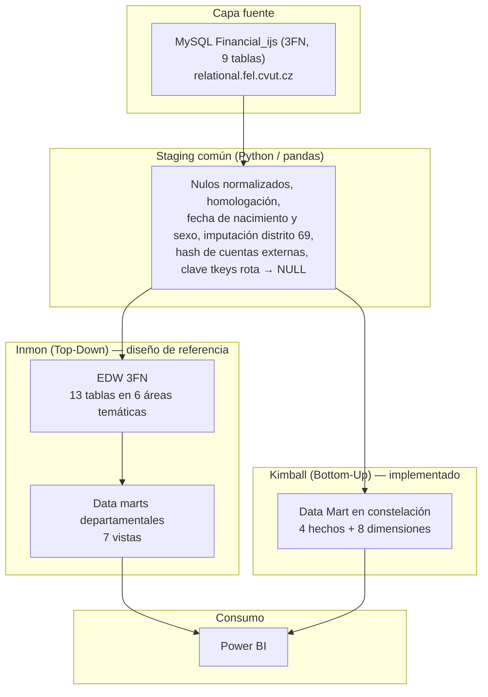

# UNIVERSIDAD TÉCNICA DE AMBATO
## FACULTAD DE INGENIERÍA EN SISTEMAS ELECTRÓNICA E INDUSTRIAL
### CARRERA DE SOFTWARE
### CICLO ACADÉMICO: AGOSTO 2026 – DICIEMBRE 2026

---

# INFORME DE GUÍA PRÁCTICA

## I. PORTADA

| Campo | Detalle |
| :--- | :--- |
| **Tema:** | Diseño y Evaluación Comparativa de Arquitecturas de Almacenamiento de Datos (DW/BI) bajo los enfoques de Ralph Kimball y Bill Inmon — versión 2, alineada con la Carta de Diseño v8 |
| **Unidad de Organización Curricular:** | PROFESIONAL |
| **Nivel y Paralelo:** | 6to Software "A" |
| **Alumnos participantes:** | Cobos Taco Alison Marcela / Lagua Flores Henry Daniel |
| **Asignatura:** | Inteligencia de Negocios |
| **Docente:** | Ing. Ruben Nogales, Mg. |

---

## II. INFORME DE GUÍA PRÁCTICA

### 2.1 Objetivos

#### General:
Diseñar y evaluar comparativamente las arquitecturas de Ralph Kimball (Data Mart Bus Architecture) y Bill Inmon (Corporate Information Factory) para la base `Financial_ijs`, a partir de los tres problemas de negocio de la Carta de Diseño v8, verificando que ambas produzcan las mismas cifras de control.

#### Específicos:
* **Desarrollar el modelo dimensional de Kimball:** procesos, grano declarado por hecho, cuatro tablas de hechos (incluida una foto periódica de saldos), dimensiones conformadas y Matriz de Bus que permita el análisis cruzado (*drill-across*) por cuenta.
* **Construir el EDW de Inmon en 3FN estricta:** áreas temáticas, catálogos de referencia, trazabilidad fuente-destino (*Source-to-Target*) y data marts departamentales derivados como vistas.
* **Validar y comparar ambas arquitecturas:** cargar los dos esquemas con los datos reales, contrastar sus resultados con los totales de control de la Carta y evaluar su idoneidad para las preguntas del negocio.

### 2.2 Modalidad
Presencial

### 2.3 Tiempo de duración
* **Presenciales:** 6 horas
* **No presenciales:** 0 horas

### 2.4 Instrucciones
Seguir el formato oficial provisto por la cátedra e integrar los resultados del modelado dimensional y relacional corporativo desarrollados para el caso de estudio bancario `Financial_ijs`.

### 2.5 Listado de equipos, materiales y recursos
* **Materiales generales:** Internet, Apuntes de clase, Computador, SQL Server (LocalDB) y SQL Server Management Studio, Python 3.12 (pandas, pyodbc, pymysql).
* **TAC empleados:**
  * [x] Plataformas educativas
  * [ ] Simuladores y laboratorios virtuales
  * [x] Aplicaciones educativas (SQL Server, SSMS, Visual Studio Code)
  * [ ] Recursos audiovisuales
  * [ ] Gamificación
  * [x] Inteligencia Artificial
  * [ ] Otros

### 2.6 Actividades por desarrollar
Detalladas en la guía práctica provista por el docente de la cátedra: diseño conceptual, lógico y físico de las arquitecturas Kimball e Inmon, Matriz de Bus, Source-to-Target Mapping, validación y análisis comparativo.

---

### 2.7 Resultados obtenidos

> [!NOTE]
> **Archivos y verificación.** Los modelos físicos están en `sql/01_DDL_Kimball_DM_Financial.sql` (Kimball) y `sql/02_DDL_Inmon_EDW_Financial.sql` (Inmon). El 28/09/2026 ambos scripts se ejecutaron sin errores en bases de prueba de SQL Server, y el EDW de Inmon se cargó con los datos reales del servidor remoto para validar sus vistas (sección 5). Todas las cifras provienen de consultas a la fuente `Financial_ijs`.

---

#### 1. Punto de partida: problemas de negocio de la Carta de Diseño v8

Ambas arquitecturas deben responder los mismos tres problemas:

| Problema (Carta v8) | Evidencia principal | Qué exige al modelo |
| :--- | :--- | :--- |
| 1. Impago relevante; los casos en mora crecen con el volumen | Mora 10.04% (45/448); incumplimiento 13.25% (31/234); tasa por año estable (χ² p = 0.93) | Préstamo al nivel atómico, con estado y año de otorgamiento |
| 2. El impago depende de la capacidad de pago | Impago de 2.9% a 23.4% entre cuartiles de cuota / saldo previo (χ² = 39.01, p < 0.001) | Combinar préstamo, movimientos previos y órdenes de la **misma cuenta** |
| 3. La posición de saldos no tiene una medición única | $197,140,249 / $197,140,434 / $204,793,819 según la regla de desempate | Saldo semiaditivo con regla explícita y foto por fecha de corte |

---

#### 2. Modelo relacional de origen (OLTP — `Financial_ijs`)

La fuente es una base MySQL en 3FN con 9 tablas. Estas son las cardinalidades **verificadas** que condicionan ambos diseños:

```mermaid
erDiagram
    districts ||--o{ accounts : "district_id"
    districts ||--o{ clients : "district_id (residencia)"
    accounts ||--|{ disps : "1 OWNER + 0..1 DISPONENT"
    clients ||--|| disps : "1 cuenta por cliente"
    disps ||--o| cards : "0..1 tarjeta"
    accounts ||--o| loans : "0..1 préstamo"
    accounts ||--o{ orders : "0..5 órdenes"
    accounts ||--o{ trans : "1..N movimientos"
    tkeys |o--o{ clients : "tkey_id (289 clientes)"
```

| Tabla | Filas | Observación relevante para el diseño |
| :--- | ---: | :--- |
| `accounts` | 4,500 | `district_id` es el distrito de la cuenta; difiere de la residencia del titular en 409 casos |
| `clients` | 5,369 | `birth_number` codifica fecha de nacimiento y sexo |
| `disps` | 5,369 | 4,500 OWNER y 869 DISPONENT; exactamente 1 titular por cuenta |
| `loans` | 682 | Un préstamo por cuenta como máximo; `amount = payments × duration` siempre |
| `orders` | 6,471 | Sin fecha; 1,379 sin propósito (`k_symbol` vacío) |
| `trans` | 1,056,320 | `balance` es el saldo después del movimiento (semiaditivo); 15 combinaciones de tipo, operación y concepto |
| `cards` | 892 | Todas emitidas a titulares; fuera del alcance de esta iteración |
| `districts` | 77 | Distrito 69 con `NULL` en indicadores de 1995 |
| `tkeys` | 234 | `goodClient = 1` = préstamo B. **Clave rota:** `clients.tkey_id = 234` no existe en `tkeys` |

---

#### 3. Flujo comparativo entre arquitecturas

```mermaid
flowchart TD
    subgraph Fuente["Capa fuente"]
        OLTP["MySQL Financial_ijs (3FN, 9 tablas)<br>relational.fel.cvut.cz"]
    end
    subgraph Staging["Staging común (Python / pandas)"]
        STG["Nulos normalizados, homologación,<br>fecha de nacimiento y sexo, imputación distrito 69,<br>hash de cuentas externas, clave tkeys rota → NULL"]
    end
    subgraph RutaInmon["Inmon (Top-Down) — diseño de referencia"]
        EDW["EDW 3FN<br>13 tablas en 6 áreas temáticas"]
        DMI["Data marts departamentales<br>7 vistas"]
    end
    subgraph RutaKimball["Kimball (Bottom-Up) — implementado"]
        DMK["Data Mart en constelación<br>4 hechos + 8 dimensiones"]
    end
    subgraph Consumo["Consumo"]
        PBI["Power BI"]
    end
    OLTP --> STG
    STG --> EDW --> DMI --> PBI
    STG --> DMK --> PBI
```

---

#### 4. Arquitectura Tipo 1 — Ralph Kimball (Data Mart Bus Architecture)

##### 4.1 Procesos de negocio

| Proceso | Fuente | Problemas que responde | Tabla de hechos |
| :--- | :--- | :--- | :--- |
| Colocación y seguimiento de cartera | `loans` | 1, 2 | `Fact_Prestamos` |
| Movimientos de cuenta | `trans` | 3 | `Fact_Transacciones` |
| Posición de saldos | `trans` (derivado) | 2, 3 | `Fact_Saldo_Cuenta_Mensual` |
| Órdenes permanentes | `orders` | 2 | `Fact_Ordenes` |

##### 4.2 Declaración del grano

| Tabla de hechos | Grano (una fila por…) | Tipo | Filas | Justificación |
| :--- | :--- | :--- | ---: | :--- |
| `Fact_Prestamos` | préstamo | Evento (otorgamiento) con estado al corte de 1998 | 682 | Nivel atómico de la fuente. Permite tasas por cualquier atributo y guarda la capacidad de pago calculada al otorgamiento |
| `Fact_Transacciones` | movimiento en cuenta | Transaccional | 1,056,320 | Nivel atómico; conserva monto, saldo resultante e id para desempatar |
| `Fact_Saldo_Cuenta_Mensual` | cuenta × mes | Foto periódica | 185,615 | Resuelve el saldo semiaditivo: un único saldo por cuenta y mes, sumable entre cuentas |
| `Fact_Ordenes` | orden permanente vigente | Foto sin fecha de evento | 6,471 | La fuente no registra cuándo se emite o ejecuta una orden |

##### 4.3 Dimensiones

| Dimensión | Tipo | Filas | Atributos principales | SCD |
| :--- | :--- | ---: | :--- | :--- |
| `Dim_Tiempo` | Conformada | 2,191 | Fecha, año, semestre, trimestre, mes, día, fin de semana, **fin de mes** | Fija |
| `Dim_Cuenta` | Conformada (eje de integración) | 4,500 | Fecha de apertura, frecuencia de extracto traducida, distrito de la cuenta, **`tiene_credito_externo`**, **`monto_credito_externo`** | 1 |
| `Dim_Cliente` | Conformada | 5,369 | Sexo, fecha de nacimiento, edad al 31/12/1998, rol, etiqueta de buen pagador, distrito de residencia y atributos del *write-back* (segmento, arquetipo, calificación) | 1 |
| `Dim_Distrito` | Conformada | 77 | Región, población, salario, desempleo y criminalidad **1995 y 1996**, marca de imputación | 0 |
| `Dim_Estado_Prestamo` | Catálogo | 4 | Código, condición (vigente / cerrado), descripción | 0 |
| `Dim_Operacion` | Catálogo | **15** | Tipo, operación y concepto originales y traducidos, **categoría analítica** (4 valores) | 0 |
| `Dim_Orden` | Catálogo | 5 | Propósito de la orden | 0 |
| `Dim_Concepto_Movimiento` | Catálogo derivado | 19 | Concepto de la transacción después de la completitud, método (fuente / inferido) y tipo de contraparte (Informe 10) | 0 |

> *Nota sobre `Dim_Cliente`:* los atributos `tiene_prestamo`, `total_ordenes_activas` y `saldo_promedio` que agrega el *write-back* describen la **cuenta**. En los 869 cotitulares repiten los valores del titular, así que no deben sumarse por cliente: su uso correcto es filtrar o segmentar.

##### 4.4 Matriz de Bus

| Proceso / Hecho | Tiempo | Cuenta | Cliente | Distrito | Estado préstamo | Operación | Concepto | Orden |
| :--- | :-: | :-: | :-: | :-: | :-: | :-: | :-: | :-: |
| `Fact_Prestamos` | X (otorgamiento) | X | X (titular) | X (de la cuenta) | X | — | — | — |
| `Fact_Transacciones` | X (día) | X | X (titular) | X (de la cuenta) | — | X (fuente) | X (completado) | — |
| `Fact_Saldo_Cuenta_Mensual` | X (fin de mes) | X | X (titular) | X (de la cuenta) | — | — | — | — |
| `Fact_Ordenes` | X (rol: apertura de cuenta) | X | X (titular) | X (de la cuenta) | — | — | — | X |

Las cuatro dimensiones presentes en todos los procesos (`Dim_Tiempo`, `Dim_Cuenta`, `Dim_Cliente`, `Dim_Distrito`) son las **conformadas**. Tienen el mismo significado en cada hecho gracias a dos reglas: el cliente es siempre el titular y el distrito es siempre el de la cuenta.

##### 4.5 Medidas y su aditividad

| Hecho | Medida | Tipo | Regla de uso |
| :--- | :--- | :--- | :--- |
| `Fact_Prestamos` | `monto_prestamo`, `pago_mensual` | Aditiva | Suma en cualquier dimensión ($103,261,740 y $2,858,033) |
| `Fact_Prestamos` | `saldo_pendiente_estimado` | Aditiva | Se calcula a una única fecha de corte (31/12/1998), por lo que se suma entre préstamos (C + D: $46,620,926) |
| `Fact_Prestamos` | `plazo_meses`, `meses_transcurridos_al_corte` | No aditiva | Se promedian o se usan para agrupar |
| `Fact_Prestamos` | `saldo_promedio_previo`, `ratio_cuota_saldo_previo` | No aditiva | Se promedian o se usa la mediana; `banda_capacidad` agrupa |
| `Fact_Transacciones` | `monto_transaccion` | Aditiva | $6,257,862,197 |
| `Fact_Transacciones` | `saldo_cuenta` | Semiaditiva | Nunca se suma entre movimientos; el saldo al corte sale de la foto mensual |
| `Fact_Saldo_Cuenta_Mensual` | `saldo_fin_mes`, `saldo_promedio_mes` | Semiaditiva | Se suma entre cuentas para un mes; entre meses se promedia o se toma el último |
| `Fact_Saldo_Cuenta_Mensual` | `num_movimientos_mes` / `en_sobregiro` | Aditiva / indicador | Sobregiros se cuentan (39 cuentas en dic-1998) |
| `Fact_Ordenes` | `monto_orden` | Aditiva | $21,229,041 |

##### 4.6 Esquema en constelación

```mermaid
erDiagram
    Dim_Tiempo ||--o{ Fact_Prestamos : "sk_tiempo (otorgamiento)"
    Dim_Tiempo ||--o{ Fact_Transacciones : "sk_tiempo"
    Dim_Tiempo ||--o{ Fact_Saldo_Cuenta_Mensual : "sk_mes"
    Dim_Tiempo ||--o{ Fact_Ordenes : "sk_tiempo_apertura_cuenta"
    Dim_Cuenta ||--o{ Fact_Prestamos : "sk_cuenta"
    Dim_Cuenta ||--o{ Fact_Transacciones : "sk_cuenta"
    Dim_Cuenta ||--o{ Fact_Saldo_Cuenta_Mensual : "sk_cuenta"
    Dim_Cuenta ||--o{ Fact_Ordenes : "sk_cuenta"
    Dim_Cliente ||--o{ Fact_Prestamos : "sk_cliente (OWNER)"
    Dim_Cliente ||--o{ Fact_Transacciones : "sk_cliente (OWNER)"
    Dim_Cliente ||--o{ Fact_Saldo_Cuenta_Mensual : "sk_cliente (OWNER)"
    Dim_Cliente ||--o{ Fact_Ordenes : "sk_cliente (OWNER)"
    Dim_Distrito ||--o{ Fact_Prestamos : "sk_distrito (cuenta)"
    Dim_Distrito ||--o{ Fact_Transacciones : "sk_distrito (cuenta)"
    Dim_Distrito ||--o{ Fact_Saldo_Cuenta_Mensual : "sk_distrito (cuenta)"
    Dim_Distrito ||--o{ Fact_Ordenes : "sk_distrito (cuenta)"
    Dim_Estado_Prestamo ||--o{ Fact_Prestamos : "sk_estado_prestamo"
    Dim_Operacion ||--o{ Fact_Transacciones : "sk_operacion"
    Dim_Orden ||--o{ Fact_Ordenes : "sk_orden_tipo"
```

Especificación física (resumen; detalle en `sql/01_DDL_Kimball_DM_Financial.sql`):

* **`Fact_Prestamos`:** `sk_prestamo` (PK), `sk_tiempo`, `sk_cuenta`, `sk_cliente`, `sk_distrito`, `sk_estado_prestamo`, `id_prestamo_bk` (único), `monto_prestamo`, `plazo_meses`, `pago_mensual`, `meses_transcurridos_al_corte`, `saldo_pendiente_estimado`, `saldo_promedio_previo`, `ratio_cuota_saldo_previo`, `banda_capacidad` (con restricción `CHECK` a 4 valores).
* **`Fact_Transacciones`:** `sk_transaccion` (BIGINT, PK), claves de tiempo, cuenta, cliente, distrito y operación, `id_transaccion_bk` (único, usado para desempatar), `monto_transaccion`, `saldo_cuenta`.
* **`Fact_Saldo_Cuenta_Mensual`:** PK compuesta (`sk_cuenta`, `sk_mes`), `sk_cliente`, `sk_distrito`, `saldo_fin_mes`, `saldo_promedio_mes`, `num_movimientos_mes`, `en_sobregiro`.
* **`Fact_Ordenes`:** `sk_orden` (PK), `sk_tiempo_apertura_cuenta`, `sk_cuenta`, `sk_cliente`, `sk_distrito`, `sk_orden_tipo`, `id_orden_bk` (único), `monto_orden`.
* Todos los montos se almacenan como `DECIMAL(12,2)`. En la fuente son enteros, así que no hay pérdida ni ganancia de precisión: el tipo decimal es por consistencia entre capas.

##### 4.7 Relaciones multivaluadas y cómo se resuelven

| Relación | Resolución en Kimball |
| :--- | :--- |
| Cliente – Cuenta (869 cuentas mancomunadas) | Los hechos se unen **solo al titular**; `Dim_Cliente` conserva a los 5,369 clientes con su rol, y la tabla `Puente_Cuenta_Cliente` (5,369 filas) vincula a cada cliente, incluidos los cotitulares, con su cuenta |
| Cuenta – Préstamo (0..1) | Sin riesgo de duplicación |
| Cuenta – Órdenes (0..5) y Cuenta – Movimientos (1..N) | No se unen hechos entre sí fila a fila. Cada hecho se agrega por cuenta y los resultados se combinan (*drill-across*) sobre `Dim_Cuenta` |
| Distrito de cuenta vs. residencia (409 titulares distintos) | `sk_distrito` de los hechos = distrito de la cuenta; la residencia queda en `Dim_Cliente` |
| Cliente – `tkeys` (289 clientes, 1 clave rota) | La etiqueta se deriva al grano del préstamo desde el estado; la clave rota se carga como `NULL` |

##### 4.8 Cómo responde el modelo a cada problema

* **Problema 1:** `Fact_Prestamos` × `Dim_Estado_Prestamo` × `Dim_Tiempo` (año de otorgamiento) × `Dim_Distrito` (región). `meses_transcurridos_al_corte` permite excluir o marcar los préstamos recientes.
* **Problema 2:** `banda_capacidad` y `ratio_cuota_saldo_previo` en `Fact_Prestamos` (calculados en el ETL con los movimientos anteriores al préstamo). El compromiso de órdenes se agrega por cuenta desde `Fact_Ordenes` y el saldo desde `Fact_Saldo_Cuenta_Mensual`, combinados por `Dim_Cuenta`; `Dim_Cuenta.tiene_credito_externo` añade la deuda con otros bancos.
* **Problema 3:** `Fact_Saldo_Cuenta_Mensual` filtrado en diciembre de 1998 da el saldo neto único ($197,140,434), su evolución mensual y los sobregiros; dividido entre la cartera vigente de `Fact_Prestamos` da el ratio de absorción (40.73%).

---

#### 5. Arquitectura Tipo 2 — Bill Inmon (Corporate Information Factory)

Solución *Top-Down*: un repositorio central en 3FN que integra toda la información del banco, del cual se derivan data marts departamentales. En este proyecto el EDW es **diseño de referencia**: la base `EDW_Financial_Inmon` de SQL Server contiene una versión anterior de la estructura, sin datos. La versión de este informe se validó cargándola completa en una base de prueba.

##### 5.1 Áreas temáticas

| Área temática | Tablas |
| :--- | :--- |
| Catálogos de referencia | `EDW_Frecuencia_Extracto`, `EDW_Estado_Prestamo`, `EDW_Tipo_Operacion`, `EDW_Proposito_Orden` |
| Territorio | `EDW_Distrito` |
| Sujetos | `EDW_Cliente`, `EDW_Evaluacion_Credito` |
| Contratos | `EDW_Cuenta`, `EDW_Disposicion`, `EDW_Tarjeta` |
| Crédito | `EDW_Prestamo` |
| Movimientos y órdenes | `EDW_Transaccion`, `EDW_Orden` |

##### 5.2 Modelo EDW en 3FN

| Tabla | PK | FK | Cardinalidad | Atributos |
| :--- | :--- | :--- | :--- | :--- |
| `EDW_Distrito` | `id_distrito` | — | 1 : N con Cuenta y Cliente | Nombre, región, población, salario, desempleo y criminalidad 1995 y 1996 |
| `EDW_Evaluacion_Credito` | `id_evaluacion` | — | 1 : 1..2 con Cliente | `good_client` tal como viene de `tkeys` |
| `EDW_Cliente` | `id_cliente` | `id_distrito`, `id_evaluacion` (nullable) | 1 : 1 con Disposición | Fecha de nacimiento y sexo derivados de `birth_number` |
| `EDW_Cuenta` | `id_cuenta` | `codigo_frecuencia`, `id_distrito` | 1 : 1..2 con Disposición | Fecha de apertura |
| `EDW_Disposicion` | `id_disposicion` | `id_cliente` (único), `id_cuenta` | Resuelve M:N cliente–cuenta | Rol; índice único filtrado: 1 OWNER por cuenta |
| `EDW_Tarjeta` | `id_tarjeta` | `id_disposicion` (único) | 0..1 por disposición | Tipo, fecha de emisión |
| `EDW_Prestamo` | `id_prestamo` | `id_cuenta` (único), `codigo_estado` | 0..1 por cuenta | Fecha, monto, plazo, cuota |
| `EDW_Transaccion` | `id_transaccion` | `id_cuenta`, `id_tipo_operacion` | N : 1 con Cuenta | Fecha, monto, saldo, banco contraparte, hash de cuenta contraparte |
| `EDW_Orden` | `id_orden` | `id_cuenta`, `k_symbol` | N : 1 con Cuenta | Monto, banco destino, hash de cuenta destino |
| Catálogos (4) | Código | — | 1 : N | Descripciones traducidas |

##### 5.3 Decisiones de normalización

* **Las traducciones dependen del código, no de la transacción.** Guardar "Depósito en efectivo" en cada una de 1,056,320 filas sería una dependencia transitiva. Por eso las 15 combinaciones de tipo, operación y concepto viven en `EDW_Tipo_Operacion`, y la transacción solo guarda su clave. Lo mismo aplica a propósito de orden, frecuencia y estado.
* **No se almacenan atributos derivados.** La edad, la etiqueta de buen pagador y la categoría analítica se calculan en las vistas: guardarlas crearía datos que pueden contradecir a su origen.
* **`tkeys` se conserva tal cual.** `good_client = 1` significa impago, como en la fuente; la inversión a "buen pagador" es una regla de presentación de los data marts.
* **Las restricciones hacen visibles los errores de la fuente.** Al cargar, la clave foránea `EDW_Cliente → EDW_Evaluacion_Credito` rechazó el `tkey_id = 234` del cliente 6275, que no existe en `tkeys`. La regla de staging lo carga como `NULL` y lo registra.

##### 5.4 Trazabilidad fuente-destino (*Source-to-Target Mapping*)

| Origen (`Financial_ijs`) | Regla de validación | Transformación en staging | Destino (EDW 3FN) |
| :--- | :--- | :--- | :--- |
| `clients.birth_number` | Texto de 6 dígitos `AAMMDD` | Si el mes > 50: sexo F y mes − 50; conversión a `DATE` | `EDW_Cliente.fecha_nacimiento`, `sexo` |
| `clients.tkey_id` | Debe existir en `tkeys.id` | Clave inexistente (234) → `NULL` y registro en auditoría | `EDW_Cliente.id_evaluacion` |
| `clients.district_id`, `accounts.district_id` | Debe existir en `districts.id` | Integridad referencial | `id_distrito` |
| `accounts.frequency` | 3 valores conocidos | Recorte de espacios; FK al catálogo | `EDW_Cuenta.codigo_frecuencia` |
| `loans.date`, `trans.date`, `accounts.date`, `cards.issued` | Tipo `DATE` en la fuente | Carga directa | Columnas `fecha` |
| `loans.status` | Conjunto {A, B, C, D} | FK al catálogo de estados | `EDW_Prestamo.codigo_estado` |
| `trans.type`, `operation`, `k_symbol` | `operation` y `k_symbol` admiten `NULL` y `''` | `NULL` y `''` → `SIN_ESPECIFICAR`; búsqueda de la combinación en el catálogo | `EDW_Transaccion.id_tipo_operacion` |
| `orders.k_symbol` | 1,379 valores vacíos | `''` → `SIN_ESPECIFICAR` | `EDW_Orden.k_symbol` |
| `orders.account_to`, `trans.account` | Número de cuenta de un tercero | Hash `SHA2_256` | `cuenta_destino_hash`, `cuenta_contraparte_hash` |
| `orders.amount`, `loans.amount`, `trans.amount` | Enteros (`decimal(10,0)`) | Carga como `DECIMAL(12,2)` | Columnas `monto` |
| `districts.A12`, `A15` | `NULL` en el distrito 69 | Se conserva `NULL` en el EDW; la imputación se aplica en los data marts | `tasa_desempleo_1995`, `tasa_criminalidad_1995` |
| `tkeys.goodClient` | 0 / 1 | Sin transformación | `EDW_Evaluacion_Credito.good_client` |

##### 5.5 Data marts departamentales derivados (vistas)

| Data mart | Vista | Qué entrega |
| :--- | :--- | :--- |
| Riesgo y cartera | `Vista_Mora_Distrito` | Préstamos vigentes, en mora, cartera vigente y tasa por distrito (con su *n*) |
| Riesgo y cartera | `Vista_Calidad_Historica` | Incumplimiento de préstamos cerrados por región |
| Riesgo y cartera | `Vista_Capacidad_Pago` | Cuota / saldo previo, banda de capacidad e impago por préstamo |
| Saldos y liquidez | `Vista_Saldo_Final_Cuenta` | Último saldo por cuenta con desempate por `id_transaccion` |
| Saldos y liquidez | `Vista_Absorcion_Region` | Cartera vigente, saldo neto, sobregiros y ratio por región |
| Operaciones | `Vista_Volumen_Operaciones` | Movimientos, monto y ticket por año y categoría analítica |
| Operaciones | `Vista_Ordenes_Recurrentes` | Órdenes, monto total y promedio por propósito |

---

#### 6. Validación de las arquitecturas

El EDW de Inmon se cargó con los 9 conjuntos de datos del servidor remoto (1,056,320 movimientos en 13 segundos) y se consultaron sus vistas. Las mismas cifras se contrastaron con el Data Mart Kimball en operación (`DM_Financial_Kimball_v2`) y con la Carta v8.

| Control | Carta v8 | Inmon (vistas) | Kimball (Data Mart) |
| :--- | ---: | ---: | ---: |
| Préstamos vigentes / en mora | 448 / 45 | 448 / 45 | 448 / 45 |
| Préstamos cerrados / con deuda | 234 / 31 | 234 / 31 | 234 / 31 |
| Saldo neto al corte (4,500 cuentas) | $197,140,434 | $197,140,434 | $197,140,434 |
| Cartera vigente / ratio de absorción | $80,296,176 / 40.73% | $80,296,176 / 40.73% | $80,296,176 / 40.73% |
| Cuentas en sobregiro al corte | 39 | 39 | 39 |
| Órdenes / monto | 6,471 / $21,229,041 | 6,471 / $21,229,041 | 6,471 / $21,229,041 |
| Movimientos: Ingreso / Intereses / Egreso / Retiro | 221,969 / 183,114 / 634,571 / 16,666 | 221,969 / 183,114 / 634,571 / 16,666 | **Pendiente:** el Data Mart en operación aún usa 3 categorías (405,083 / — / 634,571 / 16,666) |
| Bandas de capacidad (préstamos / impagos) | 171/5 · 167/16 · 172/15 · 172/40 | 171/5 · 167/16 · 172/15 · 172/40 | **Pendiente:** columnas nuevas aún no cargadas |
| Etiqueta derivada de `tkeys` vs. estado | 0 ↔ A, 1 ↔ B | 257 A con 0 · 31 B con 1 · 0 cruces | — |

**Resultado:** el diseño Inmon reproduce todas las cifras de la Carta. El Data Mart Kimball coincide en todos los controles que ya implementa. Los dos pendientes (categorías de operación y medidas de capacidad) corresponden a la actualización del ETL a este DDL.

---

#### 7. Evaluación comparativa: Kimball vs. Inmon

| Criterio | Kimball | Inmon | Veredicto para este caso |
| :--- | :--- | :--- | :--- |
| **Construcción** | Bottom-up por proceso, integrado por dimensiones conformadas | Top-down: EDW corporativo antes de los data marts | **Kimball:** entrega primero el proceso de cartera, que concentra los problemas 1 y 2 |
| **Estructura resultante** | 4 hechos + 8 dimensiones (12 tablas) | 13 tablas en 3FN + 7 vistas | Inmon necesita una capa adicional de vistas para llegar al mismo consumo |
| **Consulta analítica** | Un nivel de `JOIN` desde el hecho a cada dimensión | Varias uniones por consulta (p. ej., la mora por región pasa por préstamo → cuenta → distrito) | **Kimball** para Power BI y DAX |
| **Medidas semiaditivas** | La foto mensual materializa un saldo por cuenta y mes | Se recalcula con funciones de ventana sobre 1,056,320 movimientos en cada consulta | **Kimball:** el saldo queda calculado una vez y con una sola regla |
| **Análisis de capacidad (problema 2)** | Calculado una vez en el ETL y guardado en el hecho; se combina por *drill-across* sobre `Dim_Cuenta` | Vista con subconsulta por préstamo sobre los movimientos previos | Ambas lo resuelven; Kimball lo precalcula |
| **Integridad y calidad** | Claves sustitutas y FK en los hechos | Restricciones de negocio en la base (1 titular por cuenta, 0..1 préstamo, FK a catálogos) | **Inmon** detectó por sí mismo la clave `tkeys` rota |
| **Redundancia** | Controlada en dimensiones (p. ej., región repetida por distrito) | Mínima: cada dato en un solo lugar | **Inmon** es preferible como repositorio maestro con varias fuentes |
| **Alineación con la fuente** | Transforma una fuente 3FN directamente al modelo dimensional | Construye un EDW 3FN sobre una fuente que **ya está en 3FN** | **Kimball:** con una sola fuente, el EDW duplica la normalización sin aportar integración |
| **Resultado numérico** | Coincide con la Carta en todos los controles implementados | Coincide con la Carta en todos los controles | Las dos arquitecturas son correctas; la diferencia es de costo y de consumo |

**Decisión:** se adopta **Kimball** como arquitectura implementada. Inmon se mantiene como diseño de referencia validado, útil si el banco incorporara nuevas fuentes que requieran un repositorio integrado.

---

### 2.8 Habilidades blandas empleadas en la práctica
* [ ] Liderazgo
* [x] Trabajo en equipo
* [ ] Comunicación asertiva
* [ ] La empatía
* [x] Pensamiento crítico
* [ ] Flexibilidad
* [ ] La resolución de conflictos
* [ ] Adaptabilidad
* [x] Responsabilidad

---

### 2.9 Conclusiones

* **Kimball responde directamente a los tres problemas de la Carta.** El préstamo como grano atómico sostiene el análisis de mora; la capacidad de pago precalculada en `Fact_Prestamos` y el *drill-across* sobre `Dim_Cuenta` sostienen el problema 2; y la foto periódica `Fact_Saldo_Cuenta_Mensual` convierte el saldo semiaditivo en una cifra única ($197,140,434) y un ratio reproducible (40.73%).
* **Inmon es correcto, pero no aporta integración en este caso.** Su EDW en 3FN reproduce todas las cifras de control y sus restricciones detectaron una clave rota en `tkeys`. Sin embargo, al partir de una única fuente que ya está en 3FN, añade 13 tablas y una capa de vistas sin integrar nada nuevo.
* **La declaración de grano y de aditividad es lo que hace coincidir ambas arquitecturas.** Con las mismas reglas (titular de la cuenta, distrito de la cuenta, desempate por id, razones sobre agregados) los dos modelos dan exactamente las mismas cifras. Las versiones anteriores del informe tenían errores que venían justamente de no declararlas: un total de órdenes inexistente ($21,228,993.60), el ratio sobre préstamos ya cerrados (52.38%) y la suma de saldos entre movimientos.

---

### 2.10 Recomendaciones

* **Actualizar el ETL y el Data Mart al DDL de este informe** (`Dim_Operacion` de 15 filas, columnas de capacidad, `Fact_Saldo_Cuenta_Mensual`, `Dim_Cuenta` con crédito externo) y repetir la validación de la sección 6 hasta que no queden pendientes.
* **Recrear `EDW_Financial_Inmon` con el nuevo DDL** solo si se quiere conservar el diseño de referencia cargado. La base actual tiene una estructura anterior y está vacía.
* **Mantener el grano atómico en los hechos transaccionales** y agregar solo en hechos de foto periódica declarados (como el saldo mensual) o en vistas, nunca sobrescribiendo el detalle.
* **Conservar en staging las restricciones que en Inmon detectaron errores** (FK a `tkeys`, un titular por cuenta, un préstamo por cuenta), aunque el Data Mart Kimball no las exija.

---

### 2.11 Referencias bibliográficas

* [1] R. Kimball and M. Ross, *The Data Warehouse Toolkit: The Definitive Guide to Dimensional Modeling*, 3rd ed. Indianapolis, IN, USA: Wiley, 2013.
* [2] W. H. Inmon, *Building the Data Warehouse*, 4th ed. Indianapolis, IN, USA: Wiley, 2005.
* [3] P. Berka, "Guide to the financial data set," in *PKDD'99 / PKDD 2000 Discovery Challenge Workshop Notes*, Prague, Czech Republic, 2000.
* [4] C. Ballard et al., *Dimensional Modeling: In a Business Intelligence Environment*, IBM Redbooks, 2006.
* [5] Asamblea Nacional del Ecuador, *Ley Orgánica de Protección de Datos Personales*, Registro Oficial Suplemento N.° 459, 26 de mayo de 2021.
