# UNIVERSIDAD TÉCNICA DE AMBATO
## FACULTAD DE INGENIERÍA EN SISTEMAS ELECTRÓNICA E INDUSTRIAL
### CARRERA DE SOFTWARE
### CICLO ACADÉMICO: AGOSTO 2026 – DICIEMBRE 2026

---

# INFORME DE GUÍA PRÁCTICA

## I. PORTADA

| Campo | Detalle |
| :--- | :--- |
| **Tema:** | Limpieza y transformación de Datos |
| **Unidad de Organización Curricular:** | PROFESIONAL |
| **Nivel y Paralelo:** | 6to Software "A" |
| **Alumnos participantes:** | Cobos Taco Alison Marcela <br> Lagua Flores Henry Daniel |
| **Asignatura:** | Inteligencia de Negocios |
| **Docente:** | Ing. Ruben Nogales, Mg. |

---

## II. INFORME DE GUÍA PRÁCTICA

### 2.1 Objetivos

#### General:
Aplicar técnicas de limpieza y completitud de datos sobre los DataFrames analíticos derivados del modelo dimensional del caso Financial_ijs, combinando herramientas de refinamiento interactivo (OpenRefine) y pipelines vectorizados de procesamiento masivo (Python/Pandas/NumPy), con el fin de garantizar la integridad, consistencia y trazabilidad de los datos utilizados para el análisis de negocio.

#### Específicos:
* **Diagnosticar y clasificar los valores faltantes** en los DataFrames `df_ordenes`, `df_cliente_consolidado` y `df_transacciones`, diferenciando entre huecos estructurales y huecos reales.
* **Implementar reglas de negocio y modelos estadísticos de imputación**, homologación categórica, cruces relacionales determinísticos y clusterización no supervisada K-Means ajustados a la naturaleza y al volumen de cada conjunto de datos.
* **Seleccionar y justificar la herramienta tecnológica más adecuada** según la escala del dataset, contrastando el uso de OpenRefine para volúmenes pequeños/medianos frente a pipelines vectorizados en Python para datasets masivos, documentando el proceso para asegurar reproducibilidad y trazabilidad científica.

### 2.2 Modalidad
Presencial

### 2.3 Tiempo de duración
* **Presenciales:** 6 horas
* **No presenciales:** 0 horas

### 2.4 Instrucciones
Seguir el formato e ir llenando lo que corresponda al trabajo que va realizando en clases, este trabajo corresponde a la guía práctica oficial de la asignatura Inteligencia de Negocios.

### 2.5 Listado de equipos, materiales y recursos

#### Listado de equipos y materiales generales empleados en la guía práctica:
* Internet
* Apuntes de clase
* Herramientas de investigación online
* Computador

#### TAC (Tecnologías para el Aprendizaje y Conocimiento) empleados en la guía práctica:
* [x] Plataformas educativas
* [ ] Simuladores y laboratorios virtuales
* [x] Aplicaciones educativas (OpenRefine, Jupyter Notebook, Visual Studio Code)
* [ ] Recursos audiovisuales
* [ ] Gamificación
* [x] Inteligencia Artificial
* Otros: _____________________

---

### 2.6 Actividades por desarrollar

#### Diagnóstico inicial de calidad de datos
Antes de comenzar a aplicar cualquier técnica de limpieza, se realizó un diagnóstico para contar cuántos datos faltaban en los cuatro archivos generados a partir del modelo dimensional Kimball (`df_prestamos`, `df_ordenes`, `df_cliente_consolidado` y `df_transacciones`). Se encontró que la cantidad y el tipo de espacios vacíos variaban drásticamente de un archivo a otro: algunas columnas tenían menos del 1% de datos faltantes, mientras que otras superaban el 74% de ausencia. 

Al entender que cada archivo presentaba problemas tan distintos, se determinó que no era metodológicamente correcto aplicar una única técnica de limpieza (imputación) para todo el proyecto. Esta decisión inicial de dar un trato personalizado a cada caso es lo que justifica el enfoque híbrido que se detalla a continuación.

#### Limpieza de `df_ordenes.csv` mediante OpenRefine
Para la limpieza del archivo de órdenes, el cual contiene 6,471 filas de débitos recurrentes, se identificó que en la columna `k_symbol` faltaban 1,379 registros (un 21.3%). Estos espacios en blanco correspondían a órdenes que no tenían una categoría asignada. Dado el tamaño reducido del archivo, se utilizó el programa OpenRefine como herramienta de limpieza interactiva.

Se filtraron específicamente las filas vacías usando una herramienta de clasificación de texto y se aplicó sobre ellas una transformación directa. En lugar de dejar esos espacios vacíos o de inventar una categoría al azar, se optó por unificar estos valores bajo la etiqueta `SIN_ESPECIFICAR`. Esta decisión garantiza que haya consistencia en todo el proyecto, evitando que un mismo vacío de información se registre de formas diferentes según el modelo que se consulte.

#### Limpieza de `df_cliente_consolidado.csv`: distinción entre huecos estructurales y huecos reales
El archivo de clientes, compuesto por 5,369 filas y 29 columnas conocido como la matriz "Cliente 360", presentó la mayor complejidad de limpieza, ya que reunía nueve columnas con datos faltantes por motivos muy diferentes. Se descubrió que la falta de información en campos como `etiqueta_buen_pagador`, `id_prestamo`, `plazo_prestamo`, `monto_promedio_orden` y en las métricas de saldo (`saldo_promedio`, `saldo_minimo`, `saldo_maximo`) no representaban errores de captura.

Se trataba de ausencias legítimas donde el cliente simplemente no contaba con ese producto financiero; por ejemplo, un cliente sin un préstamo no puede tener un plazo de pago, y uno sin órdenes no puede tener un monto promedio. Si se hubieran rellenado estos campos con ceros o con promedios, se habría introducido información ficticia que distorsionaría cualquier análisis futuro de perfiles o de puntaje crediticio. Por ello, se optó por preservarlos como valores nulos y crear una columna adicional de tipo verdadero/falso (booleana) llamada `tiene_prestamo`, la cual documenta explícitamente esta situación sin alterar la ausencia real del dato.

El único hueco genuino de este archivo correspondió a las columnas `tasa_desempleo` y `tasa_criminalidad` para los 61 clientes del distrito 69. La investigación de la causa raíz determinó que este distrito corresponde a Jeseník, unidad administrativa checa creada el 1 de enero de 1996 tras separarse del distrito de Šumperk, por lo cual no existe un dato histórico real de 1995 que reportar.

Antes de decidir el método de imputación, se evaluaron dos alternativas:
1. **Clusterización K-Means:** Implementada manualmente sobre variables de población, salario promedio y región, que agrupó a Jeseník junto a otros distritos estadísticamente similares.
2. **Sustitución directa por el valor real del distrito de origen (Šumperk):** Aprovechando la relación causal de sucesión territorial documentada.

Se descartó la opción de K-Means como criterio final, ya que, si bien es estadísticamente válida cuando no existe información contextual adicional, en este caso sí se contaba con una relación causal directa y verificable: Jeseník era, literalmente, territorio de Šumperk hasta 1996, lo que hace innecesario y menos preciso recurrir a una aproximación estadística basada en la similitud de variables indirectas (población, salario, región) cuando se dispone del dato real de origen. 

Emplear el resultado de un algoritmo de agrupamiento en presencia de una relación causal directa habría significado reemplazar un hecho histórico verificable por una estimación, contradiciendo el principio de trazabilidad y no invención de datos que rige este proyecto. En consecuencia, se imputaron directamente los valores reales de Šumperk para los 61 registros de Jeseník: `tasa_desempleo = 5.0` y `tasa_criminalidad = 3736.0`, dejando además documentada la exploración del método alternativo (K-Means) como evidencia del análisis comparativo realizado antes de llegar a la decisión final.

#### Limpieza de `df_transacciones.csv.gz` mediante pipelines vectorizados en Python
En cuanto al archivo de transacciones, que cuenta con 1,056,320 filas, se detectaron cuatro columnas con información faltante, con porcentajes de ausencia de hasta el 74.11%. A diferencia de los archivos anteriores, en este caso se descartó explícitamente el uso de OpenRefine, ya que cargar un conjunto de datos de este volumen haría colapsar la memoria del programa (Java Heap).

En su lugar, se automatizó el relleno mediante un proceso (pipeline) vectorizado usando herramientas de programación en Python (Pandas y NumPy). Se aplicaron filtros de alta velocidad (máscaras booleanas compiladas en C) que permitieron evaluar condiciones sobre más de un millón de registros en menos de 24 segundos, evitando el uso de procesos de revisión fila por fila (bucles iterativos).

La metodología consistió en cruzar los montos exactos de las transacciones con las tablas de préstamos y órdenes para recuperar de qué trataba cada movimiento, sumado a reglas de negocio del propio banco. Por ejemplo, si una operación se realizó en ventanilla o cajero y no tenía un banco asociado, no se trató como un error, sino como una característica normal, ya que el dinero sale o entra directamente de la bóveda del propio banco.

Finalmente, se creó una dimensión semántica que traduce los códigos checos originales a términos financieros en español, ideales para tableros de control, y se guardó el resultado en un formato altamente eficiente (Apache Parquet). Esto redujo el peso del archivo de 142 MB (en formato CSV plano) a solo 10.53 MB, optimizando la velocidad de lectura para las herramientas de Inteligencia de Negocios (Business Intelligence) que consumirán el dato.

#### Verificación de `df_prestamos.csv`: sin necesidad de intervención
Finalmente, al realizar la verificación del archivo de cartera de créditos, que consta de 682 filas y 24 columnas, se constató que no requería ninguna transformación de limpieza. La auditoría inicial de calidad confirmó que la información clave, como el monto del préstamo, el plazo, la cuota y el estado, se encontraba completa al 100%, sin valores nulos ni textos vacíos, por lo que no se aplicó ningún proceso sobre este archivo.

---

### Tecnologías y Herramientas Utilizadas

Para llevar a cabo la completitud de datos a escala de más de un millón de registros se seleccionó una arquitectura basada en Python y formatos columnares de alto rendimiento:

* **Python 3.12:** Lenguaje base seleccionado por su robustez en la ejecución de scripts reproducibles de ingeniería de datos y transformación ETL.
* **Pandas (v2.2):**
  * Manejo tabular en memoria estructurada.
  * Ejecución de cruces relacionales optimizados (`merge` y mapeos con diccionarios de hashing) entre el DataFrame de transacciones y los DataFrames de préstamos y órdenes.
* **NumPy (v1.26):**
  * Evaluación de máscaras booleanas vectorizadas compiladas en C, permitiendo imputar condiciones compuestas sobre más de 1 millón de registros en menos de 24 segundos, evitando bucles iterativos lentos (`for`).
* **Apache Arrow & PyArrow Engine:**
  * Almacenamiento en formato binario columnar Apache Parquet.
  * Redujo el tamaño del DataFrame completo de 142 MB en CSV plano a solo 10.53 MB, optimizando la velocidad de lectura y permitiendo particionamiento y consultas ultrarrápidas.
* **Gzip RFC 1952 Compression:**
  * Exportación del archivo estándar CSV comprimido (`.csv.gz`, 15.30 MB) para compatibilidad con cualquier herramienta de Business Intelligence (Power BI, Tableau) y software de análisis estadístico sin sobrepasar límites de almacenamiento.
* **OpenRefine 3.8:**
  * Plataforma interactiva para la exploración y limpieza visual de datasets pequeños y medianos (`df_ordenes` y `df_cliente_consolidado`), permitiendo validaciones inmediatas mediante facetas y expresiones GREL.

Si bien herramientas como OpenRefine son perfectas para auditar de forma interactiva volúmenes pequeños o medianos de información como se hizo con el archivo de préstamos de 682 filas o el de órdenes de 6,471 filas, al intentar cargar un conjunto de datos masivo con 1,056,320 transacciones, la memoria base del programa (Java Heap Memory) simplemente colapsa.

Por este motivo, el rellenado de las transacciones se automatizó a través de los procesos (pipelines) vectorizados en Python, garantizando así que el proceso cuente con total trazabilidad matemática y pueda ser reproducido científicamente en cualquier momento.

---

### 2.7 Resultados obtenidos

#### Proceso de `df_ordenes` (OpenRefine)

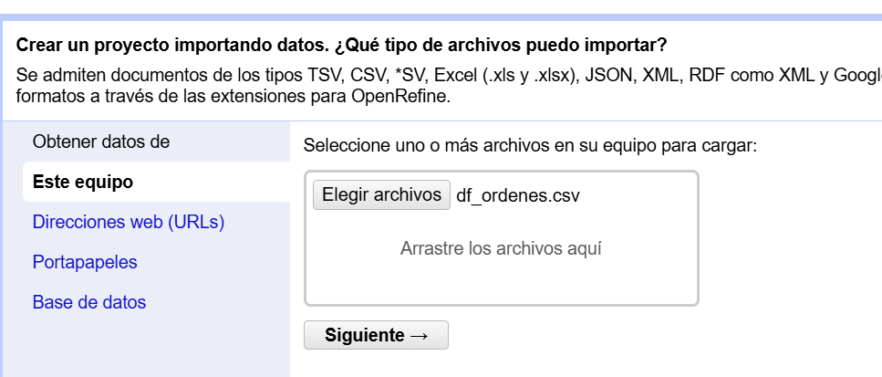
*Imagen 1. Carga df_ordenes*

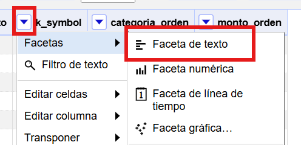
*Imagen 2. Crear Faceta de k_symbol*

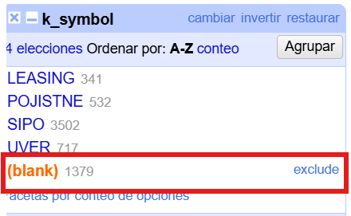
*Imagen 3. Identificar valores nulos de k_symbol*

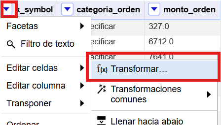
*Imagen 4. Acceso a transformar de k_symbol*

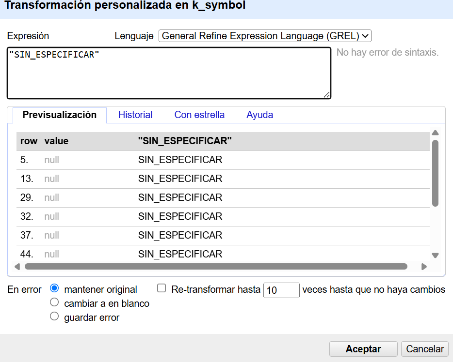
*Imagen 5. Transformación de k_symbol*

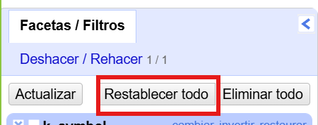
*Imagen 6. Restablecer k_symbol*

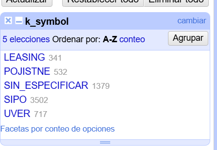
*Imagen 7. Sin datos en blanco k_symbol*

---

#### Proceso de `df_cliente_consolidado` (OpenRefine)

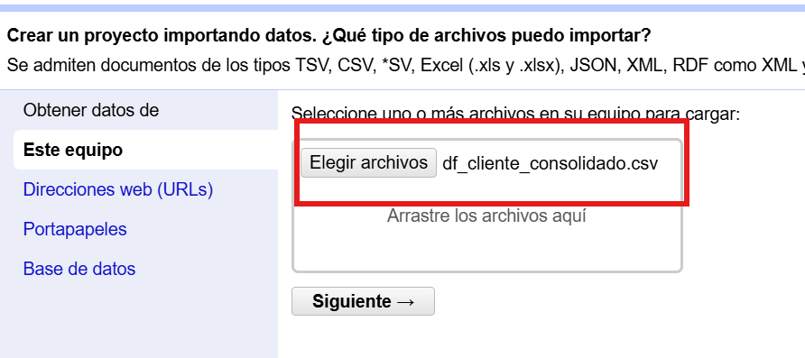
*Imagen 8. Carga de df_cliente_consolidado*

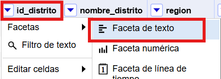
*Imagen 9. Crear Faceta de id_distrito*

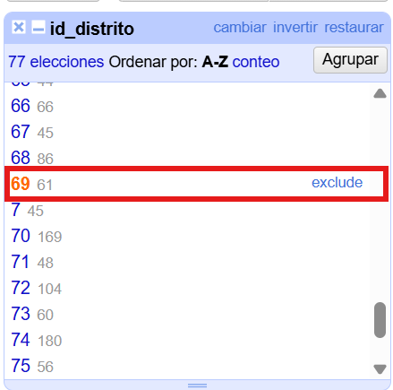
*Imagen 10. Filtrar por el número 69*

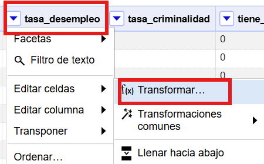
*Imagen 11. Ingreso a transformación tasa_desempleo*

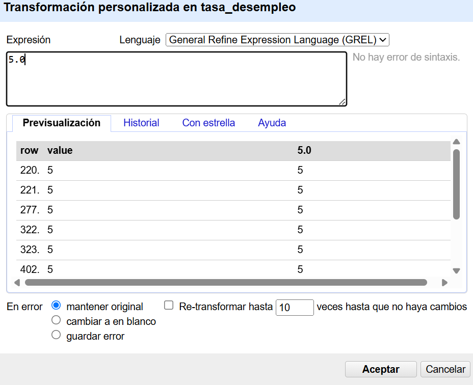
*Imagen 12. Transformación con los calculos de Python*

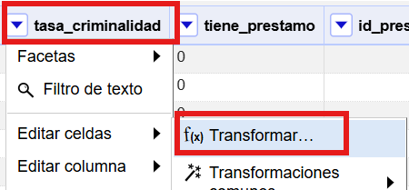
*Imagen 13. Ingreso transformación tasa_criminalidad*

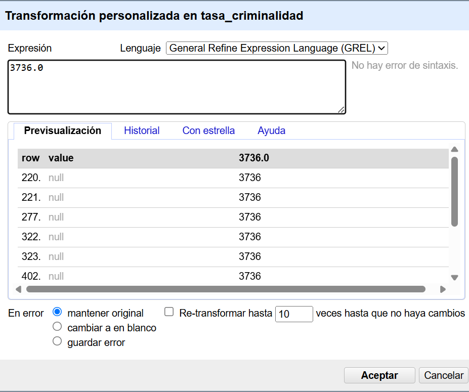
*Imagen 14. Transformación con resultados de python*

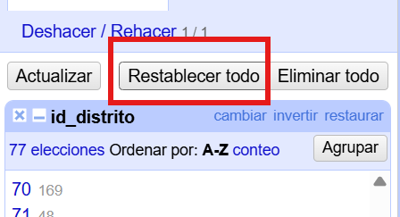
*Imagen 15. Restablecer tasa de desempleo y criminalidad*

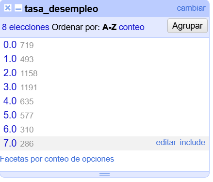
*Imagen 16. Sin vacíos en desempleo*

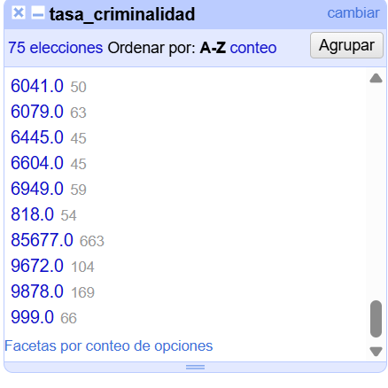
*Imagen 17. Sin vacíos en criminalidad*

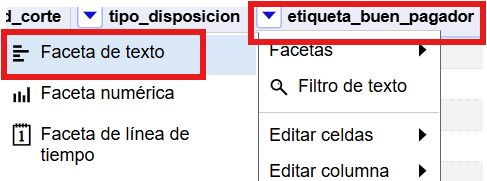
*Imagen 18. Faceta en etiqueta_buen_pagador*

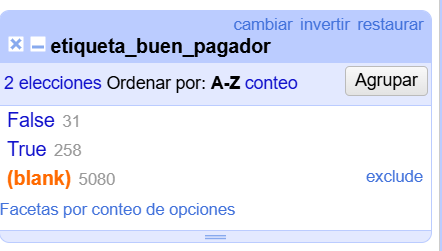
*Imagen 19. Identificación de vacíos*

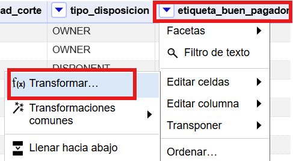
*Imagen 20. Ingreso transformación etiqueta_buen_pagador*

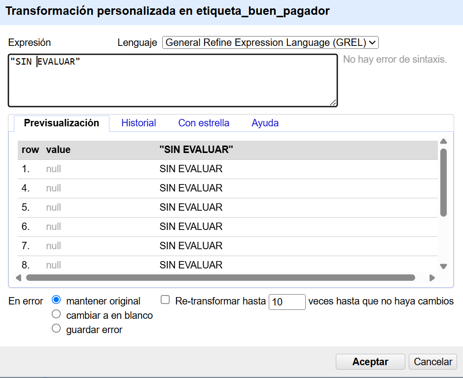
*Imagen 21. Transformación etiqueta_buen_pagador*

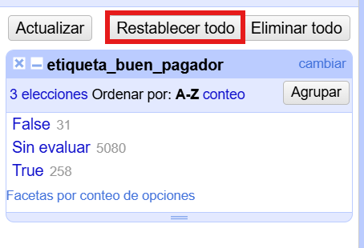
*Imagen 22. Restablecer y se muestra sin vacíos*

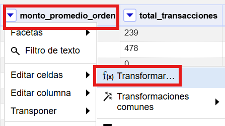
*Imagen 23. Ingreso a transformación monto_promedio_orden*

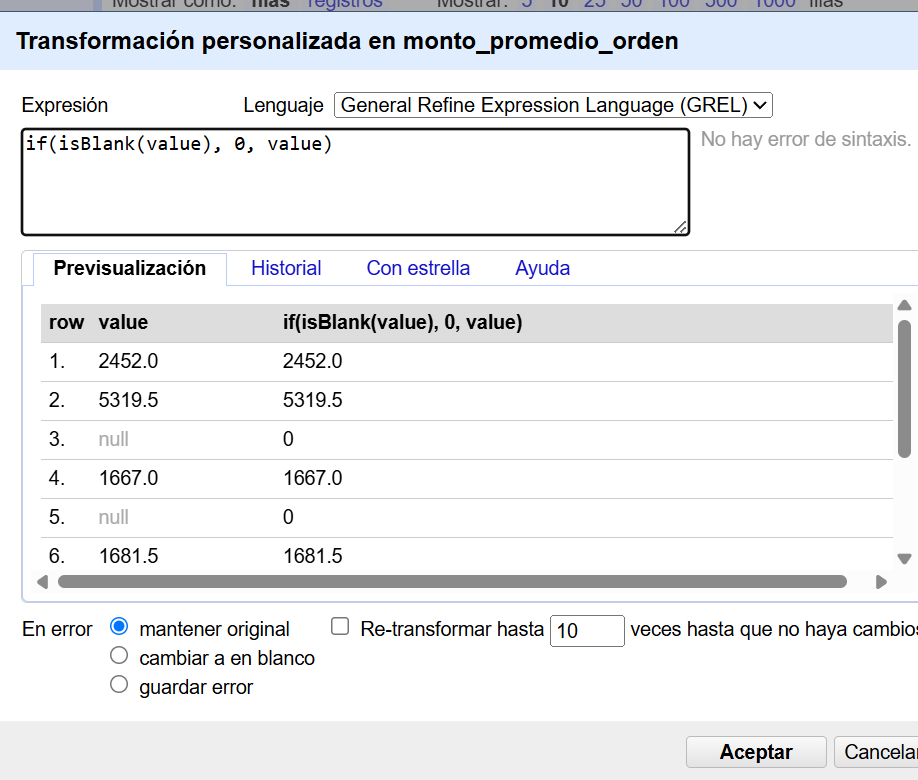
*Imagen 24. Transformación monto_promedio_orden*

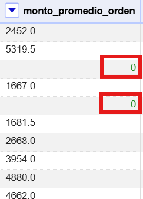
*Imagen 25. Resultado transformación*

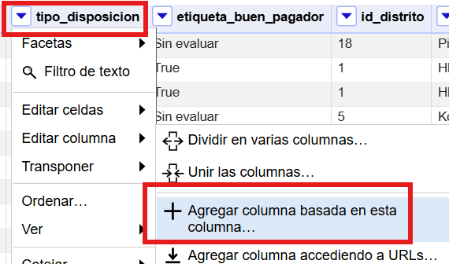
*Imagen 26. Columna basada en tipo_disposicion*

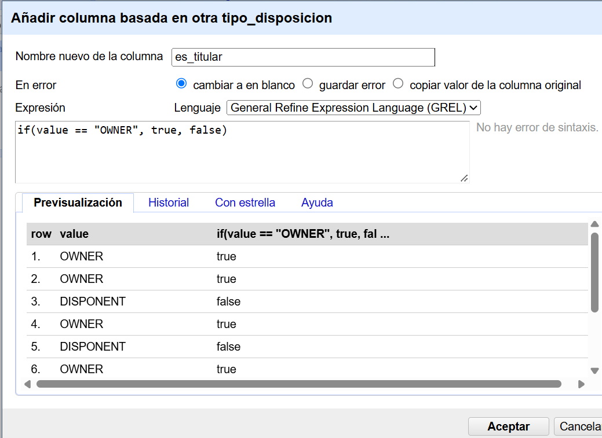
*Imagen 27. Creación nueva columna booleana*

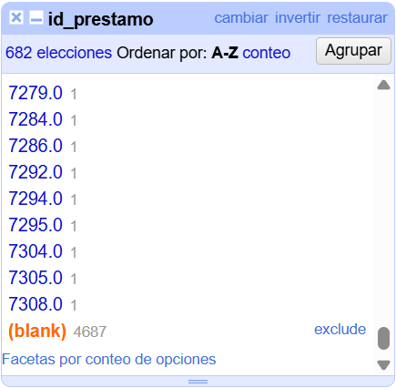
*Imagen 28. id_prestamos con vacíos justificados*

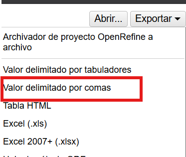
*Imagen 29. Exportación archivos*

---

#### Proceso de `df_transacciones` (Python / Pipelines Vectorizados)

Se identificaron 4 variables con datos faltantes (tanto nulos como cadenas vacías):

| Columna | Registros Faltantes | % Faltante | Causa Operativa |
| :--- | :---: | :---: | :--- |
| **`operation`** | 183,114 | 17.34% | Abonos automáticos de intereses generados por el sistema central (sin canal manual). |
| **`k_symbol`** | 535,314 | 50.68% | Movimientos en ventanilla/cajero o transferencias sin concepto asignado por el cliente. |
| **`bank`** | 760,931 | 72.04% | Operaciones físicas en efectivo y procesos internos que no involucran bancos externos. |
| **`account`** | 782,812 | 74.11% | Inexistencia de cuenta contraparte en movimientos de ventanilla, cajero o tesorería. |

*Tabla 1. Identificación variables*

##### Metodología y Reglas de Negocio para la Completitud de Datos

###### Fase 1: Deducción de Operación y Canal de Transacción
**Regla 1.1 (Abono Central de Intereses):** Las 183,114 transacciones con `operation` nula coincidían exactamente con transacciones de tipo abono (`PRIJEM`) y concepto de intereses (`k_symbol == 'UROK'`). Se imputaron determinísticamente como:
* `operation` $
ightarrow$ `'ABONO_INTERESES'`
* `tipo_operacion_traducido` $
ightarrow$ `'Intereses Ganados / Abono Bancario'`
* `canal` $
ightarrow$ `'Proceso Automatico / Sistema Central'`

###### Fase 2: Deducción Cruzada y Multicriterio de Conceptos (`k_symbol`)
Para resolver los 535,314 registros sin concepto comercial, se aplicó un embudo de deducción relacional:
* **Cruce Relacional con `df_prestamos`:** Se identificaron cargos en cuenta (`VYDAJ`) cuyo importe coincidía con centavos exactos con el campo `pago_mensual` de la tabla de préstamos para la misma cuenta. Se imputaron como `'UVER'` (*Amortización de Cuota de Préstamo*).
* **Cruce Relacional con `df_ordenes`:** Se cruzaron los débitos bancarios contra la tabla de órdenes de pago permanentes activas emparejando la tupla `(id_cuenta, monto_transaccion) == (id_cuenta, monto_orden)`. Esto permitió recuperar **10,912 transacciones** clasificándolas automáticamente en sus conceptos reales (`SIPO` para servicios básicos, `POJISTNE` para seguros y `LEASING`).
* **Deducción por Canal Físico y Operación de Caja:**
  * Las operaciones de retiros físicos en ventanilla y cajero automático (`VYBER` y `VYBER KARTOU`) sin concepto se imputaron como `'RETIRO_EFECTIVO'` (**282,657 transacciones**).
  * Los depósitos en efectivo en ventanilla (`VKLAD`) se imputaron como `'DEPOSITO_EFECTIVO'` (**156,743 transacciones**).
* **Categorización de Movimientos Residuales:**
  * Transferencias electrónicas interbancarias salientes sin descripción $
ightarrow$ `'TRANSFERENCIA_EXTERNA'` (**50,093 transacciones**).
  * Abonos e ingresos ordinarios sin descripción $
ightarrow$ `'INGRESO_ORDINARIO'` (**34,888 transacciones**).

###### Fase 3: Resolución Operativa de Contrapares Bancarias (`bank` y `account`)
En el negocio financiero, la ausencia de un banco contraparte en operaciones de ventanilla o cajero no representa un error, sino una característica del canal (el dinero entra o sale de la bóveda del propio banco). Se aplicó la normalización canónica:
* **Operaciones físicas de efectivo:** Se asignó `bank = 'BANCO_PROPIO_LOCAL'` y `account = 'CAJA_VENTANILLA_ATM'`.
* **Procesos automáticos del banco (Intereses, Comisiones de Mantenimiento):** Se asignó `bank = 'SISTEMA_CENTRAL_BANCO'` y `account = 'TESORERIA_INTERNA'`.
* **Transferencias externas no catalogadas:** Se asignó `bank = 'OTRA_ENTIDAD_NO_REGISTRADA'` y `account = 'CUENTA_EXTERNA_NO_REGISTRADA'`.

###### Fase 4: Enriquecimiento Semántico (`concepto_movimiento_traducido`)
Se creó una nueva dimensión descriptiva (`concepto_movimiento_traducido`) que homologa el código checo original (`k_symbol`) a una nomenclatura financiera formal en español apta para consumo analítico y cuadros de mando.

| Concepto Financiero Homologado | Total Transacciones | % del Universo Total | Categoría / Naturaleza Operativa |
| :--- | :---: | :---: | :--- |
| **Retiro en Efectivo (Gastos Personales)** | 282,657 | 26.76% | Egreso Físico en Ventanilla / Cajero ATM |
| **Intereses Ganados en Cuenta** | 183,114 | 17.34% | Ingreso Automático por Rendimiento Bancario |
| **Depósito en Efectivo de Fondos Propios** | 156,743 | 14.84% | Ingreso Físico en Ventanilla Bancaria |
| **Comisión por Mantenimiento / Servicios** | 155,832 | 14.75% | Débito Periódico por Cargos de Servicios |
| **Servicios Básicos del Hogar** | 128,168 | 12.13% | Pago Recurrente Domiciliado (Luz, Agua, Gas) |
| **Transferencia Bancaria Saliente** | 50,093 | 4.74% | Envío Interbancario a Cuentas Externas |
| **Ingreso Bancario Ordinario** | 34,888 | 3.30% | Transferencias Recibidas de Terceros |
| **Abono de Pensión / Jubilación** | 30,338 | 2.87% | Crédito de Prestaciones de Seguridad Social |
| **Pago de Póliza de Seguro** | 19,309 | 1.83% | Pago Domiciliado de Coberturas Aseguradoras |
| **Amortización de Cuota de Préstamo** | 13,601 | 1.29% | Pago Mensual de Crédito Bancario Concedido |
| **Interés Moratorio por Sobregiro** | 1,577 | 0.15% | Cargo por Penalización de Saldo Negativo |
| **TOTAL GENERAL** | **1,056,320** | **100.00%** | **Completitud Absoluta (0% Nulos)** |

*Tabla 2. Distribución Final de Movimientos Financieros Categorizados*

---

### 2.8 Habilidades blandas empleadas en la práctica

* [ ] Liderazgo
* [ ] Trabajo en equipo
* [ ] Comunicación asertiva
* [ ] La empatía
* [x] Pensamiento crítico
* [ ] Flexibilidad
* [ ] La resolución de conflictos
* [ ] Adaptabilidad
* [x] Responsabilidad

---

### 2.9 Conclusiones

* **Eficiencia y escalabilidad mediante enfoque híbrido:** La combinación de herramientas de limpieza interactiva para volúmenes pequeños y medianos (OpenRefine) con pipelines vectorizados en Python para volúmenes masivos demostró ser la estrategia más eficiente y escalable para garantizar la completitud de datos en el Data Warehouse dimensional Kimball, evitando limitaciones de memoria sin sacrificar la trazabilidad del proceso.
* **Importancia del diagnóstico cuantitativo:** El diagnóstico cuantitativo previo a cualquier intervención resultó indispensable no solo para decidir cómo limpiar, sino también para reconocer cuándo no limpiar: mientras `df_ordenes` y `df_cliente_consolidado` requirieron reglas de imputación específicas, `df_prestamos` se encontró completo al 100% en sus métricas centrales, evidenciando que el trabajo de calidad de datos debe basarse en evidencia diagnóstica y no en la suposición de que todo archivo del modelo dimensional necesita intervención.
* **Preservación de la semántica del negocio:** La distinción entre huecos estructurales (ausencia legítima del dato) y huecos reales (información faltante por resolver) fue determinante para evitar sesgos analíticos: rellenar artificialmente campos que legítimamente no existen como el plazo de un préstamo para un cliente que nunca solicitó uno habría introducido ruido capaz de distorsionar análisis posteriores de clusterización o scoring crediticio dentro del modelo Kimball.

---

### 2.10 Recomendaciones

* **Validaciones tempranas en staging:** Incorporar validaciones de calidad de datos desde la etapa de extracción (staging) del ETL, mediante restricciones condicionadas o catálogos por defecto, para reducir la proporción de huecos que deben resolverse manualmente en etapas posteriores del pipeline.
* **Documentación y versionamiento centralizado:** Documentar y versionar cada regla de imputación aplicada ya sea en OpenRefine o en scripts de Python en un diccionario de datos centralizado y compartido por todo el equipo, de forma que el criterio de negocio detrás de cada transformación sea auditable y reproducible por cualquier integrante del proyecto.
* **Definición de umbrales objetivos de volumen:** Establecer desde el inicio del proyecto un umbral de decisión objetivo sobre qué herramienta de limpieza utilizar según el volumen del dataset (por ejemplo, un límite aproximado de 50,000 a 100,000 filas como frontera práctica para OpenRefine), evitando el uso de una herramienta inadecuada que comprometa el rendimiento o la reproducibilidad del proceso de completitud de datos.

---

### 2.11 Referencias bibliográficas

* [1] R. Kimball and M. Ross, *The Data Warehouse Toolkit: The Definitive Guide to Dimensional Modeling*, 3rd ed. Indianapolis, IN, USA: Wiley, 2013.
* [2] W. H. Inmon, *Building the Data Warehouse*, 4th ed. Indianapolis, IN, USA: Wiley, 2005.
* [3] J. MacQueen, "Some methods for classification and analysis of multivariate observations," in *Proc. 5th Berkeley Symp. Math. Stat. Probab.*, Berkeley, CA, USA, 1967, vol. 1, pp. 281–297.
* [4] W. McKinney, "Data structures for statistical computing in Python," in *Proc. 9th Python in Science Conf. (SciPy)*, Austin, TX, USA, 2010, pp. 56–61.
* [5] P. Berka, "Guide to the Financial Data Set," PKDD'99 Discovery Challenge, 1999. [Online]. Available: https://sorry.vse.cz/~berka/challenge/pkdd1999/

---

### 2.12 Anexos

#### Anexo 1: Selección de Variables y Correlaciones - Proceso k-means

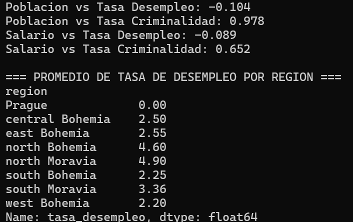
*Anexo 1. Selección de Variables y Correlaciones - Proceso k-means*

```text
Poblacion vs Tasa Desempleo: -0.104
Poblacion vs Tasa Criminalidad: 0.978
Salario vs Tasa Desempleo: -0.089
Salario vs Tasa Criminalidad: 0.652

=== PROMEDIO DE TASA DE DESEMPLEO POR REGION ===
region
Prague             0.00
central Bohemia    2.50
east Bohemia       2.55
north Bohemia      4.60
north Moravia      4.90
south Bohemia      2.25
south Moravia      3.36
west Bohemia       2.20
Name: tasa_desempleo, dtype: float64
```

---

#### Anexo 2: Determinación de k Óptimo - Proceso k-means

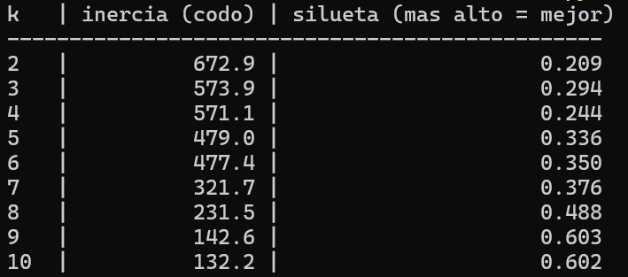
*Anexo 2. Determinación de k Óptimo - Proceso k-means*

| k | Inercia (Codo) | Silueta (más alto = mejor) |
| :---: | :---: | :---: |
| 2 | 672.9 | 0.209 |
| 3 | 573.9 | 0.294 |
| 4 | 571.1 | 0.244 |
| 5 | 479.0 | 0.336 |
| 6 | 477.4 | 0.350 |
| 7 | 321.7 | 0.376 |
| 8 | 231.5 | 0.488 |
| **9** | **142.6** | **0.603** |
| 10 | 132.2 | 0.602 |

---

#### Anexo 3: Código Fuente del Algoritmo de Imputación – Proceso k-means

```python
import pandas as pd
import numpy as np

# ==============================================================
# 1. CARGA DE DATOS
# ==============================================================
df = pd.read_csv('df_cliente_consolidado.csv')

# ==============================================================
# 2. TABLA DE DISTRITOS UNICA (77 filas, no 5369 clientes)
# ==============================================================
columnas_distrito = [
    'id_distrito', 'nombre_distrito', 'region',
    'poblacion', 'salario_promedio',
    'tasa_desempleo', 'tasa_criminalidad'
]
dist = df[columnas_distrito].drop_duplicates(subset='id_distrito').reset_index(drop=True)
print(f"Distritos unicos encontrados: {len(dist)}")

objetivo = dist[dist['id_distrito'] == 69].copy()
resto = dist[dist['id_distrito'] != 69].copy()

if objetivo.empty:
    raise ValueError("No se encontro el distrito 69 en el archivo. Revisa la ruta/columna.")

# ==============================================================
# 3. VARIABLES JUSTIFICADAS POR CORRELACION
# poblacion -> correlaciona 0.978 con tasa_criminalidad
# region    -> el norte de Moravia/Bohemia tiene desempleo mucho
#              mas alto que el resto (region explica desempleo,
#              poblacion casi no: correlacion de solo -0.10)
# ==============================================================
num_resto = resto[['poblacion', 'salario_promedio']]
num_obj = objetivo[['poblacion', 'salario_promedio']]

media = num_resto.mean()
desv = num_resto.std()

num_resto_z = (num_resto - media) / desv
num_obj_z = (num_obj - media) / desv

cat_resto = pd.get_dummies(resto['region'], prefix='region').astype(float)
cat_obj = pd.get_dummies(objetivo['region'], prefix='region') \
    .reindex(columns=cat_resto.columns, fill_value=0).astype(float)

X = np.hstack([num_resto_z.values, cat_resto.values]).astype(float)
punto_objetivo = np.hstack([num_obj_z.values[0], cat_obj.values[0]]).astype(float)

# ==============================================================
# 4. K-MEANS, UNA SOLA CORRIDA
# ==============================================================
def correr_kmeans(X, k, seed, max_iteraciones=200):
    rng = np.random.RandomState(seed)
    idx_iniciales = rng.choice(len(X), k, replace=False)
    centroides = X[idx_iniciales]
    
    for iteracion in range(max_iteraciones):
        distancias = np.sqrt(((X[:, np.newaxis, :] - centroides[np.newaxis, :, :]) ** 2).sum(axis=2))
        asignaciones = np.argmin(distancias, axis=1)
        nuevos_centroides = np.array([
            X[asignaciones == c].mean(axis=0) if np.any(asignaciones == c) else centroides[c]
            for c in range(k)
        ])
        if np.allclose(nuevos_centroides, centroides):
            break
        centroides = nuevos_centroides
        
    inercia = sum(((X[asignaciones == c] - centroides[c]) ** 2).sum() for c in range(k))
    return asignaciones, centroides, inercia

# ==============================================================
# 5. MULTI-REINICIO: 50 corridas con semillas distintas,
# nos quedamos con la de menor inercia
# ==============================================================
k = 9
N_REINICIOS = 50
mejor_inercia = np.inf
mejor_asignaciones, mejor_centroides = None, None

for seed in range(N_REINICIOS):
    asignaciones, centroides, inercia = correr_kmeans(X, k, seed)
    if inercia < mejor_inercia:
        mejor_inercia = inercia
        mejor_asignaciones = asignaciones
        mejor_centroides = centroides

print(f"Mejor inercia encontrada tras {N_REINICIOS} reinicios: {mejor_inercia:.2f}")
resto['cluster'] = mejor_asignaciones

# ==============================================================
# 6. UBICAR A QUE CLUSTER PERTENECE JESENIK
# ==============================================================
distancias_objetivo = np.sqrt(((mejor_centroides - punto_objetivo) ** 2).sum(axis=1))
cluster_jesenik = np.argmin(distancias_objetivo)
print(f"Jesenik (distrito 69) pertenece al cluster {cluster_jesenik}")

# ==============================================================
# 7. IMPUTACION: mediana del resto de distritos del mismo cluster
# ==============================================================
companeros = resto[resto['cluster'] == cluster_jesenik]
print(f"\nDistritos en el mismo cluster que Jesenik ({len(companeros)}):")
print(companeros[['nombre_distrito', 'region', 'poblacion', 'tasa_desempleo', 'tasa_criminalidad']].to_string(index=False))

desempleo_imputado = companeros['tasa_desempleo'].median()
criminalidad_imputada = companeros['tasa_criminalidad'].median()

print(f"tasa_desempleo = {desempleo_imputado}")
print(f"tasa_criminalidad = {criminalidad_imputada}")
```

---

#### Anexo 4: Repositorio con todo sobre el proyecto

El código fuente, scripts de transformación, modelos de datos y DataFrames limpios se encuentran versionados en el repositorio oficial:
* [GitHub: Hlagua/DocumentosBi](https://github.com/Hlagua/DocumentosBi)
