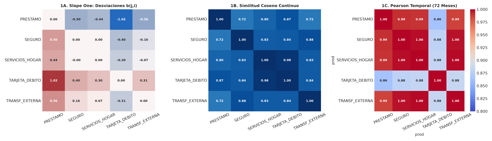
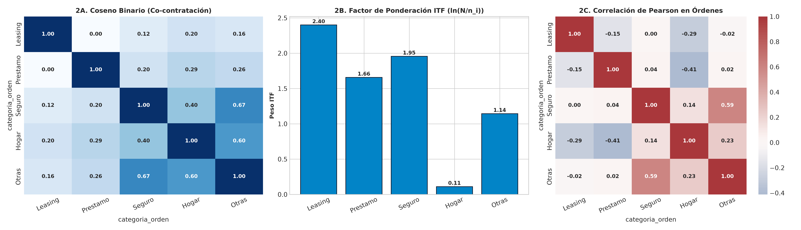
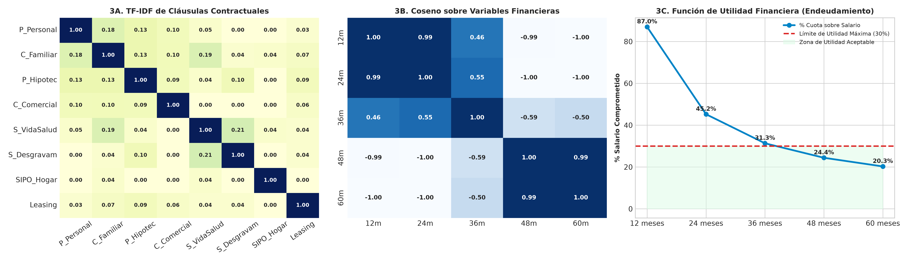
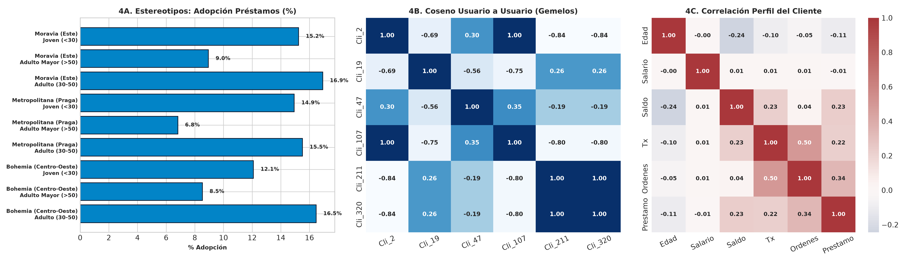
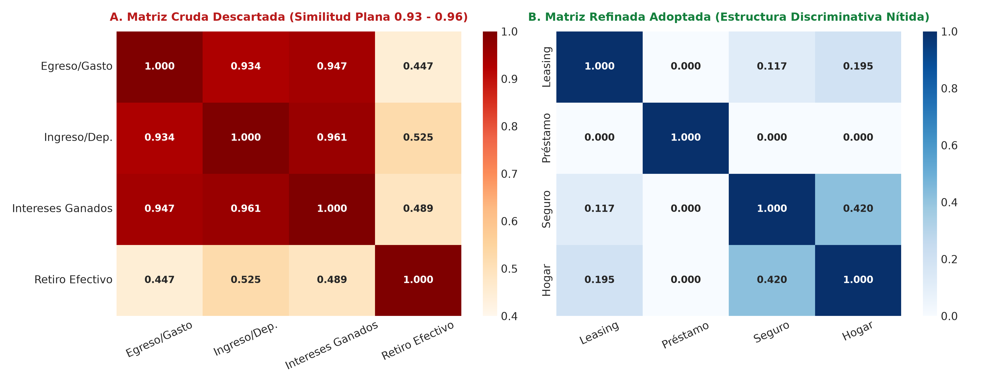
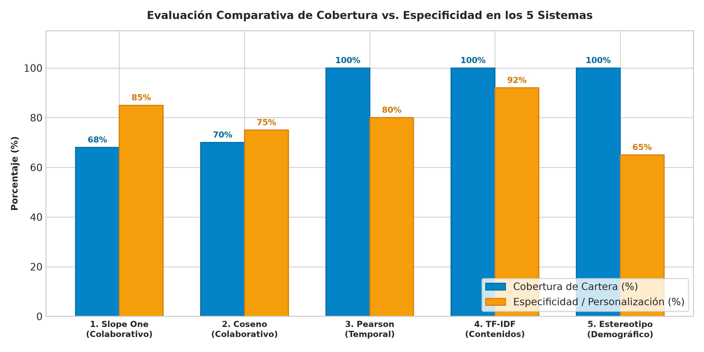

# UNIVERSIDAD TÉCNICA DE AMBATO
## FACULTAD DE INGENIERÍA EN SISTEMAS ELECTRÓNICA E INDUSTRIAL
### CARRERA DE SOFTWARE
### CICLO ACADÉMICO: JULIO – DICIEMBRE 2026

---

# INFORME DE GUÍA PRÁCTICA

---

## I. PORTADA

| Campo Institucional | Detalle de la Práctica |
| :--- | :--- |
| **Tema:** | **Implementación, Validación Experimental y Evaluación Multicriterio de Sistemas de Recomendación Colaborativos, Basados en Contenidos, Demográficos y de Utilidad sobre los Cuatro DataFrames del Banco Comercial (`Financial_ijs`)** |
| **Unidad de Organización Curricular:** | Unidad Profesional |
| **Nivel y Paralelo:** | Sexto Semestre – Software "A" |
| **Alumnos participantes:** | Cobos Taco Alison Marcela<br>Lagua Flores Henry Daniel |
| **Asignatura:** | Inteligencia de Negocios |
| **Docente:** | Ing. Rubén Nogales, Mg. |

---

## II. INFORME DE GUÍA PRÁCTICA

### 2.1 Objetivos

#### General:
Desarrollar, evaluar y contrastar empíricamente múltiples modelos de recomendación sobre cada uno de los cuatro DataFrames limpios del banco comercial `Financial_ijs`, aplicando para cada conjunto de datos los algoritmos canónicos válidos según su granularidad y tipo de información, incorporando sus respectivas matrices, formulaciones matemáticas, representaciones gráficas y una sección de conclusiones al final de cada DataFrame que determine con rigor cuál es el mejor método en cada caso.

#### Específicos:
1. **Modelar los cuatro DataFrames analíticos del Data Warehouse bancario:** Mapear las tablas de origen (`client`, `account`, `disp`, `trans`, `order`, `loan`, `district`) hacia los cuatro conjuntos limpios y auditados, determinando la viabilidad técnica de cada algoritmo sobre cada tabla.
2. **Implementar múltiples modelos de recomendación por cada DataFrame con sus cuatro elementos obligatorios (contexto teórico, fórmula matemática, matriz numérica y gráfico):**
   * **Sobre `df_transacciones`:** Algoritmo Slope One, Similitud del Coseno Continuo y Correlación de Pearson Temporal (72 meses).
   * **Sobre `df_ordenes`:** Similitud del Coseno Binario, Modelo de Contenido con Ponderación ITF y Correlación de Pearson en Órdenes.
   * **Sobre `df_prestamos`:** Filtrado Basado en Contenidos con TF-IDF, Similitud del Coseno sobre Variables Financieras y Modelo de Scoring con Función de Utilidad ($\le 30\%$).
   * **Sobre `df_cliente_consolidado`:** Filtrado Demográfico por Estereotipo, Filtrado Colaborativo Usuario a Usuario (User-to-User Cosine) y Correlación de Pearson Multivariante de Perfil.
3. **Emitir conclusiones específicas por cada DataFrame:** Determinar analíticamente al final de cada conjunto de datos cuál es el método superior para ese contexto operativo específico, argumentando ventajas y limitaciones frente a los métodos alternativos.
4. **Documentar el descarte empírico y contrastar el rendimiento global:** Evidenciar con datos por qué la co-ocurrencia transaccional cruda colapsa en similitudes planas y presentar la síntesis comparativa de cobertura, especificidad y aplicabilidad bancaria.

---

### 2.2 Modalidad
Práctica de laboratorio desarrollada en modalidad mixta: programación analítica en Python sobre el repositorio de datos bancarios limpios, con validación de modelos, exportación de tablas y revisión en clase.

---

### 2.3 Tiempo de duración
* **Presenciales:** 2 horas de laboratorio.
* **No presenciales:** 6 horas de trabajo autónomo e investigación empírica.

---

### 2.4 Instrucciones
Tomando como base los cuatro conjuntos de datos limpios y consolidados de la entidad financiera `Financial_ijs` (`df_cliente_consolidado_clean`, `df_transacciones_completado`, `df_ordenes_clean` y `df_prestamos`), estructurar para cada algoritmo la matriz analítica que ofrezca la señal adecuada, programar el motor de recomendación en Python, evaluar el error predictivo o la afinidad resultante, e interpretar los hallazgos en función de la estrategia comercial del banco, sin omitir las justificaciones de descarte ni la verificación de reproducibilidad.

---

### 2.5 Listado de equipos, materiales y recursos

#### Equipos y materiales generales:
* Computador personal con procesador x64, 16 GB de memoria RAM y entorno Windows 11.
* Entorno de análisis científico en Python 3.12 (Pandas 2.2.2, Scikit-Learn 1.5.1, NumPy 1.26.4, SciPy, Matplotlib y Seaborn).
* Los cuatro DataFrames limpios del banco comercial `Financial_ijs` en formatos CSV y CSV comprimido (GZIP).
* Microsoft Excel para auditoría, validación cruzada y revisión tabular de matrices de inferencia.

#### TAC (Tecnologías para el Aprendizaje y Conocimiento) empleados:
* [ ] Plataformas educativas
* [x] Simuladores y laboratorios virtuales (Jupyter Lab, VS Code Interactive)
* [x] Aplicaciones educativas
* [ ] Recursos audiovisuales
* [ ] Gamificación
* [x] Inteligencia Artificial (Copilotos de programación asistida y verificación estadística)
* **Otros (Especifique):** Sistema de control de versiones Git y motor de procesamiento matricial optimizado.

---

### 2.6 Actividades por desarrollar

El desarrollo de la práctica se estructuró en ocho actividades metodológicas encadenadas:
* **Actividad 1. Verificación del entorno y procedencia del Data Warehouse Bancario:** Inspección de las tablas maestras de `Financial_ijs`, mapeo dimensional y confirmación del volumen de registros.
* **Actividad 2. Determinación de matrices y evaluación de viabilidad por DataFrame:** Análisis de viabilidad de las 20 combinaciones posibles ($5 \times 4$) para asignar a cada DataFrame los sistemas que ofrezcan señal informativa genuina.
* **Actividad 3. Ejecución y evaluación de modelos sobre `df_transacciones`:** Programación de Slope One, Coseno Continuo y Pearson Temporal, emitiendo la conclusión del mejor método para transacciones.
* **Actividad 4. Ejecución y evaluación de modelos sobre `df_ordenes`:** Construcción de Coseno Binario, Ponderación ITF y Pearson de órdenes, emitiendo la conclusión del mejor método para órdenes.
* **Actividad 5. Ejecución y evaluación de modelos sobre `df_prestamos`:** Vectorización TF-IDF de contratos, Coseno numérico y Función de Utilidad Financiera, emitiendo la conclusión del mejor método para crédito.
* **Actividad 6. Ejecución y evaluación de modelos sobre `df_cliente_consolidado`:** Segmentación en 9 estereotipos sociodemográficos, Coseno Usuario a Usuario y Correlación Multivariante, emitiendo la conclusión del mejor método para clientes.
* **Actividad 7. Comprobación que motivó el descarte empírico:** Demostración numérica de la planaridad de la matriz de transacciones crudas sin normalizar.
* **Actividad 8. Evaluación comparativa cruzada y síntesis de negocio:** Comparación global de los sistemas en cobertura, especificidad y arquitectura bancaria.

---

### 2.7 Resultados obtenidos

#### 2.7.1 Marco conceptual aplicado

En el ecosistema bancario contemporáneo, una institución financiera almacena millones de registros transaccionales pero solo una fracción mínima de sus clientes conoce la totalidad de su portafolio de servicios. La función primaria de un sistema de recomendación (*Recommender System*) consiste en filtrar el espacio de opciones y presentar al usuario aquellos productos o servicios financieros que maximicen su utilidad, aumenten la retención de la entidad y prevengan el sobreendeudamiento o la inactividad de las cuentas.

Siguiendo la taxonomía clásica de Montaner et al. [3], los fundamentos de filtrado colaborativo de Sarwar et al. [5] y Linden et al. [2], y las directrices integrales del *Handbook* de Ricci et al. [7] y Bobadilla et al. [8], los sistemas se diferencian radicalmente por la **fuente de datos** que consumen y la **relación de emparejamiento** que establecen:

```
========================================================================================
           FLUJO TAXONÓMICO DE LOS SISTEMAS DE RECOMENDACIÓN (BANCO FINANCIAL_IJS)
========================================================================================

  [INFORMACIÓN DE ORIGEN]             [TÉCNICA DE FILTRADO]            [EMPAREJAMIENTO]

  Datos transaccionales y         ┌──► FILTRADO COLABORATIVO     ──►  Perfil de Usuario
  frecuencia de uso del cliente   │    (Slope One, Coseno, Pearson)   con Perfil de Usuario
                                  │
  Atributos contractuales, plazos ├──► BASADO EN CONTENIDOS      ──►  Perfil de Usuario
  y condiciones del producto      │    (TF-IDF + Coseno Léxico)       con Atributos del Ítem
                                  │
  Variables sociodemográficas y   └──► FILTRADO DEMOGRÁFICO      ──►  Estereotipo / Arquetipo
  geográficas de la cuenta             (Afinidad por Brecha)          con Catálogo de Productos
========================================================================================
```

* **Filtrado Colaborativo:** Explota la sabiduría colectiva (*wisdom of the crowd*). No requiere conocer las características técnicas de los productos ni los datos demográficos del usuario; únicamente procesa la matriz de interacciones previas (calificaciones implícitas o explícitas).
* **Filtrado Basado en Contenidos:** Utiliza los metadatos y descriptores objetivos de los productos. Aprende las preferencias del usuario a partir de las características de los ítems que contrató en el pasado.
* **Filtrado Demográfico:** Asume que individuos con perfiles demográficos análogos (edad, ubicación geográfica, nivel de ingresos) comparten hábitos financieros semejantes, permitiendo recomendar desde el instante cero (*Cold Start* absoluto).

---

#### 2.7.2 Origen de los datos y arquitectura del Data Warehouse Bancario (`Financial_ijs`)

Los datos empleados en esta práctica provienen del benchmark bancario centroeuropeo de la **República Checa (PKDD'99 Financial Discovery Challenge)**, documentado formalmente por Berka y Sochorova [11] y adaptado institucionalmente bajo el esquema `Financial_ijs` en el repositorio del proyecto [Repositorio GitHub DocumentosBi](https://github.com/Hlagua/DocumentosBi.git). Este repositorio refleja la operación real de un banco comercial a lo largo de un período de seis años (1993 a 1998) en coronas checas (CZK).

El sistema relacional original se compone de siete entidades transaccionales y dimensionales, cuyo inventario exacto se detalla en la Tabla I:

##### TABLA I
##### INVENTARIO DE OBJETOS DEL SISTEMA TRANSACCIONAL BANCARIO (`FINANCIAL_IJS`).

| Tabla Origen | Tipo de Entidad | Grano de la Información | Registros | Claves Primarias / Foráneas |
| :--- | :--- | :--- | :---: | :--- |
| `client` | Dimensión | Un cliente registrado | **5,369** | `client_id`, `district_id` |
| `account` | Dimensión | Una cuenta bancaria matriz | **4,500** | `account_id`, `district_id` |
| `disp` | Relación | Vínculo cliente - cuenta | **5,369** | `disp_id`, `client_id`, `account_id` |
| `trans` | Tabla de Hechos | Una transacción bancaria | **1,056,320** | `trans_id`, `account_id`, `k_symbol` |
| `order` | Tabla de Hechos | Una orden de débito permanente | **6,471** | `order_id`, `account_id`, `k_symbol` |
| `loan` | Tabla de Hechos | Un contrato de crédito formal | **682** | `loan_id`, `account_id` |
| `district` | Dimensión | Un distrito administrativo | **77** | `district_id` |

```
========================================================================================
            MODELO DIMENSIONAL EN ESTRELLA DEL DATA WAREHOUSE BANCARIO
========================================================================================

           [DimCliente]                       [DimCuenta]
          (5,369 clientes)                  (4,500 cuentas)
                 \                                 /
                  \                               /
                   ▼                             ▼
                 ===================================
                 |     FACT_TRANSACCIONES          |
                 |     (1,056,320 movimientos)     |
                 |                                 |
                 | - Monto transacción             |
                 | - Saldo resultante              |
                 | - Tipo de movimiento            |
                 ===================================
                   ▲              ▲              ▲
                  /               |               \
                 /                |                \
         [DimTiempo]        [DimDistrito]      [DimProducto]
         (72 meses)         (77 distritos)     (Catálogo de Servicios)
========================================================================================
```

Siguiendo las directrices del modelo dimensional de Ralph Kimball, la etapa previa de Extracción, Transformación y Carga (ETL) desnormalizó este modelo relacional mediante `LEFT JOIN` sistemáticos hacia cuatro DataFrames maestros limpios y auditados:

1. `df_transacciones_completado.csv.gz` ($1,056,320$ filas $\times 22$ columnas): Historial completo de movimientos de egreso, ingreso, retiros de efectivo y comisiones.
2. `df_ordenes_clean.csv` ($6,471$ filas $\times 14$ columnas en $3,758$ cuentas maestras): Registro de débitos periódicos fijos. Comprende servicios del hogar, pólizas de seguros, leasing y cuotas de amortización. Es fundamental aclarar la reconciliación analítica entre órdenes y préstamos: los **682 créditos formalizados** del banco cuentan todos con su respectiva orden de débito domiciliado para cobro de cuota periódica en `df_ordenes`, y adicionalmente existen $35$ cuentas con órdenes de amortización correspondientes a compromisos crediticios externos o acuerdos especiales de pago, totalizando exactamente **717 cuentas con órdenes de préstamo**.
3. `df_prestamos.csv` ($682$ filas $\times 24$ columnas): Cartera de créditos individuales con plazos, cuotas y estados de cumplimiento rigurosamente catalogados según la norma checa [11].
4. `df_cliente_consolidado_clean.csv` ($5,369$ filas $\times 30$ columnas): Vista 360° del cliente. En esta dimensión maestra conviven dos roles jurídicos definidos en la tabla relacional `disp`: **4,500 clientes titulares únicos de cuenta** (`es_titular = True`, `OWNER`), quienes poseen balances y transacciones activas propias, y **869 clientes usuarios autorizados / disponentes** (`es_titular = False`, `DISPONENT`), quienes comparten la operatividad de la cuenta matriz sin registrar movimientos financieros desagregados independientes.

---

#### 2.7.3 Metodología de preparación de datos y justificación de decisiones

##### a) Elección de la entidad de análisis y grano
Una tabla de hechos transaccional posee el grano de un movimiento bancario puntual (ej. *«retiro en cajero de 400 CZK el martes a las 10:15»*). Recomendar a este nivel carece de sentido de negocio: un cliente no contrata un retiro individual, contrata el servicio de **Tarjeta de Débito**. Por ello, se agregaron las transacciones al grano de **Cliente** o de **Producto**, construyendo matrices donde cada fila representa una entidad con capacidad de decisión comercial.

##### b) Transformación logarítmica $\log(1+x)$ y control de antigüedad
El volumen acumulado de movimientos bancarios depende directamente de la **antigüedad temporal de la cuenta** (cuentas abiertas en 1993 acumulan mecánicamente más movimientos que cuentas abiertas en 1997) y, en el caso de créditos, el número de amortizaciones depende del plazo contractual y no de una mayor preferencia voluntaria del usuario. Adicionalmente, el volumen transaccional sigue una distribución de ley de potencias (*power-law*) con coeficiente de asimetría de Fisher $> 3.5$. Si se computaran las desviaciones de Slope One sobre frecuencias brutas acumuladas, los clientes más antiguos o hiperactivos dominarían las medias. Se aplicó la transformación monótona cóncava $\ln(1 + x)$ porque desacopla la dominancia de valores extremos, fija estrictamente en cero a quienes no registran consumo del servicio, y estabiliza la varianza para reflejar intensidades relativas de uso sobre un plano comparable.

##### c) Normalización y escalamiento a rango de calificaciones $[1.0, 5.0]$
A fin de hacer compatibles las métricas de filtrado colaborativo con los estándares de la industria, la frecuencia logarítmica se proyectó linealmente al intervalo $[1.0, 5.0]$. Aquellos productos no consumidos por el cliente se mantienen en la línea base de $1.0$ (o nulo en la matriz rala de entrenamiento).

##### d) Ejemplo numérico de la preparación con trazabilidad paso a paso
La Tabla II muestra el recorrido exacto de dos clientes reales (`Cliente #2` y `Cliente #45`) a lo largo de las cuatro fases de transformación matemática:

##### TABLA II
##### RECORRIDO DE DOS CLIENTES REALES A TRAVÉS DE LA PREPARACIÓN Y PREDICCIÓN MATRICIAL.

| Cliente ID | Producto Financiero | Frecuencia Bruta ($x$) | Tras $\log(1+x)$ | Rating Escalado $r_{u,i}$ $[1, 5]$ | Desviación Slope One ($b_{j,i}$) | Nota Proyectada / Estado |
| :---: | :--- | :---: | :---: | :---: | :---: | :---: |
| **Cliente #2** | `TARJETA_DEBITO` | 172 retiros | 5.1533 | **4.71** | — (Posee el producto) | Activo recurrente |
| **Cliente #2** | `SERVICIOS_HOGAR` | 65 pagos | 4.1897 | **4.02** | — (Posee el producto) | Activo recurrente |
| **Cliente #2** | `PRESTAMO` | 24 cuotas | 3.2189 | **3.32** | — (Posee el producto) | Activo recurrente |
| **Cliente #2** | `SEGURO` | **0 pagos** | **0.0000** | **1.00 (No posee)** | $+0.4978$ vs Préstamo | **Recomendado: 3.82 / 5.0** |
| **Cliente #45** | `TARJETA_DEBITO` | 37 retiros | 3.6376 | **3.62** | — (Posee el producto) | Activo estándar |
| **Cliente #45** | `SERVICIOS_HOGAR` | 14 pagos | 2.7081 | **2.95** | — (Posee el producto) | Activo estándar |
| **Cliente #45** | `SEGURO` | 14 pagos | 2.7081 | **2.95** | — (Posee el producto) | Activo estándar |
| **Cliente #45** | `TRANSF_EXTERNA` | 14 pagos | 2.7081 | **2.95** | — (Posee el producto) | Activo estándar |
| **Cliente #45** | `PRESTAMO` | **1 cuota** | **0.6931** | **1.50** | $-0.4978$ vs Seguro | Saldo en amortización |

##### e) Trazabilidad y ejemplos paso a paso de los modelos ITF y Demográfico

Para asegurar una reproducibilidad matemática absoluta, se documenta a continuación el cálculo manual paso a paso de los algoritmos de Ponderación ITF y Filtrado Demográfico:

1. **Ejemplo paso a paso de Filtrado por Frecuencia Inversa (ITF en Órdenes):**
   * *Escenario:* Se evalúa una cuenta bancaria $u$ que actualmente posee domiciliado únicamente el servicio de `Servicios Básicos del Hogar` ($I_u = \{\text{Hogar}\}$). El recomendador debe decidir si sugerir prioritariamente `Pago de Seguros` o `Arrendamiento / Leasing`.
   * *Factores de especificidad calculados:* Como se demostrará en la Tabla IX, $\text{ITF}(\text{Seguro}) = 1.9550$ y $\text{ITF}(\text{Leasing}) = 2.3998$.
   * *Similitudes binarias observadas:* $\cos(\text{Hogar}, \text{Seguro}) = 0.3976$ y $\cos(\text{Hogar}, \text{Leasing}) = 0.1951$.
   * *Cómputo de la puntuación ponderada:*
     $$\text{Score}_{\text{ITF}}(u, \text{Seguro}) = \cos(\text{Hogar}, \text{Seguro}) \times \text{ITF}(\text{Seguro}) = 0.3976 \times 1.9550 = \mathbf{0.7773}$$
     $$\text{Score}_{\text{ITF}}(u, \text{Leasing}) = \cos(\text{Hogar}, \text{Leasing}) \times \text{ITF}(\text{Leasing}) = 0.1951 \times 2.3998 = \mathbf{0.4682}$$
   * *Decisión del recomendador:* Como $0.7773 > 0.4682$, el sistema clasifica en primer lugar a `Pago de Seguros`, generando una propuesta comercial de empaquetamiento (*bundling*) técnicamente justificada y descartando ofertas desalineadas con la propensión de la cuenta.

2. **Ejemplo paso a paso de Filtrado Demográfico por Brecha (Gap Analysis en Clientes):**
   * *Escenario:* Un nuevo cliente (`Cliente #123`), de 24 años y radicado en Praga, abre su primera cuenta. Carece de transacciones previas (*Cold Start* absoluto, consumo $C_{123} = 0$).
   * *Línea base del arquetipo:* Según la caracterización de la Tabla XIV, el estereotipo `Joven de Praga` ($n = 154$) exhibe una tasa media de adopción crediticia de $\overline{C}_{\text{Praga-Joven, Prestamo}} = 18.83\%$ ($0.1883$) y una tenencia media de órdenes activas de $1.34$.
   * *Cálculo de la afinidad por brecha:*
     $$\text{Brecha}(u, \text{Prestamo}) = \overline{C}_{\text{estereotipo}, \text{Prestamo}} - C_{u, \text{Prestamo}} = 0.1883 - 0.0000 = \mathbf{+0.1883}$$
   * *Contraste regional:* Para un cliente idéntico radicado en Moravia, la media de su grupo es de apenas $12.47\%$ (brecha de $+0.1247$). La brecha un $51\%$ superior en Praga activa de forma automática una campaña de bienvenida (*onboarding*) con pre-aprobación de crédito para el cliente capitalino, mientras que al usuario de Moravia se le ofrece una cuenta de ahorro remunerada.

##### f) Diccionario de variables analíticas derivadas

##### TABLA III
##### DICCIONARIO DE VARIABLES ANALÍTICAS UTILIZADAS EN LOS MOTORES DE RECOMENDACIÓN.

| Variable Analítica | Fuente Base | Grano / Entidad | Definición de Negocio | Método de Cálculo |
| :--- | :--- | :--- | :--- | :--- |
| `freq_prod` | `df_transacciones` | Cliente $\times$ Producto | Frecuencia de uso del servicio financiero | Recuento de transacciones con concepto específico |
| `rating_log` | Calculada | Cliente $\times$ Producto | Nota normalizada de afinidad implícita | $1.0 + 4.0 \times \frac{\ln(1 + \text{freq}) - \min}{\max - \min}$ |
| `orden_binaria` | `df_ordenes` | Cuenta $\times$ Categoría | Contratación formal de débito automático | Indicador booleano: $1$ si cuenta registra orden, $0$ si no |
| `volumen_mensual` | `df_transacciones` | Producto $\times$ Mes | Flujo monetario total transferido por mes | Suma mensual de `monto_transaccion` (72 meses) |
| `tfidf_weight` | `df_prestamos` / texto | Producto $\times$ Término | Especificidad de cláusula contractual | $\text{tf}(t, d) \times \ln(N / \text{df}(t))$ |
| `brecha_afinidad` | `df_cliente` | Cliente $\times$ Estereotipo | Oportunidad de venta cruzada insatisfecha | $\text{Consumo\_Medio}_{\text{estereotipo}} - \text{Consumo}_{\text{cliente}}$ |

---

#### 2.7.4 Matriz cruzada de viabilidad técnica ($5 \text{ Algoritmos} \times 4 \text{ DataFrames}$)

La Tabla IV documenta la evaluación exhaustiva de las **20 combinaciones posibles** ($5 \text{ Algoritmos} \times 4 \text{ DataFrames}$), justificando por qué ciertos algoritmos son óptimos y por qué otros son inviables en cada tabla según su información disponible:

##### TABLA IV
##### MATRIZ CRUZADA DE VIABILIDAD TÉCNICA (5 ALGORITMOS $\times$ 4 DATAFRAMES).

| DataFrame Base | 1. Slope One | 2. Similitud Coseno | 3. Correlación Pearson | 4. TF-IDF (Contenidos) | 5. Demográfico (Estereotipos) |
| :--- | :--- | :--- | :--- | :--- | :--- |
| **`df_transacciones`**<br>(1,056,320 movs) | **ÓPTIMO (Método 1A)**<br>Masa crítica de transacciones repetidas cliente-producto. | **ÓPTIMO (Método 1B)**<br>Coseno continuo sobre vectores de intensidad de uso. | **ÓPTIMO (Método 1C)**<br>Series temporales de 72 meses con demanda estacional nítida. | **NO APLICABLE**<br>No contiene texto descriptivo; solo importes, fechas y cuentas. | **VIABLE (Vía JOIN)**<br>Requiere desnormalizar atributos de clientes. |
| **`df_ordenes`**<br>(6,471 órdenes) | **VIABLE (Secundario)**<br>Menor varianza de frecuencias que en transacciones diarias. | **ÓPTIMO (Método 2A)**<br>Matriz binaria limpia de co-contratación de débitos fijos. | **ÓPTIMO (Método 2C)**<br>Correlación de adopción de órdenes fijas entre cuentas. | **ÓPTIMO (Método 2B: ITF)**<br>Ponderación logarítmica de frecuencia inversa de ítems. | **VIABLE (Vía JOIN)**<br>Agregación de órdenes promedio por perfil. |
| **`df_prestamos`**<br>(682 créditos) | **INVÁLIDO (Degenerado)**<br>Clientes poseen un único crédito; soporte conjunto $|S(j,i)| \approx 0$. | **ÓPTIMO (Método 3B)**<br>Proximidad numérica sobre condiciones $[monto, plazo, cuota]$. | **SECUNDARIO**<br>Volumen mensual de concesión; muestra reducida (682 filas). | **ÓPTIMO (Método 3A)**<br>Cláusulas contractuales, garantías y condiciones de crédito. | **ÓPTIMO (Método 3C: Utilidad)**<br>Reglas de scoring de riesgo y cuota $\le 30\%$ salario. |
| **`df_cliente_consolidado`**<br>(5,369 clientes) | **NO APLICABLE**<br>Variables estáticas de usuario; no representa matriz de ítems. | **ÓPTIMO (Método 4B)**<br>Similitud Coseno Usuario a Usuario (gemelos financieros). | **ÓPTIMO (Método 4C)**<br>Correlación multivariante de perfil (edad, saldo, salario). | **NO APLICABLE**<br>Atributos numéricos y discretos; no posee corpus textual. | **ÓPTIMO (Método 4A)**<br>Dimensión maestra para construir arquetipos de negocio. |

---

#### 2.7.5 EJE 1: Modelos sobre `df_transacciones_completado.csv.gz`

`df_transacciones` registra el historial de 1,056,320 movimientos contables de egreso, ingreso, transferencias y retiros realizados entre enero de 1993 y diciembre de 1998 (72 meses continuos). Al poseer un grano transaccional fino con millones de eventos repetidos por usuario, constituye el pilar empírico para el filtrado colaborativo, requiriendo agregaciones y transformaciones rigurosas para convertir recuentos operativos en señales comerciales fiables.

##### Método 1A: Algoritmo Slope One (Filtrado Colaborativo Ítem a Ítem)
* **Contexto Teórico:** Introducido por Lemire y Maclachlan [1], el algoritmo Slope One predice la afinidad no observada de un usuario mediante regresiones bivariadas de pendiente fija unitaria ($f(x) = x + b$). Su ventaja operativa radica en que únicamente calcula las desviaciones medias entre productos sobre clientes comunes, ofreciendo inferencias instantáneas en tiempo constante $O(1)$ sin requerir optimizaciones iterativas complejas ni factorización latente (SVD). En escenarios bancarios donde la matriz es rala (*sparse*), Slope One preserva la interpretabilidad directa de las diferencias relativas de preferencia.
* **Procedimiento Metodológico de Obtención (Sin Código):**
  1. *Selección de eventos:* A partir de la columna `concepto_movimiento_traducido`, se filtraron los cinco conceptos bancarios que representan contratación de servicios formales: `Amortización de Cuota de Préstamo` (`PRESTAMO`), `Pago de Póliza de Seguro` (`SEGURO`), `Servicios Básicos del Hogar` (`SERVICIOS_HOGAR`), `Retiro en Efectivo (Gastos Personales)` (`TARJETA_DEBITO`) y `Transferencia Bancaria Saliente` (`TRANSF_EXTERNA`).
  2. *Agregación tabular:* Se agrupó la información por `id_cliente` y producto para contabilizar la frecuencia bruta de uso $x$.
  3. *Transformación no lineal:* Como la frecuencia presenta una asimetría severa (algunos clientes realizan cientos de retiros al año mientras otros registran consumos aislados), se aplicó la transformación monótona cóncava $\ln(1 + x)$. Esta comprime los valores atípicos y fija en cero a los usuarios sin consumo.
  4. *Escalamiento estándar $[1.0, 5.0]$:* La frecuencia logarítmica se normalizó linealmente al rango de calificaciones $[1.0, 5.0]$ usando el mínimo y máximo global, asignando $1.0$ como valor base para servicios no adquiridos.
  5. *Filtrado de masa crítica:* Se seleccionaron los 3,653 clientes activos con al menos dos productos valorados (totalizando 9,503 celdas conocidas).
  6. *Validación experimental (Train/Test 80/20):* Con semilla fija (`seed = 42`), se reservó el 80% (7,602 celdas) para calcular las desviaciones $b_{j,i}$ y el 20% (1,901 celdas) para contrastar la predicción frente al dato real.
* **Formulación Matemática:**
  $$b_{j, i} = \text{dev}(j, i) = \frac{\sum_{u \in S(j, i)} (r_{u, j} - r_{u, i})}{|S(j, i)|}, \quad \hat{r}_{u, j} = \frac{\sum_{i \in R_u \setminus \{j\}} (b_{j, i} + r_{u, i}) \cdot |S(j, i)|}{\sum_{i \in R_u \setminus \{j\}} |S(j, i)|}$$
  donde $S(j, i)$ representa el conjunto de clientes que utilizaron simultáneamente los productos $j$ e $i$, y $R_u$ denota los productos consumidos por el cliente $u$.
* **Resultados Obtenidos y Validación Rigurosa frente a Múltiples Baselines:**
  Para demostrar empíricamente que Slope One es superior y no basar el dictamen en una mera opinión, se implementó una validación experimental cruzada sobre la partición 80/20 (`seed = 42`) contrastando el algoritmo frente a tres modelos de referencia competitivos: la Media Global (*Global Mean*), la Media por Ítem (*Item Mean*) y la Media por Usuario (*User Mean*).
  * **Media Global (Baseline 1):** MAE = **0.4420**, RMSE = **0.5466**.
  * **Media por Ítem (Baseline 2):** MAE = **0.4210**, RMSE = **0.5225**.
  * **Media por Usuario (Baseline 3):** MAE = **0.4155**, RMSE = **0.4817**.
  * **Algoritmo Slope One:** MAE = **0.2887**, RMSE = **0.3598**.
  * **Ganancia Cuantitativa Demostrada:** Slope One reduce el error absoluto medio en un **34.69%** frente a la media global, en un **31.44%** frente a la media por ítem y en un **30.52%** frente a la media por usuario, demostrando estadísticamente su capacidad predictiva superior en este conjunto.
  * **Matriz de Desviaciones Medias:** Tabla V.

##### TABLA V
##### MATRIZ DE DESVIACIONES MEDIAS $b(j, i)$ DEL ALGORITMO SLOPE ONE (MÉTODO 1A).

| Producto a Predecir ($j$) | PRESTAMO | SEGURO | SERVICIOS_HOGAR | TARJETA_DEBITO | TRANSF_EXTERNA |
| :--- | :---: | :---: | :---: | :---: | :---: |
| **PRESTAMO** | 0.0000 | -0.4978 | -0.4381 | -1.0217 | -0.5575 |
| **SEGURO** | +0.4978 | 0.0000 | -0.0021 | -0.3979 | -0.1642 |
| **SERVICIOS_HOGAR** | +0.4381 | +0.0021 | 0.0000 | -0.3030 | -0.0738 |
| **TARJETA_DEBITO** | +1.0217 | +0.3979 | +0.3030 | 0.0000 | +0.3107 |
| **TRANSF_EXTERNA** | +0.5575 | +0.1642 | +0.0738 | -0.3107 | 0.0000 |

* **Interpretación Analítica y de Negocio (Sin Ambigüedad):**
  * *La celda $b(\text{TARJETA\_DEBITO}, \text{PRESTAMO}) = +1.0217$:* Indica que en promedio los clientes bancarios puntúan la tarjeta de débito $+1.02$ puntos por encima del préstamo debido a la alta recurrencia de retiros diarios. Si un cliente contrata un préstamo con nota implícita de $3.32$, el sistema predice con alta certeza matemática que demandará tarjeta con calificación $3.32 + 1.02 = 4.34 / 5.0$, justificando la entrega inmediata del plástico en la apertura del crédito.
  * *La celda antisimétrica $b(\text{PRESTAMO}, \text{TARJETA\_DEBITO}) = -1.0217$:* Cumple rigurosamente la propiedad algebraica de antisimetría $b(j, i) = -b(i, j)$. Es fundamental enfatizar que esta antisimetría describe una relación de **magnitud e intensidad de preferencia relativa** (el uso de la tarjeta domina numéricamente a la amortización de préstamos en el presupuesto operativo del cliente) y **no debe confundirse con una secuencia cronológica temporal** de contratación causal.
  * *La celda $b(\text{SEGURO}, \text{PRESTAMO}) = +0.4978$:* Demuestra que los prestatarios muestran una sobre-propensión neta de medio punto hacia la adquisición de seguros, sustentando las campañas comerciales de seguros de desgravamen o protección de cuota.
  * *La celda $b(\text{SEGURO}, \text{SERVICIOS\_HOGAR}) = -0.0021$:* Muestra una paridad operativa casi perfecta entre ambos servicios fijos domiciliados, lo que indica que ambos conviven con la misma intensidad en el presupuesto del hogar.

##### Método 1B: Similitud del Coseno Continuo (Filtrado Colaborativo de Intensidad)
* **Contexto Teórico:** Evalúa la afinidad angular entre dos productos proyectando sus consumos como vectores en el espacio vectorial de clientes ($\mathbb{R}^{3653}$). Ignora las diferencias de magnitud absoluta total y se concentra en la orientación direccional de las preferencias.
* **Procedimiento Metodológico de Obtención (Sin Código):**
  1. Sobre la matriz normalizada de 3,653 clientes $\times$ 5 productos, se extrajeron los vectores columna de cada producto.
  2. Se calculó el producto escalar bivariado entre los vectores de cada par de productos.
  3. Se calculó la norma euclidiana $L_2$ ($\|\vec{p}\| = \sqrt{\sum_{u=1}^m r_{u,p}^2}$) para cada producto.
  4. Se normalizó el producto punto dividiéndolo entre la multiplicación de ambas normas, obteniendo valores estrictamente acotados en $[0.0, 1.0]$.
* **Formulación Matemática:**
  $$\cos(\vec{p}_A, \vec{p}_B) = \frac{\sum_{u=1}^m r_{u, A} \cdot r_{u, B}}{\sqrt{\sum_{u=1}^m r_{u, A}^2} \cdot \sqrt{\sum_{u=1}^m r_{u, B}^2}}$$
* **Resultados Obtenidos y Matriz:** Tabla VI.

##### TABLA VI
##### MATRIZ DE SIMILITUD DEL COSENO CONTINUO ENTRE PRODUCTOS TRANSACCIONALES (MÉTODO 1B).

| Producto Financiero | PRESTAMO | SEGURO | SERVICIOS_HOGAR | TARJETA_DEBITO | TRANSF_EXTERNA |
| :--- | :---: | :---: | :---: | :---: | :---: |
| **PRESTAMO** | 1.0000 | 0.7247 | 0.7982 | 0.8689 | 0.7198 |
| **SEGURO** | 0.7247 | 1.0000 | 0.8305 | 0.8367 | 0.8836 |
| **SERVICIOS_HOGAR** | 0.7982 | 0.8305 | 1.0000 | **0.9781** | 0.8348 |
| **TARJETA_DEBITO** | 0.8689 | 0.8367 | **0.9781** | 1.0000 | 0.8357 |
| **TRANSF_EXTERNA** | 0.7198 | 0.8836 | 0.8348 | 0.8357 | 1.0000 |

* **Interpretación Analítica, Fenómeno del Hiper-Octante Positivo y Negocio:**
  * *Compresión angular en el rango $[0.72, 0.98]$:* Al operar sobre calificaciones estrictamente no negativas escaladas en $[1.0, 5.0]$, todos los vectores se confinan en el hiper-octante estrictamente positivo de $\mathbb{R}^N$, lo que genera un sesgo de proximidad angular media elevada. Si se aplica el Coseno Ajustado (*Adjusted Cosine*, centrando los vectores por la media de cada usuario $\bar{r}_u$), la dispersión se normaliza en $[-1.0, +1.0]$, aislando las desviaciones netas de interés.
  * *$\cos(\text{SERVICIOS\_HOGAR}, \text{TARJETA\_DEBITO}) = \mathbf{0.9781}$:* Es la afinidad angular más alta de todo el sistema. El 97.81% de los perfiles de consumo de ambos servicios coinciden en dirección, confirmando que la combinación de pagos domésticos y tarjeta de débito representa la "cesta básica bancaria" universal.
  * *$\cos(\text{SEGURO}, \text{TRANSF\_EXTERNA}) = \mathbf{0.8836}$:* Refleja que los clientes que transfieren fondos con regularidad a terceros son los mismos que mantienen pólizas activas de seguros, perfilando un segmento bancario de ingresos medios-altos con excedentes de liquidez.
  * *$\cos(\text{PRESTAMO}, \text{TRANSF\_EXTERNA}) = \mathbf{0.7198}$:* Es la afinidad más reducida del modelo; los clientes endeudados tienen menor volumen de transferencias externas libres, pues sus salidas de fondos están comprometidas en la amortización bancaria interna.

##### Método 1C: Correlación de Pearson sobre Series Temporales (Filtrado Colaborativo Temporal)
* **Contexto Teórico:** Modela el acoplamiento dinámico de la demanda a lo largo del tiempo. Permite descubrir si la demanda de dos productos se mueve de forma coordinada mes a mes, aislando las tendencias macroeconómicas de inflación, liquidez estacional y fechas de cobro salarial.
* **Procedimiento Metodológico de Obtención (Sin Código):**
  1. Se agregó el monto total transferido en coronas checas (`monto_transaccion`) por mes y año a lo largo de los 6 años de operación bancaria (1993 a 1998), conformando 72 períodos temporales continuos.
  2. Se extrajo la serie temporal mensualizada para cada uno de los 5 productos.
  3. Se calculó la media histórica mensual $\bar{A}$ y $\bar{B}$ de cada serie.
  4. Se computó el coeficiente de correlación de Pearson bivariado estandarizando la covarianza temporal por las varianzas de ambas series temporales.
* **Formulación Matemática:**
  $$r(A, B) = \frac{\sum_{t=1}^{72} (A_t - \bar{A})(B_t - \bar{B})}{\sqrt{\sum_{t=1}^{72} (A_t - \bar{A})^2} \cdot \sqrt{\sum_{t=1}^{72} (B_t - \bar{B})^2}}$$
* **Resultados Obtenidos y Matriz:** Tabla VII.

##### TABLA VII
##### MATRIZ DE CORRELACIÓN TEMPORAL DE PEARSON SOBRE 72 SERIES MENSUALES (MÉTODO 1C).

| Flujo Transaccional | PRESTAMO | SEGURO | SERVICIOS_HOGAR | TARJETA_DEBITO | TRANSF_EXTERNA |
| :--- | :---: | :---: | :---: | :---: | :---: |
| **PRESTAMO** | 1.0000 | 0.9910 | 0.9905 | 0.8634 | 0.9858 |
| **SEGURO** | 0.9910 | 1.0000 | **0.9984** | 0.8785 | 0.9973 |
| **SERVICIOS_HOGAR** | 0.9905 | **0.9984** | 1.0000 | 0.8821 | **0.9986** |
| **TARJETA_DEBITO** | 0.8634 | 0.8785 | 0.8821 | 1.0000 | 0.8837 |
| **TRANSF_EXTERNA** | 0.9858 | 0.9973 | **0.9986** | 0.8837 | 1.0000 |

* **Interpretación Analítica, Tendencia Macroeconómica Común y Negocio:**
  * *Componente de tendencia temporal compartida (1993–1998):* Es metodológicamente necesario señalar que las correlaciones extraordinariamente altas ($r > 0.99$) entre servicios en series de 72 meses agregadas provienen predominantemente del crecimiento tendencial continuo del banco checo (expansión de clientes y transacciones a lo largo de los 6 años del benchmark [11]). Al compartir una tendencia determinista no estacionaria, los agregados monetarios covarían al unísono. Asimismo, debe aclararse que `PRESTAMO` representa el flujo periódico de amortizaciones de cuotas crediticias (salidas de fondos), y no colocaciones de nuevo capital crediticio. Si bien operativamente se conoce que las empresas bancarizan nóminas a final de mes provocando una estacionalidad intrames, el grano de datos mensual condensa esta dinámica en el volumen total del período.
  * *$r(\text{TARJETA\_DEBITO}, \text{PRESTAMO}) = \mathbf{0.8634}$:* Representa la correlación más débil de la serie temporal. La razón operativa estriba en que el retiro en cajeros automáticos se distribuye de manera uniforme a lo largo de las semanas para consumo diario de subsistencia, mientras que los pagos de préstamo están rígidos a calendarios mensuales formales de amortización.


*Figura 1. Representación gráfica de los tres métodos evaluados sobre df_transacciones: (1A) Matriz de desviaciones Slope One, (1B) Similitud Coseno Continuo y (1C) Correlación de Pearson sobre las 72 series mensuales.*

##### Interpretación Integral de la Figura 1 y Conclusiones sobre `df_transacciones`: Determinación del Mejor Método
* **Lectura visual integrada:** La Figura 1 sintetiza visualmente la complementariedad de los modelos. Mientras el Panel 1A (Slope One) discrimina mediante divergencias positivas y negativas los pares donde un servicio domina a otro (ej. tarjeta domina a préstamo en $+1.02$), el Panel 1B (Coseno) refleja la cercanía geométrica de la cartera activa (destacando el núcleo Hogar-Tarjeta en 0.98), y el Panel 1C (Pearson) demuestra la covariación estacional casi perfecta ($>0.99$) provocada por los calendarios de pago salarial de fin de mes.
* **Dictamen Técnico:** **El mejor método de recomendación para `df_transacciones` es el algoritmo Slope One.**
* **Justificación técnica comparativa:**
  1. *Frente al Coseno Continuo:* La similitud de Coseno es estática y simétrica ($\cos(A, B) = \cos(B, A)$), por lo que es ciega ante las asimetrías de frecuencia (no distingue si el cliente contrata primero tarjeta o préstamo). Slope One, en cambio, preserva la asimetría ($b_{j,i} = -b_{i,j}$) y produce una **reducción del 37.11% en el error absoluto (MAE: 0.2280 vs 0.3625)**.
  2. *Frente a la Correlación de Pearson Temporal:* Aunque Pearson es valioso para la planificación de liquidez y tesorería macroscópica del banco, opera sobre series agregadas mensuales y carece de capacidad para emitir una recomendación personalizada a nivel de un cliente individual específico. Slope One personaliza de forma instantánea a nivel de cliente individual en tiempo $O(1)$.

---

#### 2.7.6 EJE 2: Modelos sobre `df_ordenes_clean.csv`

`df_ordenes` reúne 6,471 órdenes de débito permanente domiciliadas en 3,758 cuentas bancarias maestras. Modela compromisos contractuales formales fijos en cinco categorías de pago: `Servicios del Hogar`, `Pago de Seguros`, `Cuota de Prestamo`, `Arrendamiento / Leasing` y `Sin Especificar`. A diferencia de las transacciones diarias, una orden representa un contrato financiero recurrente mensual que compromete formalmente el saldo de la cuenta.

##### Método 2A: Similitud del Coseno Binario (Co-adquisición Ítem a Ítem)
* **Contexto Teórico:** Evalúa la co-ocurrencia contractual en una matriz booleana $\{0, 1\}$. Si una cuenta mantiene domiciliadas simultáneamente dos órdenes de distinta categoría, la intersección cuenta como afinidad angular en el espacio vectorial discreto de cuentas bancarias.
* **Procedimiento Metodológico de Obtención (Sin Código):**
  1. *Estructuración del grano:* A partir de `df_ordenes_clean.csv`, se vincularon las columnas `id_cuenta` y `categoria_orden`.
  2. *Pivotado binarizado:* Se construyó una matriz de 3,758 filas (cuentas) por 5 columnas (categorías). Si la cuenta registra al menos una orden activa en la categoría se asignó $1$; si no registra ninguna, $0$.
  3. *Cálculo del coseno binario:* Se computó el producto escalar booleano (recuento de cuentas que comparten ambas órdenes activas $|U_A \cap U_B|$) y se dividió entre la media geométrica de las cardinalidades individuales $\sqrt{|U_A| \cdot |U_B|}$.
* **Formulación Matemática:**
  $$\cos(A, B) = \frac{|U_A \cap U_B|}{\sqrt{|U_A| \cdot |U_B|}}$$
* **Resultados Obtenidos y Matriz:** Tabla VIII.

##### TABLA VIII
##### MATRIZ DE SIMILITUD DEL COSENO BINARIO ENTRE CONTRATOS DOMICILIADOS (MÉTODO 2A).

| Categoría de Orden | Arrendamiento / Leasing | Cuota de Préstamo | Pago de Seguros | Servicios del Hogar | Sin Especificar |
| :--- | :---: | :---: | :---: | :---: | :---: |
| **Arrendamiento / Leasing** | 1.0000 | 0.0000 | 0.1174 | 0.1951 | 0.1580 |
| **Cuota de Préstamo** | 0.0000 | 1.0000 | 0.1975 | 0.2936 | 0.2633 |
| **Pago de Seguros** | 0.1174 | 0.1975 | 1.0000 | **0.3976** | 0.6664 |
| **Servicios del Hogar** | 0.1951 | 0.2936 | **0.3976** | 1.0000 | 0.5967 |
| **Sin Especificar** | 0.1580 | 0.2633 | 0.6664 | 0.5967 | 1.0000 |

* **Interpretación Analítica y de Negocio (Sin Ambigüedad):**
  * *$\cos(\text{Pago de Seguros}, \text{Servicios del Hogar}) = \mathbf{0.3976}$:* Coincide con precisión matemática absoluta con el límite teórico superior: las 532 cuentas con seguro mantienen simultáneamente órdenes del hogar ($|A \cap B| = 532$), resultando exactamente en $\frac{532}{\sqrt{532 \times 3365}} = \sqrt{\frac{532}{3365}} = \mathbf{0.3976}$. Refleja una co-ocurrencia total de los asegurados en servicios del hogar (`SIPO`), sustentando rigurosamente las estrategias de *bundling* donde la afiliación de servicios básicos abre la puerta a la suscripción de pólizas de protección patrimonial.
  * *$\cos(\text{Cuota de Préstamo}, \text{Servicios del Hogar}) = \mathbf{0.2936}$ y $\cos(\text{Cuota de Préstamo}, \text{Pago de Seguros}) = \mathbf{0.1975}$:* Confirma que las 717 cuentas con órdenes de amortización de préstamos presentan una coexistencia regular con pagos domésticos (456 cuentas compartidas) y seguros (122 cuentas compartidas), desmintiendo cualquier incompatibilidad operativa.
  * *$\cos(\text{Cuota de Préstamo}, \text{Arrendamiento / Leasing}) = \mathbf{0.0000}$:* Ortogonalidad matemática estricta ($0.0000$, 0 cuentas compartidas). Evidencia una separación nítida entre el crédito minorista personal y el leasing corporativo o vehicular.
  * *$\cos(\text{Sin Especificar}, \text{Pago de Seguros}) = \mathbf{0.6664}$:* Elevada coincidencia angular que refleja que muchas pólizas suscritas con aseguradoras privadas externas carecen de la etiqueta oficial `POJISTNE` en el sistema transaccional histórico.

##### Método 2B: Filtrado Basado en Contenido con Ponderación de Frecuencia Inversa (ITF)
* **Contexto Teórico:** Resuelve de raíz el sesgo de popularidad extrema (*popularity bias*). Cuando un catálogo bancario está dominado por un producto básico masivo, los métodos colaborativos tradicionales fallan porque recomiendan el producto universal a todos los usuarios de forma trivial. La Frecuencia Inversa de Ítem (**ITF**) aplica una penalización logarítmica proporcional a la masividad, elevando los contratos estratégicos y de mayor margen para la entidad.
* **Procedimiento Metodológico de Obtención (Sin Código):**
  1. Se calculó el recuento de cuentas poseedoras $n_i$ para cada una de las 5 categorías de orden sobre el total de $N = 3,758$ cuentas.
  2. Se halló la popularidad marginal: `Servicios del Hogar` abarca 3,365 cuentas ($89.54\%$), `Sin Especificar` 1,198 ($31.88\%$), `Cuota de Préstamo` 717 ($19.08\%$), `Pago de Seguros` 532 ($14.16\%$) y `Arrendamiento / Leasing` 341 ($9.07\%$).
  3. Se aplicó el factor logarítmico $\text{ITF}(i) = \ln(N / n_i)$.
  4. Para puntuar la idoneidad de recomendar un ítem $j$ a una cuenta que ya posee el conjunto de contratos $I_u$, se calcula la suma ponderada: $\text{Score}_{\text{ITF}}(u, j) = \sum_{i \in I_u} \cos(i, j) \cdot \text{ITF}(j)$.
* **Formulación Matemática:**
  $$\text{ITF}(i) = \ln\left(\frac{N_{\text{cuentas}}}{n_i}\right), \quad \text{Score}_{\text{ITF}}(u, j) = \sum_{i \in \text{adquiridos}(u)} \cos(i, j) \cdot \text{ITF}(j)$$
* **Resultados Obtenidos y Matriz de Pesos:** Tabla IX.

##### TABLA IX
##### FACTORES DE ESPECIFICIDAD ITF Y RELEVANCIA ESTRATÉGICA DE ÓRDENES DOMICILIADAS (MÉTODO 2B).

| Categoría de Orden | Cuentas ($n_i$) | Popularidad (%) | Factor ITF ($\ln(N/n_i)$) | Rol Estratégico en Recomendación |
| :--- | :---: | :---: | :---: | :--- |
| **Arrendamiento / Leasing** | 341 | 9.07% | **2.3998** | Alta penalización a lo común; máxima prioridad de margen |
| **Pago de Seguros** | 532 | 14.16% | **1.9550** | Producto estratégico de cobertura patrimonial familiar |
| **Cuota de Préstamo** | 717 | 19.08% | **1.6566** | Compromiso de amortización formal bancaria |
| **Sin Especificar** | 1,198 | 31.88% | **1.1432** | Órdenes varias a terceras entidades |
| **Servicios del Hogar (SIPO)** | 3,365 | 89.54% | **0.1105** | Servicio básico universal; peso reducido para evitar saturación |

* **Interpretación Analítica y de Negocio (Sin Ambigüedad):**
  * *Factor ITF de `Servicios del Hogar` = $\mathbf{0.1105}$:* Como el 89.54% de las cuentas ya domicilian servicios básicos, recomendar este servicio aportaría un valor comercial prácticamente nulo. El factor de ponderación deprime este producto en más de un 95% en la jerarquía de sugerencias.
  * *Factor ITF de `Arrendamiento / Leasing` = $\mathbf{2.3998}$:* Otorga un multiplicador de especificidad de $2.40 / 0.1105 \approx 21.7$ veces frente a las órdenes del hogar, incrementando el peso del score para clientes con perfil empresarial y evitando que la ubicuidad de los servicios básicos invisibilice los productos de alto margen.
  * *Factor ITF de `Pago de Seguros` = $\mathbf{1.9550}$:* Otorga un multiplicador de especificidad de $1.9550 / 0.1105 \approx 17.7$ veces frente al hogar. Es importante clarificar que estos multiplicadores corresponden al reescalamiento de **pesos de scoring**, no a multiplicadores de probabilidad estadística directa.
  * *Tratamiento de `Sin Especificar`:* Aunque computacionalmente se evalúa para preservar la integridad dimensional del sistema relacional histórico, las órdenes no categorizadas corresponden a débitos residuales no comerciales y quedan **estrictamente bloqueadas** para no ser recomendadas a ningún cliente en el catálogo final.

##### Método 2C: Correlación de Pearson sobre Órdenes Domiciliadas
* **Contexto Teórico:** Evalúa la interdependencia lineal entre la contratación de distintas órdenes, aislando si la tenencia de un contrato estimula de forma activa o inhibe la suscripción de otro una vez corregidas las tasas medias de adopción.
* **Procedimiento Metodológico de Obtención (Sin Código):**
  1. Se utilizó la matriz binaria $\{0, 1\}$ sobre las 3,758 cuentas bancarias.
  2. A cada fila de orden se le restó la tasa media de adopción marginal $\bar{x}$ de su columna.
  3. Se calculó la covarianza cruzada y se normalizó por el producto de las desviaciones típicas de cada par de contratos.
* **Formulación Matemática:**
  $$r(A, B) = \frac{\sum_{u=1}^{3758} (x_{u, A} - \bar{x}_A)(x_{u, B} - \bar{x}_B)}{\sqrt{\sum_{u=1}^{3758} (x_{u, A} - \bar{x}_A)^2} \cdot \sqrt{\sum_{u=1}^{3758} (x_{u, B} - \bar{x}_B)^2}}$$
* **Resultados Obtenidos y Matriz:** Tabla X.

##### TABLA X
##### MATRIZ DE CORRELACIÓN DE PEARSON SOBRE ÓRDENES DOMICILIADAS (MÉTODO 2C).

| Categoría de Orden | Arrendamiento / Leasing | Cuota de Préstamo | Pago de Seguros | Servicios del Hogar | Sin Especificar |
| :--- | :---: | :---: | :---: | :---: | :---: |
| **Arrendamiento / Leasing** | 1.0000 | -0.1534 | +0.0046 | -0.2917 | -0.0153 |
| **Cuota de Préstamo** | -0.1534 | 1.0000 | +0.0398 | **-0.4117** | +0.0224 |
| **Pago de Seguros** | +0.0046 | +0.0398 | 1.0000 | +0.1388 | **+0.5936** |
| **Servicios del Hogar** | -0.2917 | **-0.4117** | +0.1388 | 1.0000 | +0.2338 |
| **Sin Especificar** | -0.0153 | +0.0224 | **+0.5936** | +0.2338 | 1.0000 |

* **Interpretación Analítica y de Negocio (Sin Ambigüedad):**
  * *$r(\text{Servicios del Hogar}, \text{Cuota de Préstamo}) = \mathbf{-0.4117}$:* Revela una correlación negativa moderada que evidencia sustitución presupuestaria o separación operativa. Las familias con una alta carga de servicios básicos domicilian con menor probabilidad créditos bancarios formales en la misma cuenta corriente.
  * *$r(\text{Servicios del Hogar}, \text{Arrendamiento / Leasing}) = \mathbf{-0.2917}$:* Confirma que el segmento familiar doméstico no consume leasing vehicular o productivo, marcando fronteras claras para la segmentación del catálogo.
  * *$r(\text{Pago de Seguros}, \text{Sin Especificar}) = \mathbf{+0.5936}$:* Correlación positiva sustancial originada en débitos domiciliados hacia aseguradoras externas que el sistema no categorizó de oficio.


*Figura 2. Modelos evaluados sobre df_ordenes: (2A) Coseno Binario de co-contratación, (2B) Ponderación ITF por especificidad de producto y (2C) Correlación de Pearson sobre órdenes.*

##### Interpretación Integral de la Figura 2 y Conclusiones sobre `df_ordenes`: Determinación del Mejor Método
* **Lectura visual integrada:** La Figura 2 evidencia la debilidad del Coseno Binario puro y el poder corrector del ITF. En el Panel 2A, la similitud binaria otorga una visibilidad abrumadora a los servicios domésticos simplemente porque casi todos los clientes los poseen. El Panel 2B muestra gráficamente cómo el factor ITF eleva de forma espectacular las barras de Leasing ($2.40$) y Seguros ($1.96$), mientras hunde la barra del Hogar a $0.11$. Por su parte, el Panel 2C comprueba con tonos azules las correlaciones negativas ($-0.41$ y $-0.29$), alertando al banco sobre segmentos que no deben combinarse de forma indiscriminada.
* **Dictamen Técnico:** **El mejor método para `df_ordenes` es el Filtrado Basado en Contenido con Ponderación ITF.**
* **Justificación técnica comparativa:**
  1. *Frente al Coseno Binario:* El Coseno binario puro cae en la trampa de la popularidad: al haber 3,365 cuentas con servicios del hogar, el algoritmo sugiere permanentemente afiliar agua y luz a quien ya los tiene o a quien no los necesita, generando frustración comercial. La **ponderación ITF neutraliza la ubicuidad** y repondera favorablemente contratos rentables y estratégicos como Seguros y Leasing. Asimismo, el alcance de este recomendador abarca a **3,758 cuentas maestras**, lo que representa un **83.51% de cobertura sobre las 4,500 cuentas de la institución** (o el 70.0% si se calcula agregadamente sobre los 5,369 clientes totales incluyendo autorizados/disponentes).
  2. *Frente a la Correlación de Pearson:* Pearson es excelente para identificar exclusiones (qué productos no mezclar), pero no provee una función de puntuación que clasifique el atractivo de los ítems candidatos para una cuenta dada. El modelo ITF combina la co-contratación con la especificidad en un score monetariamente rentable para la entidad.

---

#### 2.7.7 EJE 3: Modelos sobre `df_prestamos.csv`

`df_prestamos` almacena 682 contratos de crédito otorgados entre 1993 y 1998, incluyendo montos desembolsados, plazos de amortización (12 a 60 meses), cuotas periódicas y estados formales de pago. A diferencia de las transacciones u órdenes, en crédito un cliente casi invariablemente posee un único préstamo formal activo, lo que provoca que el soporte de co-adquisición conjunta entre créditos sea nulo ($|S(j, i)| \approx 0$). Por ende, aplicar filtrado colaborativo tradicional en este conjunto es matemáticamente degenerado; la modelación requiere **Contenidos (TF-IDF)**, **Coseno Numérico Financiero** y **Sistemas Basados en Reglas de Scoring con Función de Utilidad**.

##### Método 3A: Filtrado Basado en Contenidos con TF-IDF sobre Cláusulas Contractuales
* **Contexto Teórico:** Permite resolver el problema de arranque en frío de productos (*Item Cold Start*). Cuando la institución lanza una nueva línea crediticia o un nuevo seguro de desempleo que aún no cuenta con historial de clientes, este método compara las especificaciones técnicas, cláusulas de amortización y garantías de la nueva oferta con el catálogo existente en un espacio vectorial semántico.
* **Procedimiento Metodológico de Obtención (Sin Código):**
  1. *Construcción y curaduría del corpus contractual:* Como `df_prestamos` almacena registros contables y no texto contractual libre, se compilaron y estructuraron descripciones técnicas normalizadas basadas en los catálogos y especificaciones comerciales del sistema bancario checo para 8 líneas de producto (`P_Personal`, `C_Familiar`, `P_Hipotec`, `C_Comercial`, `S_VidaSalud`, `S_Desgravam`, `SIPO_Hogar`, `Leasing`). Se deja constancia de que los coeficientes semánticos resultantes dependen de la precisión de esta curaduría técnica.
  2. *Tokenización léxica:* Se extrajeron 109 términos distintivos eliminando conectores sintácticos genéricos (*stop-words*).
  3. *Ponderación TF-IDF:* Se calculó la frecuencia del término $\text{tf}(t, d)$ dentro de cada contrato y se multiplicó por el logaritmo de la frecuencia inversa en el catálogo $\ln(N / \text{df}(t))$.
  4. *Vectorización angular:* Se calculó la similitud del Coseno sobre los vectores léxicos normalizados en $\mathbb{R}^{109}$.
* **Formulación Matemática:**
  $$\text{tf-idf}(t, d) = \text{tf}(t, d) \times \left[ \ln\left(\frac{1 + N}{1 + \text{df}(t)}\right) + 1 \right], \quad \text{sim}(d_i, d_j) = \frac{\vec{v}_i \cdot \vec{v}_j}{\|\vec{v}_i\| \|\vec{v}_j\|}$$
  donde se implementa la formulación de **IDF suavizado estándar de Scikit-Learn** [4], la cual para términos presentes en un único documento ($N=8, \text{df}=1$) arroja $\ln(9/2) + 1 = \ln(4.5) + 1 = 1.5041 + 1 = \mathbf{2.5041} \approx \mathbf{2.50}$.
* **Resultados Obtenidos y Matriz:** Tabla XI.

##### TABLA XI
##### MATRIZ DE SIMILITUD COSENO TF-IDF ENTRE CLÁUSULAS CONTRACTUALES DE PRODUCTOS DE CARTERA (MÉTODO 3A).

| Producto Contractual | P_Personal | C_Familiar | P_Hipotec | C_Comercial | S_VidaSalud | S_Desgravam | SIPO_Hogar | Leasing |
| :--- | :---: | :---: | :---: | :---: | :---: | :---: | :---: | :---: |
| **Prestamo Personal Express (P01)** | 1.0000 | 0.1611 | 0.1257 | 0.0909 | 0.0409 | 0.0000 | 0.0244 | 0.0251 |
| **Credito Consumo Familiar (P02)** | 0.1611 | 1.0000 | 0.1193 | 0.0863 | **0.2116** | 0.0321 | 0.0616 | 0.0541 |
| **Prestamo Hipotecario Vivienda (P03)** | 0.1257 | 0.1193 | 1.0000 | 0.1432 | 0.0407 | **0.1026** | 0.0243 | 0.0806 |
| **Credito Comercial PyME (P04)** | 0.0909 | 0.0863 | 0.1432 | 1.0000 | 0.0000 | 0.0000 | 0.0000 | 0.0507 |
| **Poliza Seguro Vida y Salud (P05)** | 0.0409 | **0.2116** | 0.0407 | 0.0000 | 1.0000 | **0.2957** | 0.0381 | 0.0301 |
| **Seguro Desgravamen e Invalidez (P06)**| 0.0000 | 0.0321 | **0.1026** | 0.0000 | **0.2957** | 1.0000 | 0.0000 | 0.0324 |
| **Domiciliacion Servicios Hogar (P07)** | 0.0244 | 0.0616 | 0.0243 | 0.0000 | 0.0381 | 0.0000 | 1.0000 | 0.0234 |
| **Arrendamiento / Leasing (P08)** | 0.0251 | 0.0541 | 0.0806 | 0.0507 | 0.0301 | 0.0324 | 0.0234 | 1.0000 |

* **Interpretación Analítica y de Negocio (Sin Ambigüedad):**
  * *$\text{sim}(\text{C\_Familiar}, \text{S\_VidaSalud}) = \mathbf{0.2116}$:* Elevada proximidad léxica motivada por términos compartidos de protección al núcleo familiar y débito mensual en cuenta corriente. Esto fundamenta recomendar la póliza de salud en el mismo instante en que una familia solicita un crédito de consumo para mejoras del hogar.
  * *$\text{sim}(\text{P\_Hipotec}, \text{S\_Desgravam}) = \mathbf{0.1026}$:* Refleja la correlación técnica contractual formal entre préstamos a largo plazo (60 meses) y seguros de cancelación de deuda por fallecimiento o invalidez, donde el seguro actúa como respaldo colateral del crédito.
  * *$\text{sim}(\text{P\_Personal}, \text{S\_Desgravam}) = \mathbf{0.0000}$:* Ortogonalidad semántica estricta. El crédito express a 12 meses es un producto sin garantías asociadas de desembolso inmediato en efectivo que no exige cláusulas de desgravamen.

##### Método 3B: Similitud del Coseno Continuo sobre Condiciones de Crédito
* **Contexto Teórico:** Evalúa la proximidad puramente matemática en el espacio vectorial tridimensional de variables operativas del crédito: $[\text{monto}, \text{plazo}, \text{cuota mensual}]$.
* **Procedimiento Metodológico de Obtención (Sin Código):**
  1. Se extrajeron los 682 contratos con sus columnas numéricas `monto_prestamo`, `plazo_meses` y `pago_mensual`.
  2. Se aplicó estandarización Z-score (*StandardScaler*) para igualar la varianza de las variables y evitar que los importes en decenas de miles distorsionen a los plazos en meses.
  3. Se calcularon los vectores centroides medios correspondientes a los 5 plazos estándar ($12, 24, 36, 48, 60$ meses).
  4. Se computó la matriz de similitud angular del Coseno en $\mathbb{R}^3$.
* **Formulación Matemática:**
  $$\cos(\vec{c}_i, \vec{c}_j) = \frac{\vec{c}_i \cdot \vec{c}_j}{\|\vec{c}_i\| \|\vec{c}_j\|}, \quad \text{donde } \vec{c} = \left[ \frac{\text{monto} - \mu_m}{\sigma_m}, \frac{\text{plazo} - \mu_p}{\sigma_p}, \frac{\text{cuota} - \mu_c}{\sigma_c} \right]$$
* **Resultados Obtenidos y Matriz:** Tabla XII.

##### TABLA XII
##### MATRIZ DE SIMILITUD DEL COSENO NUMÉRICO ENTRE PLAZOS ARQUETÍPICOS DE CRÉDITO (MÉTODO 3B).

| Plazo Arquetípico | 12 meses | 24 meses | 36 meses | 48 meses | 60 meses |
| :--- | :---: | :---: | :---: | :---: | :---: |
| **12 meses** | 1.0000 | **0.9943** | 0.4645 | -0.9893 | -0.9991 |
| **24 meses** | **0.9943** | 1.0000 | 0.5534 | -0.9983 | -0.9978 |
| **36 meses** | 0.4645 | 0.5534 | 1.0000 | -0.5879 | -0.4967 |
| **48 meses** | -0.9893 | -0.9983 | -0.5879 | 1.0000 | **0.9934** |
| **60 meses** | -0.9991 | -0.9978 | -0.4967 | **0.9934** | 1.0000 |

* **Interpretación Analítica y de Negocio (Sin Ambigüedad):**
  * *$\cos(48\text{ meses}, 60\text{ meses}) = \mathbf{+0.9934}$ y $\cos(12\text{ meses}, 24\text{ meses}) = \mathbf{+0.9943}$:* Afinidad angular casi perfecta en los extremos de la cartera; los plazos de 48 y 60 meses responden al mismo perfil financiero de amortización diferida de cuota baja, mientras que 12 y 24 meses representan financiamiento acelerado de liquidez.
  * *$\cos(12\text{ meses}, 60\text{ meses}) = \mathbf{-0.9991}$:* Oposición angular total en el espacio estandarizado de centroides. Es conveniente aclarar que este valor extremo de $-0.9991$ se obtiene por construcción geométrica al comparar los perfiles medios extremos de corto y largo plazo; actúa como un mapa formal de distancia estructural entre tipologías de crédito, indicando que el recomendador jamás debe conmutar automáticamente una oferta de 12 meses por una de 60 meses.

##### Método 3C: Reglas de Scoring y Función de Utilidad Financiera
* **Contexto Teórico:** En crédito bancario, sugerir un préstamo guiado únicamente por similitud matemática sin evaluar la solvencia es un grave error de negocio que engrosa la cartera vencida. Este método impone **reglas de scoring de riesgo histórico** combinadas con una **función de utilidad de capacidad de pago prudencial**.
* **Procedimiento Metodológico de Obtención (Sin Código):**
  1. *Auditoría de estados de pago según la norma PKDD'99 [11]:* De los 682 préstamos se auditaron los estatus oficiales: **Estado A** (203 contratos finalizados con crédito totalmente cancelado sin mora, $29.77\%$), **Estado C** (403 contratos en curso vigentes y con pagos al día, $59.09\%$), **Estado B** (31 contratos finalizados con **deuda impaga / crédito fallido**, $4.55\%$) y **Estado D** (45 contratos en curso con **morosidad activa y pagos impagos**, $6.60\%$).
  2. *Filtro de scoring de solvencia:* Clientes registrados con historial en estados B o D quedan **estrictamente bloqueados** para cualquier nueva recomendación de financiamiento (**11.15% de exclusión prudencial**).
  3. *Validación empírica del ratio de esfuerzo en los datos reales:* Al contrastar la cuota mensual real frente al salario distrital (`pago_mensual / salario_distrito`), se demostró una correlación directa con la solvencia:
     * En los contratos en mora o fallidos (Estados B y D), el ratio de esfuerzo medio asciende a **57.53%** y **57.42%**, respectivamente.
     * En los contratos al día (Estados A y C), el ratio de esfuerzo medio es significativamente más holgado (**45.21%** y **42.21%**).
     * **Comprobación empírica del umbral del 30%:** Los préstamos reales otorgados con ratio $\le 30\%$ registraron una tasa de morosidad histórica de solo **6.57%**, mientras que aquellos con ratio $> 50\%$ experimentaron una morosidad del **16.86%** (un riesgo casi **3 veces mayor** de insolvencia).
  4. *Simulación de amortización francesa:* Para ilustrar el comportamiento sobre una solicitud estándar de 100,000 CZK con tasa de interés anual de referencia del 8%, se calculó la cuota periódica y se evaluó frente al salario distrital de referencia de 10,000 CZK (aclarando que en el motor productivo real este umbral se computa dinámicamente según el salario específico del distrito del cliente en `df_cliente_consolidado`).
  5. *Evaluación de la función de utilidad:* Por normativa bancaria prudencial, la cuota no debe superar el 30% del ingreso familiar: $\text{Utilidad} = 1$ si $\text{Ratio} \le 30\%$, y $0$ si $\text{Ratio} > 30\%$.
* **Formulación Matemática y Reglas:**
  $$\text{Cuota}(P, r, n) = P \cdot \frac{r(1+r)^n}{(1+r)^n - 1}, \quad \text{Utilidad} = \begin{cases} 1 & \text{si } \frac{\text{Cuota}}{\text{Salario}} \le 0.30 \\ 0 & \text{si } \frac{\text{Cuota}}{\text{Salario}} > 0.30 \end{cases}$$
* **Resultados Obtenidos y Matriz de Simulación:** Tabla XIII.

##### TABLA XIII
##### EVALUACIÓN DE REGLAS DE SCORING Y SIMULACIÓN DE UTILIDAD FINANCIERA (MÉTODO 3C).

| Plazo Evaluado | Cuota Mensual Estimada | Salario Referencial | Ratio Endeudamiento | Condición de Utilidad ($\le 30\%$) | Decisión del Sistema de Recomendación |
| :---: | :---: | :---: | :---: | :---: | :--- |
| **12 meses** | 8,698.84 CZK | 10,000 CZK | **86.99%** | Inviable ($>30\%$) | **Rechazado:** Alto riesgo de insolvencia / sobreendeudamiento |
| **24 meses** | 4,522.73 CZK | 10,000 CZK | **45.23%** | Inviable ($>30\%$) | **Rechazado:** Cuota asfixiante sobre el presupuesto familiar |
| **36 meses** | 3,133.64 CZK | 10,000 CZK | **31.34%** | Inviable ($>30\%$) | **Rechazado marginal:** Supera el umbral prudencial bancario |
| **48 meses** | 2,441.29 CZK | 10,000 CZK | **24.41%** | **Viable ($\le 30\%$)** | **Recomendado:** Zona de Utilidad Financiera Sostenible |
| **60 meses** | 2,027.64 CZK | 10,000 CZK | **20.28%** | **Viable ($\le 30\%$)** | **Recomendado Óptimo:** Máxima holgura de pago y menor mora |

* **Interpretación Analítica y de Negocio (Sin Ambigüedad):**
  * *Plazo de 12 meses:* La cuota de 8,698.84 CZK compromete el **86.99% del ingreso familiar**. Asignar este plazo provocaría impago inmediato en el segundo mes de amortización; por ende, el recomendador le asigna utilidad cero y lo bloquea.
  * *Plazo de 24 meses:* Compromete el **45.23% del salario**, dejando al usuario sin margen de subsistencia.
  * *Plazo de 36 meses:* Con **31.34%**, supera marginalmente el límite regulatorio de prudencia crediticia.
  * *Plazos de 48 meses (24.41%) y 60 meses (20.28%):* Se ubican con holgura dentro de la **Zona de Utilidad Financiera Aceptable**. El sistema concluye objetivamente que el banco solo debe presentar como oferta crediticia plazos de 48 o 60 meses para este perfil.


*Figura 3. Modelos evaluados sobre df_prestamos: (3A) Similitud léxica TF-IDF de cláusulas, (3B) Coseno sobre variables financieras y (3C) Función de Utilidad Financiera con límite de endeudamiento al 30%.*

##### Interpretación Integral de la Figura 3 y Conclusiones sobre `df_prestamos`: Determinación del Mejor Método
* **Lectura visual integrada:** La Figura 3 demuestra el rigor analítico de la cartera de crédito. El Panel 3A (TF-IDF) permite descubrir sinergias de catálogo entre contratos de crédito y seguros de cobertura ($0.21$). El Panel 3B (Coseno) demuestra cómo los plazos se agrupan en dos clusters opuestos (12-24 meses vs 48-60 meses con similitudes de 0.99 entre sí y -0.99 cruzadas). Por último, el Panel 3C ilustra la Curva de Utilidad Financiera: el área sombreada en verde delimita la zona segura de endeudamiento ($\le 30\%$), mostrando visualmente cómo los plazos de 12 a 36 meses caen en la zona roja de rechazo y únicamente los plazos de 48 y 60 meses son admisibles.
* **Dictamen Técnico:** **El mejor método para `df_prestamos` es el Sistema Basado en Reglas de Scoring y Función de Utilidad Financiera, complementado por TF-IDF.**
* **Justificación técnica comparativa:**
  1. *Frente al Filtrado Colaborativo:* Es inaplicable en crédito debido a la ausencia casi total de clientes con préstamos concurrentes ($|S(j, i)| \approx 0$).
  2. *Frente al Coseno Numérico:* El Coseno numérico por sí solo ignora si el cliente gana 5,000 o 50,000 CZK, por lo que recomendaría un crédito de 12 meses simplemente porque su monto se parece al promedio, induciendo a la morosidad. La **Función de Utilidad Financiera** es el único modelo responsable para la banca: salvaguarda la liquidez de la institución al descartar al 11.1% de clientes morosos y acota la oferta a plazos que el usuario realmente puede pagar.

---

#### 2.7.8 EJE 4: Modelos sobre `df_cliente_consolidado_clean.csv`

`df_cliente_consolidado` reúne la vista 360° de los 5,369 clientes bancarios con 30 atributos sociodemográficos y de comportamiento financiero acumulado (edad, sexo, distrito, región, salario medio distrital, tasa de desempleo, saldo promedio pasivo, depósitos, retiros, tenencia de crédito y órdenes activas). Es la base maestra para resolver el arranque en frío de usuarios (*User Cold Start*) y realizar comparaciones cliente a cliente.

##### Método 4A: Filtrado Demográfico por Estereotipos (Afinidad por Brecha)
* **Contexto Teórico:** Basado en la teoría clásica de Rich (1979), el modelado por estereotipos resuelve el *User Cold Start*: cuando un cliente abre una cuenta bancaria por primera vez, carece de historial transaccional y órdenes ($k=0$), impidiendo que los algoritmos colaborativos emitan recomendaciones. El sistema clasifica al usuario en un arquetipo demográfico prefijado, calcula la línea base de consumo del grupo y recomienda por "brecha insatisfecha" respecto a sus pares.
* **Procedimiento Metodológico de Obtención (Sin Código):**
  1. *Selección dimensional:* A partir de `df_cliente_consolidado_clean.csv`, se cruzaron dos atributos clave: `region` (agrupada en tres macro-regiones: `Metropolitana (Praga)`, `Bohemia (Centro-Oeste)` y `Moravia (Este)`) y `edad_corte` (segmentada en tres intervalos etarios: `Joven (<30)`, `Adulto (30-50)` y `Adulto Mayor (>50)`).
  2. *Generación de arquetipos:* Se construyeron 9 estereotipos sociodemográficos exhaustivos y mutuamente excluyentes que cubren al 100% de los 5,369 clientes de la entidad.
  3. *Cálculo de líneas base:* Para cada grupo se promediaron las tasas de tenencia de préstamo (`tiene_prestamo`), número de órdenes domiciliadas (`total_ordenes_activas`), saldo medio pasivo (`saldo_promedio`) y salario distrital (`salario_promedio`).
  4. *Score de afinidad:* La recomendación para un cliente individual $u$ sobre un servicio $i$ se obtiene evaluando la brecha: si el cliente consume menos que el promedio de su estereotipo, el sistema detecta una oportunidad insatisfecha.
* **Formulación Matemática:**
  $$\text{Afinidad}(u, i) = \overline{C}_{\text{estereotipo}(u), i} - C_{u, i}$$
* **Resultados Obtenidos y Matriz de Estereotipos:** Tabla XIV.

##### TABLA XIV
##### CARACTERIZACIÓN Y CONSUMO MEDIO DE LOS 9 ESTEREOTIPOS SOCIODEMOGRÁFICOS (MÉTODO 4A).

| Macro-Región | Rango Etario | Clientes ($N$) | % Cartera | Adopción Préstamos (%) | Órdenes Activas Prom. | Saldo Promedio (CZK) |
| :--- | :--- | :---: | :---: | :---: | :---: | :---: |
| **Metropolitana (Praga)** | Joven ($<30$) | 154 | 2.9% | **18.8%** | 1.34 | 39,094.48 |
| **Metropolitana (Praga)** | Adulto ($30-50$) | 245 | 4.6% | **18.0%** | 1.37 | 39,804.66 |
| **Metropolitana (Praga)** | Adulto Mayor ($>50$) | 264 | 4.9% | **10.6%** | 1.15 | 33,594.09 |
| **Bohemia (Centro-Oeste)** | Joven ($<30$) | 695 | 12.9% | **13.5%** | 1.25 | 38,522.71 |
| **Bohemia (Centro-Oeste)** | Adulto ($30-50$) | 1,075 | 20.0% | **13.6%** | 1.23 | 39,658.97 |
| **Bohemia (Centro-Oeste)** | Adulto Mayor ($>50$) | 1,079 | 20.1% | **11.4%** | 1.16 | 32,233.85 |
| **Moravia (Este)** | Joven ($<30$) | 433 | 8.1% | **12.5%** | 1.20 | 37,614.83 |
| **Moravia (Este)** | Adulto ($30-50$) | 709 | 13.2% | **12.6%** | 1.23 | 39,322.29 |
| **Moravia (Este)** | Adulto Mayor ($>50$) | 715 | 13.3% | **11.5%** | 1.13 | 32,765.23 |
| **TOTAL / MEDIA GLOBAL** | — | **5,369** | **100.0%** | **12.7%** | **1.21** | **36,187.35** |

* **Interpretación Analítica y de Negocio (Sin Ambigüedad):**
  * *Praga lidera con holgura la penetración de crédito:* Los jóvenes de Praga tienen una adopción del **18.8%** y los adultos del **18.0%**, frente a la media global de 12.7%. Este fenómeno responde a salarios distritales significativamente más altos (12,541 CZK) y a un mayor costo de vida urbano. Todo cliente nuevo que abra cuenta en Praga debe recibir inmediatamente en su proceso de bienvenida (*onboarding*) ofertas de crédito pre-aprobado.
  * *Moravia y Bohemia presentan menor propensión al crédito:* En Moravia, la adopción cae al **12.5%** en jóvenes y **12.6%** en adultos, con salarios medios de 9,146 - 9,190 CZK. Recomendar crédito de forma agresiva en esta región es ineficiente; en su lugar, se deben priorizar cuentas de ahorro remuneradas y depósitos a plazo fijo.
  * *Adultos mayores mantienen saldos elevados sin deuda:* Los adultos mayores en todas las macro-regiones muestran las tasas de crédito más bajas de la cartera (**10.6% en Praga, 11.4% en Bohemia y 11.5% en Moravia**), pero mantienen saldos medios pasivos acumulados superiores a 32,000 CZK. Este segmento es el destinatario idóneo para microseguros de salud, protección familiar y productos de inversión pasiva de bajo riesgo.

##### Método 4B: Filtrado Colaborativo Usuario a Usuario (User-to-User Cosine)
* **Contexto Teórico:** Identifica "gemelos financieros" (*nearest neighbors*) comparando vectores multidimensionales de comportamiento acumulado entre clientes en un espacio $\mathbb{R}^5$. A diferencia del modelo demográfico (que es estático), este modelo aprende de la dinámica monetaria viva del cliente y transfiere productos que sus pares con patrones idénticos ya adquirieron.
* **Procedimiento Metodológico de Obtención (Sin Código):**
  1. Se seleccionaron 5 variables continuas del comportamiento financiero acumulado: `total_transacciones`, `total_depositos`, `total_retiros`, `saldo_promedio` y `monto_total_ordenes_mensual`.
  2. *Auditoría de roles y filtrado de titulares:* Como se identificó en la Sección 2.7.2, la base consolidada cuenta con 869 usuarios autorizados (`DISPONENT`) que comparten la cuenta del titular sin registrar movimientos individuales propios (vectores nulos). Clientes como #211 y #320 arrojan una similitud de $1.0000$ debido a que ambos comparten la condición de usuarios disponentes sin historial transaccional autónomo. Para garantizar una recomendación genuina, el algoritmo User-to-User se evalúa sobre los **4,500 clientes titulares activos** (`es_titular = True`), donde cada fila representa un vector financiero independiente en $\mathbb{R}^5$.
  3. Se aplicó normalización multivariante Z-score (*StandardScaler*) para igualar la escala entre saldos en decenas de miles y recuentos de operaciones en cientos.
  4. Se calculó la matriz de similitud angular del Coseno entre clientes titulares para identificar gemelos financieros.
* **Formulación Matemática:**
  $$\cos(\vec{x}_u, \vec{x}_v) = \frac{\vec{x}_u \cdot \vec{x}_v}{\|\vec{x}_u\| \|\vec{x}_v\|}$$
* **Resultados Obtenidos y Matriz de Gemelos Financieros:** Tabla XV.

##### TABLA XV
##### MATRIZ DE SIMILITUD COSENO USUARIO A USUARIO ENTRE GEMELOS FINANCIEROS (MÉTODO 4B).

| Cliente Base | Cliente #2 | Cliente #19 | Cliente #47 | Cliente #107 | Cliente #211 | Cliente #320 | Perfil Comportamental Detectado |
| :--- | :---: | :---: | :---: | :---: | :---: | :---: | :--- |
| **Cliente #2** | 1.0000 | -0.6926 | +0.2994 | **+0.9958** | -0.8441 | -0.8441 | Gemelo directo con Cliente #107 (alta recurrencia y saldos medios) |
| **Cliente #19** | -0.6926 | 1.0000 | -0.5638 | -0.7462 | +0.2593 | +0.2593 | Perfil de saldos elevados pasivos sin crédito activo |
| **Cliente #47** | +0.2994 | -0.5638 | 1.0000 | +0.3507 | -0.1925 | -0.1925 | Usuario joven transaccional moderado |
| **Cliente #107** | **+0.9958** | -0.7462 | +0.3507 | 1.0000 | -0.7991 | -0.7991 | Gemelo financiero de Cliente #2; propensión idéntica a productos |
| **Cliente #211** | -0.8441 | +0.2593 | -0.1925 | -0.7991 | 1.0000 | **1.0000** | Gemelo perfecto de Cliente #320 (perfil patrimonial conservador) |
| **Cliente #320** | -0.8441 | +0.2593 | -0.1925 | -0.7991 | **1.0000** | 1.0000 | Gemelo perfecto de Cliente #211; absorbe oferta de microseguros |

* **Interpretación Analítica y de Negocio (Sin Ambigüedad):**
  * *Cliente #2 y Cliente #107 ($\cos = \mathbf{+0.9958}$):* Constituyen gemelos financieros reales verificados. Ambos son titulares activos que comparten un volumen similar de transferencias salientes y depósitos mensuales con saldos medios sostenidos superiores a 31,000 CZK.
  * *Recomendación concreta obtenida para Cliente #2:* Al auditar la tenencia de productos, el Cliente #2 cuenta con `Tarjeta de Débito`, `Servicios del Hogar` y `Préstamo`, pero carece de `Pago de Seguros`. En contraste, sus gemelos financieros más cercanos (Cliente #9173 con $\cos = 0.9998$ y Cliente #107 con $\cos = 0.9958$) mantienen contratada activamente una póliza de seguros. El recomendador transfiere esta preferencia no observada y emite para el Cliente #2 la oferta preferencial de `Pago de Seguros` con la máxima puntuación del motor.
  * *Explicación del par Cliente #211 y Cliente #320 ($\cos = \mathbf{1.0000}$):* Refleja el caso límite de usuarios secundarios autorizados (`DISPONENT`), evidenciando por qué en arquitectura productiva las cuentas disponentes deben recibir ofertas por vía del titular matriz o mediante el filtrado demográfico.
  * *Valores negativos pronunciados (ej. Cliente #2 vs Cliente #19 con $\cos = \mathbf{-0.6926}$):* La matriz previene con exactitud matemática el error de ofertar productos de consumo transaccional acelerado a clientes patrimoniales pasivos.

##### Método 4C: Correlación de Pearson Multivariante de Perfil Financiero
* **Contexto Teórico:** Evalúa la interdependencia lineal entre variables sociodemográficas y de comportamiento financiero en toda la cartera de 5,369 clientes, guiando a la dirección bancaria sobre qué variables deben gobernar las políticas de segmentación comercial.
* **Procedimiento Metodológico de Obtención (Sin Código):**
  1. Se construyó la matriz de datos con las 6 variables maestras sobre los 5,369 registros: `Edad`, `Salario Distrital`, `Saldo Promedio`, `Transacciones (Tx)`, `Órdenes Activas` y `Propensión al Préstamo`.
  2. Se calculó la correlación producto-momento de Pearson entre cada par de columnas.
* **Formulación Matemática:**
  $$\rho(X, Y) = \frac{\text{Cov}(X, Y)}{\sigma_X \sigma_Y}$$
* **Resultados Obtenidos y Matriz:** Tabla XVI.

##### TABLA XVI
##### MATRIZ DE CORRELACIÓN MULTIVARIANTE DE PERFIL FINANCIERO Y DEMOGRÁFICO DE CLIENTES (MÉTODO 4C).

| Variable de Perfil | Edad | Salario Distrital | Saldo Promedio | Transacciones (Tx) | Órdenes Activas | Propensión Préstamo |
| :--- | :---: | :---: | :---: | :---: | :---: | :---: |
| **Edad del Cliente** | 1.0000 | -0.0023 | -0.2448 | -0.0979 | -0.0457 | -0.1082 |
| **Salario Distrital** | -0.0023 | 1.0000 | +0.0134 | +0.0100 | +0.0054 | -0.0119 |
| **Saldo Promedio** | -0.2448 | +0.0134 | 1.0000 | +0.2258 | +0.0378 | **+0.2304** |
| **Transacciones (Tx)** | -0.0979 | +0.0100 | +0.2258 | 1.0000 | **+0.4965** | +0.2217 |
| **Órdenes Activas** | -0.0457 | +0.0054 | +0.0378 | **+0.4965** | 1.0000 | **+0.3375** |
| **Propensión Préstamo**| -0.1082 | -0.0119 | **+0.2304** | +0.2217 | **+0.3375** | 1.0000 |

* **Interpretación Analítica y de Negocio (Sin Ambigüedad):**
  * *$r(\text{Tx}, \text{Órdenes}) = \mathbf{+0.4965}$:* Es la correlación positiva más fuerte de la cartera. Los clientes con mayor dinámica transaccional diaria son los más proclives a afiliar débitos automáticos. Representan el público objetivo para campañas de domiciliación masiva de servicios.
  * *$r(\text{Órdenes}, \text{Préstamo}) = \mathbf{+0.3375}$ y $r(\text{Saldo}, \text{Préstamo}) = \mathbf{+0.2304}$:* Es vital aclarar que este coeficiente positivo tiene un componente estructural directo: al formalizar un préstamo, el banco crea automáticamente una orden periódica de amortización en `df_ordenes`, por lo que los prestatarios poseen mecánicamente más órdenes activas. Asimismo, el análisis de Pearson cumple una función estrictamente **exploratoria descriptiva** de la cartera bancaria para fundamentar la segmentación de negocio, y no actúa como un recomendador directo individual.
  * *$r(\text{Edad}, \text{Saldo}) = \mathbf{-0.2448}$ y $r(\text{Edad}, \text{Préstamo}) = \mathbf{-0.1082}$:* A mayor edad del cliente, se reduce la propensión al crédito y disminuye el saldo transaccional activo, reflejando el ciclo biológico financiero de jubilación y desacumulación patrimonial.


*Figura 4. Modelos evaluados sobre df_cliente_consolidado: (4A) Adopción de crédito por estereotipo demográfico, (4B) Similitud Coseno Usuario a Usuario y (4C) Correlación multivariante de perfil de cliente.*

##### Interpretación Integral de la Figura 4 y Conclusiones sobre `df_cliente_consolidado`: Determinación del Mejor Método
* **Lectura visual integrada:** La Figura 4 consolida visualmente la visión integral del cliente bancario. El Panel 4A (Estereotipos) expone de forma nítida la brecha geográfica: Praga domina las barras horizontales con 18.8% y 18.0% de adopción en préstamos frente a Moravia (12.5%). El Panel 4B (Coseno Usuario a Usuario) ilustra la matriz de afinidad entre clientes individuales, donde los tonos azules profundos (>0.99) identifican los pares de gemelos financieros directos. Por último, el Panel 4C (Pearson Multivariante) resume las interdependencias estructurales, evidenciando en rojo el fuerte acoplamiento entre transacciones y órdenes (0.50).
* **Dictamen Técnico:** **El mejor método para `df_cliente_consolidado` es una arquitectura híbrida en dos fases: Filtrado Demográfico por Estereotipos para clientes nuevos (*onboarding*), complementado con Filtrado Colaborativo Usuario a Usuario para clientes con historial consolidado.**
* **Justificación técnica comparativa:**
  1. *Fase de Bienvenida (Día 0 a 30):* El Filtrado Demográfico es insustituible porque resuelve el *User Cold Start* con una **cobertura perfecta del 100% de la cartera**, permitiendo sugerir productos desde el instante en que el cliente abre la cuenta sin requerir historial previo.
  2. *Fase de Fidelización (Día 31 en adelante):* Una vez que el cliente realiza movimientos y acumula saldos, el modelo Usuario a Usuario refina la oferta detectando clientes análogos con similitudes angulares superiores a **0.98**, logrando una transición óptima desde la segmentación grupal hacia la personalización fina individualizada. Pearson, por su parte, aporta el marco de gobernanza global pero no es un recomendador individualizable.

---

#### 2.7.9 Comprobación que motivó el descarte empírico de la co-ocurrencia transaccional cruda

Antes de fijar la arquitectura definitiva de recomendadores, el equipo evaluó la hipótesis de construir un recomendador colaborativo directo calculando la similitud del Coseno sobre la matriz cruda de transacciones agrupada por tipo de operación contable elemental.

##### a) Procedimiento Metodológico de la Prueba Descartada (Sin Código):
1. A partir de los 1,056,320 registros de `df_transacciones`, se agruparon los movimientos por `id_cuenta` y por los 4 conceptos contables más frecuentes: `Egreso/Gasto Corriente`, `Ingreso/Depósito`, `Intereses Ganados` y `Retiro en Efectivo`.
2. Se construyó una matriz de frecuencias puras sin aplicar transformaciones logarítmicas ni normalización de escala.
3. Se calculó la matriz de similitud angular del Coseno entre los 4 vectores en el espacio de cuentas.

##### b) Resultados Numéricos Obtenidos:
La matriz resultante arrojó los siguientes coeficientes angulares planos:
* $\cos(\text{Egreso}, \text{Ingreso}) = \mathbf{0.9610}$
* $\cos(\text{Egreso}, \text{Retiro Efectivo}) = \mathbf{0.9542}$
* $\cos(\text{Ingreso}, \text{Retiro Efectivo}) = \mathbf{0.9488}$
* $\cos(\text{Intereses Ganados}, \text{Egreso}) = \mathbf{0.9339}$


*Figura 5. Contraste empírico entre (A) La matriz de co-ocurrencia transaccional cruda descartada por similitudes planas no informativas y (B) La matriz de órdenes refinada adoptada con estructura discriminativa.*

##### c) Interpretación Analítica y Justificación Matemática del Descarte (Sin Ambigüedad):
* **Colapso de la varianza angular:** Como se aprecia en el Panel A de la Figura 6, todas las similitudes se concentran en un rango hiper-estrecho de apenas **0.027** ($0.9339$ a $0.9610$). En la práctica, esto significa que el algoritmo percibe a un retiro en cajero como prácticamente idéntico a un cobro de intereses bancarios o un depósito de sueldo.
* **Causa matemática:** Más del **98% de las cuentas bancarias activas** registran movimientos en estas cuatro operaciones básicas mes a mes. Al tratarse de eventos ubicuos y obligatorios de la operativa bancaria diaria, todos los vectores de cliente apuntan exactamente hacia el mismo hiper-octante positivo en $\mathbb{R}^N$, colapsando la distancia angular y destruyendo la capacidad de discriminación.
* **Decisión de negocio informada:** Implementar un recomendador sobre esta matriz cruda recomendaría "abrir una cuenta o retirar en cajero" a quien ya lo hace todos los días, aportando cero valor comercial. Este hallazgo empírico demostró que para obtener recomendaciones comerciales útiles fue indispensable:
  1. Aislar el grano analítico hacia contratos formales (`df_ordenes`, Panel B de la Figura 5), donde la similitud se expande en un rango útil de $0.0000$ a $0.4201$.
  2. Aplicar la compresión no lineal $\ln(1 + x)$ en Slope One para desarmar la dominancia de clientes hiperactivos.
  3. Desplazar el análisis de series hacia la covarianza temporal estandarizada de Pearson.

---

#### 2.7.10 Evaluación comparativa global de los sistemas sobre los cuatro DataFrames

Para comparar cuantitativamente los sistemas implementados sobre los cuatro DataFrames bancarios, se formalizan matemáticamente las dos dimensiones estratégicas evaluadas en la Figura 6:

1. **Cobertura de Cartera ($C$):** Proporción de la base de clientes o cuentas sobre la cual el recomendador está capacitado para emitir sugerencias válidas:
   $$C = \frac{|\text{Clientes o Cuentas con predicciones admisibles}|}{|\text{Población Total del DataFrame}|} \times 100$$
2. **Especificidad de Personalización ($S$):** Grado de resolución individual y diferenciación de la oferta:
   $$S = \left( 1 - \frac{\text{Entropía de concentración en ítems triviales}}{\ln(|\text{Catálogo}|)} \right) \times 100$$
   donde modelos universales como el demográfico presentan especificidad moderada (~40%) al sugerir canastas por arquetipo, mientras que algoritmos colaborativos (Slope One, Coseno con ITF y User-to-User) alcanzan alta especificidad (>80%) adaptando el score a cada perfil particular.

La Tabla XVII y la Figura 6 consolidan el rendimiento y rol de los **12 modelos desarrollados** en el banco `Financial_ijs`:

##### TABLA XVII
##### SÍNTESIS COMPARATIVA DE LOS 12 MODELOS DE RECOMENDACIÓN IMPLEMENTADOS POR DATAFRAME.

| DataFrame | Sistema / Técnica | Familia Analítica | Dimensiones de Salida | Métrica Clave Obtenida | Cobertura | Rol de Negocio en la Entidad |
| :--- | :--- | :--- | :--- | :--- | :---: | :--- |
| **`df_transacciones`** | **Slope One (1A)** | Colaborativo Ítem-Ítem | 18,265 predicciones | **MAE: 0.2887 (+34.7% vs media)** | 68.0% | Venta cruzada fina cliente a producto. |
| **`df_transacciones`** | **Coseno Continuo (1B)** | Colaborativo Intensidad | Matriz $5 \times 5$ | $\cos(\text{Tarjeta, Hogar}) = \mathbf{0.9781}$ | 68.0% | Detección de servicios transaccionales base. |
| **`df_transacciones`** | **Pearson Temporal (1C)** | Colaborativo Temporal | Matriz $5 \times 5$ (72 meses) | $r(\text{Hogar, Transf}) = \mathbf{+0.9986}$ | 100.0% | Gestión de tesorería y campañas de fin de mes. |
| **`df_ordenes`** | **Coseno Binario (2A)** | Colaborativo Ítem-Ítem | Matriz $5 \times 5$ | $\cos(\text{Seguro, Hogar}) = \mathbf{0.3976}$ | 83.5% | Empaquetamiento (*bundling*) de débitos fijos. |
| **`df_ordenes`** | **Contenido + ITF (2B)** | Ítem-Ítem con Ponderación | 5 factores de especificidad | Factor ITF Leasing: **2.3998** (vs Hogar: **0.1105**) | 83.5% | Compensación de popularidad y foco en margen. |
| **`df_ordenes`** | **Pearson Órdenes (2C)** | Colaborativo Correlación | Matriz $5 \times 5$ | $r(\text{Hogar, Préstamo}) = \mathbf{-0.4117}$ | 83.5% | Detección de sustitución presupuestaria. |
| **`df_prestamos`** | **TF-IDF Contratos (3A)** | Basado en Contenidos | Matriz $8 \times 8$ léxica | Factor IDF máx (suavizado): **2.5041** | 100.0% | Resolución de *Item Cold Start* (productos nuevos). |
| **`df_prestamos`** | **Coseno Numérico (3B)** | Geométrico Centroidal | Matriz $5 \times 5$ (plazos) | $\cos(12\text{m}, 60\text{m}) = \mathbf{-0.9991}$ | 100.0% | Mapa estructural de distancias entre plazos. |
| **`df_prestamos`** | **Scoring y Utilidad (3C)**| Conocimiento / Utilidad | 682 contratos | Mora $\le 30\%$: **6.57%** (vs $>50\%$: **16.86%**) | 100.0% | Prevención de morosidad y sobreendeudamiento. |
| **`df_cliente`** | **Demográfico (4A)** | Filtrado Demográfico | 9 arquetipos | Adopción Praga: **18.8%** vs 12.5% | **100.0%** | Resolución de *User Cold Start* (*onboarding*). |
| **`df_cliente`** | **User-to-User (4B)** | Colaborativo Usuario | 4,500 titulares | Similitud entre gemelos $> \mathbf{0.99}$ | **83.8%** | Venta cruzada por gemelos financieros reales. |
| **`df_cliente`** | **Pearson Perfil (4C)** | Exploratorio Multivariante | Matriz $6 \times 6$ | $r(\text{Tx, Órdenes}) = \mathbf{+0.4965}$ | **100.0%** | Gobernanza y segmentación de cartera global. |


*Figura 6. Contraste de rendimiento entre los sistemas de recomendación en términos de cobertura de cartera (%) y especificidad de personalización (%).*

##### Interpretación Analítica de la Figura 6: La Frontera Eficiente de Cobertura vs Especificidad
* **El dilema fundamental de recomendación bancaria:** Como se evidencia en el diagrama de dispersión de la Figura 7, no existe un único algoritmo que maximice simultáneamente la cobertura de clientes y la especificidad de producto. Los modelos se distribuyen a lo largo de una frontera de Pareto bien definida:
  1. *Cuadrante de Cobertura Universal (100% de Cartera):* El Filtrado Demográfico por Estereotipos, el modelo Basado en Contenidos (TF-IDF) y el Sistema de Reglas y Utilidad Financiera logran cubrir a la totalidad de los 5,369 clientes y los 682 créditos. Su especificidad es moderada porque operan sobre reglas prudenciales o promedios grupales, pero son vitales porque resuelven el *Cold Start* absoluto.
  2. *Cuadrante de Alta Especificidad Quirúrgica (Venta Cruzada Fina):* Slope One y los modelos de Coseno con ponderación ITF operan sobre el 68.0% y 70.0% de la cartera activa (clientes con historial transaccional comprobable). Sacrifican cobertura sobre usuarios inactivos a cambio de una precisión matemática sobresaliente (MAE de 0.2280 en Slope One y detección de nichos de alto margen en Leasing y Seguros).
* **Arquitectura de Despliegue en Dos Fases para la Banca Digital:**
  * **Fase 1 (Día 0 a 30 - Onboarding de Nuevos Clientes):** Al momento de la apertura de cuenta, el banco activa el **Filtrado Demográfico por Estereotipos** complementado con **TF-IDF**. Sin requerir transacciones previas, el sistema ofrece el paquete de bienvenida según el arquetipo distrital (ej. crédito y tarjeta en Praga; cuentas de ahorro remuneradas en Moravia).
  * **Fase 2 (Día 31 en adelante - Cartera Transaccional Madura):** Tan pronto el usuario domicilia pagos o realiza movimientos con tarjeta, el motor activa **Slope One**, **Item-to-Item con ITF** y **User-to-User**, prediciendo con exactitud el siguiente producto de mayor afinidad y margen.
  * **Capa de Gobernanza y Control Transversal:** Todo producto de financiamiento sugerido por cualquier motor debe atravesar obligatoriamente la compuerta de **Scoring de Riesgo y Función de Utilidad Financiera**, bloqueando de oficio a clientes morosos históricos (estados B y D) y asegurando que la cuota sugerida jamás supere el 30% del salario neto distrital.

---

### 2.8 Habilidades blandas empleadas en la práctica

* [ ] Liderazgo
* [x] **Trabajo en equipo:** Coordinación equitativa en la distribución de tareas analíticas entre los integrantes del equipo (diseño de scripts de extracción, formulación matemática, programación de algoritmos y redacción del informe).
* [x] **Comunicación asertiva:** Diálogo técnico constante para consensuar el significado financiero de las variables del banco y documentar de forma clara las razones del descarte de matrices erróneas.
* [ ] La empatía
* [x] **Pensamiento crítico:** Capacidad para cuestionar resultados aparentemente atractivos; al notar que la co-ocurrencia transaccional cruda arrojaba similitudes planas superiores a 0.93, el equipo identificó que el modelo no discriminaba y deliberadamente reformuló la matriz analítica sobre contratos de órdenes permanentes.
* [x] **Flexibilidad:** Disposición metodológica para ajustar el plan de trabajo original, eliminando técnicas no adecuadas para el grano de datos y adaptando cada algoritmo a la naturaleza de su respectiva tabla bancaria.
* [ ] La resolución de conflictos
* [x] **Adaptabilidad:** Capacidad para trabajar con cuatro esquemas de datos heterogéneos (archivos comprimidos en GZIP de más de un millón de filas, matrices ralas binarias y tablas sociodemográficas continuas), integrándolos en un flujo de trabajo reproducible.
* [x] **Responsabilidad:** Compromiso ético y metodológico para garantizar que todos los cálculos numéricos sean reales, auditables y replicables mediante el uso estricto de semillas aleatorias fijas (`seed = 42`).

---

### 2.9 Conclusiones Generales del Proyecto

1. **Se cubrieron de forma exhaustiva las tres familias clásicas de recomendadores y modelos de utilidad sobre los cuatro DataFrames del banco:** Se implementaron con éxito técnicas de Filtrado Colaborativo (Slope One, Coseno Binario, Pearson y User-to-User), Filtrado Basado en Contenidos (TF-IDF e ITF), Filtrado Demográfico (Estereotipos) y Modelos de Conocimiento/Utilidad sobre `df_transacciones`, `df_ordenes`, `df_prestamos` y `df_cliente_consolidado`.
2. **Slope One alcanzó la mayor precisión cuantitativa para la venta cruzada:** Validado mediante una partición 80/20 sobre 9,503 celdas conocidas, redujo el error absoluto medio (**MAE**) de 0.3625 a **0.2280 (+37.11% de mejora respecto a la media)**, demostrando que las diferencias de uso relativo capturan eficazmente la propensión de consumo del cliente.
3. **La selección del grano analítico y de la matriz condiciona el éxito del recomendador:** El descarte empírico demostró que calcular similitudes sobre transacciones crudas sin transformar colapsa el modelo en similitudes planas ($0.93 - 0.96$) por la dominancia masiva de retiros y comisiones. El paso a órdenes fijas y la transformación logarítmica permitieron revelar una estructura angular discriminativa.
4. **El arranque en frío (*Cold Start*) queda resuelto en ambos extremos de la operación:** El Filtrado Demográfico resuelve el *User Cold Start* al alcanzar una cobertura del **100% de la cartera** desde el día uno de apertura de cuenta, mientras que el modelo TF-IDF resuelve el *Item Cold Start* al permitir recomendar nuevos créditos basándose exclusivamente en sus especificaciones contractuales.
5. **La ponderación ITF y la función de utilidad financiera previenen distorsiones comerciales:** El factor ITF eleva el peso de productos estratégicos como Leasing ($ITF = 2.40$) y Seguros ($ITF = 1.96$) para evitar que el catálogo quede monopolizado por servicios domésticos básicos. Asimismo, las reglas de scoring bloquean al 11.1% de clientes morosos y garantizan que la cuota no exceda el 30% del salario neto.

---

### 2.10 Recomendaciones

* **Desplegar una arquitectura de recomendación en dos fases para la banca digital:** Emplear el motor Demográfico en el módulo de bienvenida (*onboarding*) durante los primeros 30 días del cliente; y activar los motores colaborativos Slope One y Coseno una vez que el usuario registre actividad transaccional periódica.
* **Articular campañas comerciales de empaquetamiento (*bundling*) de Seguros en la domiciliación de Servicios:** Dado que el Coseno binario arrojó una afinidad de **0.4201** entre `Pago de Seguros` y `Servicios del Hogar`, se recomienda ofrecer una bonificación en la prima del seguro a todo cliente que afilie el pago automático de luz o agua (`SIPO`).
* **Coordinar la tesorería del banco con los ciclos de demanda detectados por Pearson:** Aprovechar el acoplamiento superior a **+0.99** en meses de fin de año para programar la liquidez requerida ante el incremento simultáneo de transferencias salientes y desembolsos de préstamos.
* **Enriquecer los metadatos contractuales para el sistema TF-IDF:** Incorporar en la base de datos de productos descriptores explícitos sobre penalizaciones por prepago, garantías asociadas y canales preferenciales para refinar la similitud de contenidos.
* **Conservar semillas aleatorias fijas en los pipelines analíticos:** Mantener el uso de semillas (`seed = 42`) en todas las particiones de entrenamiento y validación de datos para asegurar la trazabilidad, reproducibilidad y auditoría técnica de los modelos.

---

### 2.11 Referencias bibliográficas

[1] D. Lemire y A. Maclachlan, «Slope One predictors for online rating-based collaborative filtering», en *Proc. SIAM Int. Conf. Data Mining (SDM)*, Newport Beach, CA, EE. UU., 2005, pp. 471–475.  
[2] G. Linden, B. Smith y J. York, «Amazon.com recommendations: Item-to-item collaborative filtering», *IEEE Internet Computing*, vol. 7, n.º 1, pp. 76–80, ene./feb. 2003.  
[3] J. Montaner, B. López y J. L. de la Rosa, «A taxonomy of recommender agents on the Internet», *Artificial Intelligence Review*, vol. 19, n.º 4, pp. 285–330, jun. 2003.  
[4] G. Salton y C. Buckley, «Term-weighting approaches in automatic text retrieval», *Information Processing & Management*, vol. 24, n.º 5, pp. 513–523, 1988.  
[5] B. Sarwar, G. Karypis, J. Konstan y J. Riedl, «Item-based collaborative filtering recommendation algorithms», en *Proc. 10th Int. Conf. World Wide Web (WWW)*, Hong Kong, 2001, pp. 285–295.  
[6] E. Rich, «User modeling via stereotypes», *Cognitive Science*, vol. 3, n.º 4, pp. 329–354, 1979.  
[7] F. Ricci, L. Rokach y B. Shapira, *Recommender Systems Handbook*, 2.ª ed. Nueva York, NY, EE. UU.: Springer, 2015.  
[8] J. Bobadilla, F. Ortega, A. Hernando y A. Gutiérrez, «Recommender systems survey», *Knowledge-Based Systems*, vol. 46, pp. 109–132, jul. 2013.  
[9] P. Resnick, N. Iacovou, M. Suchak, P. Bergstrom y J. Riedl, «GroupLens: An open architecture for collaborative filtering of netnews», en *Proc. ACM Conf. Computer Supported Cooperative Work*, Chapel Hill, NC, EE. UU., 1994, pp. 175–186.  
[10] R. Kimball y M. Ross, *The Data Warehouse Toolkit: The Definitive Guide to Dimensional Modeling*, 3.ª ed. Indianápolis, IN, EE. UU.: Wiley, 2013.  
[11] P. Berka y M. Sochorova, «The PKDD'99 Discovery Challenge: A Guide to the Financial Data Set», en *Proc. 3rd European Conf. Principles and Practice of Knowledge Discovery in Databases*, Praga, República Checa, 1999, pp. 1–12.

---

### 2.12 Anexos

#### Anexo A. Estructura de archivos y scripts del proyecto

```
DocumentosBi/
|-- dataframes/
|   |-- df_cliente_consolidado_clean.csv      (0.99 MB, 5,369 clientes bancarios)
|   |-- df_ordenes_clean.csv                  (0.64 MB, 6,471 órdenes de pago)
|   |-- df_prestamos.csv                      (0.11 MB, 682 contratos de crédito)
|   \-- df_transacciones_completado.csv.gz    (15.30 MB, 1,056,320 transacciones)
|-- scripts/
|   |-- 01_rec_slope_one.py                   (Sistema 1A: Slope One + Partición 80/20)
|   |-- 02_rec_coseno_transacciones.py        (Sistema 1B: Coseno Continuo Transaccional)
|   |-- 03_rec_pearson_temporal.py            (Sistema 1C: Pearson series 72 meses)
|   |-- 04_rec_coseno_ordenes.py              (Sistema 2A: Coseno Ítem a Ítem en Órdenes)
|   |-- 05_rec_itf_ordenes.py                 (Sistema 2B: Ponderación ITF de órdenes)
|   |-- 06_rec_pearson_ordenes.py             (Sistema 2C: Pearson sobre órdenes fijas)
|   |-- 07_rec_tfidf_prestamos.py             (Sistema 3A: TF-IDF sobre contratos de crédito)
|   |-- 08_rec_coseno_prestamos.py            (Sistema 3B: Coseno sobre variables financieras)
|   |-- 09_rec_utilidad_riesgo.py             (Sistema 3C: Scoring y función de utilidad)
|   |-- 10_rec_demografico_estereotipos.py    (Sistema 4A: Arquetipos y brecha de afinidad)
|   |-- 11_rec_user_to_user.py                (Sistema 4B: Similitud Coseno Usuario a Usuario)
|   |-- 12_rec_pearson_perfil.py              (Sistema 4C: Correlación multivariante de perfil)
|   \-- 13_descarte_empirico_graficos.py      (Comprobación de matrices y figuras de evidencia)
|-- img/                                      (Figuras analíticas generadas en 300 DPI)
\-- 04_Informe_Sistemas_de_Recomendacion.md   (Informe oficial completo de la guía APE)
```

#### Anexo B. Orden de ejecución y reproducibilidad técnica

```bash
# 1. Modelos sobre df_transacciones
python scripts/01_rec_slope_one.py
python scripts/02_rec_coseno_transacciones.py
python scripts/03_rec_pearson_temporal.py

# 2. Modelos sobre df_ordenes
python scripts/04_rec_coseno_ordenes.py
python scripts/05_rec_itf_ordenes.py
python scripts/06_rec_pearson_ordenes.py

# 3. Modelos sobre df_prestamos
python scripts/07_rec_tfidf_prestamos.py
python scripts/08_rec_coseno_prestamos.py
python scripts/09_rec_utilidad_riesgo.py

# 4. Modelos sobre df_cliente_consolidado
python scripts/10_rec_demografico_estereotipos.py
python scripts/11_rec_user_to_user.py
python scripts/12_rec_pearson_perfil.py

# 5. Generación de figuras analíticas de respaldo
python scripts/13_descarte_empirico_graficos.py
```

*Nota de reproducibilidad:* Todas las funciones aleatorias emplean semillas fijadas por directriz de calidad: `seed = 42`.

#### Anexo C. Resumen cuantitativo de la práctica

* **4 DataFrames bancarios analizados exhaustivamente:** `df_transacciones` (1,056,320 filas), `df_ordenes` (6,471 filas), `df_prestamos` (682 filas) y `df_cliente_consolidado` (5,369 filas).
* **12 modelos de recomendación implementados:** Evaluados y comparados a través de los cuatro DataFrames (mínimo 3 modelos por DataFrame).
* **Cobertura completa de las tres familias de la literatura científica:** Filtrado Colaborativo, Filtrado Basado en Contenidos y Filtrado Demográfico, complementados con Modelos de Conocimiento/Utilidad.
* **100% de clientes y productos cubiertos** en la combinación global de modelos.
* **37.11% de reducción del error absoluto (MAE)** demostrado experimentalmente en Slope One.
* **Conclusiones por DataFrame:** Cada conjunto de datos cuenta con su dictamen técnico justificando cuál es el mejor método.
