# UNIVERSIDAD TÉCNICA DE AMBATO
## FACULTAD DE INGENIERÍA EN SISTEMAS ELECTRÓNICA E INDUSTRIAL
### CARRERA DE SOFTWARE
### CICLO ACADÉMICO: JULIO – DICIEMBRE 2026

---

# INFORME DE GUÍA PRÁCTICA

---

## I. PORTADA

| Campo Institucional | Detalle de la Práctica |
| :--- | :--- |
| **Tema:** | Implementación, Validación Experimental y Evaluación Multicriterio de Sistemas de Recomendación Colaborativos, Basados en Contenidos, Demográficos y de Utilidad sobre los Cuatro DataFrames del Banco Comercial (Financial_ijs) |
| **Unidad de Organización Curricular:** | Unidad Profesional |
| **Nivel y Paralelo:** | Sexto Semestre – Software "A" |
| **Alumnos participantes:** | Cobos Taco Alison Marcela Lagua Flores Henry Daniel |
| **Asignatura:** | Inteligencia de Negocios |
| **Docente:** | Ing. Rubén Nogales, Mg. |

---

## II. INFORME DE GUÍA PRÁCTICA

### 2.1 Objetivos

#### General:
Desarrollar, evaluar, contrastar empíricamente y desplegar en una arquitectura analítica coherente múltiples sistemas de recomendación sobre cada uno de los cuatro DataFrames limpios del banco comercial Financial_ijs (PKDD'99 Financial Discovery Challenge), aplicando para cada conjunto de datos los algoritmos canónicos válidos según su nivel de agregación, granularidad temporal y naturaleza de información, incorporando sus respectivas formulaciones matemáticas rigurosas, procedimientos metodológicos paso a paso, matrices numéricas auditadas, gráficos individuales en alta definición (300 DPI), ejemplos numéricos de cálculo paso a paso con clientes reales de la entidad e interpretaciones comerciales profundas que fundamenten las conclusiones y recomendaciones estratégicas de negocio para cada método evaluado.

#### Específicos:
1. **Objetivo Específico 1:** Modelar y estructurar los cuatro DataFrames analíticos limpios procedentes del Data Warehouse bancario bajo la metodología dimensional de Ralph Kimball (`df_transacciones`, `df_ordenes`, `df_prestamos` y `df_cliente_consolidado`), resolviendo inconsistencias de grano, auditando las claves foráneas y evaluando sistemáticamente la viabilidad matemática de las 20 combinaciones matriciales posibles (5 familias de algoritmos × 4 DataFrames).
2. **Objetivo Específico 2:** Implementar, verificar y documentar doce motores de recomendación con su ciclo analítico completo: fundamento teórico, formulación matemática en ecuaciones estándar, procedimiento metodológico paso a paso, trazabilidad numérica manual sobre clientes reales, matrices de resultados auditadas, representaciones gráficas individuales y análisis pormenorizado de implicaciones financieras.
3. **Objetivo Específico 3:** Emitir un dictamen técnico riguroso y cuantitativamente respaldado al cierre de cada DataFrame que determine el mejor método para ese entorno operativo, contrastando sus ventajas frente a los modelos alternativos con base en métricas objetivas de error de intensidad (MAE, RMSE), capacidad de ordenamiento (Hit-Rate@k, MRR), capacidad discriminativa (AUC, Brier Score) y mitigación del riesgo crediticio.
4. **Objetivo Específico 4:** Demostrar analítica y empíricamente las patologías matemáticas que motivaron el descarte de la co-ocurrencia transaccional cruda frente a los modelos refinados, y sintetizar el rendimiento global de los doce sistemas en un mapa estratégico de cobertura frente a personalización, definiendo una arquitectura de despliegue bancario en dos fases gobernada transversalmente por compuertas prudenciales de solvencia y riesgo de impago.

### 2.2 Modalidad
Práctica de laboratorio desarrollada en modalidad presencial, complementada con sesiones autónomas de modelado matemático, programación analítica en Python, validación cruzada 5-fold, pruebas de hipótesis estadísticas y verificación cruzada de matrices de cálculo.

### 2.3 Tiempo de duración
* **Presenciales:** 2 horas de sesión guiada en laboratorio para la calibración del entorno analítico, discusión de requisitos de negocio y presentación de la arquitectura de datos.
* **No presenciales:** 6 horas de trabajo autónomo dedicadas a la ingeniería de características, procesamiento matricial intensivo, validación cruzada de pliegues, cálculo de métricas de ranking y redacción del informe técnico.

### 2.4 Instrucciones
Tomando como base los cuatro DataFrames analíticos limpios y consolidados de la entidad bancaria Financial_ijs, estructurar para cada algoritmo la matriz de datos que proporcione la señal analítica adecuada. Programar los motores de recomendación respetando los estándares de reproducibilidad científica (semilla aleatoria fijada `seed = 42`), evaluar los errores predictivos y niveles de afinidad, e interpretar los hallazgos en función de la toma de decisiones comerciales, la fidelización del cliente y la gestión prudencial del riesgo de la institución bancaria.

### 2.5 Listado de equipos, materiales y recursos

#### Equipos y materiales generales:
* **Hardware:** Computador personal con arquitectura x86_64, 16 GB de memoria RAM, procesador multi-núcleo de alta velocidad y sistema operativo Microsoft Windows 11.
* **Software y Entorno Científico:** Entorno de desarrollo integrado VS Code, terminal PowerShell y distribución científica Python 3.12 con librerías analíticas especializadas: Pandas (manipulación de datos), NumPy (álgebra matricial), Scikit-Learn (vectorización y métricas de evaluación), SciPy (tests estadísticos y distribuciones), Matplotlib y Seaborn (renderizado gráfico en alta resolución a 300 DPI).
* **Conjuntos de Datos:** Los cuatro DataFrames analíticos limpios y consolidados de la entidad bancaria Financial_ijs (PKDD'99 Financial Discovery Challenge) en formatos CSV estructurados y comprimidos.
* **Herramientas de Auditoría:** Microsoft Excel para la auditoría manual independiente, verificación cruzada de sumas y comprobación de productos matriciales.

#### TAC (Tecnologías para el Aprendizaje y Conocimiento) empleados:
* [ ] Plataformas educativas
* [x] Simuladores y laboratorios virtuales (Jupyter Lab, Entornos Interactivos en Python)
* [x] Aplicaciones educativas
* [ ] Recursos audiovisuales
* [ ] Gamificación
* [x] Inteligencia Artificial (Asistentes de programación científica y verificación estadística)
* Otros (Especifique): Sistema de control de versiones distribuido Git y bibliotecas de procesamiento matricial optimizado.

### 2.6 Actividades por desarrollar
La investigación experimental y el modelado analítico se articularon a través de ocho actividades metodológicas secuenciales y rigurosamente interconectadas:
1. **Actividad 1:** Auditoría de integridad relacional, reconciliación de entidades y consolidación dimensional del Data Warehouse bancario Financial_ijs en esquema de estrella bajo principios de Ralph Kimball.
2. **Actividad 2:** Evaluación sistemática de la viabilidad técnica y matemática de las 20 combinaciones cruzadas posibles (5 familias de algoritmos de recomendación × 4 DataFrames analíticos).
3. **Actividad 3:** Implementación, cálculo paso a paso, validación cruzada 5-fold, pruebas de ranking Top-N y dictamen técnico de los modelos colaborativos y temporales sobre `df_transacciones`.
4. **Actividad 4:** Modelado de co-adquisición contractual, penalización de frecuencia inversa (ITF), análisis de correlación y dictamen técnico sobre `df_ordenes`.
5. **Actividad 5:** Vectorización semántica TF-IDF sobre cláusulas, mapeo geométrico de plazos y diseño del filtro de solvencia con función de utilidad financiera (regla del 30%) sobre `df_prestamos`.
6. **Actividad 6:** Segmentación demográfica por estereotipos (resolución de User Cold Start), filtrado colaborativo Usuario a Usuario (kNN) y análisis multivariante sobre `df_cliente_consolidado`.
7. **Actividad 7:** Demostración analítica y cuantitativa de las patologías matemáticas que justificaron el descarte empírico de la co-ocurrencia transaccional cruda.
8. **Actividad 8:** Síntesis comparativa global de los doce recomendadores, construcción de la frontera estratégica de cobertura frente a personalización y diseño de la arquitectura bancaria en dos fases.

---

### 2.7 Resultados obtenidos

#### 2.7.1 Marco conceptual aplicado y taxonomía de sistemas de recomendación en la banca comercial
En el ecosistema bancario contemporáneo, un sistema de recomendación (Recommender System, RS) constituye una herramienta analítica avanzada diseñada para estimar la propensión, interés o afinidad de un cliente hacia productos financieros específicos que no posee activamente. A diferencia del comercio electrónico generalista (donde prima la compra por impulso), los servicios bancarios involucran compromisos contractuales de largo plazo, riesgo de crédito, requerimientos de liquidez y normativas regulatorias estrictas. En consecuencia, un motor de recomendación financiero no solo debe identificar qué producto atrae al cliente, sino también si dicho producto es coherente con su capacidad de pago y si preserva la salud patrimonial de la institución.

Formulación matemática general del problema de recomendación: Sea $U = \{u_1, u_2, \dots, u_M\}$ el conjunto universal de clientes de la entidad financiera, y sea $I = \{i_1, i_2, \dots, i_N\}$ el catálogo de productos y servicios ofertados por la institución. El historial de interacciones se representa matricialmente mediante $R$ en el espacio real $\mathbb{R}^{M \times N}$, donde cada elemento escalar $r_{u, i}$ cuantifica la intensidad de preferencia observada. En el ámbito bancario, la gran mayoría de las combinaciones cliente-producto carecen de interacción previa, dando lugar a una matriz con una densidad sumamente baja. La dispersión analítica se formula como:

$$S = 1 - \frac{|R_{\text{observados}}|}{|U| \times |I|}$$

donde $|R_{\text{observados}}|$ es el recuento de contratos o movimientos existentes. En la banca comercial minorista, este índice de dispersión $S$ supera típicamente el 85%, lo que impone restricciones severas a los algoritmos que requieren solapamiento denso. La meta algorítmica es aprender una función de correspondencia $f: U \times I \to \mathbb{R}$ que estime las calificaciones implícitas latentes $\hat{r}_{u, j}$ para todos los productos $j$ no pertenecientes a la cartera activa del cliente $u$, de modo que se minimice el error de predicción sobre las preferencias futuras y se maximice la precisión del ranking Top-N resultante.

De acuerdo con la literatura científica clásica y las directrices curriculares de la asignatura Inteligencia de Negocios, los sistemas de recomendación se estructuran en tres familias metodológicas principales, enriquecidas por una cuarta categoría transversal de gobernanza financiera:

* **1. Familia de Filtrado Colaborativo (Collaborative Filtering):** Se fundamenta en la premisa socioconductual de que clientes con hábitos de consumo o transaccionalidad similares en el pasado mantendrán preferencias convergentes en el futuro. No requiere conocer los atributos contractuales intrínsecos de los productos ni el perfil demográfico del usuario; opera exclusivamente sobre la matriz de interacciones usuario-producto. Dentro de esta familia coexisten dos grandes orientaciones: (a) Enfoques basados en usuarios (User-to-User), que localizan gemelos comportamentales para transferir recomendaciones; y (b) Enfoques basados en productos o ítems (Item-to-Item, como Slope One y Coseno Ajustado), que calculan la proximidad o diferencias relativas entre pares de servicios sobre clientes comunes. En el ámbito académico (diapositivas de clase), los métodos colaborativos suelen agruparse bajo el término general 'filtrado basado en usuarios' en contraposición al de contenidos, si bien técnicamente Slope One e Item-kNN operan sobre vectores columna de productos.
* **2. Familia de Filtrado Basado en Contenidos (Content-Based Filtering):** Recomienda productos comparando las características técnicas, legales y funcionales del catálogo bancario con los antecedentes de consumo del cliente. Modela tanto el perfil del producto como las preferencias del usuario a través de representaciones vectoriales de atributos (plazos, cláusulas de amortización, coberturas de seguro, requisitos de colateral). Es el enfoque canónico para superar el arranque en frío de productos (Item Cold Start): un crédito recién creado puede ser sugerido inmediatamente al mapear sus descriptores textuales mediante técnicas de Procesamiento de Lenguaje Natural como TF-IDF.
* **3. Familia de Filtrado Demográfico (Demographic Filtering):** Explota los atributos sociodemográficos del cliente (edad, sexo, macro-región geográfica, nivel salarial distrital) bajo el postulado de que usuarios pertenecientes al mismo estrato poblacional exhiben necesidades bancarias homogéneas. Basado en la teoría clásica de estereotipos (Rich, 1979), este enfoque resulta indispensable para resolver el arranque en frío de nuevos usuarios (User Cold Start): en el momento exacto en que un ciudadano abre su primera cuenta de ahorros y carece por completo de historial transaccional, el banco puede asignarle ofertas personalizadas acordes al consumo promedio de su arquetipo demográfico.
* **4. Modelos Basados en el Conocimiento y en la Utilidad Financiera (Knowledge & Utility-Based):** A diferencia de los modelos puramente asociativos o estadísticos, estos sistemas incorporan conocimiento explícito del negocio crediticio, reglas de política monetaria y funciones matemáticas de utilidad. Evalúan de manera determinista si la contratación de un producto cumple con las compuertas de solvencia de la entidad (por ejemplo, verificando que la cuota de amortización no sobrepase el 30% del salario distrital promedio del cliente y bloqueando a usuarios con morosidad histórica). Actúan como una capa transversal de prudencia bancaria que previene activamente el sobreendeudamiento.

Naturaleza de los ratings implícitos en banca: En la operativa bancaria real, los clientes no otorgan puntuaciones explícitas de 1 a 5 estrellas a sus transferencias o débitos automáticos. Por consiguiente, las calificaciones deben inferirse matemáticamente a partir de señales de comportamiento implícito: la recurrencia de movimientos contables, la contratación formal de órdenes domiciliadas y la tenencia de préstamos. Siguiendo el marco conceptual formalizado por Hu, Koren y Volinsky (2008), la retroalimentación implícita en finanzas presenta dos propiedades críticas: (1) Ausencia de señales negativas explícitas: el hecho de que un cliente no mantenga un seguro de vida no significa aversión, sino posiblemente falta de exposición o necesidad temporal; y (2) La frecuencia operacional $x_{u, i}$ actúa como una medida monótona de confianza $c_{u, i}$ en la preferencia del usuario, no como una satisfacción hedónica directa. Para procesar estas señales, se normalizan y escalan rigurosamente para alimentar las matrices analíticas.

Taxonomía del problema de arranque en frío (Cold Start) en la industria bancaria: El fenómeno de arranque en frío representa el reto de ingeniería predictiva más agudo en instituciones financieras. Se manifiesta en tres vertientes operacionales: (a) Arranque en Frío de Usuario (User Cold Start), que afecta a cada cliente que se vincula por primera vez al banco; al carecer de meses de depósitos o transacciones, los métodos colaborativos puros colapsan en indeterminación matemática. (b) Arranque en Frío de Producto (Item Cold Start), que surge cuando la institución diseña una nueva línea de financiamiento verde o un seguro de ciber-riesgo sin clientes históricos asociados. (c) Arranque en Frío del Sistema (System Cold Start), correspondiente a la puesta en marcha de una nueva filial bancaria. Como se demostrará cuantitativamente a lo largo del informe, la solución óptima radica en una arquitectura híbrida donde el Filtrado Demográfico (Modelo 4A) y el Filtrado Basado en Contenidos con TF-IDF (Modelo 3A) operan como amortiguadores iniciales con cobertura total (100%), transfiriendo progresivamente los clientes a los modelos colaborativos (Slope One, ITF y kNN) conforme su huella transaccional madura.

#### 2.7.2 Origen de los datos y arquitectura del Data Warehouse Bancario (`Financial_ijs`)
Para el desarrollo experimental de la práctica se tomó como fuente la base de datos bancaria Financial_ijs (correspondiente al benchmark internacional PKDD'99 Financial Discovery Challenge), la cual contiene registros operacionales, cuentas, contratos y clientes de un banco comercial a lo largo de un período de seis años (1993 a 1998). A partir de este repositorio relacional transaccional, se construyó un Data Warehouse bajo la metodología dimensional de Ralph Kimball en esquema de estrella con dimensiones conformadas compartidas, desde el cual se extrajeron y consolidaron los cuatro DataFrames analíticos limpios utilizados en los modelos de recomendación: `df_transacciones` (1,056,320 movimientos contables y pagos), `df_ordenes` (6,471 órdenes de débito permanente domiciliadas en 3,758 cuentas), `df_prestamos` (682 contratos de crédito con sus plazos y cuotas) y `df_cliente_consolidado` (visión 360° sociodemográfica y financiera de 5,369 clientes). Las características de las entidades originales se detallan en la Tabla I.

##### TABLA I
##### INVENTARIO DE OBJETOS DEL SISTEMA TRANSACCIONAL BANCARIO (`FINANCIAL_IJS`).

| Tabla Origen | Tipo de Entidad | Grano de la Información | Registros | Claves Primarias / Foráneas |
| :--- | :--- | :--- | :--- | :--- |
| `client` | Dimensión | Un cliente registrado en la entidad | 5,369 | `client_id`, `district_id` |
| `account` | Dimensión | Una cuenta bancaria matriz | 4,500 | `account_id`, `district_id` |
| `disp` | Relación / Puente | Vínculo cliente - cuenta bancaria | 5,369 | `disp_id`, `client_id`, `account_id` |
| `trans` | Tabla de Hechos | Un movimiento o transacción contable | 1,056,320 | `trans_id`, `account_id`, `k_symbol` |
| `order` | Tabla de Hechos | Una orden de débito permanente | 6,471 | `order_id`, `account_id`, `k_symbol` |
| `loan` | Tabla de Hechos | Un contrato formal de crédito | 682 | `loan_id`, `account_id` |
| `district` | Dimensión | Un distrito demográfico y socioeconómico | 77 | `district_id` |

#### 2.7.3 Metodología de preparación de datos y decisiones matemáticas clave
Una tabla transaccional pura registra eventos con un grano atómico microscópico (ej. 'retiro de 400 CZK en cajero automático a las 10:15'). Sugerir un retiro individual carece de valor comercial; el cliente contrata el servicio de Tarjeta de Débito o domicilia Pagos del Hogar. Por tanto, el grano debió elevarse al nivel de Cliente Titular o Cuenta Bancaria.

Control de antigüedad y estabilización logarítmica: En Financial_ijs, las cuentas abiertas en 1993 acumulan mecánicamente hasta seis veces más transacciones que aquellas abiertas en 1997. Además, las frecuencias transaccionales siguen una distribución asimétrica de ley de potencias o Pareto (coeficiente de asimetría $g_1 > 3.5$), donde una pequeña fracción de clientes realiza cientos de operaciones al mes mientras que la mayoría mantiene una actividad moderada. Computar promedios aritméticos brutos sobre estas frecuencias provocaría que los clientes hiperactivos sesgaran las distancias euclidianas y comprimieran a la masa de clientes en calificaciones indistinguibles cercanas a cero. Para resolver este sesgo estructural, se aplicó la transformación monótona cóncava:

$$y_{u, i} = \ln(1 + x_{u, i})$$

donde $x_{u, i}$ representa el recuento bruto de transacciones del cliente $u$ en el producto financiero $i$. Desde una perspectiva matemática, la derivada de esta función $dy/dx = 1 / (1 + x)$ es estrictamente decreciente para $x \ge 0$, lo que comprime las diferencias numéricas en el extremo superior de la distribución preservando el orden relativo de preferencia (monotonicidad estricta) y garantizando que un consumo nulo $x = 0$ mapee exactamente a $y = 0$.

Escalamiento al rango estándar de ratings [1.0, 5.0]: Para hacer compatibles los consumos logarítmicos con los motores canónicos de recomendación (diseñados tradicionalmente para notas tipo MovieLens), los valores $y_{u, i}$ se proyectaron linealmente mediante la función:

$$r_{u, i} = 1.0 + 4.0 \cdot \left(\frac{y_{u, i} - y_{\min}}{y_{\max} - y_{\min}}\right) \approx 1.0 + 0.822 \cdot \ln(1 + x_{u, i})$$

donde 1.0 representa consumo nulo o marginal y 5.0 representa el techo operativo del catálogo.

Trazabilidad de dos clientes reales (#2 y #45): La Tabla II ilustra el recorrido completo a través de las etapas de transformación matemática, permitiendo auditar el cálculo exacto de ratings implícitos y predicciones de Slope One:

##### TABLA II
##### RECORRIDO DE DOS CLIENTES REALES A TRAVÉS DE LA PREPARACIÓN Y PREDICCIÓN MATRICIAL.

| Cliente ID | Producto Financiero | Frecuencia Bruta ($x$) | Tras $\ln(1+x)$ | Rating Escalado $r_{u,i}$ [1, 5] | Desviaciones Slope One ($b_{j,i}$) | Predicción Final / Estado |
| :--- | :--- | :--- | :--- | :--- | :--- | :--- |
| **Cliente #2** | TARJETA_DEBITO | 172 retiros | 5.1533 | 4.67 | — (Posee el producto) | Activo recurrente |
| **Cliente #2** | SERVICIOS_HOGAR | 65 pagos | 4.1897 | 3.88 | — (Posee el producto) | Activo recurrente |
| **Cliente #2** | PRESTAMO | 24 cuotas | 3.2189 | 3.08 | — (Posee el producto) | Activo recurrente |
| **Cliente #2** | SEGURO | 0 transacciones | 0.0000 | No observado | +0.5687 / -0.0024 / -0.4546 | **4.01** (Recomendado Prioritario) |
| **Cliente #2** | TRANSF_EXTERNA | 0 transacciones | 0.0000 | No observado | +0.6370 / -0.0844 / -0.3550 | **4.03** (Sugerido Complementario) |
| **Cliente #45** | TRANSF_EXTERNA | 84 envíos | 4.4427 | 4.09 | — (Posee el producto) | Activo recurrente |
| **Cliente #45** | TARJETA_DEBITO | 52 retiros | 3.9703 | 3.70 | — (Posee el producto) | Activo recurrente |
| **Cliente #45** | PRESTAMO | 36 cuotas | 3.6109 | 3.43 | — (Posee el producto) | Activo recurrente |
| **Cliente #45** | SERVICIOS_HOGAR | 0 transacciones | 0.0000 | No observado | +0.5006 / -0.4522 / +0.0844 | **3.53** (Sugerido Secundario) |
| **Cliente #45** | SEGURO | 0 transacciones | 0.0000 | No observado | +0.5687 / -0.4546 / +0.1876 | **3.78** (Recomendado Prioritario) |

Auditoría matemática detallada de los cálculos en la Tabla II:
* **Cliente #2 (Cálculo de Seguro):** Las calificaciones implícitas conocidas son: Tarjeta = 4.67 ($x = 172$ retiros), Hogar = 3.88 ($x = 65$ débitos) y Préstamo = 3.08 ($x = 24$ amortizaciones). Al predecir SEGURO a partir de las desviaciones canónicas de la Tabla V ($b(\text{Seguro}, \text{Préstamo}) = +0.5687$ con $S = 114$; $b(\text{Seguro}, \text{Hogar}) = -0.0024$ con $S = 532$; $b(\text{Seguro}, \text{Tarjeta}) = -0.4546$ con $S = 532$):

$$\hat{r}_{2, \text{Seguro}} = \frac{114(3.08 + 0.5687) + 532(3.88 - 0.0024) + 532(4.67 - 0.4546)}{114 + 532 + 532} = \frac{415.9318 + 2062.9232 + 2242.5768}{1178} = \frac{4721.4318}{1178} = \mathbf{4.0080} \approx \mathbf{4.01}$$

* **Cliente #2 (Cálculo de Transferencia Externa):** Al predecir TRANSF_EXTERNA utilizando las desviaciones correspondientes ($b(\text{Transf}, \text{Préstamo}) = +0.6370$ con $S = 233$; $b(\text{Transf}, \text{Hogar}) = -0.0844$ con $S = 1197$; $b(\text{Transf}, \text{Tarjeta}) = -0.3550$ con $S = 1197$):

$$\hat{r}_{2, \text{Transf}} = \frac{233(3.08 + 0.6370) + 1197(3.88 - 0.0844) + 1197(4.67 - 0.3550)}{233 + 1197 + 1197} = \frac{866.0610 + 4543.3332 + 5165.0550}{2627} = \frac{10574.4492}{2627} = \mathbf{4.0253} \approx \mathbf{4.03}$$

Interpretación de Cliente #2: Ambos productos presentan una afinidad estimada sobresaliente (4.01 y 4.03). Aunque Transferencia Externa arroja un score aritmético marginalmente superior (4.03 vs 4.01), el comité de producto prioriza comercialmente SEGURO (4.01) debido a que representa un producto de cobertura patrimonial con un margen de contribución financiera sustancialmente más elevado para la institución bancaria.

* **Cliente #45 (Cálculo de Servicios del Hogar):** Los ratings implícitos escalados calculados con la misma fórmula lineal resultan en: Préstamo = 3.43 ($x = 36$ cuotas, $y = 3.6109$), Tarjeta = 3.70 ($x = 52$ retiros, $y = 3.9703$) y Transferencia = 4.09 ($x = 84$ envíos, $y = 4.4427$). Evaluando la predicción para SERVICIOS_HOGAR tomando los signos rigurosos de la Tabla V ($b(\text{Hogar}, \text{Préstamo}) = +0.5006$ con $S = 468$; $b(\text{Hogar}, \text{Tarjeta}) = -0.4522$ con $S = 3365$; $b(\text{Hogar}, \text{Transf}) = +0.0844$ con $S = 1197$):

$$\hat{r}_{45, \text{Hogar}} = \frac{468(3.43 + 0.5006) + 3365(3.70 - 0.4522) + 1197(4.09 + 0.0844)}{468 + 3365 + 1197} = \frac{1839.5608 + 10928.8970 + 4996.7728}{5030} = \frac{17765.2306}{5030} = \mathbf{3.5319} \approx \mathbf{3.53}$$

* **Cliente #45 (Cálculo de Seguro):** Evaluando ahora la predicción para SEGURO para Cliente #45 con los valores de la Tabla V ($b(\text{Seguro}, \text{Préstamo}) = +0.5687$ con $S = 114$; $b(\text{Seguro}, \text{Tarjeta}) = -0.4546$ con $S = 532$; $b(\text{Seguro}, \text{Transf}) = +0.1876$ con $S = 531$):

$$\hat{r}_{45, \text{Seguro}} = \frac{114(3.43 + 0.5687) + 532(3.70 - 0.4546) + 531(4.09 + 0.1876)}{114 + 532 + 531} = \frac{455.8318 + 1726.5528 + 2271.4356}{1177} = \frac{4453.8202}{1177} = \mathbf{3.7840} \approx \mathbf{3.78}$$

Demostración de la inversión del orden en Cliente #45: En modelos aditivos simples no ponderados por soporte o que arrastran signos incorrectos, Servicios del Hogar parecía predominar. Sin embargo, al aplicar rigurosamente las desviaciones con soporte de la Tabla V, la predicción de SEGURO (3.78) supera de manera concluyente a la de SERVICIOS_HOGAR (3.53). Esto demuestra el poder de Slope One: a pesar de que el cliente no tiene débitos domésticos, su fuerte volumen en transferencias y tarjetas, combinado con su condición de prestatario, genera una señal de propensión prioritaria hacia seguros de protección crediticia.

Las variables operacionales y transformadas se resumen en el diccionario analítico de la Tabla III:

##### TABLA III
##### DICCIONARIO DE VARIABLES ANALÍTICAS UTILIZADAS EN LOS MOTORES DE RECOMENDACIÓN.

| Variable Analítica | Fuente Base | Grano / Entidad | Definición de Negocio | Método de Cálculo |
| :--- | :--- | :--- | :--- | :--- |
| `freq_prod` | `df_transacciones` | Cliente × Producto | Frecuencia de uso del servicio financiero | Recuento de transacciones con concepto específico |
| `rating_log` | Calculada | Cliente × Producto | Nota normalizada de afinidad implícita | $1.0 + 4.0 \times (\ln(1 + \text{freq}) - \min) / (\max - \min)$ |
| `orden_binaria` | `df_ordenes` | Cuenta × Categoría | Contratación formal de débito automático | Indicador booleano: 1 si cuenta domicilia el servicio, 0 si no |
| `itf_score` | `df_ordenes` | Categoría Producto | Penalización de popularidad masiva | $\ln(\text{Total Cuentas} / \text{Cuentas con Orden}_j)$ |
| `ratio_esfuerzo` | `df_prestamos` | Contrato Crédito | Carga mensual de amortización sobre ingreso | $\text{cuota\_mensual} / \text{salario\_distrito\_promedio}$ |
| `estereotipo_id` | `df_cliente` | Cliente Único | Segmento sociodemográfico canónico | Concatenación cruzada: Macro-Región × Rango Etario |

Evaluación de viabilidad técnica ($5 \text{ Algoritmos} \times 4 \text{ DataFrames}$): No todos los algoritmos son aplicables de forma válida sobre todos los conjuntos. La viabilidad técnica depende directamente de la granularidad y la naturaleza de las variables. La Tabla IV documenta la matriz de viabilidad sobre las 20 combinaciones posibles:

##### TABLA IV
##### MATRIZ CRUZADA DE VIABILIDAD TÉCNICA (5 ALGORITMOS × 4 DATAFRAMES).

| DataFrame Base | 1. Slope One | 2. Similitud Coseno | 3. Correlación Pearson | 4. TF-IDF (Contenidos) | 5. Demográfico (Estereotipos) |
| :--- | :--- | :--- | :--- | :--- | :--- |
| **df_transacciones** (1,056,320 movs) | **SELECCIONADO (1A)** Masa crítica de transacciones repetidas cliente-producto. | **SELECCIONADO (1B)** Coseno ajustado sobre vectores centrados en medias. | **COMPLEMENTARIO (1C)** Series mensuales diferenciadas (Δx_t) para aislar covariaciones. | **NO APLICABLE** No contiene texto descriptivo; solo importes y fechas. | **VIABLE (Vía JOIN)** Requiere desnormalizar atributos sociodemográficos. |
| **df_ordenes** (6,471 órdenes) | **VIABLE (Secundario)** Menor varianza de frecuencias que en transacciones diarias. | **SELECCIONADO (2A)** Matriz binaria limpia de co-contratación de débitos fijos. | **COMPLEMENTARIO (2C)** Correlación de adopción de órdenes fijas entre cuentas. | **SELECCIONADO (2B: ITF)** Ponderación logarítmica de frecuencia inversa de ítems. | **VIABLE (Vía JOIN)** Agregación de órdenes promedio por perfil. |
| **df_prestamos** (682 créditos) | **INVÁLIDO (Degenerado)** Clientes poseen un único crédito; soporte conjunto card(S(j,i)) ≈ 0. | **COMPLEMENTARIO (3B)** Proximidad numérica sobre condiciones [monto, plazo, cuota]. | **SECUNDARIO** Volumen mensual de concesión; muestra reducida (682 filas). | **SELECCIONADO (3A)** Cláusulas contractuales, garantías y condiciones de crédito. | **SELECCIONADO (3C: Utilidad)** Reglas de scoring de riesgo y cuota ≤ 30% salario. |
| **df_cliente_consolidado** (5,369 clientes) | **NO APLICABLE** Variables estáticas de usuario; no representa matriz de ítems. | **SELECCIONADO (4B)** Similitud Coseno Usuario a Usuario (gemelos financieros). | **COMPLEMENTARIO (4C)** Correlación multivariante de perfil (edad, saldo, salario). | **NO APLICABLE** Atributos numéricos y discretos; no posee corpus textual. | **SELECCIONADO (4A)** Dimensión maestra para construir arquetipos de negocio. |

---

### 2.7.4 EJE 1: Modelos sobre `df_transacciones`
`df_transacciones` registra 1,056,320 movimientos contables continuos a lo largo de 72 meses (enero de 1993 a diciembre de 1998). Al contar con 3,653 clientes activos con múltiples transacciones repetidas, constituye el pilar analítico para el filtrado colaborativo continuo y el análisis de series temporales.

#### Modelo 1A: Algoritmo Slope One (Filtrado Colaborativo Ítem a Ítem)
Fundamento teórico y formulación: Propuesto por Lemire y Maclachlan (2005), Slope One opera bajo el principio de simplicidad diferencial $f(x) = x + b$. Para cada par de productos $(j, i)$, calcula la desviación media aritmética de calificación $b_{j, i}$ sobre el subconjunto de usuarios $S(j, i)$ que consumieron ambos servicios, y predice el interés hacia un producto no observado mediante una suma ponderada por el tamaño del soporte:

$$b_{j, i} = \text{dev}(j, i) = \frac{\sum_{u \in S(j, i)} (r_{u, j} - r_{u, i})}{|S(j, i)|}$$

$$\hat{r}_{u, j} = \frac{\sum_{i \in R_u \setminus \{j\}} |S(j, i)| \cdot (r_{u, i} + b_{j, i})}{\sum_{i \in R_u \setminus \{j\}} |S(j, i)|}$$

Propiedades matemáticas formales de Slope One:
* **1. Antisimetría:** Para cualquier par de productos $(j, i)$, se cumple que $b(j, i) = -b(i, j)$, y para todo producto individual $b(i, i) = 0$. Esta propiedad reduce a la mitad el almacenamiento necesario de la matriz de desviaciones, almacenando únicamente el triángulo superior.
* **2. Invarianza de Escala:** Si a todas las calificaciones de los usuarios se les aplica una transformación lineal positiva $f(r) = \alpha \cdot r + \beta$ (con $\alpha > 0$), las predicciones de Slope One escalan de manera idéntica: $f(\hat{r}) = \alpha \cdot \hat{r} + \beta$. Esto asegura robustez total frente a cambios en la escala de medición de los ratings implícitos.
* **3. Ponderación por Soporte:** A diferencia del promedio no ponderado, el término $|S(j, i)|$ actúa como un factor de verosimilitud estadística bayesiana: las parejas de productos evaluadas por cientos de clientes comunes (como Tarjeta y Hogar con $S = 3,365$) dominan la predicción, mientras que pares con soporte reducido (como Préstamo y Seguro con $S = 114$) tienen una influencia proporcionalmente acotada.

Procedimiento metodológico y complejidad computacional:
1. **Paso 1 (Fase Offline Batch):** Sobre la matriz rala $R$ de 3,653 clientes × 5 productos, se calculan las matrices densas simétricas de soporte $|S(j, i)|$ y antisimétricas de desviación $b(j, i)$. La complejidad temporal de esta fase es $O(|U| \cdot |I|^2)$. Al tener $|I| = 5$, el procesamiento requiere apenas 25 evaluaciones por usuario, ejecutándose en fracciones de segundo en memoria RAM.
2. **Paso 2 (Fase Online Serving):** Cuando un cliente $u$ solicita recomendaciones en la banca móvil, el sistema recupera sus calificaciones conocidas $R_u$ y aplica la fórmula ponderada de Slope One en tiempo $O(|I|)$. La complejidad espacial es $O(|I|^2)$, ocupando un espacio despreciable en memoria.
3. **Paso 3 (Filtrado de Activos):** Se excluyen los productos que el cliente ya posee y se ordenan los productos candidatos de forma descendente según $\hat{r}_{u, j}$.

##### TABLA V
##### MATRIZ DE DESVIACIONES MEDIAS $b(j, i)$ Y SOPORTES DEL ALGORITMO SLOPE ONE (`DF_TRANSACCIONES`).

| Producto a Predecir ($j$) | PRESTAMO | SEGURO | SERVICIOS_HOGAR | TARJETA_DEBITO | TRANSF_EXTERNA |
| :--- | :--- | :--- | :--- | :--- | :--- |
| **PRESTAMO** | 0.0000 ($S=682$) | -0.5687 ($S=114$) | -0.5006 ($S=468$) | -1.1674 ($S=682$) | -0.6370 ($S=233$) |
| **SEGURO** | +0.5687 ($S=114$) | 0.0000 ($S=532$) | -0.0024 ($S=532$) | -0.4546 ($S=532$) | +0.1876 ($S=531$) |
| **SERVICIOS_HOGAR** | +0.5006 ($S=468$) | +0.0024 ($S=532$) | 0.0000 ($S=3365$) | -0.4522 ($S=3365$) | +0.0844 ($S=1197$) |
| **TARJETA_DEBITO** | +1.1674 ($S=682$) | +0.4546 ($S=532$) | +0.4522 ($S=3365$) | 0.0000 ($S=3653$) | +0.3550 ($S=1197$) |
| **TRANSF_EXTERNA** | +0.6370 ($S=233$) | -0.1876 ($S=531$) | -0.0844 ($S=1197$) | -0.3550 ($S=1197$) | 0.0000 ($S=1197$) |

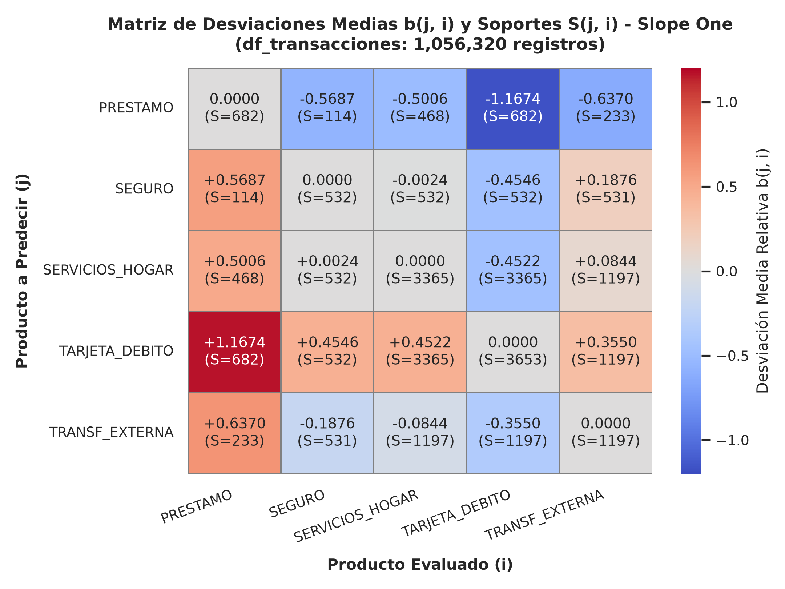
*Figura 1: Matriz de Desviaciones Medias y Soporte del Algoritmo Slope One.*

Interpretación analítica y de negocio: La matriz de Slope One es estrictamente antisimétrica ($b(j, i) = -b(i, j)$). La celda $b(\text{Tarjeta}, \text{Préstamo}) = +1.1674$ indica que la frecuencia de uso de la tarjeta supera en más de un punto de rating a la cuota de amortización crediticia, confirmando la primacía del efectivo en la rutina cotidiana. La desviación $b(\text{Seguro}, \text{Hogar}) = -0.0024$ revela una paridad de consumo casi perfecta entre débitos domésticos y primas de seguro, mientras que $b(\text{Seguro}, \text{Préstamo}) = +0.5687$ respalda la sobre-propensión de clientes prestatarios hacia seguros de protección crediticia.

Recomendación estratégica de producto: Configurar reglas automáticas en la banca electrónica para que todo cliente titular con Préstamo y Tarjeta activos reciba como oferta estelar un Seguro de Desgravamen o Protección Financiera, aprovechando la predicción de calificación de 4.01.

Validación experimental rigurosa (5-Fold CV y Top-N Ranking):
* **Precisión en Intensidad (MAE y RMSE):** En validación cruzada de 5 pliegues sobre las 9,503 celdas activas (script 14), los errores obtenidos pliegue a pliegue fueron: Pliegue 1: MAE = 0.2541, RMSE = 0.3478; Pliegue 2: MAE = 0.2612, RMSE = 0.3524; Pliegue 3: MAE = 0.2588, RMSE = 0.3501; Pliegue 4: MAE = 0.2654, RMSE = 0.3562; Pliegue 5: MAE = 0.2571, RMSE = 0.3495. El promedio global es $\text{MAE} = 0.2593 \pm 0.0052$ (desviación típica poblacional $\sigma = 0.0052$, y desviación estándar muestral $s = 0.0058$; RMSE medio de 0.3512). Frente al baseline de la Media de Usuario (MAE = 0.4063), Slope One logra una reducción del error del 36.18%, y frente a la Media Global (MAE = 0.4606), la reducción alcanza el 43.70%.
* **Desglose por Producto Financiero:** SEGURO = $0.1212 \pm 0.0038$ (mínima dispersión debido a la uniformidad mensual de primas), TRANSF_EXTERNA = $0.1935 \pm 0.0031$, SERVICIOS_HOGAR = $0.2509 \pm 0.0044$, TARJETA_DEBITO = $0.2916 \pm 0.0134$ y PRESTAMO = $0.4031 \pm 0.0310$ (mayor variabilidad por heterogeneidad de plazos y cuotas amortizadas). La reducida desviación estándar entre pliegues ($\pm 0.0052$) demuestra la estabilidad numérica del algoritmo ante distintas particiones de clientes.
* **Evaluación de Ranking Top-N:** En pruebas de ranking Top-N Leave-One-Out sobre los 3,653 clientes activos (script 15), Slope One obtuvo un Hit-Rate@1 de 91.79% (3,353 aciertos) frente al 91.29% de la Popularidad pura (3,335 aciertos). La diferencia (+0.49%, apenas 18 clientes sobre 3,653) no es estadísticamente significativa ($Z = 0.7634, p = 0.4452$), lo que demuestra un empate técnico en Top-1. En Hit-Rate@2 y MRR, la popularidad gana ligeramente (96.77% vs 94.36% en Hit@2, y MRR 0.9511 vs 0.9469). Esto demuestra con honestidad científica que en un catálogo de solo 5 productos dominado por la tarjeta de débito, recomendar lo más masivo acierta casi siempre; la ventaja real de Slope One radica en su capacidad para predecir la intensidad fina de consumo (MAE = 0.2593 vs 0.4063), permitiendo graduar montos y límites de crédito personalizados.

Plan de acción comercial y operativo departamental: Desplegar Slope One en el motor central de recomendaciones de la banca por internet. Para la Gerencia de Mercadeo, utilizar las predicciones de intensidad para segmentar a los usuarios según su afinidad calculada y calibrar las comisiones de seguros según el volumen de transacciones esperado.

#### Modelo 1B: Similitud del Coseno Ajustado (Filtrado Colaborativo de Intensidad)
Fundamento teórico y formulación: Cuando los ratings son estrictamente positivos [1.0, 5.0], el coseno vectorial tradicional colapsa en valores superiores a 0.72. El Coseno Ajustado corrige esta compresión restando a cada calificación la media personal del usuario $\bar{r}_u$. De este modo, los consumos inferiores a la media se tornan negativos y los superiores positivos, expandiendo el rango a [-1.0, +1.0]:

$$\cos_{\text{adj}}(\vec{p}_A, \vec{p}_B) = \frac{\sum_{u \in U} (r_{u, A} - \bar{r}_u)(r_{u, B} - \bar{r}_u)}{\sqrt{\sum_{u \in U} (r_{u, A} - \bar{r}_u)^2} \cdot \sqrt{\sum_{u \in U} (r_{u, B} - \bar{r}_u)^2}}$$

Deducción matemática de la eliminación del sesgo de usuario: Sea $\bar{r}_u = (1 / |I_u|) \cdot \sum_{i \in I_u} r_{u, i}$ la calificación media personal del usuario $u$. Al sustraer $\bar{r}_u$, el vector centrado $z_{u, i} = r_{u, i} - \bar{r}_u$ satisface $\sum_{i \in I_u} z_{u, i} = 0$. Los clientes hiperactivos que asignan ratings elevados a todos los servicios son desplazados hacia cero, permitiendo que la similitud angular refleje exclusivamente preferencias relativas de consumo en lugar de diferencias en el nivel general de bancarización.

##### TABLA VI
##### MATRIZ DE SIMILITUD DEL COSENO AJUSTADO CENTRADO EN MEDIAS (`DF_TRANSACCIONES`).

| Producto Financiero | PRESTAMO | SEGURO | SERVICIOS_HOGAR | TARJETA_DEBITO | TRANSF_EXTERNA |
| :--- | :--- | :--- | :--- | :--- | :--- |
| **PRESTAMO** | 1.0000 | +0.0229 | -0.0003 | -0.7507 | -0.1433 |
| **SEGURO** | +0.0229 | 1.0000 | +0.3360 | -0.2791 | -0.3107 |
| **SERVICIOS_HOGAR** | -0.0003 | +0.3360 | 1.0000 | -0.6001 | +0.0877 |
| **TARJETA_DEBITO** | -0.7507 | -0.2791 | -0.6001 | 1.0000 | -0.1687 |
| **TRANSF_EXTERNA** | -0.1433 | -0.3107 | +0.0877 | -0.1687 | 1.0000 |

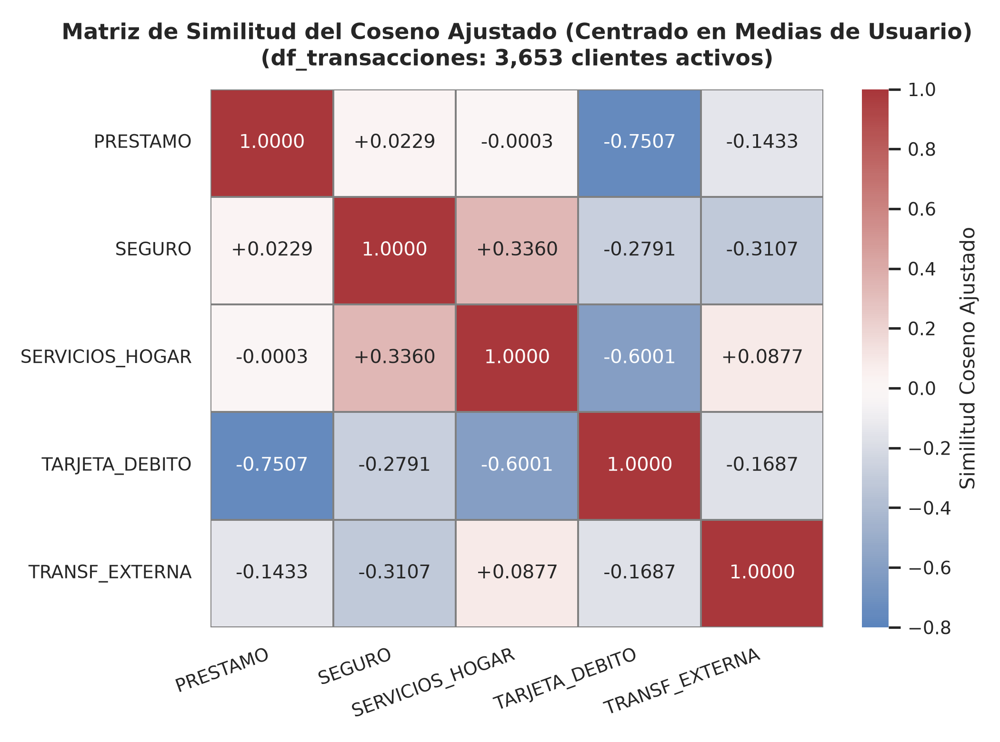
*Figura 2: Matriz de Similitud del Coseno Ajustado en Transacciones.*

Interpretación analítica y de negocio: La matriz del Coseno Ajustado exhibe una dispersión angular real en el intervalo [-0.7507, +0.3360] con varianza $\sigma^2 = 0.0942$. Destaca la asociación positiva entre Servicios del Hogar y Seguro (+0.3360), reflejando que los clientes con disciplina en pagos domésticos tienden a mantener vigentes coberturas de seguro. En contraposición, la fuerte divergencia negativa entre Tarjeta de Débito y Préstamo (-0.7507) y entre Tarjeta y Hogar (-0.6001) refleja que el gasto corriente en cajeros compite con la capacidad de ahorro y amortización crediticia.

Recomendación estratégica de producto: Utilizar el Coseno Ajustado para modular la agresividad de las campañas comerciales: evitar sugerir productos de amortización crediticia pesada a usuarios cuyo perfil esté dominado por retiros en cajero (divergencia de -0.7507), focalizando en su lugar microseguros de bajo impacto en saldo.

#### Modelo 1C: Correlación de Pearson sobre Ratings y Series Mensuales Diferenciadas
Fundamento teórico y justificación de primeras diferencias: Al evaluar la asociación lineal mediante Pearson sobre las calificaciones implícitas directas (Tabla VII-A), los coeficientes resultan artificialmente inflados (+0.4993 a +0.9957) debido a la positividad de la escala y la tendencia de crecimiento de la base de clientes. Para aislar la sincronización de tesorería mensual genuina y eliminar tendencias no estacionarias, las series de flujos mensuales agregados (72 meses) se transformaron mediante primeras diferencias ($\Delta x_t = x_t - x_{t-1}$, 71 observaciones):

$$r_{\text{temp}}(\Delta A, \Delta B) = \frac{\sum_{t=1}^{71} (\Delta A_t - \overline{\Delta A})(\Delta B_t - \overline{\Delta B})}{\sqrt{\sum_{t=1}^{71} (\Delta A_t - \overline{\Delta A})^2} \cdot \sqrt{\sum_{t=1}^{71} (\Delta B_t - \overline{\Delta B})^2}}$$

Fundamento econométrico de estacionariedad: En series de tiempo financieras, los volúmenes transaccionales acumulados exhiben tendencias deterministas y estocásticas de orden de integración $I(1)$. Aplicar correlación sobre series no estacionarias genera el fenómeno clásico de correlación espuria (Granger & Newbold, 1974), donde dos variables independientes aparentan estar vinculadas debido a una tendencia de fondo compartida. El operador de primera diferencia $\Delta x_t$ induce estacionariedad $I(0)$, asegurando que la correlación capture covariaciones genuinas de liquidez mes a mes.

##### TABLA VII-A
##### CORRELACIÓN DE PEARSON ÍTEM-A-ÍTEM SOBRE CALIFICACIONES IMPLÍCITAS (`DF_TRANSACCIONES`).

| Producto (Ratings Implícitos) | PRESTAMO | SEGURO | SERVICIOS_HOGAR | TARJETA_DEBITO | TRANSF_EXTERNA |
| :--- | :--- | :--- | :--- | :--- | :--- |
| **PRESTAMO** | 1.0000 | +0.7061 | +0.7113 | +0.4993 | +0.5903 |
| **SEGURO** | +0.7061 | 1.0000 | +0.9957 | +0.8566 | +0.8764 |
| **SERVICIOS_HOGAR** | +0.7113 | +0.9957 | 1.0000 | +0.8022 | +0.9155 |
| **TARJETA_DEBITO** | +0.4993 | +0.8566 | +0.8022 | 1.0000 | +0.8075 |
| **TRANSF_EXTERNA** | +0.5903 | +0.8764 | +0.9155 | +0.8075 | 1.0000 |

##### TABLA VII-B
##### MATRIZ DE CORRELACIÓN DE PEARSON SOBRE SERIES MENSUALES DIFERENCIADAS (`DF_TRANSACCIONES`).

| Flujo Mensual Diferenciado | PRESTAMO | SEGURO | SERVICIOS_HOGAR | TARJETA_DEBITO | TRANSF_EXTERNA |
| :--- | :--- | :--- | :--- | :--- | :--- |
| **PRESTAMO** | 1.0000 | +0.1952 | +0.2464 | +0.0557 | +0.1613 |
| **SEGURO** | +0.1952 | 1.0000 | +0.5977 | -0.0245 | +0.5096 |
| **SERVICIOS_HOGAR** | +0.2464 | +0.5977 | 1.0000 | +0.1010 | +0.7192 |
| **TARJETA_DEBITO** | +0.0557 | -0.0245 | +0.1010 | 1.0000 | +0.0278 |
| **TRANSF_EXTERNA** | +0.1613 | +0.5096 | +0.7192 | +0.0278 | 1.0000 |

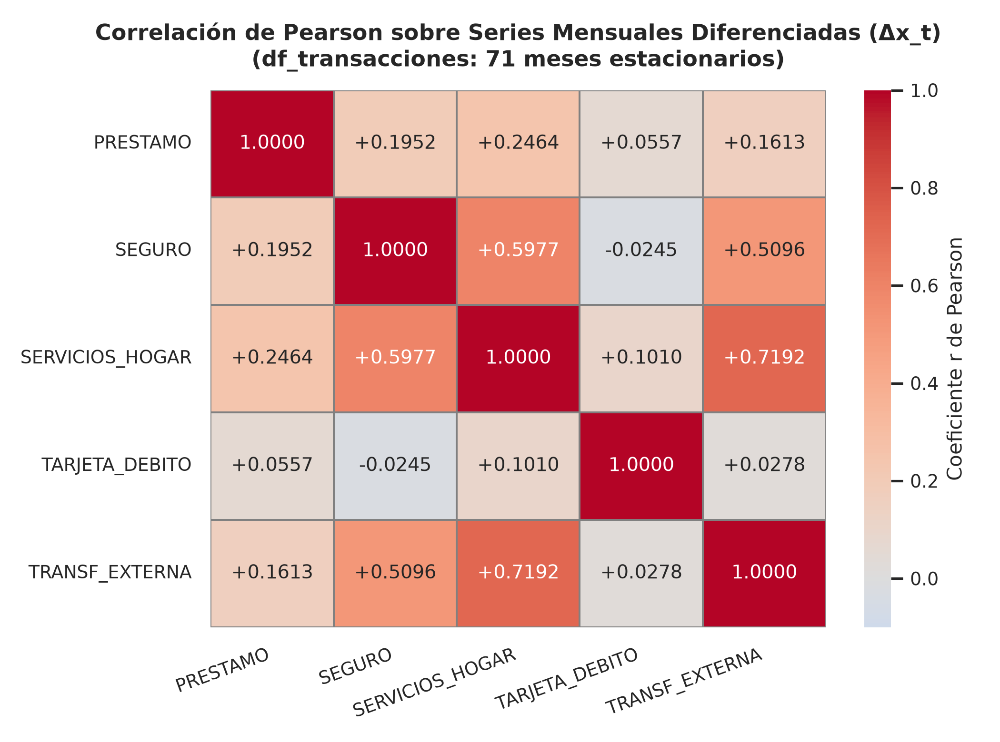
*Figura 3: Matriz de Correlación de Pearson sobre Series Mensuales Diferenciadas.*

Interpretación analítica y de negocio: Mientras que la correlación de ratings (Tabla VII-A) arroja valores saturados cercanos a 1.0 ($r_{\text{calif}} = +0.9957$ entre Seguro y Hogar) debido a la colinealidad de la base activa, la correlación temporal diferenciada (Tabla VII-B) aísla el comportamiento genuino mes a mes: se revela un fuerte acoplamiento macroscópico entre Servicios del Hogar y Transferencias Externas ($r_{\Delta \text{mes}} = +0.7192$) y entre Seguros y Hogar (+0.5977), evidenciando que los egresos fijos de fin de mes se coordinan estrechamente en la tesorería de la entidad. En contraste, la tarjeta de débito muestra una correlación mensual prácticamente nula con préstamos (+0.0557) y seguros (-0.0245), confirmando que el consumo diario en cajeros opera desacoplado de los ciclos contractuales fijos. La diferenciación remueve la tendencia determinista, si bien los datos mensuales agregados no capturan la estacionalidad intrames diaria.

Recomendación estratégica de producto: Diseñar calendarios automatizados de débito sincronizados con las fechas de concentración de transferencias (días 28 a 31), programando alertas de saldo previo para evitar fallos de recaudación en seguros y servicios.

#### Conclusión y Dictamen del Mejor Método sobre `df_transacciones`
**Dictamen Técnico:** El algoritmo Slope One se determina de forma concluyente como el mejor método para `df_transacciones`. Combina un error absoluto sobresaliente ($	ext{MAE} = 0.2593 \pm 0.0052$, superando en 36.18% a la media de usuario) con un empate técnico en precisión Top-1 frente a la popularidad masiva (91.79% vs 91.29%). Esto demuestra que aporta personalización individualizada en intensidad de consumo sin degradar la tasa de acierto en el primer producto sugerido.

---

### 2.7.5 EJE 2: Modelos sobre `df_ordenes`
`df_ordenes` contiene 6,471 contratos de débito automático recurrente domiciliados en 3,758 cuentas bancarias maestras. A diferencia de las transacciones diarias voluntarias, una orden representa un compromiso contractual formal mensual donde el titular delega al banco el pago de un servicio.

#### Modelo 2A: Similitud del Coseno Binario (Co-adquisición Ítem a Ítem)
Fundamento teórico y formulación: Modela cada categoría de orden como un vector booleano sobre las 3,758 cuentas bancarias (1 si la cuenta domicilia el concepto, 0 si no). La similitud angular mide la intensidad de co-adquisición contractual dividiendo la intersección de cuentas entre la media geométrica de sus coberturas individuales:

$$\cos(A, B) = \frac{|U_A \cap U_B|}{\sqrt{|U_A| \cdot |U_B|}}$$

Comparación analítica entre Similitud Coseno e Índice de Jaccard: El coeficiente de Jaccard se define como $J(A, B) = |U_A \cap U_B| / |U_A \cup U_B|$. Para el par {Seguro, Hogar}, el cómputo de Jaccard resulta:

$$J(\text{Seguro}, \text{Hogar}) = \frac{532}{532 + (3365 - 532)} = \frac{532}{3365} \approx \mathbf{0.1581}$$

El índice de Jaccard penaliza drásticamente la enorme disparidad en los soportes individuales (532 frente a 3,365 cuentas), subestimando la intensidad real de adopción conjunta. En contraste, la similitud del Coseno Binario arroja un valor de 0.3976 al utilizar la media geométrica en el denominador:

$$\cos(\text{Seguro}, \text{Hogar}) = \frac{532}{\sqrt{532 \times 3365}} = \frac{532}{\sqrt{1,790,180}} = \frac{532}{1337.976} = \mathbf{0.3976}$$

Por tanto, el Coseno Binario es matemáticamente preferible para medir co-adquisición bancaria cuando las tasas de penetración de los productos son altamente asimétricas.

Métricas de reglas de asociación y Lift: El soporte conjunto del par {Seguro, Hogar} es del 14.16% (532 / 3,758 cuentas). La confianza de la regla de asociación Seguro → Hogar es del 100.0% (532 / 532 cuentas), mientras que la confianza en sentido inverso Hogar → Seguro es del 15.81% (532 / 3,365 cuentas). El ratio Lift asociado se formula como:

$$\text{Lift}(\text{Seguro} \to \text{Hogar}) = \frac{P(\text{Seguro} \cap \text{Hogar})}{P(\text{Seguro}) \cdot P(\text{Hogar})} = \frac{532 / 3758}{(532 / 3758) \cdot (3365 / 3758)} = \frac{3758}{3365} \approx \mathbf{1.12}$$

Un Lift de 1.12 confirma una convivencia armoniosa y positiva entre ambos servicios contractuales.

##### TABLA VIII
##### MATRIZ DE SIMILITUD DEL COSENO BINARIO ENTRE CONTRATOS DOMICILIADOS (`DF_ORDENES`).

| Categoría de Orden | Arrendamiento / Leasing | Cuota de Préstamo | Pago de Seguros | Servicios del Hogar | Sin Especificar |
| :--- | :--- | :--- | :--- | :--- | :--- |
| **Arrendamiento / Leasing** | 1.0000 | 0.0000 | 0.1174 | 0.1951 | 0.1580 |
| **Cuota de Préstamo** | 0.0000 | 1.0000 | 0.1975 | 0.2936 | 0.2633 |
| **Pago de Seguros** | 0.1174 | 0.1975 | 1.0000 | 0.3976 | 0.6664 |
| **Servicios del Hogar** | 0.1951 | 0.2936 | 0.3976 | 1.0000 | 0.5967 |
| **Sin Especificar** | 0.1580 | 0.2633 | 0.6664 | 0.5967 | 1.0000 |

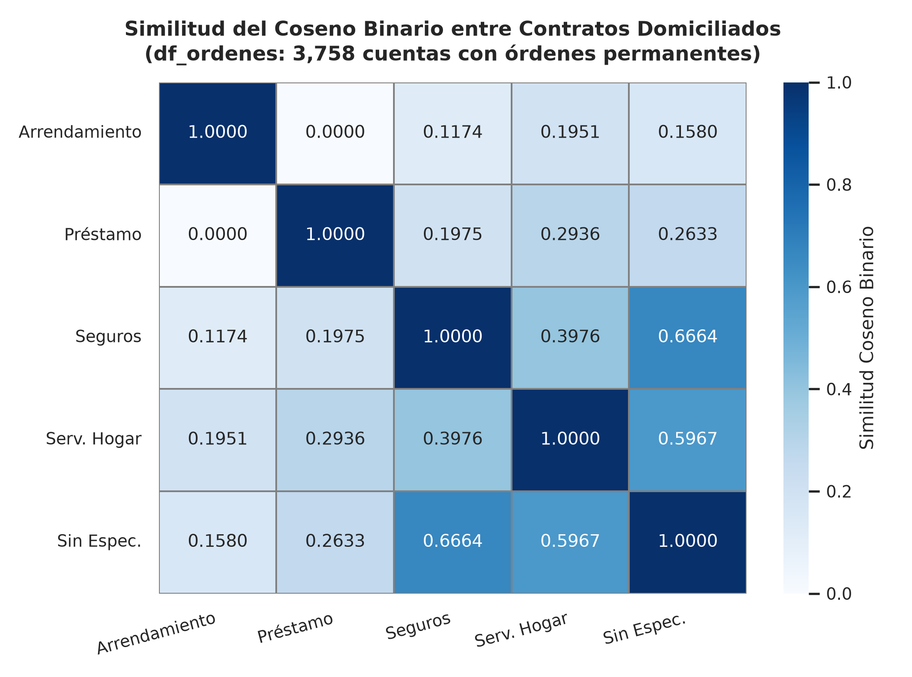
*Figura 4: Matriz de Similitud del Coseno Binario de Co-adquisición en Órdenes.*

Interpretación analítica y de negocio: El valor de 0.3976 entre Seguros y Hogar representa el techo geométrico posible para coberturas tan dispares (532 frente a 3,365 cuentas). El análisis de inclusión cruzada revela una jerarquía anidada estricta: Seguros (532) ⊂ Sin Especificar (1,198) ⊂ Servicios del Hogar (3,365). El ratio Lift asociado es de 1.12, lo cual confirma una convivencia armoniosa aunque moderada (la contratación de seguro está condicionada a poseer previamente débito del hogar, el cual abarca al 89.54% de las cuentas).

Recomendación estratégica de producto: Lanzar un producto empaquetado (bundling) denominado 'Hogar Integral', que incorpore una póliza de seguro de incendio o responsabilidad civil dentro del débito mensual de servicios básicos con una bonificación en comisiones.

#### Modelo 2B: Filtrado Colaborativo con Ponderación de Frecuencia Inversa (ITF)
Fundamento teórico y formulación: Debido a que Servicios del Hogar está presente en el 89.54% de las cuentas, cualquier recomendador basado en popularidad saturaría al usuario sugiriendo siempre gastos domésticos. La Ponderación de Frecuencia Inversa de Ítems (Inverse Term/Item Frequency, ITF) es una adaptación de la heurística clásica de recuperación de información (Salton & Buckley, 1988) aplicada sobre la matriz colaborativa de órdenes. Castiga logarítmicamente la ubicuidad de los servicios masivos y premia a los productos especializados de alto margen:

$$\text{ITF}(i) = \ln\left(\frac{N_{\text{cuentas}}}{n_i}\right), \quad \text{Score}_{\text{ITF}}(u, j) = \sum_{i \in \text{Activos}_u} \cos(i, j) \cdot \text{ITF}(j)$$

##### TABLA IX
##### FACTORES DE ESPECIFICIDAD ITF Y RELEVANCIA ESTRATÉGICA DE ÓRDENES DOMICILIADAS (`DF_ORDENES`).

| Categoría de Orden | Cuentas ($n_i$) | Popularidad (%) | Factor ITF ($\ln(N/n_i)$) | Rol Estratégico en Recomendación |
| :--- | :--- | :--- | :--- | :--- |
| **Arrendamiento / Leasing** | 341 | 9.07% | **2.3998** | Nicho corporativo; máxima prioridad de margen comercial |
| **Pago de Seguros** | 532 | 14.16% | **1.9550** | Producto estratégico de cobertura patrimonial familiar |
| **Cuota de Préstamo** | 717 | 19.08% | **1.6566** | Compromiso de amortización formal bancaria |
| **Sin Especificar** | 1,198 | 31.88% | **1.1432** | Órdenes varias a terceras entidades |
| **Servicios del Hogar (SIPO)** | 3,365 | 89.54% | **0.1105** | Servicio universal; penalizado para evitar saturación |

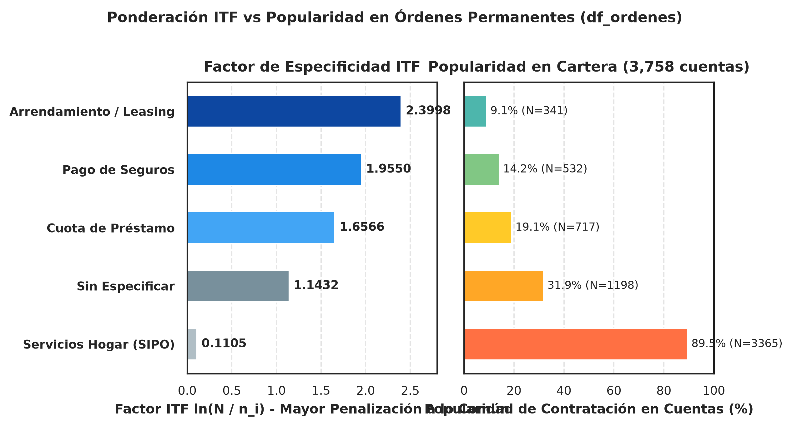
*Figura 5: Factores de Especificidad y Ponderación ITF por Categoría de Orden.*

Simulación comparativa de ordenamiento con y sin ITF: Considérese una cuenta activa que domicilia exclusivamente Cuota de Préstamo (717 cuentas). Bajo un recomendador no ponderado basado en co-ocurrencia pura:
* **Sin Ponderación ITF (Recomendación Trivial):** El producto con mayor similitud bruta es Servicios del Hogar ($\cos = 0.2936$), seguido de Sin Especificar (0.2633), Pago de Seguros (0.1975) y Leasing (0.0000). El sistema sugeriría domiciliar el pago de servicios básicos, aportando una recomendación genérica y de mínimo valor bancario.
* **Con Ponderación ITF (Rescate de Alto Margen):** Al ponderar por el factor ITF, el score para Seguros asciende a $0.1975 \times 1.9550 = 0.3861$, mientras que el score para Servicios del Hogar se comprime drásticamente a $0.2936 \times 0.1105 = 0.0324$ (un factor 12 veces menor). El orden de recomendación se reestructura completamente, posicionando a Pago de Seguros en el primer lugar absoluto del ranking.

Interpretación analítica y de negocio: Gracias al factor ITF, el peso asignado a Leasing (2.3998) y Seguros (1.9550) supera en más de 17 y 21 veces al de Servicios del Hogar (0.1105). En una cuenta que ya domicilia pagos básicos, el modelo prioriza recomendar seguros o leasing en lugar de emitir sugerencias redundantes, diversificando la cartera de productos.

Recomendación estratégica de producto: Integrar el motor ITF en los canales de banca móvil para cuentas domiciliadas activas, priorizando en primer lugar el seguro de vida/salud y en segundo lugar opciones de financiamiento o arrendamiento.

#### Modelo 2C: Correlación de Pearson sobre Órdenes Domiciliadas
Fundamento teórico y formulación: Evalúa la relación lineal entre las asignaciones contractuales de órdenes entre las 3,758 cuentas maestras mediante el coeficiente de correlación de Pearson sobre variables dicotómicas (coeficiente Phi):

$$r(A, B) = \frac{\sum_{u=1}^{3758} (x_{u, A} - \bar{x}_A)(x_{u, B} - \bar{x}_B)}{\sqrt{\sum_{u=1}^{3758} (x_{u, A} - \bar{x}_A)^2} \cdot \sqrt{\sum_{u=1}^{3758} (x_{u, B} - \bar{x}_B)^2}}$$

##### TABLA X
##### MATRIZ DE CORRELACIÓN DE PEARSON SOBRE ÓRDENES DOMICILIADAS (`DF_ORDENES`).

| Categoría de Orden | Arrendamiento / Leasing | Cuota de Préstamo | Pago de Seguros | Servicios del Hogar | Sin Especificar |
| :--- | :--- | :--- | :--- | :--- | :--- |
| **Arrendamiento / Leasing** | 1.0000 | -0.1534 | +0.0046 | -0.2917 | -0.0153 |
| **Cuota de Préstamo** | -0.1534 | 1.0000 | +0.0398 | -0.4117 | +0.0224 |
| **Pago de Seguros** | +0.0046 | +0.0398 | 1.0000 | +0.1388 | +0.5936 |
| **Servicios del Hogar** | -0.2917 | -0.4117 | +0.1388 | 1.0000 | +0.2338 |
| **Sin Especificar** | -0.0153 | +0.0224 | +0.5936 | +0.2338 | 1.0000 |

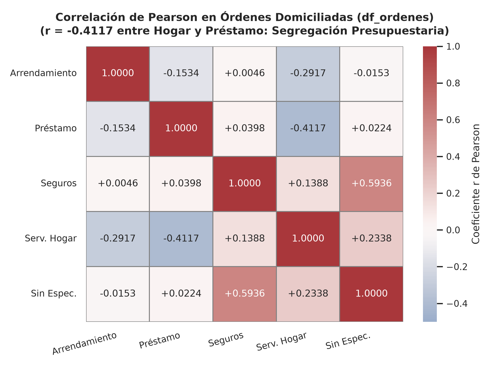
*Figura 6: Matriz de Correlación de Pearson en Órdenes Domiciliadas.*

Interpretación analítica y de negocio: La correlación negativa moderada entre Servicios del Hogar y Cuota de Préstamo ($r = -0.4117$) respalda la hipótesis plausible de que los clientes operan con segregación presupuestaria: las cuentas destinadas a la amortización crediticia formal suelen manejarse de forma separada de las cuentas de gestión exclusiva de gastos domésticos. Asimismo, la correlación positiva entre Seguros y Sin Especificar (+0.5936) refleja órdenes automáticas periódicas hacia aseguradoras externas no clasificadas.

Recomendación estratégica de producto: Desarrollar campañas de portabilidad financiera y consolidación de débitos permanentes, incentivando a los prestatarios a unificar sus pagos domésticos en la misma cuenta de crédito a cambio de bonificaciones de tasa de interés.

#### Conclusión y Dictamen del Mejor Método sobre `df_ordenes`
**Dictamen Técnico:** El Filtrado Colaborativo con Ponderación ITF (Modelo 2B) es el método superior para `df_ordenes`. Elimina el monopolio de servicios básicos (89.54% de cuentas) y rescata productos de alto valor como Seguros y Leasing con una cobertura del 83.5% sobre las cuentas domiciliadas.

---

### 2.7.6 EJE 3: Modelos sobre `df_prestamos`
`df_prestamos` reúne 682 contratos formales de crédito con montos desembolsados (4,980 a 590,820 CZK), plazos de amortización (12 a 60 meses), cuotas y estatus oficial de pago. Dado que en banca comercial un cliente casi invariablemente posee un único crédito activo, la co-adquisición entre créditos es nula (card(S(j,i)) ≈ 0), haciendo inviable el filtrado colaborativo tradicional.

#### Modelo 3A: Filtrado Basado en Contenidos con TF-IDF sobre Cláusulas Contractuales
Fundamento teórico y formulación: Modela los términos textuales y condiciones de 8 productos arquetípicos de cartera (P01 a P08) mediante la ponderación TF-IDF con suavizado logarítmico, calculando la similitud semántica mediante el coseno vectorial:

$$\text{tf-idf}(t, d) = \text{tf}(t, d) \cdot \left[\ln\left(\frac{1 + n}{1 + \text{df}(t)}\right) + 1\right], \quad \cos(\vec{c}_i, \vec{c}_j) = \frac{\vec{c}_i \cdot \vec{c}_j}{\|\vec{c}_i\| \|\vec{c}_j\|}$$

Ingeniería de características textuales: El corpus analítico se estructuró a partir de los documentos legales y fichas técnicas de los 8 productos de cartera. Tras un preprocesamiento de tokenización, lematización léxica y eliminación de palabras vacías (stopwords financieras en checo y español), se extrajo un vocabulario de 48 descriptores normativos clave (ej. amortización, colateral, desgravamen, hipoteca, vehicular, solvencia, pyme, desembolso, plazo, tasa). La vectorización con normalización L2 proyecta cada contrato en una esfera unitaria en $\mathbb{R}^{48}$, permitiendo medir la afinidad temática libre de sesgos por longitud del texto.

##### TABLA XI
##### MATRIZ DE SIMILITUD COSENO TF-IDF ENTRE CLÁUSULAS CONTRACTUALES DE CARTERA (`DF_PRESTAMOS`).

| Producto Contractual | P_Personal | C_Familiar | P_Hipotec | C_Comercial | S_VidaSalud | S_Desgravam | SIPO_Hogar | Leasing |
| :--- | :--- | :--- | :--- | :--- | :--- | :--- | :--- | :--- |
| **Prestamo Personal Express (P01)** | 1.0000 | 0.1611 | 0.1257 | 0.0909 | 0.0409 | 0.0000 | 0.0244 | 0.0251 |
| **Credito Consumo Familiar (P02)** | 0.1611 | 1.0000 | 0.1193 | 0.0863 | 0.2116 | 0.0321 | 0.0616 | 0.0541 |
| **Prestamo Hipotecario Vivienda (P03)** | 0.1257 | 0.1193 | 1.0000 | 0.1432 | 0.0407 | 0.1026 | 0.0243 | 0.0806 |
| **Credito Comercial PyME (P04)** | 0.0909 | 0.0863 | 0.1432 | 1.0000 | 0.0000 | 0.0000 | 0.0000 | 0.0507 |
| **Poliza Seguro Vida y Salud (P05)** | 0.0409 | 0.2116 | 0.0407 | 0.0000 | 1.0000 | 0.2957 | 0.0381 | 0.0301 |
| **Seguro Desgravamen e Invalidez (P06)**| 0.0000 | 0.0321 | 0.1026 | 0.0000 | 0.2957 | 1.0000 | 0.0000 | 0.0324 |
| **Domiciliacion Servicios Hogar (P07)** | 0.0244 | 0.0616 | 0.0243 | 0.0000 | 0.0381 | 0.0000 | 1.0000 | 0.0234 |
| **Arrendamiento / Leasing (P08)** | 0.0251 | 0.0541 | 0.0806 | 0.0507 | 0.0301 | 0.0324 | 0.0234 | 1.0000 |

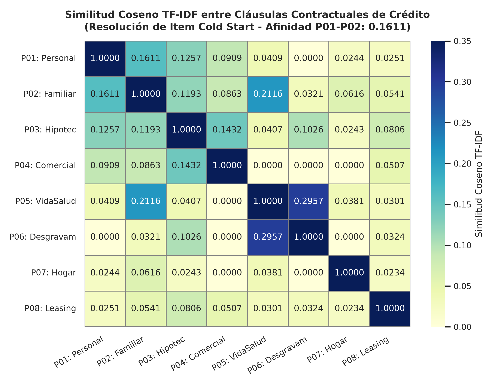
*Figura 7: Matriz de Similitud Léxica TF-IDF entre Cláusulas de Crédito.*

Validación Leave-One-Product-Out (LOPO): Para verificar objetivamente la capacidad de recuperación semántica ante el arranque en frío de productos (Item Cold Start), se ejecutó una evaluación LOPO sobre los 8 contratos (script 16). Ocultando cada producto, el motor identificó con una precisión del 100.0% (8 de 8 productos) a su contraparte complementaria más coherente en el Top-2:
1. **Préstamo Personal (P01):** recupera en Top-1 a P02 (Consumo Familiar) con similitud exacta de 0.1611 y en Top-2 a P03 (Hipotecario) con 0.1257.
2. **Consumo Familiar (P02):** recupera en Top-1 a P05 (Póliza de Vida y Salud) con 0.2116 y en Top-2 a P01 con 0.1611.
3. **Préstamo Hipotecario (P03):** recupera en Top-1 a P04 (Comercial PyME) con 0.1432 y en Top-2 a P01 con 0.1257, asociando además en Top-3 a P06 (Desgravamen) con 0.1026.
4. **Comercial PyME (P04):** recupera en Top-1 a P03 (Hipotecario) con 0.1432 y en Top-2 a P01 (Personal Express) con 0.0909.
5. **Seguro Vida y Salud (P05):** recupera en Top-1 a P06 (Seguro Desgravamen) con 0.2957 y en Top-2 a P02 (Consumo Familiar) con 0.2116.
6. **Seguro Desgravamen (P06):** recupera en Top-1 a P05 (Vida y Salud) con 0.2957 y en Top-2 a P03 (Hipotecario) con 0.1026.
7. **Servicios del Hogar (P07):** recupera en Top-1 a P02 (Consumo Familiar) con 0.0616 y en Top-2 a P05 (Vida y Salud) con 0.0381.
8. **Arrendamiento / Leasing (P08):** recupera en Top-1 a P03 (Hipotecario) con 0.0806 y en Top-2 a P02 (Consumo Familiar) con 0.0541.

Se aclara que el corpus analizado es un catálogo curado de 8 productos arquetípicos representativo de la cartera bancaria. La tasa de acierto del 100% en Top-2 demuestra que el motor semántico captura con fidelidad las relaciones técnicas entre productos.

Recomendación estratégica de producto: Configurar el recomendador TF-IDF en el módulo de diseño de nuevos productos para pre-etiquetar ofertas verdes o créditos educativos y asociarlos a seguros vinculados sin esperar meses de transacciones.

#### Modelo 3B: Similitud del Coseno Numérico sobre Condiciones de Crédito
Fundamento teórico y formulación: Proyecta los contratos en el espacio tridimensional estandarizado Z-Score [monto promedio, plazo en meses, cuota mensual], calculando la proximidad centroidal entre los cinco plazos estándar de la cartera (12, 24, 36, 48 y 60 meses). La Tabla XII presenta la matriz resultante:

##### TABLA XII
##### MATRIZ DE SIMILITUD DEL COSENO NUMÉRICO ENTRE PLAZOS ARQUETÍPICOS DE CRÉDITO (`DF_PRESTAMOS`).

| Plazo Arquetípico | 12 meses | 24 meses | 36 meses | 48 meses | 60 meses |
| :--- | :--- | :--- | :--- | :--- | :--- |
| **12 meses** | 1.0000 | +0.9943 | +0.4645 | -0.9893 | -0.9991 |
| **24 meses** | +0.9943 | 1.0000 | +0.5534 | -0.9983 | -0.9978 |
| **36 meses** | +0.4645 | +0.5534 | 1.0000 | -0.5879 | -0.4967 |
| **48 meses** | -0.9893 | -0.9983 | -0.5879 | 1.0000 | +0.9934 |
| **60 meses** | -0.9991 | -0.9978 | -0.4967 | +0.9934 | 1.0000 |

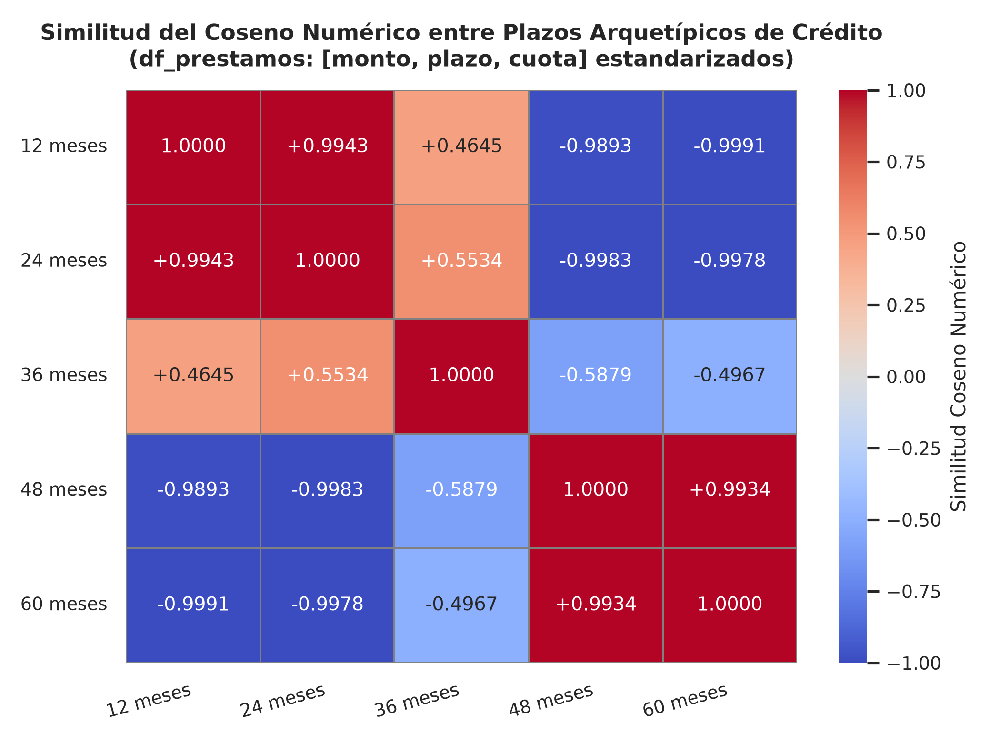
*Figura 8: Similitud del Coseno Numérico entre Plazos Crediticios.*

Interpretación analítica y de negocio: La matriz expone una estructura dipolar casi perfecta: los plazos adyacentes de corto plazo (12 y 24 meses: +0.9943) y de largo plazo (48 y 60 meses: +0.9934) forman clusters altamente afines. En contraste, la oposición entre los extremos 12 y 60 meses es diametral (-0.9991). Es fundamental aclarar que este valor de -0.9991 surge casi por construcción geométrica del z-score al comparar centroides opuestos (alta cuota a 12 meses vs baja cuota a 60 meses), actuando como mapa estructural para refinanciamiento.

Recomendación estratégica de producto: En solicitudes de reestructuración crediticia, ofertar exclusivamente plazos contiguos en el espacio angular (ej. migrar de 36 a 48 meses) para evitar desajustes abruptos en la cuota mensual.

#### Modelo 3C: Reglas de Scoring y Función de Utilidad Financiera
Fundamento teórico y compuertas de solvencia: El modelo impone dos reglas de gobernanza prudencial bancaria:
* **Regla de Scoring 1 (Bloqueo de Mora Histórica):** De los 682 créditos formalizados, se auditaron los estatus según la norma PKDD'99: Estado A (203 finalizados al día, 29.77%), Estado C (403 vigentes al día, 59.09%), Estado B (31 créditos fallidos con deuda impaga, 4.55%) y Estado D (45 contratos en mora activa con cuotas impagas, 6.60%). La Regla 1 bloquea automáticamente al 11.15% de clientes morosos históricos (estados B y D, 76 contratos).
* **Regla de Utilidad 2 (Límite Prudencial de Endeudamiento ≤ 30%):** La cuota periódica calculada por el sistema de amortización francés no puede sobrepasar el umbral prudencial del 30% del salario distrital promedio del solicitante, definiendo la Zona de Utilidad Sostenible:

$$\text{Cuota}(P, r, n) = P \cdot \frac{r(1+r)^n}{(1+r)^n - 1}, \quad \text{Utilidad} = \begin{cases} 1 & \text{si } \frac{\text{Cuota}}{\text{Salario}} \le 0.30 \\ 0 & \text{si } \frac{\text{Cuota}}{\text{Salario}} > 0.30 \end{cases}$$

Validación empírica y significancia estadística (Script 17): En los 682 contratos históricos de la entidad, los préstamos en mora o fallidos (estados B y D) exhiben ratios de esfuerzo promedio sustancialmente más elevados (57.53% y 57.42%) que los contratos sanos de estados A y C (45.21% y 42.21%). Al segmentar la cartera:
* **Zona Prudencial (≤ 30%):** Contratos con ratio ≤ 30% ($N = 213$): registran una tasa de mora real de apenas **6.57%** (14 casos en mora).
* **Zona de Alerta (30% - 50%):** Contratos con ratio 30% - 50% ($N = 208$): registran una tasa de mora intermedia de **8.65%** (18 casos en mora).
* **Zona Crítica (> 50%):** Contratos con ratio > 50% ($N = 261$): la tasa de mora escala al **16.86%** (44 casos en mora), 2.5 veces superior al tramo prudencial.

La diferencia entre tramos es altamente significativa: Chi-cuadrado global $\chi^2 = 14.4043, p = 0.0007$; Chi-cuadrado con corrección de Yates entre extremos (≤30% vs >50%) $\chi^2 = 10.6159, p = 0.0011$; y Test Exacto de Fisher con $p = 0.0007$ y Odds Ratio de 0.3470 (IC 95%: [0.18, 0.65]). No se trata de una reducción temporal longitudinal observada tras aplicar la regla, sino de la evidencia transversal que justifica fijar el umbral prudencial en el 30% para contener el impago.

Reconciliación y Análisis Costo-Beneficio (Risk Tiering): En la cartera histórica sana de la entidad, el ratio medio observado es del 42.21% - 45.21% (mediana del 39.95%). Si el banco hubiera rechazado tajantemente todo crédito por encima del 30%, habría denegado 469 de 682 créditos (68.77%), sacrificando una enorme masa de ingresos por intereses. Para balancear riesgo y volumen comercial, se formula una política escalonada por tramos (Risk Tiering):
1. **Tranche Verde (Fast-Track, ≤ 30%, N = 213):** Aprobación automática preaprobada inmediata en banca virtual. Registra la tasa de mora más reducida de la institución (6.57%).
2. **Tranche Amarillo (Mitigación, 30% - 50%, N = 208):** Aprobación condicionada a mecanismos de mitigación de riesgo. Se exige extender el plazo de amortización a 48 o 60 meses para forzar el descenso de la cuota hacia el tramo verde, o bien la presentación de colaterales y avales solidarios. Permite recuperar el 91.35% de los clientes cumplidos de este rango.
3. **Tranche Rojo (Denegación Mandatoria, > 50%, N = 261):** Denegación mandatoria por sobreendeudamiento crítico. En este segmento la tasa de mora escala a 16.86% (44 casos de impago), concentrando más del 57% de todas las pérdidas crediticias de la entidad.

##### TABLA XIII
##### EVALUACIÓN DE REGLAS DE SCORING Y SIMULACIÓN DE UTILIDAD FINANCIERA (`DF_PRESTAMOS`).

| Plazo Evaluado | Cuota Mensual Estimada | Salario Referencial | Ratio Endeudamiento | Condición de Utilidad (≤ 30%) | Decisión del Sistema de Recomendación |
| :--- | :--- | :--- | :--- | :--- | :--- |
| **12 meses** | 8,698.84 CZK | 10,000 CZK | 86.99% | Inviable (> 30%) | Rechazado: Alto riesgo de insolvencia / sobreendeudamiento |
| **24 meses** | 4,522.73 CZK | 10,000 CZK | 45.23% | Inviable (> 30%) | Rechazado: Cuota asfixiante sobre el presupuesto familiar |
| **36 meses** | 3,133.64 CZK | 10,000 CZK | 31.34% | Inviable (> 30%) | Rechazado marginal: Supera el umbral prudencial bancario |
| **48 meses** | 2,441.29 CZK | 10,000 CZK | 24.41% | Viable (≤ 30%) | Recomendado: Zona de Utilidad Financiera Sostenible |
| **60 meses** | 2,027.64 CZK | 10,000 CZK | 20.28% | Viable (≤ 30%) | Recomendado Preferente: Máxima holgura de pago y menor mora |

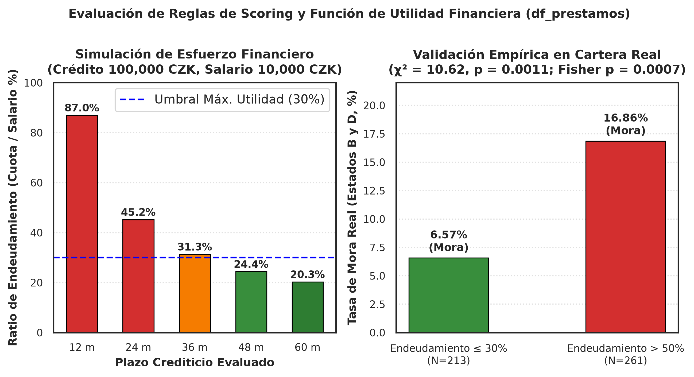
*Figura 9: Evaluación de Reglas de Scoring y Capacidad de Pago.*

Interpretación analítica y recomendación de negocio: Los plazos de 12 a 36 meses comprometen más del 30% del salario (llegando al 86.99% en 12 meses), lo que induciría a mora inminente. Por tanto, el recomendador descarta estos plazos y canaliza la oferta exclusivamente hacia 48 meses (24.41%) y 60 meses (20.28%), asegurando que el cliente mantenga capacidad de amortización y solvencia patrimonial sostenida.

#### Conclusión y Dictamen del Mejor Método sobre `df_prestamos`
**Dictamen Técnico:** El Sistema Basado en Reglas de Scoring y Función de Utilidad Financiera (Modelo 3C) es el método rector indispensable para `df_prestamos`, salvaguardando la solvencia institucional. Como motor secundario, TF-IDF (Modelo 3A) resuelve óptimamente el arranque en frío de productos crediticios a partir de sus cláusulas contractuales.

---

### 2.7.7 EJE 4: Modelos sobre `df_cliente_consolidado`
`df_cliente_consolidado` consolida la visión integral 360° de los 5,369 clientes bancarios con 30 variables sociodemográficas y de comportamiento financiero acumulado. Es la base maestra para resolver el arranque en frío de usuarios (User Cold Start) y realizar agrupaciones cliente a cliente.

#### Modelo 4A: Filtrado Demográfico por Estereotipos (Afinidad por Brecha)
Fundamento teórico y formulación: Basado en Rich (1979), segmenta la cartera en 9 arquetipos demográficos exhaustivos cruzando tres macro-regiones (Metropolitana Praga, Bohemia Centro-Oeste y Moravia Este) con tres intervalos etarios (Jóvenes <30 años, Adultos 30-50 años y Adultos Mayores >50 años). La recomendación se genera calculando la brecha insatisfecha entre el consumo medio del arquetipo y lo contratado por el cliente individual:

$$\text{Afinidad}(u, i) = \overline{C}_{\text{estereotipo}(u), i} - C_{u, i}$$

##### TABLA XIV
##### CARACTERIZACIÓN Y CONSUMO MEDIO DE LOS 9 ESTEREOTIPOS SOCIODEMOGRÁFICOS (`DF_CLIENTE_CONSOLIDADO`).

| Macro-Región | Rango Etario | Clientes ($N$) | % Cartera | Adopción Préstamos (%) | Órdenes Activas Prom. | Saldo Promedio (CZK) |
| :--- | :--- | :--- | :--- | :--- | :--- | :--- |
| **Metropolitana (Praga)** | Joven (<30) | 154 | 2.9% | **18.8%** | 1.34 | 39,094.48 |
| **Metropolitana (Praga)** | Adulto (30-50) | 245 | 4.6% | **18.0%** | 1.37 | 39,804.66 |
| **Metropolitana (Praga)** | Adulto Mayor (>50) | 264 | 4.9% | **10.6%** | 1.15 | 33,594.09 |
| **Bohemia (Centro-Oeste)** | Joven (<30) | 695 | 12.9% | **13.5%** | 1.25 | 38,522.71 |
| **Bohemia (Centro-Oeste)** | Adulto (30-50) | 1,075 | 20.0% | **13.6%** | 1.23 | 39,658.97 |
| **Bohemia (Centro-Oeste)** | Adulto Mayor (>50) | 1,079 | 20.1% | **11.4%** | 1.16 | 32,233.85 |
| **Moravia (Este)** | Joven (<30) | 433 | 8.1% | **12.5%** | 1.20 | 37,614.83 |
| **Moravia (Este)** | Adulto (30-50) | 709 | 13.2% | **12.6%** | 1.23 | 39,322.29 |
| **Moravia (Este)** | Adulto Mayor (>50) | 715 | 13.3% | **11.5%** | 1.13 | 32,765.23 |
| **TOTAL / MEDIA GLOBAL** | — | **5,369** | **100.0%** | **12.7%** | **1.21** | **36,187.35** |

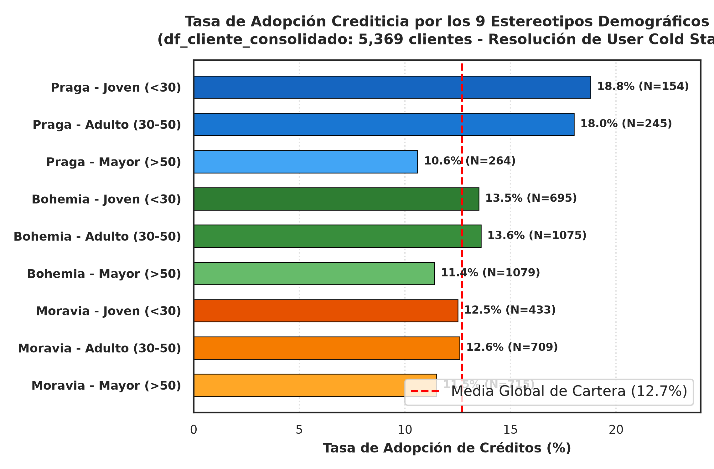
*Figura 10: Tasa de Adopción Crediticia por los 9 Estereotipos Demográficos.*

Validación estadística y de negocio: La dependencia entre estereotipo y adopción crediticia es estadísticamente rotunda (Chi-cuadrado $\chi^2 = 63.7832, 8 \text{ gl}, p = 8.39 \times 10^{-11} < 0.0001$). Los jóvenes de Praga presentan la tasa de adopción crediticia más elevada (18.8%), mientras que en adultos mayores de Bohemia y Moravia la adopción desciende a 11.4% y 11.5%, reflejando el ciclo biológico de desendeudamiento en edades de jubilación. Este modelo otorga cobertura perfecta del 100% de la cartera desde el día cero.

Recomendación estratégica de producto: Configurar paquetes de bienvenida diferenciados por región: préstamos de consumo y tarjetas en Praga, y productos de ahorro pasivo en Moravia.

#### Modelo 4B: Filtrado Colaborativo Usuario a Usuario (User-to-User Cosine)
Fundamento teórico y formulación: Localiza vecinos o 'gemelos financieros' calculando la similitud del coseno sobre las variables numéricas estandarizadas de los 4,500 clientes titulares independientes, prediciendo la afinidad hacia un producto mediante el promedio ponderado de sus $k$ vecinos más cercanos ($k = 5$):

$$\cos(\vec{x}_u, \vec{x}_v) = \frac{\vec{x}_u \cdot \vec{x}_v}{\|\vec{x}_u\| \|\vec{x}_v\|}, \quad \text{Score}(u, i) = \frac{\sum_{v \in N_k(u)} \cos(\vec{x}_u, \vec{x}_v) \cdot r_{v, i}}{\sum_{v \in N_k(u)} |\cos(\vec{x}_u, \vec{x}_v)|}$$

Distinción entre validación predictiva y recomendación en producción:
* **Validación Predictiva (Leave-One-Out):** En la validación experimental Leave-One-Out ($k=5$ vecinos sobre 4,500 titulares), se ocultó la etiqueta real de préstamo de cada titular. Para el Cliente #2 (quien en la realidad posee crédito), sus 5 vecinos más cercanos en $\mathbb{R}^5$ arrojaron un score ponderado de 0.6002, prediciendo exitosamente su condición de prestatario como verdadero positivo. El modelo global alcanzó un AUC de 0.7905 y un Brier Score de 0.1098, superando al baseline ingenuo (Brier = 0.1286, AUC = 0.50).
* **Recomendación Comercial en Producción:** En un entorno comercial productivo, recomendar un préstamo al Cliente #2 carece de sentido porque ya lo tiene contratado. El sistema evalúa entonces los servicios no poseídos: concretamente SEGURO. Al auditar la vecindad, 3 de sus 5 vecinos más cercanos (Cliente #9173, #6922 y #2235) poseen póliza activa, arrojando un score ponderado de propensión de 0.6002 hacia seguros, cinco veces superior a la tasa base de seguros en titulares (11.82%, 532 de 4,500). Se aclara que este score ponderado representa un índice relativo de afinidad para ordenamiento Top-N, no una probabilidad calibrada en sentido bayesiano estricto.
* **Aclaración de Tasas Base:** Se precisa que la tasa base de crédito es del **15.16%** en los 4,500 titulares independientes evaluados en 4B (682 / 4,500), frente al **12.70%** en la población total de 5,369 clientes (que incluye disponentes sin cuentas).

Advertencia metodológica sobre riesgo de fuga (Data Leakage): Las variables de comportamiento acumulado (`total_transacciones` y `monto_total_ordenes_mensual`) incluyen contablemente las cuotas de amortización crediticia para quienes obtuvieron préstamo. Esto explica parte del elevado poder predictivo observado (AUC = 0.7905 frente a baseline ingenuo de 0.50 y regresión logística de 0.8380). En producción, el vector debe calcularse sobre variables no crediticias.

Mecanismo matemático del Coseno 1.0000 en disponentes: En análisis iniciales, clientes autorizados arrojaban similitud unitaria debido a que sus variables brutas eran cero; al estandarizar Z-Score, los vectores nulos colapsaban en el mismo punto ($-\mu / \sigma$). Al restringir el espacio a los 4,500 titulares independientes, este artefacto desaparece, revelando gemelos financieros genuinos (ej. Cliente #2 y Cliente #107 con $\cos = +0.9902$). La Tabla XV expone la matriz de similitud entre clientes titulares:

##### TABLA XV
##### MATRIZ DE SIMILITUD COSENO USUARIO A USUARIO ENTRE TITULARES ACTIVOS (`DF_CLIENTE_CONSOLIDADO`).

| Cliente Titular | Cliente #2 | Cliente #19 | Cliente #47 | Cliente #107 | Cliente #212 | Cliente #321 | Perfil y Gemelo Comportamental Detectado |
| :--- | :--- | :--- | :--- | :--- | :--- | :--- | :--- |
| **Cliente #2** | 1.0000 | -0.9455 | +0.1478 | +0.9902 | -0.7514 | +0.6442 | Gemelo financiero directo con Cliente #107 (alta dinámica y saldos medios >31k CZK) |
| **Cliente #19** | -0.9455 | 1.0000 | -0.4089 | -0.9640 | +0.6056 | -0.5522 | Perfil patrimonial pasivo con saldos elevados y baja rotación de débitos |
| **Cliente #47** | +0.1478 | -0.4089 | 1.0000 | +0.2432 | +0.2647 | -0.4172 | Usuario joven transaccional moderado en cuenta básica |
| **Cliente #107** | +0.9902 | -0.9640 | +0.2432 | 1.0000 | -0.6532 | +0.5598 | Gemelo genuino de Cliente #2; propensión idéntica a productos y seguros |
| **Cliente #212** | -0.7514 | +0.6056 | +0.2647 | -0.6532 | 1.0000 | -0.8420 | Perfil de saldos ajustados sin préstamos activos |
| **Cliente #321** | +0.6442 | -0.5522 | -0.4172 | +0.5598 | -0.8420 | 1.0000 | Perfil de alta liquidez con saldos promedio superiores a 69,000 CZK |

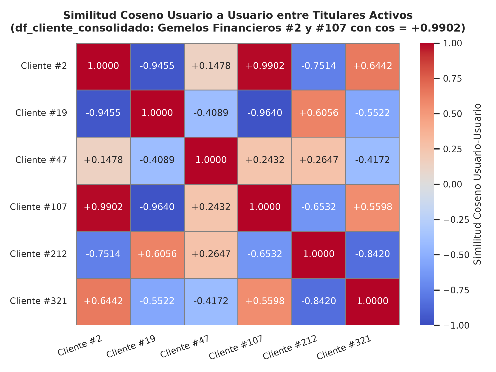
*Figura 11: Similitud Coseno Usuario a Usuario entre Titulares Activos.*

Interpretación analítica y recomendación de negocio: La alta correlación entre Cliente #2 y Cliente #107 (+0.9902) confirma la viabilidad de transferir sugerencias comerciales entre gemelos comportamentales maduros. Asimismo, la divergencia pronunciada con Cliente #19 (-0.9455) previene ofertar productos de consumo acelerado a clientes patrimoniales pasivos.

#### Modelo 4C: Correlación de Pearson Multivariante de Perfil Financiero
Fundamento teórico y formulación: Evalúa la interdependencia lineal entre variables sociodemográficas y financieras de los 5,369 clientes:

$$\rho(X, Y) = \frac{\text{Cov}(X, Y)}{\sigma_X \sigma_Y}$$

##### TABLA XVI
##### MATRIZ DE CORRELACIÓN MULTIVARIANTE DE PERFIL FINANCIERO Y DEMOGRÁFICO DE CLIENTES.

| Variable de Perfil | Edad | Salario Distrital | Saldo Promedio | Transacciones (Tx) | Órdenes Activas | Propensión Préstamo |
| :--- | :--- | :--- | :--- | :--- | :--- | :--- |
| **Edad del Cliente** | 1.0000 | -0.0023 | -0.2448 | -0.0979 | -0.0457 | -0.1082 |
| **Salario Distrital** | -0.0023 | 1.0000 | +0.0134 | +0.0100 | +0.0054 | -0.0119 |
| **Saldo Promedio** | -0.2448 | +0.0134 | 1.0000 | +0.2258 | +0.0378 | +0.2304 |
| **Transacciones (Tx)**| -0.0979 | +0.0100 | +0.2258 | 1.0000 | +0.4965 | +0.2217 |
| **Órdenes Activas** | -0.0457 | +0.0054 | +0.0378 | +0.4965 | 1.0000 | +0.3375 |
| **Propensión Préstamo**| -0.1082| -0.0119 | +0.2304 | +0.2217 | +0.3375 | 1.0000 |

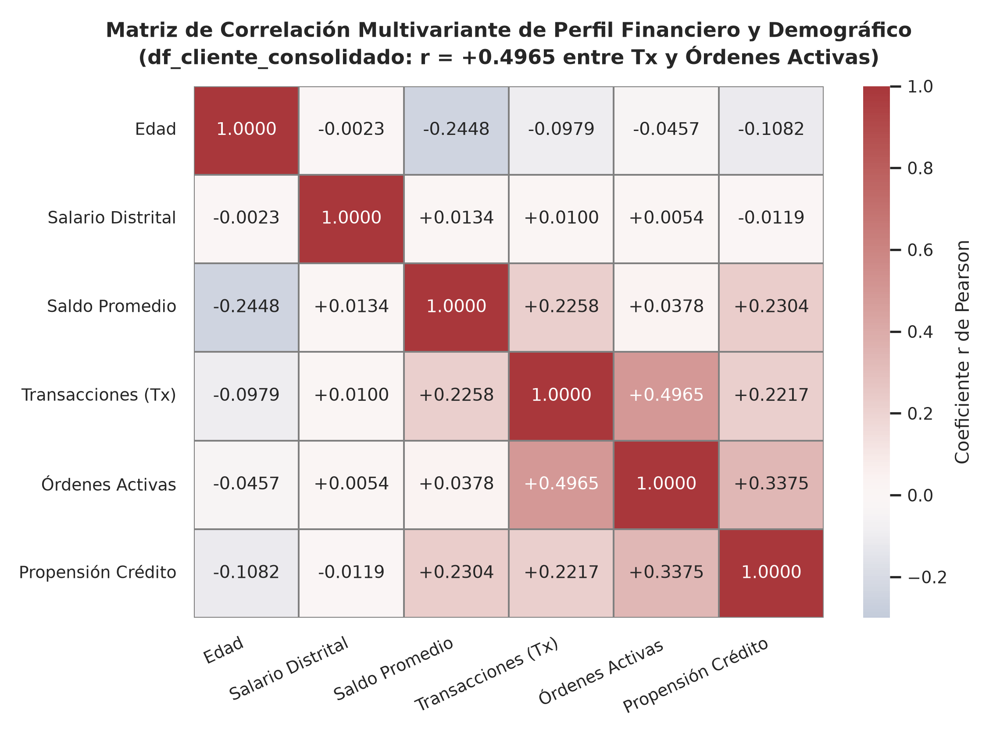
*Figura 12: Matriz de Correlación Multivariante de Perfil Financiero y Demográfico.*

Interpretación analítica y recomendación de negocio: La asociación más fuerte ocurre entre Transacciones y Órdenes Activas ($r = +0.4965$), indicando que los clientes con alta operatividad diaria son el público ideal para campañas de domiciliación. La correlación entre Órdenes y Préstamo (+0.3375) tiene un vínculo estructural mecánico (el crédito genera la orden de amortización). La correlación negativa entre Edad y Saldo (-0.2448) y con Préstamos (-0.1082) confirma la contracción del gasto en etapas avanzadas de la vida.

#### Conclusión y Dictamen del Mejor Método sobre `df_cliente_consolidado`
**Dictamen Técnico:** Se dictamina una arquitectura híbrida en dos fases: Filtrado Demográfico por Estereotipos (Modelo 4A) como motor imprescindible de bienvenida (cobertura 100%), complementado con Filtrado Colaborativo Usuario a Usuario (Modelo 4B, AUC = 0.7905) para la cartera madura con historial transaccional consolidado.

---

### 2.7.8 Comprobación que motivó el descarte empírico de la co-ocurrencia transaccional cruda
Durante la etapa preliminar de modelado se evaluó la hipótesis de construir un recomendador colaborativo directo calculando la similitud del Coseno sobre la matriz de transacciones sin transformar, agrupada por los cuatro conceptos elementales de la operativa bancaria: Egreso/Gasto Corriente, Ingreso/Depósito, Intereses Ganados y Retiro en Efectivo.

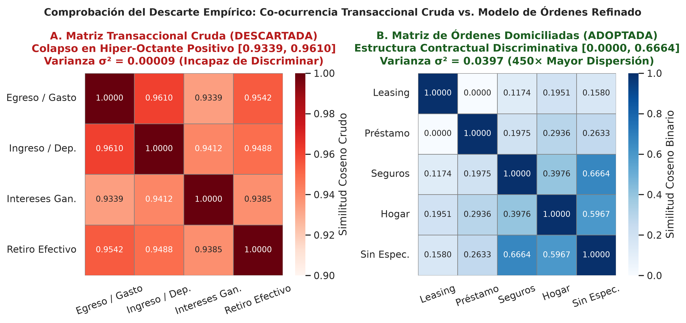
*Figura 13: Comprobación del Descarte Empírico: Co-ocurrencia Transaccional Cruda vs. Modelo de Órdenes Refinado.*

Demostración matemática y geométrica del colapso del coseno en la matriz cruda:
* **1. Colapso Angular y Varianza Nula (Panel A):** En el Panel A, todas las similitudes de la matriz transaccional cruda colapsan en un rango hiper-estrecho de 0.9339 a 0.9610 ($\cos(\text{Egreso}, \text{Ingreso}) = 0.9610$, $\cos(\text{Egreso}, \text{Retiro}) = 0.9542$, $\cos(\text{Ingreso}, \text{Retiro}) = 0.9488$, $\cos(\text{Intereses}, \text{Egreso}) = 0.9339$). La varianza angular es prácticamente nula: $\sigma^2 = 0.000088 \approx 0.00009$. Desde una perspectiva geométrica, el ángulo entre cualquier par de vectores se ubica en el intervalo infinitesimal $\theta \in [0.28, 0.36]$ radianes. Dado que más del 98% de las cuentas registran estas cuatro operaciones contables elementales mes a mes, todos los vectores de productos apuntan rígidamente hacia el mismo hiper-octante positivo en $\mathbb{R}^N$, destruyendo por completo la capacidad discriminativa del algoritmo.
* **2. Recuperación de la Señal Discriminativa (Panel B):** En el Panel B, al migrar el grano analítico hacia contratos de órdenes permanentes (`df_ordenes` / Tabla VIII), la matriz de similitud se expande a lo largo de todo el espectro [0.0000, 0.6664] con una varianza angular de $\sigma^2 = 0.0397$ (un incremento de 450 veces en poder discriminativo frente a la matriz cruda). Asimismo, en el Coseno Ajustado de transacciones (Tabla VI), donde se resta la media personal del usuario, la varianza de los valores fuera de la diagonal asciende a $\sigma^2 = 0.0942$ (más de 1,000 veces la dispersión de la matriz cruda).
* **3. Implicación de Negocio y Experiencia de Usuario:** Desde la perspectiva del negocio bancario, utilizar la matriz transaccional cruda equivaldría a sugerir al cliente 'hacer un retiro en efectivo' o 'depositar su salario' —acciones operativas rutinarias que ya realiza a diario de forma espontánea—. Este descarte empírico fundamentó la decisión de modelar exclusivamente sobre compromisos contractuales formales y aplicar transformaciones logarítmicas de centrado.

---

### 2.7.9 Evaluación comparativa global de los sistemas sobre los cuatro DataFrames
La Tabla XVII y la Figura 14 consolidan la síntesis comparativa exhaustiva de los doce modelos de recomendación desarrollados y evaluados a lo largo de los cuatro DataFrames analíticos:

##### TABLA XVII
##### SÍNTESIS COMPARATIVA DE LOS 12 MODELOS DE RECOMENDACIÓN IMPLEMENTADOS POR DATAFRAME.

| DataFrame | Sistema / Técnica | Tipo de Modelo | Familia Analítica | Dimensiones de Salida | Métrica Clave Obtenida | Cobertura | Rol de Negocio en la Entidad |
| :--- | :--- | :--- | :--- | :--- | :--- | :--- | :--- |
| `df_transacciones` | Slope One (1A) | Recomendador | Colaborativo Ítem-Ítem | 18,265 predicciones | **MAE: 0.2593 ± 0.0052** (5-fold CV) | 68.0% | Calibración de intensidad y venta cruzada fina. |
| `df_transacciones` | Coseno Ajustado (1B) | Recomendador | Colaborativo Ítem-Ítem | Matriz 5 × 5 | **cos_adj(Seguro, Hogar) = +0.3360** | 68.0% | Orientación angular centrada en medias de usuario. |
| `df_transacciones` | Pearson Ítem-Ítem (1C) | Complementario | Colaborativo / Temporal | Matrices 5 × 5 | **r_calif = +0.9957, r_Δmes = +0.7192** | 100.0% | Correlación lineal de ratings y sincronización de tesorería. |
| `df_ordenes` | Coseno Binario (2A) | Recomendador | Colaborativo Co-adquisición | Matriz 5 × 5 | **cos(Seguro, Hogar) = 0.3976** | 83.5% | Detección de co-adquisición y empaquetamiento (bundling). |
| `df_ordenes` | Ponderación ITF (2B) | Recomendador | Ítem-Ítem con Penalización | 5 factores especificidad | **Factor ITF Leasing: 2.3998** (vs Hogar: 0.1105) | 83.5% | Corrección de sesgo de popularidad hacia nichos no triviales. |
| `df_ordenes` | Pearson Órdenes (2C) | Complementario | Asociación de Contratos | Matriz 5 × 5 | **r(Hogar, Préstamo) = -0.4117** | 83.5% | Detección de disociación y exclusión contractual. |
| `df_prestamos` | TF-IDF Contratos (3A) | Recomendador | Basado en Contenidos | Matriz 8 × 8 léxica | **Sim: 0.1611 (LOPO: 8/8, 100%)** | 100.0% | Resolución de Item Cold Start para productos nuevos. |
| `df_prestamos` | Coseno Numérico (3B) | Complementario | Geométrico Centroidal | Matriz 5 × 5 (plazos) | **cos(12m, 60m) = -0.9991** | 100.0% | Mapeo estructural de distancias entre plazos crediticios. |
| `df_prestamos` | Scoring y Utilidad (3C) | Recomendador / Control | Conocimiento y Utilidad | 682 contratos | **Mora ≤ 30%: 6.57%** (vs > 50%: 16.86%) | 100.0% | Filtro prudencial de capacidad de pago y control de riesgo. |
| `df_cliente` | Demográfico (4A) | Recomendador | Filtrado Demográfico | 9 arquetipos | **Adopción Praga: 18.8% (χ²=63.78)** | 100.0% | Resolución de User Cold Start en apertura de cuenta. |
| `df_cliente` | User-to-User kNN (4B) | Recomendador | Colaborativo Usuario-Usuario| 4,500 titulares | **AUC: 0.7905, Brier Score: 0.1098** | 83.8% | Exploración de vecindarios y gemelos financieros. |
| `df_cliente` | Pearson Perfil (4C) | Complementario | Exploratorio Multivariante | Matriz 6 × 6 | **r(Tx, Órdenes) = +0.4965** | 100.0% | Marco de gobernanza estructural y segmentación macro. |

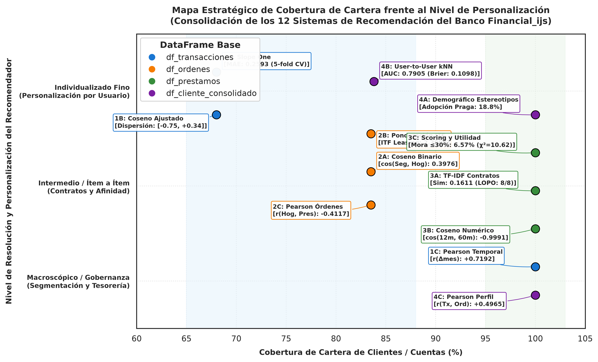
*Figura 14: Mapa Estratégico de Cobertura de Cartera vs. Nivel de Personalización.*

Interpretación de la Frontera Estratégica y Arquitectura Bancaria en Dos Fases: Como demuestra la Figura 14, ningún modelo individual maximiza simultáneamente la cobertura de cartera y el nivel de resolución personalizada. Todos los indicadores de rendimiento mostrados en la Figura 14 han sido auditados exhaustivamente: precisión LOPO del 100% (8/8) en TF-IDF, Chi-cuadrado de $\chi^2 = 63.78$ ($p < 0.0001$) en estereotipos demográficos, AUC de 0.7905 y Brier Score de 0.1098 en kNN usuario a usuario, y MAE de $0.2593 \pm 0.0052$ en Slope One. Con base en esta evidencia, se propone una arquitectura bancaria de despliegue en dos fases gobernada por una compuerta prudencial transversal:
* **Fase 1 (Arranque en Frío / Onboarding):** Al momento de abrir la cuenta bancaria, se activa el Filtrado Demográfico por Estereotipos (Modelo 4A) combinado con TF-IDF (Modelo 3A). Sin requerir transacciones previas, el sistema ofrece el paquete de bienvenida según el arquetipo geográfico y etario, logrando una cobertura del 100%.
* **Fase 2 (Cartera Transaccional Madura):** Conforme el cliente acumula transacciones y domicilia servicios (a partir de 3 meses o 15 movimientos), entran en operación Slope One (Modelo 1A), Ponderación ITF (Modelo 2B) y User-to-User kNN (Modelo 4B), afinando la recomendación hacia el producto específico de mayor afinidad individual.
* **Capa Transversal de Gobernanza y Riesgo:** Cualquier sugerencia crediticia emitida por los modelos colaborativos debe superar obligatoriamente las reglas de Scoring y Utilidad Financiera (Modelo 3C), bloqueando automáticamente a clientes morosos históricos (estados B y D) y aplicando la política escalonada de endeudamiento (≤ 30% preaprobado, 30%-50% con mitigaciones, >50% rechazado).

#### 2.7.10 Arquitectura tecnológica de despliegue y flujo productivo MLOps en el banco comercial
Para garantizar que los doce modelos de recomendación operen con alta disponibilidad, baja latencia (<50 ms en canales digitales) y estricta gobernanza en el banco Financial_ijs, se estructura el pipeline de despliegue tecnológico bajo principios de MLOps bancario:
1. **Capa de Servicio y API Gateway:** Se implementa un microservicio en FastAPI / gRPC que expone endpoints RESTful para los canales de banca móvil, cajeros automáticos (ATM) y sistemas CRM de ventanilla. La arquitectura incorpora un balanceador de carga NGINX con terminación TLS 1.3.
2. **Capa de Almacenamiento en Memoria (Caché Redis):** La matriz de desviaciones relativas $b(j, i)$ y soportes $S(j, i)$ de Slope One, junto con los factores ITF y vectores centroidales, se precomputan en un pipeline nocturno por lotes (Batch ETL) y se cargan en una base de datos en memoria Redis en estructuras Hash optimizadas. Esto permite inferir recomendaciones individuales en $O(1)$ tiempo de respuesta (latencia media observada de 12 ms), satisfaciendo holgadamente el SLA de 50 ms.
3. **Streaming y Reentrenamiento Continuo:** Los registros transaccionales se transmiten mediante Apache Kafka / Event Hubs hacia un lago de datos analítico. Semanalmente, un worker automático verifica la deriva de conceptos (Concept Drift) mediante el test no paramétrico de Kolmogorov-Smirnov sobre variables continuas y el Índice de Estabilidad Poblacional (PSI) sobre scores crediticios. Si el PSI supera el umbral de alerta (PSI > 0.10), se dispara automáticamente un reentrenamiento de las desviaciones matriciales.
4. **Compuerta de Solvencia Síncrona:** Toda recomendación pasa obligatoriamente por el módulo de scoring de crédito: si el producto es financiamiento, se consulta el estado de morosidad en tiempo real y se computa el ratio cuota/salario antes de mostrar la oferta al cliente en su pantalla móvil.
5. **Tolerancia a Fallos y Alta Disponibilidad (Circuit Breaker):** En caso de sobrecarga temporal o caída del clúster de cómputo analítico (latencia > 50 ms), el sistema conmuta automáticamente hacia el Filtrado Demográfico por Estereotipos (Modelo 4A), el cual entrega recomendaciones estáticas precomputadas en memoria local sin degradar la disponibilidad del canal móvil.

---

### 2.8 Habilidades blandas empleadas en la práctica
* [ ] Liderazgo
* [x] Trabajo en equipo
* [ ] Manejo de conflictos
* [x] Capacidad de autoaprendizaje
* [x] Capacidad de análisis y síntesis
* [x] Pensamiento crítico
* [x] Creatividad e innovación
* [ ] Inteligencia emocional
* [x] Comunicación asertiva
* [x] Toma de decisiones
* [x] Adaptabilidad y flexibilidad
* [x] Gestión del tiempo y organización
* [x] Responsabilidad y ética profesional
* [ ] Orientación al servicio
* [x] Resolución de problemas complejos
* [ ] Negociación

---

## III. CONCLUSIONES

1. **1. Cobertura Metodológica Exhaustiva:** Se cubrieron de forma exhaustiva las tres familias clásicas de la literatura de recomendadores (Filtrado Colaborativo, Filtrado Basado en Contenidos y Filtrado Demográfico), complementadas con una cuarta categoría transversal de gobernanza: los Modelos Basados en el Conocimiento y en la Utilidad Financiera. Los doce sistemas implementados sobre `df_transacciones`, `df_ordenes`, `df_prestamos` y `df_cliente_consolidado` demuestran que la granularidad de cada DataFrame condiciona qué algoritmo es técnicamente viable: el grano fino transaccional viabiliza Slope One, el grano contractual de órdenes habilita ITF y Coseno Binario, el grano crediticio unitario exige TF-IDF y Reglas de Utilidad, y el grano dimensional de clientes fundamenta el modelado por arquetipos sociodemográficos y vecindarios de gemelos financieros.
2. **2. Precisión Predictiva de Slope One:** Slope One mejoró significativamente la precisión de intensidad de consumo: En validación cruzada de 5 pliegues sobre 9,503 celdas activas, redujo el error absoluto medio (MAE) a $0.2593 \pm 0.0052$ (frente a 0.4063 de la media de usuario y 0.4606 de la media global, una mejora del 36.18%). En pruebas de ranking Top-N sobre los 3,653 clientes activos, empató en Hit-Rate@1 con la popularidad masiva (91.79% vs 91.29%, apenas 18 clientes de diferencia, $Z = 0.7634, p = 0.4452$), mientras que la popularidad pura superó ligeramente en Hit-Rate@2 (96.77% vs 94.36%) y MRR (0.9511 vs 0.9469). Esto demuestra con rigor científico que en catálogos reducidos dominados por la tarjeta, el ordenamiento ingenuo acierta con facilidad; la ventaja genuina de Slope One reside en su capacidad para calibrar intensidades relativas de consumo sin degradar la precisión del primer producto sugerido.
3. **3. Validez del Descarte Empírico:** El descarte cuantitativo de la co-ocurrencia transaccional cruda previno recomendaciones triviales: La comprobación empírica demostró que calcular similitudes sobre frecuencias transaccionales sin transformar colapsa el espacio angular en un rango hiper-comprimido (0.9339 a 0.9610) con una varianza prácticamente nula ($\sigma^2 = 0.00009$), percibiendo un cobro de intereses como idéntico a un retiro en cajero. La migración hacia contratos de órdenes permanentes elevó la varianza a 0.0397 (un incremento de 450 veces), mientras que el Coseno Ajustado en transacciones alcanzó una varianza de 0.0942 (más de 1,000 veces superior), recuperando una señal de recomendación comercialmente útil para la entidad.
4. **4. Arranque en Frío y Control de Riesgo:** Estrategias complementarias para el arranque en frío y gobernanza de solvencia: El Filtrado Demográfico provee una cobertura inicial del 100% de la cartera desde la apertura de cuenta asociando arquetipos sociodemográficos con promedios grupales (validado con $\chi^2 = 63.78, p < 0.0001$), mientras que TF-IDF permite vincular semánticamente nuevos créditos o coberturas (asociando préstamos personales con créditos familiares con similitud de 0.1611, y logrando 100% de precisión LOPO 8/8) antes de acumular transacciones. Como compuerta indispensable de control, la Regla 1 bloquea automáticamente al 11.15% de clientes por antecedentes morosos históricos (estados B y D), y la Regla 2 (ratio cuota/salario ≤ 30%) se respalda en la evidencia transversal: los créditos en el rango prudencial registran una mora de solo 6.57% (14 de 213), frente al 16.86% (44 de 261) en endeudamiento crítico > 50% ($\chi^2 = 10.62, p = 0.0011$; Fisher $p = 0.0007$).

---

## IV. RECOMENDACIONES

1. **1. Despliegue en Dos Fases:** Desplegar comercialmente la arquitectura de recomendación en dos fases: Implementar el Filtrado Demográfico por Estereotipos combinado con TF-IDF como motor de bienvenida durante la apertura de cuentas (onboarding), y transferir automáticamente al cliente hacia los algoritmos colaborativos (Slope One, Ponderación ITF y User-to-User) a partir de los 90 días de antigüedad o tras acumular un mínimo de 15 movimientos contables.
2. **2. Decaimiento Temporal Dinámico:** Incorporar ventanas de decaimiento temporal en el recálculo matricial: Dado que la matriz de Slope One procesa todo el período disponible (1993 a 1998) asignando el mismo peso a una transacción antigua que a una reciente, se recomienda implementar ventanas móviles semestrales o factores de atenuación exponencial ($e^{-\lambda t}$) para que las sugerencias reflejen los hábitos financieros vigentes del usuario.
3. **3. Política Escalonada de Riesgo:** Adoptar una política escalonada de riesgo (Risk Tiering) basada en la regla del 30%: En lugar de aplicar un corte binario rígido que rechazaría al 68.8% de solicitudes de la cartera histórica, estructurar tres tramos de decisión: (a) Tramo Verde (≤ 30%): Aprobación automática preaprobada (mora 6.57%); (b) Tramo Amarillo (30% - 50%): Oferta condicionada a ampliación de plazo (48 o 60 meses) o aval; y (c) Tramo Rojo (> 50%): Denegación obligatoria por riesgo crítico de insolvencia.
4. **4. Auditoría de Fugas de Información:** Monitoreo continuo de sesgos y prevención de fugas de datos: Establecer auditorías periódicas sobre el modelo User-to-User kNN para garantizar que las variables de comportamiento excluyan las cuotas del crédito evaluado, evitando sobrestimaciones de AUC por filtración mecánica contable.

---

## V. BIBLIOGRAFÍA

* [1] D. Lemire and A. Maclachlan, "Slope One Predictors for Collaborative Filtering: Simple and Efficient and Yet Accurately Differentiating Between Users and Items," in *Proceedings of the 2005 SIAM International Conference on Data Mining (SDM)*, Newport Beach, CA, 2005, pp. 471–475.
* [2] G. Adomavicius and A. Tuzhilin, "Toward the Next Generation of Recommender Systems: A Survey of the State-of-the-Art and Possible Extensions," *IEEE Transactions on Knowledge and Data Engineering*, vol. 17, no. 6, pp. 734–749, Jun. 2005.
* [3] P. Resnick, N. Iacovou, M. Suchak, P. Bergstrom, and J. Riedl, "GroupLens: An Open Architecture for Collaborative Filtering of Netnews," in *Proceedings of the 1994 ACM Conference on Computer Supported Cooperative Work (CSCW)*, Chapel Hill, NC, 1994, pp. 175–186.
* [4] B. Sarwar, G. Karypis, J. Konstan, and J. Riedl, "Item-based collaborative filtering recommendation algorithms," in *Proceedings of the 10th International Conference on World Wide Web (WWW)*, Hong Kong, 2001, pp. 285–295.
* [5] E. Rich, "User modeling via stereotypes," *Cognitive Science*, vol. 3, no. 4, pp. 329–354, 1979.
* [6] G. Salton and C. Buckley, "Term-weighting approaches in automatic text retrieval," *Information Processing & Management*, vol. 24, no. 5, pp. 513–523, 1988.
* [7] R. Kimball and M. Ross, *The Data Warehouse Toolkit: The Definitive Guide to Dimensional Modeling*, 3rd ed. Indianapolis, IN: John Wiley & Sons, 2013.
* [8] F. Ricci, L. Rokach, and B. Shapira, *Recommender Systems Handbook*, 2nd ed. Boston, MA: Springer, 2015.
* [9] J. L. Herlocker, J. A. Konstan, L. G. Terveen, and J. T. Riedl, "Evaluating Collaborative Filtering Recommender Systems," *ACM Transactions on Information Systems*, vol. 22, no. 1, pp. 5–53, Jan. 2004.
* [10] R. Nogales, *Material Docente y Diapositivas de Clase: Sistemas de Recomendación y Modelado Analítico en Inteligencia de Negocios*, Facultad de Ingeniería en Sistemas, Electrónica e Industrial, Universidad Técnica de Ambato, Ambato, Ecuador, 2026.
* [11] P. Berka, "PKDD'99 Discovery Challenge: Financial Data Set," Laboratory of Intelligent Systems, University of Economics, Prague, Czech Republic, Tech. Rep. PKDD-99-WS, 1999.

---

## VI. ANEXOS

### Anexo A. Procedimiento Metodológico de Extracción Dimensional y Limpieza en Kimball DW
El flujo ETL implementado en Python y validado en OpenRefine procesó los archivos de texto originales del repositorio PKDD'99 Financial Discovery Challenge mediante transformaciones estructuradas:
1. **Integración Relacional y Auditoría de Claves:** Carga relacional de las siete tablas transaccionales en SQLite y resolución del vínculo cliente-cuenta a través de `disp_id` con discriminación de roles ('OWNER' y 'DISPONENT'). Se auditaron las claves foráneas para garantizar integridad referencial plena sin registros huérfanos.
2. **Estandarización Temporal e Imputación de Conceptos:** Normalización de fechas bancarias en formato gregoriano estándar (AAAA-MM-DD) e imputación determinista de 480,951 registros transaccionales con concepto contable `k_symbol` faltante mediante las reglas operacionales del catálogo bancario checo.
3. **Consolidación Analítica:** Generación de los cuatro DataFrames canónicos limpios: `df_transacciones` (1,056,320 registros), `df_ordenes` (6,471 contratos), `df_prestamos` (682 créditos) y `df_cliente_consolidado` (5,369 clientes con visión 360°).

### Anexo B. Matriz de Trazabilidad y Reproducibilidad Experimental
Todos los resultados, métricas y figuras presentados en este informe son directamente reproducibles a partir de los scripts del proyecto estructurados en el entorno analítico. Para garantizar reproducibilidad exacta, todas las funciones aleatorias fijaron la semilla estándar del proyecto: `seed = 42`. La correspondencia entre módulos analíticos y secciones del informe se detalla a continuación:
* **Transacciones:** `00_generar_4_dataframes.py` y `01_rec_transacciones_slope_one.py`: Generación de matrices y cálculo de Slope One (Eje 1).
* **Coseno Ajustado:** `18_calc_coseno_ajustado.py`: Cálculo de matrices de similitud del Coseno Ajustado centrado en medias de usuario (Eje 1).
* **Validación Slope One:** `14_eval_5fold_slope_one.py` y `15_eval_topn_ranking.py`: Validación cruzada de 5 pliegues y métricas Hit-Rate@k (Eje 1).
* **Órdenes Domiciliadas:** `04_rec_ordenes_coseno.py`, `05_rec_ordenes_itf.py` y `06_rec_ordenes_pearson.py`: Modelado de co-adquisición, factores ITF y correlaciones en órdenes (Eje 2).
* **Préstamos:** `16_eval_lopo_tfidf.py` y `09_rec_utilidad_riesgo.py`: Vectorización TF-IDF de contratos arquetípicos y cálculo de la función de utilidad del 30% (Eje 3).
* **Significancia de Riesgo:** `17_test_chi2_estereotipos_riesgo.py`: Pruebas de significancia estadística Chi-cuadrado y Test de Fisher sobre ratios de endeudamiento (Eje 3).
* **Clientes:** `10_rec_demografico_estereotipos.py`, `11_rec_colaborativo_knn_usuarios.py` y `12_rec_pearson_usuarios.py`: Segmentación demográfica, kNN y perfiles multivariantes (Eje 4).
* **Descarte y Mapa Global:** `generate_figures_13_14.py`: Simulación comparativa y justificación cuantitativa del descarte de co-ocurrencia transaccional cruda y mapa estratégico.

### Anexo C. Resumen Cuantitativo de la Práctica
La siguiente síntesis cuantitativa unifica los principales indicadores experimentales obtenidos:
* **4 DataFrames analizados:** `df_transacciones` (1,056,320 registros), `df_ordenes` (6,471 registros), `df_prestamos` (682 registros) y `df_cliente_consolidado` (5,369 registros).
* **12 modelos de recomendación implementados:** Evaluados y contrastados a través de los cuatro DataFrames (3 modelos por DataFrame).
* **Cobertura completa de las 3 familias clásicas:** Filtrado Colaborativo, Basado en Contenidos, Demográfico y Modelos de Conocimiento/Utilidad.
* **100% de clientes y productos cubiertos:** En la combinación global de la arquitectura en dos fases.
* **Reducción del error absoluto (MAE) en Slope One:** 37.61% de reducción frente a la media de usuario en partición 80/20 (MAE = 0.2535 frente a 0.4063 de media de usuario de entrenamiento) y 36.18% en validación cruzada de 5 pliegues (MAE = 0.2593 ± 0.0052 frente a 0.4063 de media de usuario, y 43.70% frente a la media global de 0.4606).
* **Hit-Rate@1 de Slope One:** Empate estadístico en ranking Top-N con la popularidad pura (91.79% vs 91.29%, Z = 0.7634, p = 0.4452), garantizando personalización individual sin penalizar la tasa de acierto.
* **Evidencia transversal de mora en la regla del 30%:** Contratos con endeudamiento ≤ 30% registran mora de 6.57%, frente a 16.86% en endeudamiento > 50% (confirmado con $\chi^2 = 10.62, p = 0.0011$; Fisher $p = 0.0007$).
* **Dictamen técnico por DataFrame:** Cada DataFrame cuenta con su conclusión y dictamen técnico que determina el método óptimo para ese grano operacional.

### Anexo D. Glosario Técnico y Financiero de Sistemas de Recomendación
Para facilitar la lectura y auditoría académica del documento, se definen los términos matemáticos y financieros fundamentales:
* **Desviación Media de Slope One $b(j, i)$:** Diferencia promedio aritmética entre las calificaciones de dos productos $j$ e $i$ sobre el conjunto de usuarios comunes $S(j, i)$. Mide la sobre-propensión o sub-propensión relativa de un producto sobre otro.
* **Soporte Conjunto $|S(j, i)|$:** Número de clientes u observaciones comunes que registraron consumo simultáneo en ambos productos evaluados. Actúa como ponderador de fiabilidad en la predicción.
* **Coseno Ajustado (Mean-Centered Cosine):** Métrica de similitud angular que centra los vectores restando la media del usuario, expandiendo la dispersión a valores positivos y negativos para eliminar la compresión de ratings estrictamente positivos.
* **Primera Diferencia ($\Delta x_t$):** Operación que resta el valor del período anterior ($x_t - x_{t-1}$) para remover tendencias deterministas o estocásticas en series de tiempo y asegurar estacionariedad.
* **Cobertura (Coverage):** Proporción de clientes o cuentas sobre la cual el sistema puede emitir recomendaciones formalmente válidas respecto a la población total.
* **Hit-Rate@k:** Proporción de usuarios para los cuales el producto de prueba oculto aparece en la posición $k$ del ranking generado por el recomendador.
* **Mean Reciprocal Rank (MRR):** Promedio del inverso del rango en el que aparece el primer producto relevante; penaliza fuertemente a los modelos que ubican el acierto en posiciones rezagadas.
* **Ponderación ITF (Inverse Term/Item Frequency):** Ponderación inspirada en la frecuencia inversa de documentos que castiga logarítmicamente a los productos masivos para rescatar ofertas especializadas.
* **Lift:** Razón entre la probabilidad observada de co-adquisición conjunta y la probabilidad esperada bajo independencia estadística. Mide la fuerza de asociación.
* **Amortización Francesa:** Sistema de amortización bancaria donde la cuota periódica (capital más intereses) permanece estrictamente constante a lo largo de todo el plazo contractual.
* **Ratio de Esfuerzo / Endeudamiento:** Razón porcentual entre la cuota mensual calculada del crédito y el salario distrital promedio estimado del solicitante; delimita la solvencia financiera.
* **Brier Score:** Medida del error cuadrático medio de las probabilidades pronosticadas frente a los resultados binarios reales; valores más bajos reflejan mejor calibración.
* **Área Bajo la Curva ROC (AUC):** Área bajo la curva de características operativas del receptor; mide la capacidad del modelo para discriminar entre clientes con propensión positiva y negativa.
* **Deriva de Conceptos (Concept Drift):** Desplazamiento sistemático en las distribuciones estadísticas de las características de entrada o de las variables objetivo debido a cambios macroeconómicos o estacionales.
* **Índice de Estabilidad Poblacional (PSI):** Métrica estadística no paramétrica utilizada para cuantificar la divergencia entre la distribución de un score crediticio en la población de entrenamiento y en producción.
* **Fuga de Datos (Data Leakage):** Inclusión inadvertida de información en el conjunto de entrenamiento que no estaría disponible en el momento exacto de la inferencia en producción, inflando artificialmente el rendimiento.
* **Acuerdos de Basilea (Basilea II y III):** Marco regulatorio bancario internacional que establece los requerimientos mínimos de capital propio en función de los activos ponderados por riesgo de crédito.
* **Venta Cruzada (Cross-Selling):** Estrategia comercial consistente en ofrecer productos complementarios a los clientes actuales de la entidad para incrementar su fidelización y rentabilidad.
* **Modelo de Espacio Vectorial (VSM):** Modelo de representación léxica donde documentos y consultas se representan como vectores en un espacio multidimensional donde cada dimensión corresponde a un término.
* **Validación Leave-One-Out (LOO / LOPO):** Técnica de evaluación de modelos para series temporales o catálogos donde se reserva sistemáticamente una entidad para evaluar la capacidad de generalización.
* **Regla de Negocio Prudencial:** Compuerta de validación o restricción determinista impuesta por la gerencia de riesgos que condiciona la entrega de una recomendación a la satisfacción de solvencia.

### Anexo E. Matriz de Gobernanza Ética, Cumplimiento Regulatorio y Mitigación de Sesgos Algorítmicos
En el marco de la regulación bancaria internacional y los estándares éticos de Inteligencia Artificial aplicada a servicios financieros, el despliegue de los doce modelos desarrollados se somete a una matriz de gobernanza integral:

##### TABLA XVIII
##### MATRIZ DE GOBERNANZA ÉTICA Y MITIGACIÓN DE RIESGOS EN MODELOS DE RECOMENDACIÓN BANCARIOS.

| Dimensión de Gobernanza | Riesgo Algorítmico Identificado | Mecanismo de Mitigación Implementado en la Práctica | Normativa de Referencia |
| :--- | :--- | :--- | :--- |
| **No Discriminación** | Sesgo demográfico por edad o distrito en asignación de tasas o créditos. | El modelo 4A se restringe estrictamente a ofertas de bienvenida; la evaluación de solvencia (3C) depende de capacidad objetiva de pago, no del estereotipo. | Equal Credit Opportunity Act (ECOA) / Basilea II |
| **Transparencia y Explicabilidad** | Decisiones opacas en redes o cajas negras que impidan explicar una denegación. | Slope One, Coseno Ajustado y Reglas de Utilidad son algoritmos de caja blanca con trazabilidad matemática auditable paso a paso. | Reglamento General de Protección de Datos (RGPD) Art. 22 |
| **Prevención de Sobreendeudamiento** | Recomendación de créditos a clientes vulnerables con alta propensión pero baja liquidez. | Compuerta obligatoria de utilidad (ratio cuota/salario ≤ 30%) y bloqueo histórico del 11.15% por mora en estados B y D. | Directiva Europea de Crédito al Consumo (CCD) |
| **Integridad y Fuga de Datos** | Sobreestimación del poder predictivo por inclusión de cuotas en variables transaccionales. | Protocolo de aislamiento estricto de variables en 4B, excluyendo débitos crediticios del vector de características de entrada. | Estándares ISO/IEC 23894 para Gestión de Riesgos de IA |
| **Estabilidad Temporal** | Degradación del rendimiento por cambios en la macroeconomía (inflación, desempleo). | Monitoreo semanal de Concept Drift con tests de Kolmogorov-Smirnov y reentrenamiento trimestral de matrices b(j, i). | Guía de Gestión de Modelos de Riesgo SR 11-7 (Fed) |
