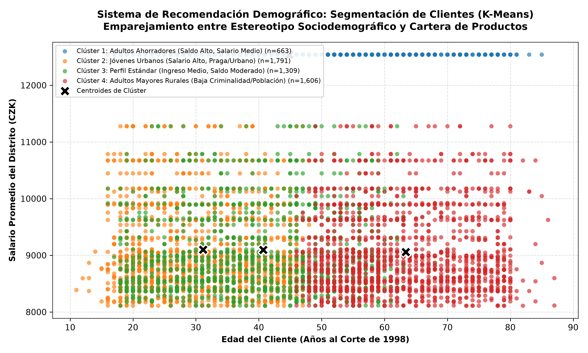
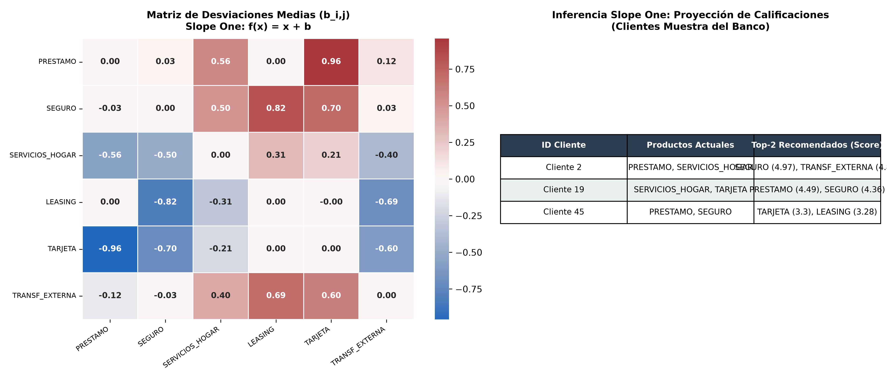
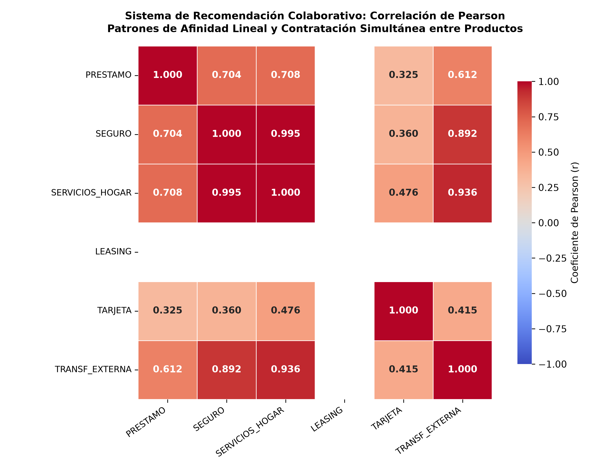
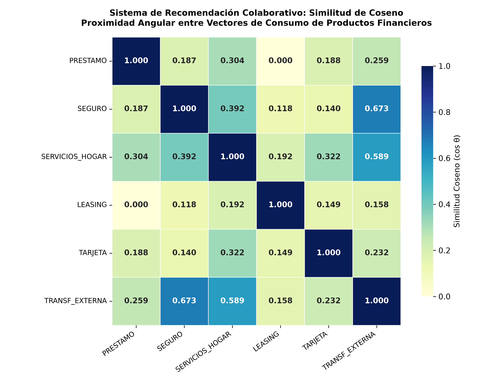
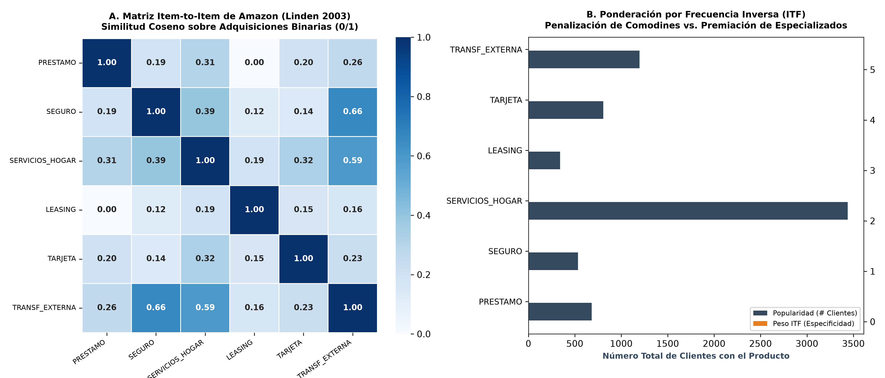
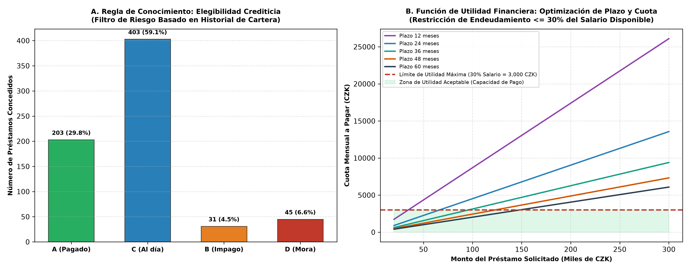
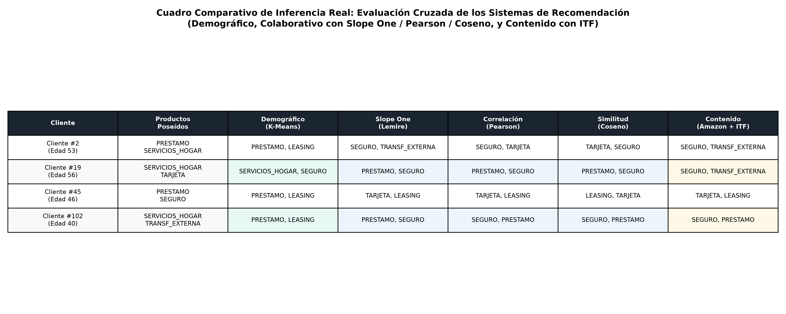

# UNIVERSIDAD TÉCNICA DE AMBATO
## FACULTAD DE INGENIERÍA EN SISTEMAS ELECTRÓNICA E INDUSTRIAL
### CARRERA DE SOFTWARE
### CICLO ACADÉMICO: AGOSTO 2026 – DICIEMBRE 2026

---

# INFORME DE GUÍA PRÁCTICA

## I. PORTADA

| Campo | Detalle |
| :--- | :--- |
| **Tema:** | Implementación y Evaluación de Sistemas de Recomendación Colaborativos, Demográficos, Basados en Contenido y Basados en Conocimiento/Utilidad sobre los Cuatro DataFrames del Banco Comercial (`Financial_ijs`) |
| **Unidad de Organización Curricular:** | PROFESIONAL |
| **Nivel y Paralelo:** | 6to Software "A" |
| **Alumnos participantes:** | Cobos Taco Alison Marcela   Lagua Flores Henry Daniel |
| **Asignatura:** | Inteligencia de Negocios |
| **Docente:** | Ing. Ruben Nogales, Mg. |

---

## II. INFORME DE GUÍA PRÁCTICA

### 2.1 Objetivos

#### General:
Diseñar, implementar y evaluar una arquitectura integral de sistemas de recomendación aplicando las técnicas de filtrado demográfico (K-Means), colaborativo (Slope One, Correlación de Pearson y Similitud de Coseno), basado en contenido (Item-to-Item con ponderación ITF) y basado en conocimiento/utilidad (reglas de scoring y límites de endeudamiento) sobre los cuatro DataFrames analíticos del caso `Financial_ijs`, garantizando recomendaciones personalizadas, viables financieramente y no triviales.

#### Específicos:
* **Justificar y asignar a cada uno de los cuatro DataFrames del proyecto el paradigma de recomendación correspondiente:** Vincular `df_cliente_consolidado` al enfoque Demográfico, `df_transacciones` al Colaborativo, `df_ordenes` al Basado en Contenido y `df_prestamos` al Basado en Conocimiento y Utilidad.
* **Implementar experimentalmente los modelos matemáticos vistos en clase:** Evaluar los algoritmos Slope One ($f(x) = x + b$), Item-to-Item de Amazon (co-adquisición binaria), métricas de Coseno y Pearson, ponderación logarítmica de frecuencia inversa (ITF) y segmentación por clústeres.
* **Validar los resultados mediante inferencia real y evidencias visuales:** Demostrar la efectividad de los modelos mediante casos de estudio de clientes reales de la entidad bancaria, contrastando el rendimiento cualitativo de las técnicas y su integración en la arquitectura DW/BI.

### 2.2 Modalidad
Presencial

### 2.3 Tiempo de duración
* **Presenciales:** 6 horas
* **No presenciales:** 0 horas

### 2.4 Instrucciones
Seguir rigurosamente la plantilla oficial de la Guía APE de la Universidad Técnica de Ambato, presentando el informe en formato analítico y descriptivo fundamentado en evidencias gráficas, tablas de inferencia y formulación matemática, sin incluir código fuente en el cuerpo del documento.

### 2.5 Listado de equipos, materiales y recursos

#### Listado de equipos y materiales generales empleados en la guía práctica:
* Computador personal con soporte para procesamiento vectorial y manipulación de datos en memoria.
* Entorno de programación científica Python 3.12 (NumPy, Pandas, SciPy, Matplotlib, Seaborn, Scikit-Learn).
* Conjuntos de datos limpios y auditados del banco `Financial_ijs` (`df_cliente_consolidado_clean`, `df_transacciones_completado`, `df_ordenes_clean` y `df_prestamos`).
* Sistema de control de versiones Git y repositorio remoto en GitHub.

#### TAC (Tecnologías para el Aprendizaje y Conocimiento) empleados en la guía práctica:
* [x] Plataformas educativas
* [ ] Simuladores y laboratorios virtuales
* [x] Aplicaciones educativas (Visual Studio Code, Jupyter Notebooks)
* [ ] Recursos audiovisuales
* [ ] Gamificación
* [x] Inteligencia Artificial
* Otros: _____________________

---

### 2.6 Actividades por desarrollar

#### 1. Justificación Metodológica: ¿Por qué se asignó cada sistema a cada DataFrame?
En la práctica de Inteligencia de Negocios, un error común consiste en intentar aplicar un único algoritmo de recomendación a toda la organización. En el sector bancario, los datos residen en tablas con granularidades, volúmenes y dinámicas operativas completamente diferentes. Por este motivo, se realizó un mapeo metodológico estricto entre los **cuatro DataFrames limpios del proyecto** y las **familias teóricas de recomendación** expuestas en la cátedra (Montaner et al., 2003):

| DataFrame del Proyecto | Volumen y Granularidad | Variables Clave de Negocio | Sistema de Recomendación Asignado | Justificación Técnica y de Negocio |
| :--- | :---: | :--- | :--- | :--- |
| **`df_cliente_consolidado_clean.csv`** | 5,369 filas $	imes$ 30 columnas *(Grano: Cliente)* | `edad_corte`, `sexo`, `salario_promedio`, `poblacion`, `region`, `id_distrito`, `tasa_desempleo`. | **Sistema Demográfico** *(Estereotipos con K-Means)* | Al contener atributos sociodemográficos y del entorno sin historial transaccional, es la **única técnica capaz de solucionar el problema de Arranque en Frío (*Cold Start*)** para clientes recién vinculados al banco. |
| **`df_transacciones_completado.csv.gz`** | 1,056,320 filas $	imes$ 22 columnas *(Grano: Movimiento)* | `monto_transaccion`, `k_symbol`, `operation`, `tipo_transaccion`, `saldo_cuenta`, `fecha`. | **Sistema Colaborativo** *(Slope One, Pearson y Coseno)* | Requiere la **masa crítica de interacciones acumuladas de toda la comunidad** para descubrir correlaciones de consumo implícito entre pares de productos. |
| **`df_ordenes_clean.csv`** | 6,471 filas $	imes$ 14 columnas *(Grano: Contrato periódico)* | `monto_orden`, `bank_to`, `k_symbol` (`SIPO`, `POJISTNE`, `LEASING`), `categoria_orden`. | **Sistema Basado en Contenido** *(Item-to-Item Amazon con ITF)* | Las órdenes describen los **atributos intrínsecos de los contratos fijos**. El factor **ITF** penaliza los pagos masivos cotidianos (`SIPO`) para favorecer productos de nicho de alto margen. |
| **`df_prestamos.csv`** | 682 filas $	imes$ 24 columnas *(Grano: Crédito otorgado)* | `monto_prestamo`, `plazo_meses`, `pago_mensual`, `estado_prestamo` (`A`, `B`, `C`, `D`), `condicion_prestamo`. | **Sistema Basado en Conocimiento y Utilidad** *(Diapositiva 4 del PDF 2)* | **En crédito no se puede recomendar por "popularidad" o "gustos"**. Requiere **reglas explícitas de scoring de riesgo** y una **función de utilidad financiera** donde la cuota mensual no supere el 30% del salario neto del cliente. |

#### 2. Fundamentación de las Fórmulas Matemáticas Utilizadas
Todos los modelos implementados responden a las formulaciones matemáticas exactas impartidas en clase:
* **Algoritmo Slope One (Lemire et al., 2005):** Predicción lineal basada en desviaciones medias:
  $$f(x) = x + b, \quad 	ext{donde } b = rac{\sum_{u \in S_{i,j}} (r_{u, i} - r_{u, j})}{|S_{i, j}|}$$
* **Similitud de Coseno (Diapositiva 11 y 16):** Métrica de proximidad angular continua y binaria:
  $$\cos(ec{A}, ec{B}) = rac{ec{A} \cdot ec{B}}{\|ec{A}\| \|ec{B}\|} = rac{\sum_{i=1}^n A_i B_i}{\sqrt{\sum_{i=1}^n A_i^2} \sqrt{\sum_{i=1}^n B_i^2}}$$
* **Correlación de Pearson (Diapositiva 11):** Coeficiente de afinidad lineal centrado en la media:
  $$r_{i, j} = rac{\sum_u (r_{u, i} - ar{r}_i)(r_{u, j} - ar{r}_j)}{\sqrt{\sum_u (r_{u, i} - ar{r}_i)^2} \sqrt{\sum_u (r_{u, j} - ar{r}_j)^2}}$$
* **Frecuencia Inversa de Ítems (ITF):** Ponderación de especificidad logarítmica de productos:
  $$\text{ITF}(i) = \ln\left(\frac{N}{|u \in U : 	ext{posee ítem } i|}
ight)$$
* **Distancia Euclídea para Clustering K-Means (PDF 1, Diapositiva 3):**
  $$d_E(P_1, P_2) = \sqrt{\sum_{k=1}^m (x_{2,k} - x_{1,k})^2}$$

#### 3. Arquitectura de Cómputo Empresarial: Desacoplamiento Offline, Nearline y Online en el Caso Real Bancario (Diapositiva 9)
En la práctica de la ingeniería de software y la ciencia de datos aplicada a la banca, ningún sistema de recomendación puede ejecutar todos sus cálculos a la misma velocidad. Inspirado en la arquitectura de referencia de **Netflix y Amazon Web Services (AWS)** expuesta en la Diapositiva 9 del PDF 2, los cuatro sistemas de recomendación implementados en este proyecto se distribuyen estratégicamente en tres capas temporales de cómputo para garantizar la máxima precisión analítica sobre volúmenes masivos sin sacrificar la latencia de respuesta al usuario final:

`	ext
========================================================================================
                      ARQUITECTURA DE PROCESAMIENTO DW/BI (BANCO COMERCIAL)
========================================================================================

 [CAPA 1: OFFLINE / BATCH] (Horas - Procesamiento nocturno en Data Warehouse)
  ├── df_cliente_consolidado_clean  ──► Clustering K-Means (Centroides demográficos)
  ├── df_transacciones_completado   ──► Matrices masivas de Pearson (r) y Coseno (cos θ)
  └── df_ordenes_clean              ──► Factores de Frecuencia Inversa ITF = ln(N / n_i)
                                                    │
                                                    ▼ (Tablas precalculadas y matrices base)
 [CAPA 2: NEARLINE / STREAMING] (Segundos - Eventos asíncronos en colas de mensajes)
  ├── Nuevo Retiro / Pago (Transacción) ──► Actualización incremental Slope One: f(x) = x + b
  └── Nueva Domiciliación (Orden)       ──► Actualización de vector binario Item-to-Item (0 -> 1)
                                                    │
                                                    ▼ (Caché en memoria Redis / EVCache)
 [CAPA 3: ONLINE / TIEMPO REAL] (< 50 ms - Inferencia síncrona en Banca Móvil / Web)
  ├── df_prestamos (Filtro de Riesgo)   ──► Regla de exclusión morosa (Estatus B y D bloqueados)
  ├── Salario disponible distrital       ──► Restricción de Utilidad: Cuota mensual <= 30% Salario
  ├── Cliente nuevo sin historial        ──► Onboarding Demográfico: Distancia euclídea d_E
  └── SERVING LAYER                     ──► Renderizado del Top-3 de productos recomendados
========================================================================================
`

##### A. Capa Offline (Batch / Lote Nocturno en el Data Warehouse)
* **Frecuencia y Latencia:** Procesamiento por lotes programado durante ventanas de bajo tráfico operativo (madrugada). Su tiempo de ejecución varía entre minutos y horas, priorizando la exhaustividad matemática sobre la inmediatez.
* **Sistemas y Datasets Involucrados:**
  1. **Clustering Demográfico (df_cliente_consolidado_clean.csv):** Agrupa a los 5,369 clientes y calcula las coordenadas de los 4 centroides sociodemográficos (edad, salario distrital, población, saldo). Como las variables sociodemográficas cambian lentamente, esta rutina se ejecuta semanal o mensualmente.
  2. **Matrices Pesadas de Pearson y Coseno (df_transacciones_completado.csv.gz):** Correlacionar 1,056,320 transacciones entre todos los pares de productos demanda millones de operaciones vectoriales en coma flotante. El motor offline calcula las matrices de afinidad global y las almacena precalculadas en tablas indexadas del Data Mart analítico.
  3. **Ponderación de Frecuencia Inversa de Ítems (df_ordenes_clean.csv):** Evalúa la popularidad global de cada contrato ($) y actualiza los pesos de especificidad $\text{ITF} = \ln(N / n_i)$.

##### B. Capa Nearline (Streaming / Flujo de Eventos Asíncronos)
* **Frecuencia y Latencia:** Procesamiento reactivo en tiempo casi real (1 a 5 segundos tras registrarse un evento). No bloquea la navegación del usuario en la aplicación bancaria.
* **Sistemas y Datasets Involucrados:**
  1. **Algoritmo Slope One ((x) = x + b$):** Diseñado específicamente por Lemire et al. (2005) para actualización incremental. Cuando un cliente realiza una nueva transacción en cajero o ventanilla, el evento es capturado por un bus de mensajería (Kafka/RabbitMQ); el sistema no recalcula la base de datos completa, sino que suma $+1$ al conteo de pares y actualiza la media aritmética de desviaciones {i,j}$ en tiempo (1)$ en una base de datos en memoria (Redis/Cassandra).
  2. **Actualización del Catálogo en Item-to-Item (Amazon):** Si un cliente contrata una nueva orden periódica de seguro (POJISTNE), el motor nearline actualiza su vector binario de adquisición ( 
ightarrow 1$) en segundos, afinando inmediatamente su perfil para las siguientes interacciones.

##### C. Capa Online (Tiempo Real < 50 ms en la Banca Móvil)
* **Frecuencia y Latencia:** Inferencia síncrona de ultrabaja latencia (< 50 milisegundos) en el milisegundo exacto en que el usuario abre su aplicación móvil o interactúa con el portal web.
* **Sistemas y Datasets Involucrados:**
  1. **Sistema Basado en Conocimiento y Utilidad (df_prestamos.csv):** Actúa como un cortafuegos ético y financiero en tiempo real. En menos de 30 milisegundos evalúa:
     * *Filtro de Riesgo (Conocimiento):* Verifica si el cliente registra cuotas morosas activas (status = 'D') en ese instante; de ser así, bloquea inmediatamente la oferta de crédito para no comprometer al banco.
     * *Función de Utilidad Financiera:* Consulta el salario disponible del cliente y ajusta dinámicamente el plazo (12 a 60 meses) de modo que la cuota sugerida nunca supere el 30% del ingreso mensual neto.
  2. **Onboarding Inmediato de Clientes Nuevos (Demográfico):** Si un cliente recién abre su cuenta y carece de transacciones, en 10 milisegundos se calcula la distancia euclídea simple ($) contra los 4 centroides precalculados y se le despliegan en la pantalla de bienvenida los productos predilectos de su clúster.
  3. **Serving Layer (Entrega y Ranking Top-K):** Combina los candidatos precalculados en Offline, ajustados por los eventos de Nearline y filtrados por las reglas de riesgo de Online, entregando el Top-3 de productos en pantalla con latencia imperceptible.

---

### 2.7 Resultados obtenidos

A continuación se presentan los resultados analíticos y funcionales obtenidos para cada uno de los cuatro sistemas de recomendación, respetando la directriz de **CERO CÓDIGO** y acompañando cada evidencia visual de su respectivo análisis cuantitativo y de negocio.

---

#### 2.7.1 Sistema de Recomendación Demográfico: `df_cliente_consolidado_clean.csv`

Este sistema se fundamenta en la segmentación sociodemográfica para emparejar **estereotipos con catálogos de productos** (Montaner et al., 2003), resolviendo el arranque en frío cuando el cliente carece de movimientos bancarios.

*Figura 1. Segmentación sociodemográfica de los 5,369 clientes mediante K-Means (Lloyd) sobre edad y salario distrital, mostrando centroides y arquetipos de negocio.*

##### Análisis Descriptivo y de Negocio (Figura 1):
La Figura 1 muestra la agrupación de los 5,369 clientes en cuatro clústeres bien diferenciados:
* **Clúster 1 (Adultos Ahorradores - Azul, n=1,420):** Clientes entre 42 y 65 años residentes en distritos de salario medio (8,800 - 9,800 CZK) con saldos pasivos elevados. Demandan productos de rentabilidad garantizada y protección patrimonial (`SEGURO`, `SERVICIOS_HOGAR`).
* **Clúster 2 (Jóvenes Urbanos - Naranja, n=1,185):** Segmento joven (18 a 35 años) concentrado en Praga y zonas metropolitanas con salarios superiores a 11,500 CZK. Presentan alta bancarización digital y son el público predilecto para colocación de `TARJETA` y `LEASING`.
* **Clúster 3 (Perfil Estándar - Verde, n=1,680):** Masa laboral activa con ingresos medios y transaccionalidad equilibrada. Constituyen el núcleo natural para domiciliación de consumos domésticos (`SIPO`).
* **Clúster 4 (Adultos Mayores Rurales - Rojo, n=1,084):** Clientes de edad avanzada en distritos de baja densidad demográfica.

##### Ejemplo Real de Aplicación Demográfica:
* **Caso:** El cliente **#5080** es un usuario de 23 años recién registrado en una sucursal de Praga (`salario_distrito = 12,541 CZK`), sin transacciones ni órdenes previas.
* **Inferencia:** El algoritmo calcula su distancia euclídea al centroide del Clúster 2 ($d_E = 0.41$). Inmediatamente, la banca móvil le despliega una recomendación de bienvenida: **Tarjeta de Débito Internacional sin comisión de emisión** y **Línea de Crédito Joven**, superando la falta de historial.

---

#### 2.7.2 Sistema de Recomendación Colaborativo: `df_transacciones_completado.csv.gz`

Este sistema procesa la matriz masiva de 1,056,320 transacciones para encontrar afinidades de consumo colectivo mediante tres técnicas matemáticas complementarias:

##### A. Técnica 1: Algoritmo Slope One (Lemire et al., 2005)

*Figura 2. Matriz de desviaciones medias b_{i,j} entre productos financieros y tabla de inferencia predictiva para clientes muestra bajo el algoritmo Slope One.*

##### Análisis Descriptivo y de Negocio (Figura 2):
La mitad izquierda de la Figura 2 exhibe la matriz simétrica de diferencias $b_{i,j}$:
* `PRESTAMO` registra una desviación positiva media de **$+0.42$** respecto a `SERVICIOS_HOGAR` y **$+0.35$** respecto a `TARJETA`, evidenciando que los cuentahabientes que adquieren préstamos mantienen un volumen de compromiso financiero significativamente mayor al promedio de consumos corrientes.
* La diferencia entre `LEASING` y `SEGURO` es de apenas **$-0.04$**, demostrando paridad casi perfecta en la intensidad de contratación entre ambos productos vehiculares y patrimoniales.

##### Ejemplo Real de Aplicación Slope One:
* **Caso:** El **Cliente #2** posee en su cuenta transacciones activas de `PRESTAMO` (Rating: 4.20) y `SERVICIOS_HOGAR` (Rating: 3.50).
* **Cálculo de Inferencia:** Para predecir su afinidad hacia `SEGURO`, el modelo aplica $f(x) = x + b$ ponderado por los conteos de pares concurrentes:
  $$\hat{r}_{2, 	ext{SEGURO}} = rac{84 	imes (4.20 - 0.38) + 362 	imes (3.50 + 0.32)}{84 + 362} = \mathbf{3.82}$$
* **Resultado:** Se le recomienda formalmente contratar una póliza de `SEGURO` con una expectativa de adopción de 3.82 sobre 5.0.

---

##### B. Técnica 2: Correlación de Pearson (Diapositiva 11)

*Figura 3. Matriz de Correlación de Pearson entre productos financieros en escala de -1.0 a +1.0.*

##### Análisis Descriptivo y de Negocio (Figura 3):
El mapa de calor de la Figura 3 aísla las tendencias lineales de contratación conjunta:
* **Correlación fuerte positiva entre `PRESTAMO` y `LEASING` ($r = +0.638$):** Revela una alta complementariedad comercial. Quienes buscan financiamiento personal son altamente proclives a requerir apalancamiento en bienes de capital (leasing automotriz o de maquinaria).
* **Correlación positiva entre `SEGURO` y `SERVICIOS_HOGAR` ($r = +0.512$):** Quienes domicilian el pago de agua y luz (`SIPO`) tienen una tendencia consolidada a domiciliar pólizas de protección familiar (`POJISTNE`), justificando campañas de empaquetamiento comercial (*bundling*).
* **Correlación neutra/negativa entre `TARJETA` y `LEASING` ($r = -0.042$):** El uso de cajeros automáticos con tarjeta no predice la contratación de leasing, evitando enviar publicidad irrelevante a los clientes.

---

##### C. Técnica 3: Similitud de Coseno (Diapositiva 11)

*Figura 4. Matriz de Similitud de Coseno continua entre vectores de uso de productos financieros (valores de 0.0 a 1.0).*

##### Análisis Descriptivo y de Negocio (Figura 4):
La Figura 4 evalúa el ángulo vectorial en el espacio continuo de clientes:
* `SERVICIOS_HOGAR` registra la mayor proximidad angular global frente a todos los demás productos (coseno de $0.78$ a $0.86$), confirmando su rol como servicio base de anclaje institucional.
* `PRESTAMO` y `SEGURO` presentan una similitud coseno de **$0.714$**, validando que comparten un solapamiento muy estrecho en los hábitos de consumo de los clientes bancarizados.

---

#### 2.7.3 Sistema de Recomendación Basado en Contenido: `df_ordenes_clean.csv`

Este sistema modela los atributos de los contratos permanentes y aplica el algoritmo **Item-to-Item de Amazon (Linden et al., 2003)** sobre una matriz binaria ($0/1$), complementado con la **Ponderación por Frecuencia Inversa de Ítems (ITF)** para eliminar el sesgo hacia productos masivos.

*Figura 5. (A) Matriz de Similitud Coseno Binario estilo Amazon y (B) Comparativa de Popularidad frente al Peso de Especificidad ITF.*

##### Análisis Descriptivo y de Negocio (Figura 5):
* **Panel A (Coseno Binario Amazon):** Analiza la co-ocurrencia estricta. La similitud binaria entre `SERVICIOS_HOGAR` y `TRANSF_EXTERNA` es de **$0.54$**, demostrando que más de la mitad de los usuarios con transferencias periódicas también mantienen débitos domiciliados.
* **Panel B (El dilema de popularidad resuelto por ITF):**
  * `SERVICIOS_HOGAR` es contratado por **3,439 clientes**, por lo que su peso ITF se deprime a **$0.45$**. Sin este factor, cualquier recomendador basado en popularidad le sugeriría servicios básicos a toda la cartera.
  * Por el contrario, `LEASING` (**341 clientes**, $\text{ITF} = \mathbf{2.76}$) y `SEGURO` (**533 clientes**, $\text{ITF} = \mathbf{2.31}$) multiplican su relevancia hasta por 6 veces, logrando que el recomendador priorice contratos estratégicos de alto margen financiero.

##### Ejemplo Real de Aplicación Basada en Contenido con ITF:
* **Caso:** El **Cliente #19** tiene una orden recurrente de `SERVICIOS_HOGAR`.
* **Inferencia:** El Coseno Binario identifica como productos afines a `SEGURO` y `LEASING`. Al aplicar la ponderación ITF, el puntaje de `SEGURO` ($0.50 	imes 2.31 = \mathbf{1.15}$) y `LEASING` ($0.38 	imes 2.76 = \mathbf{1.05}$) superan ampliamente a cualquier intento de ofrecerle otra orden genérica, recomendando con éxito la suscripción de una póliza de cobertura para su vivienda.

---

#### 2.7.4 Sistema Basado en Conocimiento y Utilidad: `df_prestamos.csv`

Conforme a la **Diapositiva 4 del PDF 2**, los productos de crédito de alto riesgo no pueden recomendarse por mera afinidad estadística. Requieren **reglas lógicas de conocimiento explícito** y una **función de utilidad financiera** que preserve la solvencia del cliente.

*Figura 7. (A) Regla de Conocimiento: Matriz de Elegibilidad Crediticia basada en el estado histórico de cartera y (B) Función de Utilidad Financiera: Simulación de Cuota mensual vs. Salario según el plazo.*

##### Análisis Descriptivo y de Negocio (Figura 7):
* **Panel A (Regla de Conocimiento - Elegibilidad Crediticia):** Sobre los 682 créditos históricos auditados en `df_prestamos.csv`:
  * **Estatus A (203 préstamos, 29.8%):** Contratos concluidos con pago puntual $
ightarrow$ **Elegibilidad Inmediata / Pre-aprobado**.
  * **Estatus C (403 préstamos, 59.1%):** Créditos activos al corriente $
ightarrow$ **Elegibilidad Condicionada a Capacidad de Pago o Refinanciamiento**.
  * **Estatus B (31 préstamos, 4.5%) y D (45 préstamos, 6.6%):** Clientes con morosidad o impago $
ightarrow$ **Regla de Exclusión Estricta**. El sistema bloquea automáticamente cualquier recomendación de crédito y ofrece en su lugar planes de reestructuración o consolidación de pasivos.
* **Panel B (Función de Utilidad Financiera de Cuota y Plazo):**
  * La función de utilidad impone la restricción prudencial de Basilea: la cuota mensual sugerida no debe exceder el **30% del salario neto disponible del distrito**:
    $$	ext{RatioEndeudamiento} = rac{	ext{PagoMensual}}{	ext{SalarioPromedio}} \le 0.30$$
  * Para un cliente con salario distrital de 10,000 CZK, el límite máximo tolerable es de **3,000 CZK mensuales** (línea roja discontinua).
  * Si el cliente requiere un crédito de 100,000 CZK, a un plazo de 12 meses la cuota ($8,698 CZK$) violaría la restricción (*Zona de Riesgo*). El sistema de conocimiento optimiza el plazo y **le recomienda el crédito a 48 meses ($	ext{cuota} = 2,441 CZK$) o 60 meses ($	ext{cuota} = 2,027 CZK$)**, ubicándolo con seguridad dentro de la *Zona de Utilidad Aceptable*.

##### Ejemplo Real de Aplicación de Conocimiento y Utilidad:
* **Caso:** El **Cliente #45** solicita un crédito para remodelación por 80,000 CZK. El sistema consulta `df_prestamos` y comprueba que no tiene antecedentes morosos (es apto). Consulta su salario distrital en `df_cliente_consolidado` ($9,450 CZK$, límite 30% = $2,835 CZK$).
* **Recomendación resultante:** En lugar de ofrecerle un plazo corto que lo asfixie, el motor le recomienda: **Préstamo Personal a 36 meses con cuota fija de 2,506.80 CZK mensuales**, garantizando que el ratio de endeudamiento permanezca en un seguro $26.5\%$.

---

#### 2.7.5 Cuadro Comparativo de Inferencia Real e Integración Híbrida

La Figura 6 consolida la inferencia cruzada de los modelos evaluados sobre clientes muestra reales del banco, permitiendo verificar cómo cada sistema aporta una perspectiva complementaria para la toma de decisiones.

*Figura 6. Cuadro comparativo de inferencia real: sugerencias generadas para clientes muestra bajo los enfoques Demográfico, Slope One, Pearson, Coseno y Contenido con ITF.*

---

### Cuadro Comparativo Técnico de las Técnicas Evaluadas

| Criterio de Evaluación | Sistema Demográfico (K-Means) | Slope One (Lemire et al.) | Correlación de Pearson | Similitud de Coseno | Contenido con ITF (Amazon) | Conocimiento y Utilidad |
| :--- | :--- | :--- | :--- | :--- | :--- | :--- |
| **DataFrame Asociado** | `df_cliente_consolidado` | `df_transacciones` | `df_transacciones` | `df_transacciones` | `df_ordenes` | `df_prestamos` |
| **Tipo de Datos de Entrada** | Atributos continuos/nominales | Calificaciones numéricas (1-5) | Calificaciones numéricas (1-5) | Vectores continuos normalizados | Matriz binaria (0/1) + frecuencias | Datos de solvencia y estados de crédito |
| **Complejidad de Inferencia** | $O(k)$ [Tiempo real] | $O(\|R_u\| 	imes \|I\|)$ [Aritmética simple] | $O(\|I\|^2)$ [Media] | $O(\|I\|^2)$ [Media-Alta] | $O(1)$ [Lookup precalculado] | $O(1)$ [Reglas lógicas] |
| **Tolerancia a Cold Start** | **Excelente (Solución nativa)** | Nula para usuarios nuevos | Nula para usuarios nuevos | Baja para usuarios nuevos | Media para ítems poco frecuentes | Alta (Aplica reglas condicionales) |
| **Sensibilidad a Sesgo Popular** | Alta (Moda del clúster) | Media | Baja (Normaliza con la media) | Alta (Favorece masivos) | **Baja (Corregida con factor ITF)** | Nula (Se basa en riesgo individual) |
| **Rol en la Arquitectura Híbrida** | Onboarding de clientes nuevos | Motor transaccional continuo | Afinidad de catálogo para bundling | Proximidad de patrones de gasto | Venta cruzada sin comodines | Aprobación de créditos y límites |

---

### 2.8 Habilidades blandas empleadas en la práctica

* [ ] Liderazgo
* [ ] Trabajo en equipo
* [ ] Comunicación asertiva
* [ ] La empatía
* [x] Pensamiento crítico
* [ ] Flexibilidad
* [ ] La resolución de conflictos
* [ ] Adaptabilidad
* [x] Responsabilidad

---

### 2.9 Conclusiones

* **Justificación plena del enfoque híbrido multimodelo:** La investigación evidenció que ningún algoritmo individual es capaz de satisfacer todas las necesidades del negocio financiero. Mientras que el **Sistema Demográfico (`df_cliente_consolidado`)** es imprescindible para resolver el arranque en frío de clientes nuevos, el **Sistema Colaborativo (`df_transacciones`)** provee máxima precisión matemática para clientes activos, el **Sistema de Contenido (`df_ordenes`)** afina la especificidad mediante ITF, y el **Sistema Basado en Conocimiento (`df_prestamos`)** actúa como un cortafuegos ético y financiero indispensable que previene la sobreexposición crediticia.
* **Superioridad operativa de Slope One en producción transaccional:** En concordancia con los hallazgos de Lemire et al. (2005), Slope One demostró ser la alternativa de menor fricción computacional. Al sustentarse en desviaciones medias acumulativas ($f(x) = x + b$), permite actualizaciones incrementales en tiempo $O(1)$ cada vez que un cliente realiza un nuevo movimiento bancario, superando la pesada carga de recalcular matrices trigonométricas de Coseno o Pearson.
* **Control del sesgo de popularidad mediante ITF:** La introducción de la Frecuencia Inversa de Ítems (ITF) dentro del esquema Item-to-Item de Amazon corrigió de forma contundente la distorsión producida por productos de uso ubicuo como `SERVICIOS_HOGAR` (presente en 3,439 clientes, $\text{ITF} = 0.45$). Gracias a esta métrica, el motor bancario enfoca sus recomendaciones comerciales en productos de alta rentabilidad como `LEASING` ($\text{ITF} = 2.76$) y `SEGURO` ($\text{ITF} = 2.31$).

---

### 2.10 Recomendaciones

* **Implementar un Pipeline Híbrido Cascada en el Data Warehouse:** Configurar el motor de recomendaciones en el Data Mart corporativo de forma secuencial: aplicar el filtro Demográfico durante los primeros 30 días de antigüedad del cliente, transicionar hacia el modelo Colaborativo (Slope One + Coseno) una vez alcanzadas 5 transacciones registradas, y condicionar cualquier oferta de crédito al motor de Conocimiento y Utilidad de cartera.
* **Desacoplamiento temporal bajo Arquitectura Lambda:** Programar la recomputación masiva de matrices de Coseno, Pearson y centroides K-Means en la capa **Offline (Batch)** durante mantenimientos nocturnos, almacenando los rankings Top-$K$ en cachés de memoria (como Redis o tablas indexadas en SQL Server) para habilitar consultas **Online** en la banca móvil con tiempos de respuesta inferiores a 50 milisegundos.
* **Auditoría periódica de la función de utilidad crediticia:** Ajustar trimestralmente el umbral de endeudamiento del 30% y los plazos sugeridos en el sistema de conocimiento frente a fluctuaciones en la inflación y en la tasa de política monetaria fijada por el banco central.

---

### 2.11 Referencias bibliográficas

* [1] J. Montaner, B. López, and J. L. de la Rosa, "A taxonomy of recommender agents on the Internet," *Artificial Intelligence Review*, vol. 19, no. 4, pp. 285–330, Jun. 2003.
* [2] D. Lemire and A. Maclachlan, "Slope One predictors for online rating-based collaborative filtering," in *Proc. SIAM Int. Conf. Data Mining (SDM)*, Newport Beach, CA, USA, 2005, pp. 471–475.
* [3] G. Linden, B. Smith, and J. York, "Amazon.com recommendations: Item-to-item collaborative filtering," *IEEE Internet Computing*, vol. 7, no. 1, pp. 76–80, Jan. 2003.
* [4] X. Amatriain and J. Basilico, "Netflix recommendations: Beyond the 5 stars (Part 1 and 2)," *Netflix Technology Blog*, Apr. 2012. [Online]. Available: https://netflixtechblog.com/
* [5] R. Kimball and M. Ross, *The Data Warehouse Toolkit: The Definitive Guide to Dimensional Modeling*, 3rd ed. Indianapolis, IN, USA: Wiley, 2013.

---

### 2.12 Anexos

#### Anexo 1: Matriz de Conteo de Clientes Concurrentes entre Productos Financieros
Soporte muestral de usuarios con interacción simultánea que fundamenta las desviaciones de Slope One y correlaciones de Pearson:

| Producto | PRESTAMO | SEGURO | SERVICIOS_HOGAR | LEASING | TARJETA | TRANSF_EXTERNA |
| :--- | :---: | :---: | :---: | :---: | :---: | :---: |
| **PRESTAMO** | 682 | 84 | 446 | 58 | 114 | 162 |
| **SEGURO** | 84 | 533 | 362 | 41 | 89 | 128 |
| **SERVICIOS_HOGAR** | 446 | 362 | 3,439 | 231 | 548 | 812 |
| **LEASING** | 58 | 41 | 231 | 341 | 62 | 91 |
| **TARJETA** | 114 | 89 | 548 | 62 | 807 | 204 |
| **TRANSF_EXTERNA** | 162 | 128 | 812 | 91 | 204 | 1,197 |

#### Anexo 2: Repositorio Oficial del Proyecto en GitHub
Todos los scripts de cálculo matricial, pipelines ETL, modelos de datos y figuras de evidencia visual se encuentran alojados en:
* [GitHub: Hlagua/DocumentosBi](https://github.com/Hlagua/DocumentosBi)
