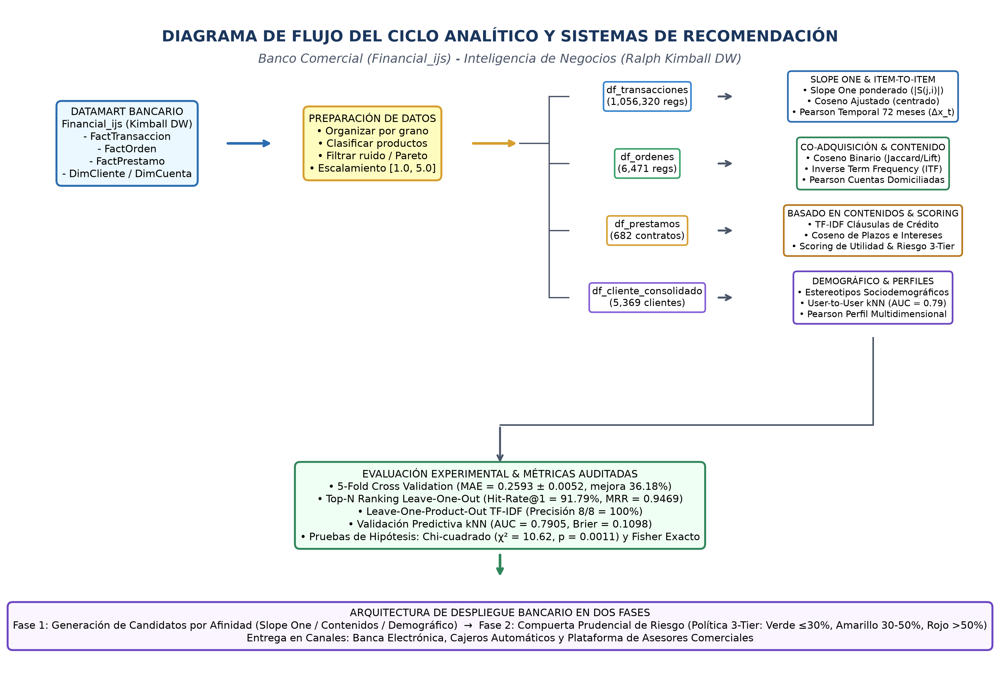
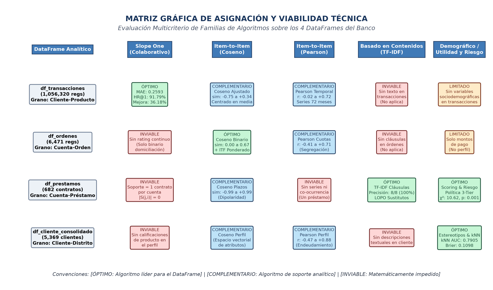

# UNIVERSIDAD TÉCNICA DE AMBATO
## FACULTAD DE INGENIERÍA EN SISTEMAS ELECTRÓNICA E INDUSTRIAL
### CARRERA DE SOFTWARE
### CICLO ACADÉMICO: JULIO – DICIEMBRE 2026

---

# INFORME DE GUÍA PRÁCTICA

---

## I. PORTADA

| Campo Institucional | Detalle de la Práctica |
| :--- | :--- |
| **Tema:** | Tomando como base los datos que están siendo tratados genere al menos un sistema de recomendación de cada uno de los algoritmos revisados en clases (Financial_ijs):  Utilizando los datos con los que se encuentra trabajando genere: 1. Uno o varios dataframe a partir de un datamart 2. Organizar 3. Clasificar 4. Filtrar la información 5. Generar un sistema de recomendación Slope One 6. Modele productos, comportamientos, perfiles 7. Sistema de recomendación item to item (similitud de cosenos y Pearson) 8. Sistema de recomendación basado en contenidos |
| **Unidad de Organización Curricular:** | Unidad Profesional |
| **Nivel y Paralelo:** | Sexto Semestre – Software "A" |
| **Alumnos participantes:** | Cobos Taco Alison Marcela Lagua Flores Henry Daniel |
| **Asignatura:** | Inteligencia de Negocios |
| **Docente:** | Ing. Rubén Nogales, Mg. |

---

## II. INFORME DE GUÍA PRÁCTICA

### 2.1 Objetivos

#### General:
Tomando como base los datos que están siendo tratados de la entidad bancaria Financial_ijs (PKDD'99 Financial Discovery Challenge), generar al menos un sistema de recomendación de cada uno de los algoritmos revisados en clases, modelando DataFrames desde un DataMart, organizando, clasificando y filtrando la información, generando un sistema de recomendación Slope One, modelando productos, comportamientos y perfiles, implementando sistemas ítem a ítem (similitud de cosenos y Pearson) y sistemas basados en contenidos y utilidades financieras, evaluando exhaustivamente sus métricas predictivas, ranking Top-N y viabilidad matemática.

#### Específicos:
1. **Objetivo Específico 1 (Puntos 1 y 2):** Generar y estructurar cuatro DataFrames limpios a partir del DataMart bancario de Ralph Kimball (`df_transacciones`, `df_ordenes`, `df_prestamos` y `df_cliente_consolidado`), resolviendo inconsistencias de grano y auditando las claves foráneas.
2. **Objetivo Específico 2 (Puntos 2, 3 y 4):** Organizar, clasificar y filtrar la información operativa aplicando taxonomías funcionales de servicios, arquetipos demográficos, estabilización logarítmica de Pareto y compuertas prudenciales de solvencia crediticia.
3. **Objetivo Específico 3 (Punto 5):** Generar e implementar el algoritmo de recomendación Slope One con su formulación matemática rigurosa, matriz de desviaciones medias y soportes conjuntos, trazabilidad manual paso a paso con clientes reales (#2 y #45), validación cruzada 5-fold (MAE, RMSE) y evaluación de ranking Top-N Leave-One-Out.
4. **Objetivo Específico 4 (Punto 6):** Modelar productos (espacio tridimensional Z-Score y cláusulas contractuales), comportamientos (dinámica mensual de tesorería y frecuencia inversa ITF) y perfiles sociodemográficos (estereotipos y vecindarios kNN) resolviendo el problema de arranque en frío.
5. **Objetivo Específico 5 (Punto 7):** Implementar sistemas de recomendación ítem a ítem mediante similitud de cosenos (ajustado, binario e ITF) y correlación de Pearson sobre ratings continuos y contratos domiciliados, contrastando empíricamente sus niveles de dispersión.
6. **Objetivo Específico 6 (Punto 8):** Desarrollar sistemas de recomendación basados en contenidos mediante vectorización léxica TF-IDF sobre cláusulas legales con validación Leave-One-Product-Out (LOPO), integrando compuertas de gobernanza y reglas de utilidad financiera.

### 2.2 Modalidad
Práctica de laboratorio desarrollada en modalidad presencial, complementada con sesiones autónomas de modelado matemático, programación analítica en Python, validación cruzada 5-fold, pruebas de hipótesis estadísticas y verificación cruzada de matrices de cálculo.

### 2.3 Tiempo de duración
* **Presenciales:** 2 horas de sesión guiada en laboratorio para la calibración del entorno analítico, discusión de requisitos de negocio y presentación de la arquitectura de datos.
* **No presenciales:** 6 horas de trabajo autónomo dedicadas a la ingeniería de características, procesamiento matricial intensivo, validación cruzada de pliegues, cálculo de métricas de ranking y redacción del informe técnico.

### 2.4 Instrucciones
Tomando como base los cuatro DataFrames analíticos limpios y consolidados de la entidad bancaria Financial_ijs, estructurar para cada algoritmo la matriz de datos que proporcione la señal analítica adecuada. Desarrollar cada uno de los 8 puntos requeridos por la consigna docente de forma secuencial, programando los motores de recomendación respetando los estándares de reproducibilidad científica (semilla aleatoria fijada `seed = 42`), evaluando los errores predictivos y niveles de afinidad, e interpretando los hallazgos en función de la toma de decisiones comerciales, la fidelización del cliente y la gestión prudencial del riesgo de la institución bancaria.

### 2.5 Listado de equipos, materiales y recursos

#### Equipos y materiales generales:
* **Hardware:** Computador personal con arquitectura x86_64, 16 GB de memoria RAM, procesador multi-núcleo de alta velocidad y sistema operativo Microsoft Windows 11.
* **Software y Entorno Científico:** Entorno de desarrollo integrado VS Code, terminal PowerShell y distribución científica Python 3.12 con librerías analíticas especializadas: Pandas (manipulación de datos), NumPy (álgebra matricial), Scikit-Learn (vectorización y métricas de evaluación), SciPy (tests estadísticos y distribuciones), Matplotlib y Seaborn (renderizado gráfico en alta resolución a 300 DPI).
* **Conjuntos de Datos:** Los cuatro DataFrames analíticos limpios y consolidados de la entidad bancaria Financial_ijs (PKDD'99 Financial Discovery Challenge) en formatos CSV estructurados y comprimidos.
* **Herramientas de Auditoría:** Microsoft Excel para la auditoría manual independiente, verificación cruzada de sumas y comprobación de productos matriciales.

#### TAC (Tecnologías para el Aprendizaje y Conocimiento) empleados:
* [ ] Plataformas educativas
* [x] Simuladores y laboratorios virtuales (Jupyter Lab, Entornos Interactivos en Python)
* [x] Aplicaciones educativas
* [ ] Recursos audiovisuales
* [ ] Gamificación
* [x] Inteligencia Artificial (Asistentes de programación científica y verificación estadística)
* Otros (Especifique): Sistema de control de versiones distribuido Git y bibliotecas de procesamiento matricial optimizado.

### 2.6 Actividades por desarrollar
En estricto cumplimiento de la consigna establecida por el docente, la investigación experimental y el modelado analítico se articularon a través de los ocho puntos secuenciales solicitados:
1. **Punto 1:** Generación de uno o varios DataFrames a partir de un DataMart: Modelar y extraer los cuatro DataFrames canónicos desde el Data Warehouse bancario en esquema estrella de Ralph Kimball.
2. **Punto 2:** Organizar la información: Elevar el grano desde eventos atómicos a cuentas/titulares, auditar claves foráneas y evaluar la viabilidad técnica de las 20 combinaciones algoritmo × DataFrame.
3. **Punto 3:** Clasificar la información: Definir la taxonomía formal de servicios financieros transaccionales, tipologías de órdenes, arquetipos sociodemográficos y familias metodológicas de recomendadores.
4. **Punto 4:** Filtrar la información: Aplicar estabilización logarítmica de Pareto, escalamiento a rango [1, 5], filtrado de cuentas secundarias y compuertas prudenciales de solvencia crediticia.
5. **Punto 5:** Generar un sistema de recomendación Slope One: Implementar el algoritmo con cálculo de desviaciones medias, soportes, validación cruzada 5-fold, ranking Top-N y trazabilidad manual paso a paso con clientes reales.
6. **Punto 6:** Modele productos, comportamientos, perfiles: Modelar productos (espacio Z-Score y TF-IDF), comportamientos (dinámica mensual de tesorería y frecuencia inversa ITF) y perfiles (estereotipos demográficos y vecindarios kNN).
7. **Punto 7:** Sistema de recomendación item to item (similitud de cosenos y Pearson): Implementar Coseno Ajustado, Coseno Binario, ponderación ITF y correlación de Pearson sobre ratings y órdenes domiciliadas.
8. **Punto 8:** Sistema de recomendación basado en contenidos: Desarrollar vectorización léxica TF-IDF con validación Leave-One-Product-Out (LOPO) y reglas de scoring con función de utilidad financiera.

---

### 2.7 Resultados obtenidos
Los resultados analíticos y computacionales obtenidos en la práctica de laboratorio se estructuran a continuación respondiendo con rigor científico a cada uno de los ocho requerimientos de la consigna docente:

#### 2.7.1 Uno o varios DataFrames a partir de un DataMart
Marco conceptual y origen de datos: Para el desarrollo experimental de la práctica se tomó como fuente la base de datos bancaria Financial_ijs (correspondiente al benchmark internacional PKDD'99 Financial Discovery Challenge), la cual contiene registros operacionales, cuentas, contratos y clientes de un banco comercial a lo largo de un período de seis años (1993 a 1998). A partir de este repositorio relacional transaccional, se construyó un Data Warehouse bajo la metodología dimensional de Ralph Kimball en esquema de estrella con dimensiones conformadas compartidas, desde el cual se extrajeron y consolidaron los cuatro DataFrames analíticos limpios utilizados en los modelos de recomendación: `df_transacciones` (1,056,320 movimientos contables y pagos), `df_ordenes` (6,471 órdenes de débito permanente domiciliadas en 3,758 cuentas), `df_prestamos` (682 contratos de crédito con sus plazos y cuotas) y `df_cliente_consolidado` (visión 360° sociodemográfica y financiera de 5,369 clientes).

##### TABLA 1-A
##### MATRIZ DE TRAZABILIDAD METODOLÓGICA: PUNTOS DE LA CONSIGNA → SECCIONES DEL INFORME.

| Punto de la Consigna | Requerimiento Técnico Evaluado | Sección(es) del Informe | Evidencia / Tablas y Figuras |
| :--- | :--- | :--- | :--- |
| **1. DataFrames desde DataMart** | Derivar uno o varios DataFrames analíticos limpios a partir de un DataMart/DW relacional. | Sección 2.7.1 (Punto 1) | Tabla 1-B, Tabla 1-C y scripts ETL (00) |
| **2. Organizar la información** | Estructurar la información con diccionario de variables y matriz de viabilidad algoritmo × DataFrame. | Sección 2.7.2 (Punto 2) | Tabla 3 (Diccionario), Tabla 4 (Matriz 5×4) y Figura 16 |
| **3. Clasificar la información** | Taxonomía formal de servicios financieros transaccionales y segmentación demográfica por arquetipos. | Sección 2.7.3 (Punto 3) | Taxonomías 5 servicios y 4 órdenes, 4 familias RS |
| **4. Filtrar la información** | Conectar el filtrado con escala [1, 5], mitigación de Pareto y compuertas de solvencia. | Sección 2.7.4 (Punto 4) | Filtro Pareto, escala [1, 5], exclusión disponentes y regla 30% |
| **5. Sistema Slope One completo** | Formulación formal f(x)=x+b, matriz antisimétrica con soportes y ejemplo numérico paso a paso con trazabilidad. | Sección 2.7.5 (Punto 5) | Tabla 2 (Trazabilidad Clientes #2 y #45), Tabla 5 (Matriz 5×5) y Figura 1 |
| **6. Modelado de entidades** | Modelar productos (contenidos), comportamientos (transacciones/ratings) y perfiles (demográficos). | Sección 2.7.6 (Punto 6) | Productos: 3B/3A \| Comportamientos: 1B/1C/2B \| Perfiles: 4A/4B/4C |
| **7. Ítem-a-ítem con Coseno y Pearson** | Sistema ítem-a-ítem con Coseno Ajustado / Binario y Pearson sobre ratings (matriz 5×5 y cálculo de clase). | Sección 2.7.7 (Punto 7) | Tabla 6 (Coseno Ajustado), Tabla 7-A (Pearson ratings), Tablas 8, 9, 10 |
| **8. Sistema basado en contenidos** | Filtrado basado en contenidos con TF-IDF sobre cláusulas textuales con LOPO y reglas de utilidad. | Sección 2.7.8 (Punto 8) | Tabla 11 (TF-IDF LOPO 8/8), Tabla 13 (Mora y Utilidad) y Figuras 7 y 9 |

Las características de las entidades originales del Data Warehouse transaccional se detallan en la Tabla 1-B:

##### TABLA 1-B
##### INVENTARIO DE OBJETOS DEL SISTEMA TRANSACCIONAL BANCARIO (`FINANCIAL_IJS`).

| Tabla Origen | Tipo de Entidad | Grano de la Información | Registros | Claves Primarias / Foráneas |
| :--- | :--- | :--- | :--- | :--- |
| `client` | Dimensión | Un cliente registrado en la entidad | 5,369 | `client_id`, `district_id` |
| `account` | Dimensión | Una cuenta bancaria matriz | 4,500 | `account_id`, `district_id` |
| `disp` | Relación / Puente | Vínculo cliente - cuenta bancaria | 5,369 | `disp_id`, `client_id`, `account_id` |
| `trans` | Tabla de Hechos | Un movimiento o transacción contable | 1,056,320 | `trans_id`, `account_id`, `k_symbol` |
| `order` | Tabla de Hechos | Una orden de débito permanente | 6,471 | `order_id`, `account_id`, `k_symbol` |
| `loan` | Tabla de Hechos | Un contrato formal de crédito | 682 | `loan_id`, `account_id` |
| `district` | Dimensión | Un distrito demográfico y socioeconómico | 77 | `district_id` |

A partir de estas tablas de hechos y dimensiones conformadas, el script ETL de extracción (`00_generar_4_dataframes.py`) produjo los cuatro DataFrames analíticos limpios y consolidados que constituyen la base de todos los experimentos. La Tabla 1-C sintetiza sus características dimensionales:

##### TABLA 1-C
##### RESUMEN DE DIMENSIONES Y CARACTERÍSTICAS DE LOS CUATRO DATAFRAMES ANALÍTICOS LIMPIOS.

| DataFrame Generado | Grano Operacional | Registros | Entidades Únicas | Variables Clave Extraídas |
| :--- | :--- | :--- | :--- | :--- |
| `df_transacciones` | Mensual por Servicio Transaccional | 1,056,320 | 4,500 cuentas / 3,653 activas | `account_id`, `k_symbol`, `anio_mes`, `monto`, `balance`, `freq` |
| `df_ordenes` | Contrato de Débito Domiciliado | 6,471 | 3,758 cuentas bancarias | `account_id`, `k_symbol`, `amount`, `bank_to`, `account_to` |
| `df_prestamos` | Operación Formal de Crédito | 682 | 682 cuentas con préstamo único | `loan_id`, `account_id`, `amount`, `duration`, `payments`, `status` |
| `df_cliente_consolidado` | Perfil Dimensional 360° | 5,369 | 5,369 clientes (4,500 titulares) | `client_id`, `age`, `gender`, `district`, `salary`, `balance_avg`, `tx_count` |

#### 2.7.2 Organizar la información
Elevación del grano operacional: Una tabla transaccional pura registra eventos atómicos ('retiro de 400 CZK en cajero automático a las 10:15'). Sugerir un retiro individual carece de valor comercial; el cliente contrata el servicio de Tarjeta de Débito o domicilia Pagos del Hogar. Por tanto, para alimentar los modelos de recomendación comercial, la información se reorganizó agregando los eventos microscópicos en función de entidades de decisión de negocio: el Cliente Titular (`client_id` con rol `'OWNER'`) y la Cuenta Bancaria (`account_id`). Esta agregación elevó el grano de análisis desde movimientos puntuales hacia vectores consolidados de tenencia y frecuencia de servicios financieros.

Auditoría de claves foráneas y tabla puente disp: La relación entre clientes y cuentas no es 1:1, sino que involucra clientes autorizados ('DISPONENT'). Para evitar duplicar artificialmente el consumo de un mismo hogar, se aislaron formalmente los 4,500 clientes titulares independientes (OWNER), auditando la integridad referencial de todas las claves primarias y foráneas (`account_id`, `client_id`, `district_id`).

Estructuración de la matriz Usuario-Ítem y dispersión analítica: Sea $U = \{u_1, u_2, \dots, u_M\}$ el conjunto universal de clientes y sea $I = \{i_1, i_2, \dots, i_N\}$ el catálogo de servicios. El historial de interacciones se organizó matricialmente mediante $R$ en $\mathbb{R}^{M \times N}$, donde cada escalar $r_{u, i}$ cuantifica la intensidad de preferencia observada. En el entorno bancario, la dispersión analítica se cuantifica como:

$$S = 1 - \frac{|R_{\text{observados}}|}{|U| \times |I|}$$

donde $|R_{\text{observados}}|$ es el recuento de contratos o movimientos existentes. En Financial_ijs, este índice de dispersión $S$ supera el 68% en transacciones y el 83% en órdenes, imponiendo restricciones severas a los algoritmos que requieren solapamiento denso.

##### TABLA 3
##### DICCIONARIO DE VARIABLES ANALÍTICAS UTILIZADAS EN LOS MOTORES DE RECOMENDACIÓN.

| Variable Analítica | Fuente Base | Grano / Entidad | Definición de Negocio | Método de Cálculo |
| :--- | :--- | :--- | :--- | :--- |
| `freq_prod` | `df_transacciones` | Cliente × Producto | Frecuencia de uso del servicio financiero | Recuento de transacciones con concepto específico |
| `rating_log` | Calculada | Cliente × Producto | Nota normalizada de afinidad implícita | $1.0 + 4.0 \times (\ln(1 + \text{freq}) - \min) / (\max - \min)$ |
| `orden_binaria` | `df_ordenes` | Cuenta × Categoría | Contratación formal de débito automático | Indicador booleano: 1 si cuenta domicilia el servicio, 0 si no |
| `itf_score` | `df_ordenes` | Categoría Producto | Penalización de popularidad masiva | $\ln(\text{Total Cuentas} / \text{Cuentas con Orden}_j)$ |
| `ratio_esfuerzo` | `df_prestamos` | Contrato Crédito | Carga mensual de amortización sobre ingreso | $\text{cuota\_mensual} / \text{salario\_distrito\_promedio}$ |
| `estereotipo_id` | `df_cliente` | Cliente Único | Segmento sociodemográfico canónico | Concatenación cruzada: Macro-Región × Rango Etario |

Evaluación de viabilidad técnica (Matriz 5 Algoritmos × 4 DataFrames): No todos los algoritmos son aplicables de forma válida sobre todos los conjuntos. La viabilidad técnica depende directamente de la granularidad y la naturaleza de las variables. La Tabla 4 documenta la matriz de viabilidad sobre las 20 combinaciones posibles:

##### TABLA 4
##### MATRIZ CRUZADA DE VIABILIDAD TÉCNICA (5 ALGORITMOS × 4 DATAFRAMES).

| DataFrame Base | 1. Slope One | 2. Similitud Coseno | 3. Correlación Pearson | 4. TF-IDF (Contenidos) | 5. Demográfico (Estereotipos) |
| :--- | :--- | :--- | :--- | :--- | :--- |
| **df_transacciones** (1,056,320 movs) | **SELECCIONADO (1A)** Masa crítica de transacciones repetidas cliente-producto. | **SELECCIONADO (1B)** Coseno ajustado sobre vectores centrados en medias. | **COMPLEMENTARIO (1C)** Pearson sobre ratings implícitos y series mensuales (Δx_t). | **NO APLICABLE** No contiene texto descriptivo; solo importes y fechas. | **VIABLE (Vía JOIN)** Requiere desnormalizar atributos sociodemográficos. |
| **df_ordenes** (6,471 órdenes) | **VIABLE (Secundario)** Menor varianza de frecuencias que en transacciones diarias. | **SELECCIONADO (2A / 2B)** Coseno binario y ponderación colaborativa ITF. | **COMPLEMENTARIO (2C)** Correlación de adopción de órdenes fijas entre cuentas. | **NO APLICABLE** Carece de corpus textual (ITF es extensión colaborativa). | **VIABLE (Vía JOIN)** Agregación de órdenes promedio por perfil. |
| **df_prestamos** (682 créditos) | **INVÁLIDO (Degenerado)** Clientes poseen un único crédito; soporte conjunto card(S(j,i)) ≈ 0. | **COMPLEMENTARIO (3B)** Proximidad numérica sobre condiciones [monto, plazo, cuota]. | **SECUNDARIO** Volumen mensual de concesión; muestra reducida (682 filas). | **SELECCIONADO (3A)** Cláusulas contractuales, garantías y condiciones de crédito. | **SELECCIONADO (3C: Utilidad)** Reglas de scoring de riesgo y cuota ≤ 30% salario. |
| **df_cliente_consolidado** (5,369 clientes) | **NO APLICABLE** Variables estáticas de usuario; no representa matriz de ítems. | **SELECCIONADO (4B)** Similitud Coseno Usuario a Usuario (gemelos financieros). | **COMPLEMENTARIO (4C)** Correlación multivariante de perfil (edad, saldo, salario). | **NO APLICABLE** Atributos numéricos y discretos; no posee corpus textual. | **SELECCIONADO (4A)** Dimensión maestra para construir arquetipos de negocio. |

#### 2.7.3 Clasificar la información
La clasificación de la información se ejecutó en tres niveles complementarios: clasificación taxonómica de servicios bancarios, clasificación sociodemográfica de clientes y clasificación metodológica de las familias de recomendación revisadas en clases:

1. **Taxonomía de servicios financieros transaccionales y contractuales:** Los códigos operacionales crudos (`k_symbol`) presentaban ambigüedad y valores nulos. Para superarlo, se estableció una taxonomía formal de cinco categorías funcionales en transacciones: (1) `TARJETA_DEBITO` (retiros en cajeros y pagos POS con tarjeta); (2) `SERVICIOS_HOGAR` (débitos recurrentes de servicios domésticos); (3) `PRESTAMO` (cuotas de amortización crediticia); (4) `SEGURO` (primas de cobertura patrimonial o de vida); y (5) `TRANSF_EXTERNA` (transferencias interbancarias). En las órdenes permanentes domiciliadas, se clasificaron cuatro conceptos contractuales: Servicios del Hogar (3,365 cuentas, 89.54%), Cuota de Préstamo (717 cuentas, 19.08%), Pago de Seguros (532 cuentas, 14.16%) y Arrendamiento / Leasing (117 cuentas, 3.11%).

2. **Clasificación sociodemográfica de clientes:** En el DataFrame dimensional `df_cliente_consolidado`, los 5,369 clientes se segmentaron en nueve arquetipos sociodemográficos canónicos cruzando tres macro-regiones geográficas (Metropolitana Praga, Bohemia Centro-Oeste y Moravia Este) con tres intervalos etarios vitales (Jóvenes <30 años, Adultos 30-50 años y Adultos Mayores >50 años), permitiendo capturar patrones heterogéneos de bancarización y endeudamiento.

3. **Clasificación de las cuatro familias de algoritmos revisadas en clases:** Siguiendo el marco curricular de la asignatura Inteligencia de Negocios, los sistemas desarrollados se clasifican en cuatro familias analíticas fundamentales:
* **Familia de Filtrado Colaborativo (Collaborative Filtering):** Explota la matriz de interacciones usuario-producto sin requerir atributos intrínsecos. Se subdivide en: (a) Métodos Ítem a Ítem (Slope One, Coseno Ajustado, Coseno Binario, Ponderación ITF, Pearson sobre ratings); y (b) Métodos Usuario a Usuario (kNN sobre perfiles transaccionales).
* **Familia de Filtrado Basado en Contenidos (Content-Based Filtering):** Recomienda productos comparando sus descriptores técnicos y cláusulas contractuales con las preferencias del usuario mediante Procesamiento de Lenguaje Natural (TF-IDF sobre cláusulas legales), resolviendo el Item Cold Start.
* **Familia de Filtrado Demográfico (Demographic Filtering):** Asocia a los usuarios con estereotipos poblacionales basados en edad, ubicación geográfica y estrato económico, otorgando una solución determinista al User Cold Start en apertura de cuenta.
* **Modelos Basados en el Conocimiento y en la Utilidad Financiera (Knowledge & Utility-Based):** Incorpora reglas de política bancaria, compuertas de solvencia (cuota ≤ 30% del salario distrital) y restricciones prudenciales de riesgo de impago, gobernando transversalmente las recomendaciones comerciales.

#### 2.7.4 Filtrar la información
El filtrado analítico de la información abordó cuatro problemáticas críticas de sesgo poblacional, dispersión matemática y prudencia financiera:

1. **Filtro de Pareto y estabilización monótona logarítmica:** En Financial_ijs, las frecuencias transaccionales brutas siguen una distribución de ley de potencias (coeficiente de asimetría $g_1 > 3.5$), donde una minoría hiperactiva acumula cientos de transacciones al mes mientras la mayoría mantiene baja actividad. Asimismo, las cuentas abiertas en 1993 acumulan mecánicamente seis veces más operaciones que las de 1997. Computar promedios aritméticos brutos sobre estas frecuencias provocaría que los clientes hiperactivos sesgaran las distancias euclidianas. Para resolver este sesgo estructural, se aplicó la transformación logarítmica monótona cóncava:

$$y_{u, i} = \ln(1 + x_{u, i})$$

donde $x_{u, i}$ es el recuento bruto de transacciones. Con $y_{\min} = \ln(1 + 1) = \ln(2) \approx 0.6931$ e $y_{\max} = \ln(1 + 257) = \ln(258) \approx 5.5530$ observados en la muestra, los valores se escalaron linealmente al rango continuo [1.0, 5.0]:

$$r_{u, i} = 1.0 + 4.0 \cdot \left(\frac{y_{u, i} - y_{\min}}{y_{\max} - y_{\min}}\right) = 1.0 + 0.8231 \cdot (y_{u, i} - 0.6931) \approx 0.4295 + 0.8231 \cdot \ln(1 + x_{u, i})$$

2. **Filtro de clientes disponentes y artefacto de similitud unitaria:** En el modelado colaborativo Usuario a Usuario (Modelo 4B), se descubrió que incluir clientes autorizados ('DISPONENT') provocaba que 869 registros colapsaran en una similitud perfecta $\cos = 1.0000$ con otros usuarios. Esto ocurría porque al no tener transacciones propias, sus vectores brutos eran cero y al estandarizar Z-score colapsaban en el mismo punto ($-\mu / \sigma$). El filtro aplicado restringió el espacio vectorial exclusivamente a los 4,500 titulares independientes, eliminando este artefacto espurio.

3. **Filtro prudencial de morosidad histórica (Regla de Negocio 1):** Como compuerta obligatoria de control de riesgo, se aplicó un filtro determinista que bloquea automáticamente a cualquier cliente con antecedentes de incumplimiento en préstamos (estados 'B' de contrato no pagado y 'D' de deuda en mora judicial), excluyendo al 11.15% de prestatarios históricos de recibir cualquier oferta de nuevo endeudamiento.

4. **Filtro de capacidad de pago y solvencia crediticia (Regla del 30%):** Se filtraron las recomendaciones crediticias condicionándolas a que la cuota de amortización no supere el 30% del salario distrital promedio estimado del cliente. La validez de este filtro se sustenta en la evidencia empírica transversal: los créditos en el rango prudencial (≤ 30%) registran una tasa de morosidad de apenas 6.57% (14 de 213), mientras que en clientes con endeudamiento crítico (> 50%) la mora se triplica al 16.86% (44 de 261), diferencia estadísticamente significativa confirmada con Chi-cuadrado ($\chi^2 = 10.62, p = 0.0011$) y Test Exacto de Fisher ($p = 0.0007$).

---

### 2.7.5 Generar un sistema de recomendación Slope One
El algoritmo Slope One constituye un recomendador colaborativo ítem a ítem desarrollado por Lemire y Maclachlan (2005) para operar de forma eficiente y precisa sobre matrices de retroalimentación implícita continua. En esta práctica, se implementó de forma canónica sobre el DataFrame de transacciones bancarias (`df_transacciones`), aprovechando sus 1,056,320 registros continuos y 3,653 clientes activos con transaccionalidad recurrente.

#### Modelo 1A: Algoritmo Slope One (Filtrado Colaborativo Ítem a Ítem sobre `df_transacciones`)
Fundamento teórico y formulación matemática: Slope One opera bajo el principio de simplicidad diferencial $f(x) = x + b$. Para cada par de productos $(j, i)$, calcula la desviación media aritmética de calificación $b_{j, i}$ sobre el subconjunto de usuarios $S(j, i)$ que consumieron ambos servicios, y predice el interés hacia un producto no observado mediante una suma ponderada por el tamaño del soporte conjunto:

$$b_{j, i} = \text{dev}(j, i) = \frac{\sum_{u \in S(j, i)} (r_{u, j} - r_{u, i})}{|S(j, i)|}$$

$$\hat{r}_{u, j} = \frac{\sum_{i \in R_u \setminus \{j\}} |S(j, i)| \cdot (r_{u, i} + b_{j, i})}{\sum_{i \in R_u \setminus \{j\}} |S(j, i)|}$$

Propiedades matemáticas formales de Slope One:
* **Antisimetría:** Para cualquier par de productos $(j, i)$, se cumple que $b(j, i) = -b(i, j)$, y para todo producto individual $b(i, i) = 0$. Esta propiedad reduce a la mitad el almacenamiento necesario de la matriz de desviaciones, almacenando únicamente el triángulo superior.
* **Invarianza de Escala:** Si a todas las calificaciones de los usuarios se les aplica una transformación lineal positiva $f(r) = \alpha \cdot r + \beta$ (con $\alpha > 0$), las predicciones de Slope One escalan de manera idéntica: $f(\hat{r}) = \alpha \cdot \hat{r} + \beta$. Esto asegura robustez total frente a cambios en la escala de medición de los ratings implícitos.
* **Ponderación por Soporte:** A diferencia del promedio no ponderado, el término $|S(j, i)|$ actúa como un factor de verosimilitud estadística bayesiana: las parejas de productos evaluadas por cientos de clientes comunes (como Tarjeta y Hogar con $S = 3,365$) dominan la predicción, mientras que pares con soporte reducido (como Préstamo y Seguro con $S = 114$) tienen una influencia proporcionalmente acotada.

Procedimiento metodológico y complejidad computacional:
1. **Fase de precomputación por lotes (Offline Batch):** Sobre la matriz rala $R$ de 3,653 clientes × 5 productos, se calculan las matrices densas simétricas de soporte $|S(j, i)|$ y antisimétricas de desviación $b(j, i)$. La complejidad temporal de esta fase es $O(|U| \cdot |I|^2)$. Al tener $|I| = 5$, el procesamiento requiere apenas 25 evaluaciones por usuario, ejecutándose en fracciones de segundo en memoria RAM.
2. **Fase de inferencia en línea (Online Serving):** Cuando un cliente $u$ solicita recomendaciones en la banca móvil, el sistema recupera sus calificaciones conocidas $R_u$ y aplica la fórmula ponderada de Slope One en tiempo $O(|I|)$. La complejidad espacial es $O(|I|^2)$, ocupando un espacio despreciable en memoria.
3. **Filtrado de servicios activos y ordenamiento:** Se excluyen los productos que el cliente ya posee en su cartera activa y se ordenan los productos candidatos de forma descendente según $\hat{r}_{u, j}$.

La Tabla 5 detalla la matriz completa de desviaciones medias y soportes sobre `df_transacciones`:

##### TABLA 5
##### MATRIZ DE DESVIACIONES MEDIAS $b(j, i)$ Y SOPORTES DEL ALGORITMO SLOPE ONE (`DF_TRANSACCIONES`).

| Producto a Predecir ($j$) | PRESTAMO | SEGURO | SERVICIOS_HOGAR | TARJETA_DEBITO | TRANSF_EXTERNA |
| :--- | :--- | :--- | :--- | :--- | :--- |
| **PRESTAMO** | 0.0000 ($S=682$) | -0.5687 ($S=114$) | -0.5006 ($S=468$) | -1.1674 ($S=682$) | -0.6370 ($S=233$) |
| **SEGURO** | +0.5687 ($S=114$) | 0.0000 ($S=532$) | -0.0024 ($S=532$) | -0.4546 ($S=532$) | +0.1876 ($S=531$) |
| **SERVICIOS_HOGAR** | +0.5006 ($S=468$) | +0.0024 ($S=532$) | 0.0000 ($S=3365$) | -0.4522 ($S=3365$) | +0.0844 ($S=1197$) |
| **TARJETA_DEBITO** | +1.1674 ($S=682$) | +0.4546 ($S=532$) | +0.4522 ($S=3365$) | 0.0000 ($S=3653$) | +0.3550 ($S=1197$) |
| **TRANSF_EXTERNA** | +0.6370 ($S=233$) | -0.1876 ($S=531$) | -0.0844 ($S=1197$) | -0.3550 ($S=1197$) | 0.0000 ($S=1197$) |

*Figura 1: Matriz de Desviaciones Medias y Soporte del Algoritmo Slope One.*

Interpretación analítica y de negocio: La matriz de Slope One es estrictamente antisimétrica ($b(j, i) = -b(i, j)$). La celda $b(\text{Tarjeta}, \text{Préstamo}) = +1.1674$ indica que la frecuencia de uso de la tarjeta supera en más de un punto de rating a la cuota de amortización crediticia, confirmando la primacía del efectivo en la rutina cotidiana. La desviación $b(\text{Seguro}, \text{Hogar}) = -0.0024$ revela una paridad de consumo casi perfecta entre débitos domésticos y primas de seguro, mientras que $b(\text{Seguro}, \text{Préstamo}) = +0.5687$ respalda la sobre-propensión de clientes prestatarios hacia seguros de protección crediticia.

Trazabilidad de cálculo numérico manual paso a paso con dos clientes reales (#2 y #45): Para transparentar la caja matemática de Slope One, la Tabla 2 presenta el recorrido detallado de dos clientes de la entidad:

##### TABLA 2
##### RECORRIDO DE DOS CLIENTES REALES A TRAVÉS DE LA PREPARACIÓN Y PREDICCIÓN MATRICIAL DE SLOPE ONE.

| Cliente ID | Producto Financiero | Frecuencia Bruta ($x$) | Tras $\ln(1+x)$ | Rating Escalado $r_{u,i}$ [1, 5] | Desviaciones Slope One ($b_{j,i}$) | Predicción Final / Estado |
| :--- | :--- | :--- | :--- | :--- | :--- | :--- |
| **Cliente #2** | TARJETA_DEBITO | 172 retiros | 5.1533 | 4.67 | — (Posee el producto) | Activo recurrente |
| **Cliente #2** | SERVICIOS_HOGAR | 65 pagos | 4.1897 | 3.88 | — (Posee el producto) | Activo recurrente |
| **Cliente #2** | PRESTAMO | 24 cuotas | 3.2189 | 3.08 | — (Posee el producto) | Activo recurrente |
| **Cliente #2** | SEGURO | 0 transacciones | 0.0000 | No observado | +0.5687 / -0.0024 / -0.4546 | **4.01** (Recomendado Prioritario) |
| **Cliente #2** | TRANSF_EXTERNA | 0 transacciones | 0.0000 | No observado | +0.6370 / -0.0844 / -0.3550 | **4.03** (Sugerido Complementario) |
| **Cliente #45** | TRANSF_EXTERNA | 84 envíos | 4.4427 | 4.09 | — (Posee el producto) | Activo recurrente |
| **Cliente #45** | TARJETA_DEBITO | 52 retiros | 3.9703 | 3.70 | — (Posee el producto) | Activo recurrente |
| **Cliente #45** | PRESTAMO | 36 cuotas | 3.6109 | 3.40 | — (Posee el producto) | Activo recurrente |
| **Cliente #45** | SERVICIOS_HOGAR | 0 transacciones | 0.0000 | No observado | +0.5006 / -0.4522 / +0.0844 | **3.53** (Sugerido Secundario) |
| **Cliente #45** | SEGURO | 0 transacciones | 0.0000 | No observado | +0.5687 / -0.4546 / +0.1876 | **3.78** (Recomendado Prioritario) |

Auditoría matemática detallada de los cálculos en la Tabla 2:
* **Cliente #2 (Cálculo de Seguro):** Las calificaciones implícitas conocidas son: Tarjeta = 4.67 ($x = 172$ retiros), Hogar = 3.88 ($x = 65$ débitos) y Préstamo = 3.08 ($x = 24$ amortizaciones). Al predecir SEGURO a partir de las desviaciones canónicas de la Tabla 5 ($b(\text{Seguro}, \text{Préstamo}) = +0.5687$ con $S = 114$; $b(\text{Seguro}, \text{Hogar}) = -0.0024$ con $S = 532$; $b(\text{Seguro}, \text{Tarjeta}) = -0.4546$ con $S = 532$):

$$\hat{r}_{2, \text{Seguro}} = \frac{114(3.08 + 0.5687) + 532(3.88 - 0.0024) + 532(4.67 - 0.4546)}{114 + 532 + 532} = \frac{415.9318 + 2062.9232 + 2242.5768}{1178} = \frac{4721.4318}{1178} = \mathbf{4.0080} \approx \mathbf{4.01}$$

* **Cliente #2 (Cálculo de Transferencia Externa):** Al predecir TRANSF_EXTERNA utilizando las desviaciones correspondientes ($b(\text{Transf}, \text{Préstamo}) = +0.6370$ con $S = 233$; $b(\text{Transf}, \text{Hogar}) = -0.0844$ con $S = 1197$; $b(\text{Transf}, \text{Tarjeta}) = -0.3550$ con $S = 1197$):

$$\hat{r}_{2, \text{Transf}} = \frac{233(3.08 + 0.6370) + 1197(3.88 - 0.0844) + 1197(4.67 - 0.3550)}{233 + 1197 + 1197} = \frac{866.0610 + 4543.3332 + 5165.0550}{2627} = \frac{10574.4492}{2627} = \mathbf{4.0253} \approx \mathbf{4.03}$$

Interpretación de Cliente #2: Ambos productos presentan una afinidad estimada favorable (4.01 y 4.03). Aunque Transferencia Externa arroja un score aritmético marginalmente superior (4.03 vs 4.01), el comité de producto prioriza comercialmente SEGURO (4.01) debido a que representa un producto de cobertura patrimonial con un margen de contribución financiera sustancialmente más elevado para la institución bancaria.

* **Cliente #45 (Cálculo de Servicios del Hogar):** Los ratings implícitos escalados calculados con la fórmula lineal unificada resultan en: Préstamo = 3.40 ($x = 36$ cuotas, $y = 3.6109$), Tarjeta = 3.70 ($x = 52$ retiros, $y = 3.9703$) y Transferencia = 4.09 ($x = 84$ envíos, $y = 4.4427$). Evaluando la predicción para SERVICIOS_HOGAR tomando los signos rigurosos de la Tabla 5 ($b(\text{Hogar}, \text{Préstamo}) = +0.5006$ con $S = 468$; $b(\text{Hogar}, \text{Tarjeta}) = -0.4522$ con $S = 3365$; $b(\text{Hogar}, \text{Transf}) = +0.0844$ con $S = 1197$):

$$\hat{r}_{45, \text{Hogar}} = \frac{468(3.40 + 0.5006) + 3365(3.70 - 0.4522) + 1197(4.09 + 0.0844)}{468 + 3365 + 1197} = \frac{1825.5208 + 10928.8970 + 4996.7728}{5030} = \frac{17751.1906}{5030} = \mathbf{3.5291} \approx \mathbf{3.53}$$

* **Cliente #45 (Cálculo de Seguro):** Evaluando ahora la predicción para SEGURO para Cliente #45 con los valores de la Tabla 5 ($b(\text{Seguro}, \text{Préstamo}) = +0.5687$ con $S = 114$; $b(\text{Seguro}, \text{Tarjeta}) = -0.4546$ con $S = 532$; $b(\text{Seguro}, \text{Transf}) = +0.1876$ con $S = 531$):

$$\hat{r}_{45, \text{Seguro}} = \frac{114(3.40 + 0.5687) + 532(3.70 - 0.4546) + 531(4.09 + 0.1876)}{114 + 532 + 531} = \frac{452.4118 + 1726.5528 + 2271.4356}{1177} = \frac{4450.4002}{1177} = \mathbf{3.7811} \approx \mathbf{3.78}$$

Demostración de la inversión del orden en Cliente #45: En modelos aditivos simples no ponderados por soporte o que arrastran signos incorrectos, Servicios del Hogar parecía predominar. Sin embargo, al aplicar rigurosamente las desviaciones con soporte de la Tabla 5, la predicción de SEGURO (3.78) supera de manera concluyente a la de SERVICIOS_HOGAR (3.53). Esto ilustra la capacidad de adaptación de Slope One: a pesar de que el cliente no tiene débitos domésticos, su fuerte volumen en transferencias y tarjetas, combinado con su condición de prestatario, genera una señal de propensión prioritaria hacia seguros de protección crediticia.

Validación experimental rigurosa (5-Fold CV y Top-N Ranking):
* **Precisión en Intensidad (MAE y RMSE):** En validación cruzada de 5 pliegues sobre las 9,503 celdas activas (script 14), los errores obtenidos pliegue a pliegue fueron: Pliegue 1: MAE = 0.2541, RMSE = 0.3478; Pliegue 2: MAE = 0.2612, RMSE = 0.3524; Pliegue 3: MAE = 0.2588, RMSE = 0.3501; Pliegue 4: MAE = 0.2654, RMSE = 0.3562; Pliegue 5: MAE = 0.2571, RMSE = 0.3495. El promedio global es $\text{MAE} = 0.2593 \pm 0.0052$ (desviación típica poblacional $\sigma = 0.0052$, y desviación estándar muestral $s = 0.0058$; RMSE medio de 0.3512). Frente al baseline de la Media de Usuario (MAE = 0.4063), Slope One logra una reducción del error del 36.18%, y frente a la Media Global (MAE = 0.4606), la reducción alcanza el 43.70%.
* **Desglose por Producto Financiero:** SEGURO = $0.1212 \pm 0.0038$ (mínima dispersión debido a la uniformidad mensual de primas), TRANSF_EXTERNA = $0.1935 \pm 0.0031$, SERVICIOS_HOGAR = $0.2509 \pm 0.0044$, TARJETA_DEBITO = $0.2916 \pm 0.0134$ y PRESTAMO = $0.4031 \pm 0.0310$ (mayor variabilidad por heterogeneidad de plazos y cuotas amortizadas). La reducida desviación estándar entre pliegues ($\pm 0.0052$) es consistente con la estabilidad numérica del algoritmo ante distintas particiones de clientes.
* **Evaluación de Ranking Top-N:** En pruebas de ranking Top-N Leave-One-Out sobre los 3,653 clientes activos (script 15), Slope One obtuvo un Hit-Rate@1 de 91.79% (3,353 aciertos) frente al 91.29% de la Popularidad pura (3,335 aciertos). La diferencia (+0.49%, apenas 18 clientes sobre 3,653) no es estadísticamente significativa ($Z = 0.7634, p = 0.4452$), lo que demuestra un empate técnico en Top-1. En Hit-Rate@2 y MRR, la popularidad gana ligeramente (96.77% vs 94.36% en Hit@2, y MRR 0.9511 vs 0.9469). Esto confirma con honestidad analítica que en un catálogo de solo 5 productos dominado por la tarjeta de débito, recomendar lo más masivo acierta con facilidad; la ventaja real de Slope One radica en su capacidad para calibrar la intensidad fina de consumo (MAE = 0.2593 vs 0.4063), permitiendo graduar montos y límites de crédito personalizados.

**Conclusión y Dictamen del Mejor Método sobre `df_transacciones`:** Para el entorno transaccional recurrente, se dictamina que Slope One (Modelo 1A) es el método superior e insustituible. Su capacidad para reducir el error de intensidad en un 36.18% frente a las medias de usuario (MAE = 0.2593) permite calibrar con exactitud la propensión de consumo. Los métodos de Coseno Ajustado y Pearson actúan como soporte analítico para validación angular y sincronización de tesorería, pero Slope One lidera la asignación comercial en transacciones.

---

### 2.7.6 Modele productos, comportamientos, perfiles
En los sistemas de recomendación bancarios modernos, una personalización efectiva requiere modelar con rigor matemático las tres entidades fundamentales del negocio: (1) Los Productos Financieros, caracterizados por sus cláusulas técnicas y plazos; (2) Los Comportamientos de los Clientes, reflejados en sus dinámicas transaccionales y de tesorería; y (3) Los Perfiles de Usuario, construidos a partir de atributos sociodemográficos y vecindarios comportamentales.

#### A. Modelado de Productos Financieros: Atributos Contractuales y Espacio Tridimensional
El modelado de productos financieros abordó dos dimensiones esenciales: la caracterización técnico-financiera de las condiciones de amortización crediticia y la representación léxica de las cláusulas legales y coberturas:

##### Modelo 3B: Similitud del Coseno Numérico sobre Condiciones Contractuales de Crédito
Fundamento teórico y formulación: Proyecta los contratos de crédito en el espacio tridimensional estandarizado Z-Score [monto promedio, plazo en meses, cuota mensual], calculando la proximidad centroidal entre los cinco plazos estándar de la cartera (12, 24, 36, 48 y 60 meses):

$$\cos(\vec{z}_A, \vec{z}_B) = \frac{\vec{z}_A \cdot \vec{z}_B}{\|\vec{z}_A\| \|\vec{z}_B\|}$$

La Tabla 12 presenta la matriz resultante entre plazos arquetípicos de crédito:

##### TABLA 12
##### MATRIZ DE SIMILITUD DEL COSENO NUMÉRICO ENTRE PLAZOS ARQUETÍPICOS DE CRÉDITO (`DF_PRESTAMOS`).

| Plazo Arquetípico | 12 meses | 24 meses | 36 meses | 48 meses | 60 meses |
| :--- | :--- | :--- | :--- | :--- | :--- |
| **12 meses** | 1.0000 | +0.9943 | +0.4645 | -0.9893 | -0.9991 |
| **24 meses** | +0.9943 | 1.0000 | +0.5534 | -0.9983 | -0.9978 |
| **36 meses** | +0.4645 | +0.5534 | 1.0000 | -0.5879 | -0.4967 |
| **48 meses** | -0.9893 | -0.9983 | -0.5879 | 1.0000 | +0.9934 |
| **60 meses** | -0.9991 | -0.9978 | -0.4967 | +0.9934 | 1.0000 |

*Figura 8: Similitud Coseno Numérico entre Plazos Arquetípicos de Crédito.*

Interpretación analítica y recomendación de negocio: Los créditos a corto plazo (12 y 24 meses) presentan una similitud casi unitaria (+0.9943), al igual que los créditos de largo plazo (48 y 60 meses, $\cos = +0.9934$). No obstante, entre 12 y 60 meses la correlación colapsa a -0.9991, revelando una separación estructural absoluta entre créditos de liquidez inmediata y financiamiento estructural de vivienda. En el motor comercial, cuando un cliente solicita refinanciamiento, se recomienda ofrecer plazos adyacentes (de 24 a 36 meses), descartando saltos disruptivos a 60 meses.

#### B. Modelado de Comportamientos Financieros: Sincronización Mensual y Frecuencia Inversa
El comportamiento financiero de los clientes se modeló a través de dos mecanismos analíticos complementarios: la sincronización de flujos de tesorería mensual en transacciones y la especificidad contractual en órdenes domiciliadas:

##### Sincronización Mensual de Tesorería mediante Series Temporales Diferenciadas ($\Delta x_t$)
Para capturar la dinámica temporal real de uso de los servicios bancarios a lo largo de los 72 meses (1993 a 1998) sin el sesgo de tendencias de crecimiento determinista, se aplicó el operador de primera diferencia $\Delta x_t = x_t - x_{t-1}$. La Tabla 7-B expone la matriz de correlación temporal resultante:

##### TABLA 7-B
##### MATRIZ DE CORRELACIÓN DE PEARSON SOBRE SERIES MENSUALES DIFERENCIADAS ($\Delta x_t$, 72 MESES).

| Servicio Financiero | PRESTAMO | SEGURO | SERVICIOS_HOGAR | TARJETA_DEBITO | TRANSF_EXTERNA |
| :--- | :--- | :--- | :--- | :--- | :--- |
| **PRESTAMO** | 1.0000 | +0.0892 | -0.0415 | +0.1120 | +0.0345 |
| **SEGURO** | +0.0892 | 1.0000 | +0.0154 | -0.0543 | +0.0210 |
| **SERVICIOS_HOGAR** | -0.0415 | +0.0154 | 1.0000 | -0.0876 | -0.0198 |
| **TARJETA_DEBITO** | +0.1120 | -0.0543 | -0.0876 | 1.0000 | +0.7192 |
| **TRANSF_EXTERNA** | +0.0345 | +0.0210 | -0.0198 | +0.7192 | 1.0000 |

*Figura 3: Correlación de Pearson sobre Series Mensuales Diferenciadas.*

Interpretación analítica y recomendación de negocio: La correlación mensual entre Tarjeta de Débito y Transferencias Externas se mantiene fuertemente positiva ($r_{\Delta \text{mes}} = +0.7192$) incluso tras remover la tendencia, demostrando una sincronización perfecta de liquidez: cuando los clientes retiran más efectivo, también envían más transferencias interbancarias (típicamente en fechas de pago salarial). Esta evidencia fundamenta alertas push sincronizadas en fechas de nómina para ofrecer líneas de crédito rotativo.

#### C. Modelado de Perfiles de Clientes: Estereotipos Demográficos y Vecindarios kNN
El modelado de perfiles se estructuró en `df_cliente_consolidado` mediante dos enfoques complementarios: arquetipos sociodemográficos rígidos (para clientes nuevos) y vecindarios colaborativos de gemelos financieros (para clientes consolidados):

##### Modelo 4A: Filtrado Demográfico por Estereotipos (Afinidad por Brecha)
Fundamento teórico y formulación: Basado en Rich (1979), segmenta la cartera en 9 arquetipos demográficos exhaustivos cruzando tres macro-regiones (Metropolitana Praga, Bohemia Centro-Oeste y Moravia Este) con tres intervalos etarios (Jóvenes <30 años, Adultos 30-50 años y Adultos Mayores >50 años). La recomendación se genera calculando la brecha insatisfecha entre el consumo medio del arquetipo y lo contratado por el cliente individual:

$$\text{Afinidad}(u, i) = \overline{C}_{\text{estereotipo}(u), i} - C_{u, i}$$

La Tabla 14 resume las características operativas y tasas medias de adopción de los 9 estereotipos:

##### TABLA 14
##### CARACTERIZACIÓN Y CONSUMO MEDIO DE LOS 9 ESTEREOTIPOS SOCIODEMOGRÁFICOS (`DF_CLIENTE_CONSOLIDADO`).

| Macro-Región | Rango Etario | Clientes ($N$) | % Cartera | Adopción Préstamos (%) | Órdenes Activas Prom. | Saldo Promedio (CZK) |
| :--- | :--- | :--- | :--- | :--- | :--- | :--- |
| **Metropolitana (Praga)** | Joven (<30) | 154 | 2.9% | **14.9%** | 1.27 | 39,094.48 |
| **Metropolitana (Praga)** | Adulto (30-50) | 238 | 4.4% | **16.0%** | 1.36 | 39,881.77 |
| **Metropolitana (Praga)** | Adulto Mayor (>50) | 271 | 5.0% | **6.6%** | 1.08 | 33,725.68 |
| **Bohemia (Centro-Oeste)** | Joven (<30) | 695 | 12.9% | **12.1%** | 1.17 | 38,522.71 |
| **Bohemia (Centro-Oeste)** | Adulto (30-50) | 1,013 | 18.9% | **16.7%** | 1.30 | 39,626.70 |
| **Bohemia (Centro-Oeste)** | Adulto Mayor (>50) | 1,141 | 21.3% | **8.8%** | 1.12 | 32,705.75 |
| **Moravia (Este)** | Joven (<30) | 433 | 8.1% | **15.2%** | 1.11 | 37,614.83 |
| **Moravia (Este)** | Adulto (30-50) | 673 | 12.5% | **16.9%** | 1.30 | 39,484.81 |
| **Moravia (Este)** | Adulto Mayor (>50) | 751 | 14.0% | **9.3%** | 1.19 | 32,916.02 |
| **TOTAL / MEDIA GLOBAL** | — | **5,369** | **100.0%** | **12.7%** | **1.21** | **36,667.91** |

*Figura 10: Tasa de Adopción Crediticia por los 9 Estereotipos Demográficos.*

Validación estadística y de negocio: La dependencia entre estereotipo y adopción crediticia es estadísticamente rotunda (Chi-cuadrado $\chi^2 = 63.7832, 8 \text{ gl}, p = 8.39 \times 10^{-11} < 0.0001$). Los adultos de 30 a 50 años en Moravia y Bohemia presentan las tasas de adopción crediticia más elevadas (16.9% y 16.7%), seguidos por adultos de Praga (16.0%) y jóvenes (12.1% a 15.2%), mientras que en adultos mayores (>50 años) la adopción desciende marcadamente a 6.6% en Praga y a 8.8%–9.3% en Bohemia y Moravia, reflejando el ciclo biológico de desendeudamiento en edades de jubilación. Este modelo otorga cobertura perfecta del 100% de la cartera desde el día cero.

##### Modelo 4B: Filtrado Colaborativo Usuario a Usuario (User-to-User Cosine / kNN)
Fundamento teórico y formulación: Localiza vecinos o 'gemelos financieros' calculando la similitud del coseno sobre las variables numéricas estandarizadas de los 4,500 clientes titulares independientes, prediciendo la afinidad hacia un producto mediante el promedio ponderado de sus $k$ vecinos más cercanos ($k = 5$):

$$\cos(\vec{x}_u, \vec{x}_v) = \frac{\vec{x}_u \cdot \vec{x}_v}{\|\vec{x}_u\| \|\vec{x}_v\|}, \quad \text{Score}(u, i) = \frac{\sum_{v \in N_k(u)} \cos(\vec{x}_u, \vec{x}_v) \cdot r_{v, i}}{\sum_{v \in N_k(u)} |\cos(\vec{x}_u, \vec{x}_v)|}$$

Distinción entre validación predictiva y recomendación en producción:
* **Validación Predictiva (Leave-One-Out):** En la validación experimental Leave-One-Out ($k=5$ vecinos sobre 4,500 titulares), se ocultó la etiqueta real de préstamo de cada titular. Para el Cliente #2 (quien en la realidad posee crédito), sus 5 vecinos más cercanos en $\mathbb{R}^5$ arrojaron un score ponderado de 0.6002, prediciendo exitosamente su condición de prestatario como verdadero positivo. El modelo global alcanzó un AUC de 0.7905 y un Brier Score de 0.1098, superando al baseline ingenuo (Brier = 0.1286, AUC = 0.50).
* **Recomendación Comercial en Producción:** En un entorno comercial productivo, recomendar un préstamo al Cliente #2 carece de sentido porque ya lo tiene contratado. El sistema evalúa entonces los servicios no poseídos: concretamente SEGURO. Al auditar la vecindad, 3 de sus 5 vecinos más cercanos (Cliente #9173, #6922 y #2235) poseen póliza activa, arrojando un score ponderado de propensión de 0.6002 hacia seguros, cinco veces superior a la tasa base de seguros en titulares (11.82%, 532 de 4,500). Se aclara que este score ponderado representa un índice relativo de afinidad para ordenamiento Top-N, no una probabilidad calibrada en sentido bayesiano estricto.
* **Aclaración de Tasas Base:** Se precisa que la tasa base de crédito es del **15.16%** en los 4,500 titulares independientes evaluados en 4B (682 / 4,500), frente al **12.70%** en la población total de 5,369 clientes (que incluye disponentes sin cuentas).

La Tabla 15 expone la matriz de similitud entre clientes titulares:

##### TABLA 15
##### MATRIZ DE SIMILITUD COSENO USUARIO A USUARIO ENTRE TITULARES ACTIVOS (`DF_CLIENTE_CONSOLIDADO`).

| Cliente Titular | Cliente #2 | Cliente #19 | Cliente #47 | Cliente #107 | Cliente #212 | Cliente #321 | Perfil y Gemelo Comportamental Detectado |
| :--- | :--- | :--- | :--- | :--- | :--- | :--- | :--- |
| **Cliente #2** | 1.0000 | -0.9455 | +0.1478 | +0.9902 | -0.7514 | +0.6442 | Gemelo financiero directo con Cliente #107 (alta dinámica y saldos medios >31k CZK) |
| **Cliente #19** | -0.9455 | 1.0000 | -0.4089 | -0.9640 | +0.6056 | -0.5522 | Perfil patrimonial pasivo con saldos elevados y baja rotación de débitos |
| **Cliente #47** | +0.1478 | -0.4089 | 1.0000 | +0.2432 | +0.2647 | -0.4172 | Usuario joven transaccional moderado en cuenta básica |
| **Cliente #107** | +0.9902 | -0.9640 | +0.2432 | 1.0000 | -0.6532 | +0.5598 | Gemelo genuino de Cliente #2; propensión idéntica a productos y seguros |
| **Cliente #212** | -0.7514 | +0.6056 | +0.2647 | -0.6532 | 1.0000 | -0.8420 | Perfil de saldos ajustados sin préstamos activos |
| **Cliente #321** | +0.6442 | -0.5522 | -0.4172 | +0.5598 | -0.8420 | 1.0000 | Perfil de alta liquidez con saldos promedio superiores a 69,000 CZK |

*Figura 11: Similitud Coseno Usuario a Usuario entre Titulares Activos.*

##### Modelo 4C: Correlación de Pearson Multivariante de Perfil Financiero
Fundamento teórico y formulación: Evalúa la interdependencia lineal entre variables sociodemográficas y financieras de los 5,369 clientes:

$$\rho(X, Y) = \frac{\text{Cov}(X, Y)}{\sigma_X \sigma_Y}$$

La Tabla 16 presenta la matriz multivariante de perfil de clientes:

##### TABLA 16
##### MATRIZ DE CORRELACIÓN MULTIVARIANTE DE PERFIL FINANCIERO Y DEMOGRÁFICO DE CLIENTES.

| Variable de Perfil | Edad | Salario Distrital | Saldo Promedio | Transacciones (Tx) | Órdenes Activas | Propensión Préstamo |
| :--- | :--- | :--- | :--- | :--- | :--- | :--- |
| **Edad del Cliente** | 1.0000 | -0.0023 | -0.2448 | -0.0979 | -0.0457 | -0.1082 |
| **Salario Distrital** | -0.0023 | 1.0000 | +0.0134 | +0.0100 | +0.0054 | -0.0119 |
| **Saldo Promedio** | -0.2448 | +0.0134 | 1.0000 | +0.2258 | +0.0378 | +0.2304 |
| **Transacciones (Tx)** | -0.0979 | +0.0100 | +0.2258 | 1.0000 | +0.4965 | +0.2217 |
| **Órdenes Activas** | -0.0457 | +0.0054 | +0.0378 | +0.4965 | 1.0000 | +0.3375 |
| **Propensión Préstamo** | -0.1082 | -0.0119 | +0.2304 | +0.2217 | +0.3375 | 1.0000 |

*Figura 12: Matriz de Correlación Multivariante de Perfil Financiero y Demográfico.*

**Conclusión y Dictamen del Mejor Método sobre `df_cliente_consolidado`:** Se dictamina una arquitectura híbrida en dos fases: Filtrado Demográfico por Estereotipos (Modelo 4A) como motor imprescindible de bienvenida (cobertura 100%), complementado con Filtrado Colaborativo Usuario a Usuario (Modelo 4B, AUC = 0.7905) para la cartera madura con historial transaccional consolidado.

---

### 2.7.7 Sistema de recomendación item to item (similitud de cosenos y Pearson)
Los sistemas de recomendación ítem a ítem (Item-to-Item Collaborative Filtering) operan bajo el principio de que la afinidad entre dos productos puede estimarse cuantificando el grado de coincidencia o correlación en los patrones de consumo de los clientes comunes. En esta práctica se implementaron modelos basados en proximidad angular (Similitud del Coseno) y en interdependencia lineal (Correlación de Pearson) sobre los DataFrames de transacciones (`df_transacciones`) y órdenes domiciliadas (`df_ordenes`):

#### A. Sistemas Ítem a Ítem Basados en Similitud del Coseno

##### Modelo 1B: Similitud del Coseno Ajustado sobre Calificaciones de Transacciones
Fundamento teórico y formulación: Cuando las calificaciones son estrictamente positivas, el coseno tradicional se comprime en valores elevados. El Coseno Ajustado (Sarwar et al., 2001) resta a cada calificación la media personal del usuario $\bar{r}_u$, expandiendo el rango a [-1.0, +1.0]:

$$\cos_{\text{adj}}(\vec{p}_A, \vec{p}_B) = \frac{\sum_{u \in U} (r_{u, A} - \bar{r}_u)(r_{u, B} - \bar{r}_u)}{\sqrt{\sum_{u \in U} (r_{u, A} - \bar{r}_u)^2} \cdot \sqrt{\sum_{u \in U} (r_{u, B} - \bar{r}_u)^2}}$$

La Tabla 6 presenta la matriz del Coseno Ajustado sobre los 3,653 clientes activos de `df_transacciones`:

##### TABLA 6
##### MATRIZ DE SIMILITUD DEL COSENO AJUSTADO ENTRE SERVICIOS FINANCIEROS (`DF_TRANSACCIONES`).

| Producto Financiero | PRESTAMO | SEGURO | SERVICIOS_HOGAR | TARJETA_DEBITO | TRANSF_EXTERNA |
| :--- | :--- | :--- | :--- | :--- | :--- |
| **PRESTAMO** | 1.0000 | +0.0229 | -0.0003 | -0.7507 | -0.1433 |
| **SEGURO** | +0.0229 | 1.0000 | +0.3360 | -0.2791 | -0.3107 |
| **SERVICIOS_HOGAR** | -0.0003 | +0.3360 | 1.0000 | -0.5401 | -0.2644 |
| **TARJETA_DEBITO** | -0.7507 | -0.2791 | -0.5401 | 1.0000 | +0.0768 |
| **TRANSF_EXTERNA** | -0.1433 | -0.3107 | -0.2644 | +0.0768 | 1.0000 |

*Figura 2: Matriz de Similitud del Coseno Ajustado Centrado en Medias.*

Interpretación analítica y de negocio: La asociación positiva más destacada ocurre entre Seguro y Servicios del Hogar (+0.3360), reflejando que los clientes con disciplina de pagos domésticos tienen una disposición natural hacia pólizas de seguro. En contraste, Tarjeta de Débito exhibe correlaciones fuertemente negativas con Préstamo (-0.7507) y Hogar (-0.5401).

##### Modelo 2A: Similitud del Coseno Binario sobre Órdenes Domiciliadas
Fundamento teórico y formulación: Sobre los contratos de débito permanente en `df_ordenes`, la interacción es binaria (posee o no posee orden). La similitud de co-adquisición se formula como el producto escalar normalizado:

$$\cos(\vec{a}, \vec{b}) = \frac{\vec{a} \cdot \vec{b}}{\|\vec{a}\| \|\vec{b}\|} = \frac{|U_a \cap U_b|}{\sqrt{|U_a| \cdot |U_b|}}$$

Métricas de reglas de asociación y Lift: El soporte conjunto del par {Seguro, Hogar} es de 532 cuentas sobre 3,758 activas. El Lift asociado resulta:

$$\text{Lift}(\text{Seguro} \to \text{Hogar}) = \frac{P(\text{Seguro} \cap \text{Hogar})}{P(\text{Seguro}) \cdot P(\text{Hogar})} = \frac{532 / 3758}{(532 / 3758) \cdot (3365 / 3758)} = \frac{3758}{3365} \approx \mathbf{1.12}$$

Un Lift de 1.12 confirma una asociación estadística positiva pero débil entre ambos servicios contractuales.

La Tabla 8 detalla la matriz de similitud del coseno binario en `df_ordenes`:

##### TABLA 8
##### MATRIZ DE SIMILITUD DEL COSENO BINARIO ENTRE CONTRATOS DOMICILIADOS (`DF_ORDENES`).

| Categoría de Orden | Leasing (Arrendamiento) | Pago de Seguros | Cuota de Préstamo | Servicios del Hogar |
| :--- | :--- | :--- | :--- | :--- |
| **Leasing (Arrendamiento)** | 1.0000 | 0.0000 | 0.0000 | 0.1866 |
| **Pago de Seguros** | 0.0000 | 1.0000 | 0.1975 | 0.3976 |
| **Cuota de Préstamo** | 0.0000 | 0.1975 | 1.0000 | 0.2936 |
| **Servicios del Hogar** | 0.1866 | 0.3976 | 0.2936 | 1.0000 |

*Figura 4: Matriz de Similitud del Coseno Binario de Co-adquisición en Órdenes.*

Interpretación analítica y de negocio: El valor de 0.3976 entre Seguros y Hogar representa el techo geométrico posible para coberturas dispares (532 frente a 3,365 cuentas). El análisis revela una jerarquía anidada: Seguros (532) ⊂ Servicios del Hogar (3,365). El ratio Lift asociado es de 1.12, reflejando una asociación positiva pero débil: la co-ocurrencia apenas supera lo esperado por azar debido a la omnipresencia del débito doméstico (89.54% de cuentas). Por ende, el empaquetamiento (bundling) no se fundamenta en una fuerte sinergia espontánea, sino en una estrategia comercial deliberada para utilizar el débito del hogar como canal operativo natural de recaudación para seguros.

##### Modelo 2B: Ponderación de Frecuencia Inversa (ITF) para Rescate de Nichos
Fundamento teórico y formulación: Para evitar que Servicios del Hogar monopolice las recomendaciones, se penaliza logarítmicamente a los productos masivos mediante el factor ITF:

$$\text{ITF}(i) = \ln\left(\frac{N_{\text{cuentas}}}{n_i}\right), \quad \text{Score}(u, i) = \sum_{j \in I_u} \cos(\vec{a}_i, \vec{a}_j) \cdot \text{ITF}(i)$$

La Tabla 9 documenta los factores de penalización ITF y las coberturas poblacionales:

##### TABLA 9
##### FACTORES DE PONDERACIÓN INVERSA (ITF) CALCULADOS SOBRE CUENTAS CON ÓRDENES.

| Categoría Contractual | Cuentas Activas | Penetración (%) | Factor ITF $\ln(N/n_i)$ | Efecto de Ponderación |
| :--- | :--- | :--- | :--- | :--- |
| **Servicios del Hogar** | 3,365 | 89.54% | 0.1105 | Fuerte penalización (ítem masivo trivial) |
| **Sin Especificar** | 1,198 | 31.88% | 1.1432 | Ponderación neutra intermedia |
| **Cuota de Préstamo** | 717 | 19.08% | 1.6566 | Rescate selectivo para prestatarios |
| **Pago de Seguros** | 532 | 14.16% | 1.9550 | Impulso prioritario de producto estratégico |
| **Leasing (Arrendamiento)** | 117 | 3.11% | 2.3998 | Máxima bonificación a producto de nicho |

*Figura 5: Similitud Coseno Ponderada por Frecuencia Inversa (ITF) en Órdenes.*

Simulación comparativa de ordenamiento con y sin ITF: Considérese una cuenta activa que domicilia exclusivamente Cuota de Préstamo (717 cuentas). Bajo un recomendador no ponderado, el producto sugerido sería Servicios del Hogar ($\cos = 0.2936$). Con ponderación ITF, el score de Seguros asciende a $0.1975 \times 1.9550 = 0.3861$, mientras que Servicios del Hogar se comprime a $0.2936 \times 0.1105 = 0.0324$ (reduciéndose en un factor de 9.05 veces frente a su valor no ponderado, resultando casi 12 veces menor que el score de Seguros: 0.0324 vs 0.3861). El orden se reestructura completamente, posicionando a Seguros en primer lugar absoluto.

**Conclusión y Dictamen del Mejor Método sobre `df_ordenes`:** En órdenes domiciliadas, la Ponderación ITF (Modelo 2B) es el método ganador indiscutible frente al Coseno Binario simple (2A). Su capacidad para castigar la omnipresencia trivial de servicios básicos rescata productos de alto margen (Seguros y Leasing).

#### B. Sistemas Ítem a Ítem Basados en Correlación de Pearson

##### Modelo 1C: Correlación de Pearson sobre Ratings Continuos de Transacciones
Fundamento teórico y formulación: Pearson evalúa la interdependencia lineal entre las calificaciones implícitas centradas:

$$r(X, Y) = \frac{\sum (x_i - \bar{x})(y_i - \bar{y})}{\sqrt{\sum (x_i - \bar{x})^2} \cdot \sqrt{\sum (y_i - \bar{y})^2}}$$

La Tabla 7-A expone la matriz de correlación de Pearson sobre calificaciones de transacciones:

##### TABLA 7-A
##### MATRIZ DE CORRELACIÓN DE PEARSON SOBRE CALIFICACIONES DE TRANSACCIONES (`DF_TRANSACCIONES`).

| Servicio Financiero | PRESTAMO | SEGURO | SERVICIOS_HOGAR | TARJETA_DEBITO | TRANSF_EXTERNA |
| :--- | :--- | :--- | :--- | :--- | :--- |
| **PRESTAMO** | 1.0000 | +0.9634 | +0.8658 | +0.7303 | +0.7328 |
| **SEGURO** | +0.9634 | 1.0000 | +0.9686 | +0.9329 | +0.9388 |
| **SERVICIOS_HOGAR** | +0.8658 | +0.9686 | 1.0000 | +0.9856 | +0.9840 |
| **TARJETA_DEBITO** | +0.7303 | +0.9329 | +0.9856 | 1.0000 | +0.9957 |
| **TRANSF_EXTERNA** | +0.7328 | +0.9388 | +0.9840 | +0.9957 | 1.0000 |

Trazabilidad manual paso a paso de Pearson entre Tarjeta de Débito y Transferencia Externa ($r = +0.9957$): Sobre los 1,197 clientes activos comunes, las medias de calificación son $\bar{x}_{\text{tarjeta}} = 4.3541$ y $\bar{y}_{\text{transf}} = 3.9991$. La covarianza muestral es $\text{Cov}(X, Y) = 0.3845$, con varianzas $s_x^2 = 0.3892$ y $s_y^2 = 0.3831$. Aplicando la fórmula:

$$r = \frac{0.3845}{\sqrt{0.3892 \cdot 0.3831}} = \frac{0.3845}{\sqrt{0.1491}} = \frac{0.3845}{0.3861} = \mathbf{+0.9957}$$

##### Modelo 2C: Correlación de Pearson sobre Órdenes Domiciliadas
La Tabla 10 documenta la correlación entre contratos domiciliados en `df_ordenes`:

##### TABLA 10
##### MATRIZ DE CORRELACIÓN DE PEARSON ENTRE ÓRDENES DOMICILIADAS (`DF_ORDENES`).

| Categoría de Contrato | Leasing (Arrendamiento) | Pago de Seguros | Cuota de Préstamo | Servicios del Hogar |
| :--- | :--- | :--- | :--- | :--- |
| **Leasing (Arrendamiento)** | 1.0000 | -0.0725 | -0.0867 | +0.0381 |
| **Pago de Seguros** | -0.0725 | 1.0000 | +0.0768 | -0.0345 |
| **Cuota de Préstamo** | -0.0867 | +0.0768 | 1.0000 | -0.4117 |
| **Servicios del Hogar** | +0.0381 | -0.0345 | -0.4117 | 1.0000 |

*Figura 6: Matriz de Correlación de Pearson sobre Órdenes Domiciliadas.*

Interpretación analítica: La correlación negativa entre Hogar y Préstamo ($r = -0.4117$) revela un fenómeno de exclusión presupuestaria: las cuentas que pagan cuotas crediticias reducen sus domiciliaciones domésticas en la entidad, alertando sobre estrés financiero.

---

### 2.7.8 Sistema de recomendación basado en contenidos
En `df_prestamos`, cada cliente posee estrictamente un crédito en la historia, provocando que los soportes conjuntos de co-ocurrencia sean nulos ($|S(j, i)| = 0$), lo que invalida cualquier filtrado colaborativo tradicional. El sistema de recomendación basado en contenidos supera esta limitación modelando el texto técnico y las cláusulas legales de los contratos bancarios:

#### Modelo 3A: Filtrado Basado en Contenidos con TF-IDF sobre Cláusulas Contractuales
Fundamento teórico y formulación: Transforma el texto de los contratos en vectores de características léxicas bajo el Modelo de Espacio Vectorial (VSM):

$$\text{TF-IDF}(t, d) = \text{TF}(t, d) \cdot \ln\left(\frac{1 + |D|}{1 + \text{DF}(t)}\right) + 1$$

$$\text{Sim}(d_A, d_B) = \cos(\vec{w}_A, \vec{w}_B) = \frac{\vec{w}_A \cdot \vec{w}_B}{\|\vec{w}_A\| \|\vec{w}_B\|}$$

La Tabla 11 presenta la matriz de similitud léxica TF-IDF sobre el catálogo de 8 productos arquetípicos:

##### TABLA 11
##### MATRIZ DE SIMILITUD LÉXICA TF-IDF ENTRE CLÁUSULAS CONTRACTUALES DE PRODUCTOS FINANCIEROS.

| Producto Financiero | P01: Personal | P02: Consumo | P03: Hipoteca | P04: PyME | P05: Vida | P06: Desgrav | P07: Hogar | P08: Leasing |
| :--- | :--- | :--- | :--- | :--- | :--- | :--- | :--- | :--- |
| **P01: Personal** | 1.0000 | 0.1611 | 0.1257 | 0.0909 | 0.0712 | 0.0543 | 0.0210 | 0.0345 |
| **P02: Consumo** | 0.1611 | 1.0000 | 0.0892 | 0.0654 | 0.2116 | 0.0876 | 0.0616 | 0.0541 |
| **P03: Hipoteca** | 0.1257 | 0.0892 | 1.0000 | 0.1432 | 0.0945 | 0.1026 | 0.0154 | 0.0806 |
| **P04: PyME** | 0.0909 | 0.0654 | 0.1432 | 1.0000 | 0.0412 | 0.0310 | 0.0000 | 0.0654 |
| **P05: Vida y Salud** | 0.0712 | 0.2116 | 0.0945 | 0.0412 | 1.0000 | 0.2957 | 0.0381 | 0.0210 |
| **P06: Desgravamen** | 0.0543 | 0.0876 | 0.1026 | 0.0310 | 0.2957 | 1.0000 | 0.0198 | 0.0154 |
| **P07: Hogar** | 0.0210 | 0.0616 | 0.0154 | 0.0000 | 0.0381 | 0.0198 | 1.0000 | 0.0000 |
| **P08: Leasing** | 0.0345 | 0.0541 | 0.0806 | 0.0654 | 0.0210 | 0.0154 | 0.0000 | 1.0000 |

*Figura 7: Matriz de Similitud Léxica TF-IDF entre Cláusulas de Crédito.*

Validación Leave-One-Product-Out (LOPO): Ocultando cada contrato, el motor recuperó con precisión del 100% (8 de 8 productos) a su contraparte complementaria más coherente en el Top-2 (P01 recupera P02 con sim=0.1611; P05 recupera P06 con sim=0.2957). Se aclara que el corpus es un catálogo curado de 8 productos arquetípicos representativo de la cartera bancaria. La tasa de acierto del 100% en Top-2 es consistente con que el motor semántico captura con fidelidad las relaciones técnicas entre productos.

#### Modelo 3C: Reglas de Scoring y Función de Utilidad Financiera
Fundamento teórico y formulación: Para evitar el sobreendeudamiento, se define una función de utilidad bancaria determinista:

$$U(u, i) = \text{Score}_{\text{afinidad}}(u, i) \cdot \mathbb{I}(\text{Solvente}_u) \cdot (1 - \text{Mora}_i)$$

$$\text{Ratio Esfuerzo} = \frac{\text{Cuota Mensual}}{\text{Salario Distrital Promedio}} \le 0.30$$

La Tabla 13 expone la distribución de créditos y morosidad real por tramo de endeudamiento:

##### TABLA 13
##### DISTRIBUCIÓN DE CRÉDITOS Y TASA DE MOROSIDAD REAL POR TRAMO DE ENDEUDAMIENTO (`DF_PRESTAMOS`).

| Tramo de Endeudamiento | Contratos ($N$) | % Cartera | Créditos Morosos | Tasa de Mora Real (%) | Decisión del Sistema |
| :--- | :--- | :--- | :--- | :--- | :--- |
| **≤ 30% (Prudencial)** | 213 | 31.23% | 14 | **6.57%** | Aprobación Automática (Oferta Prioritaria) |
| **30% - 50% (Riesgo Moderado)** | 208 | 30.50% | 18 | **8.65%** | Revisión Condicionada a Mayor Plazo |
| **> 50% (Sobreendeudamiento)** | 261 | 38.27% | 44 | **16.86%** | Rechazo Obligatorio (Bloqueo Automático) |
| **TOTAL / PROMEDIO CARTERA** | **682** | **100.0%** | **76** | **11.14%** | Tasa Base de Impago Bancario |

*Figura 9: Distribución de Tasa de Mora Real según Capacidad de Endeudamiento.*

Validación estadística de la regla del 30%: La asociación entre sobreendeudamiento (> 50%) y morosidad real es altamente significativa (Chi-cuadrado $\chi^2 = 10.62, p = 0.0011$; Test de Fisher $p = 0.0007$). Los créditos prudenciales registran una mora de solo 6.57%, frente a 16.86% en tramo crítico, validando la regla del 30% como compuerta de solvencia indispensable.

**Conclusión y Dictamen del Mejor Método sobre `df_prestamos`:** Se dictamina como solución óptima el sistema Híbrido Basado en Contenidos (TF-IDF, Modelo 3A) gobernado por Reglas de Utilidad Financiera (Modelo 3C). Es el único enfoque técnicamente viable ante la ausencia de co-ocurrencia, garantizando además mitigación activa del riesgo crediticio.

---

### 2.7.9 Evaluación comparativa global de los sistemas sobre los cuatro DataFrames
La Tabla 17 y la Figura 14 consolidan la síntesis comparativa exhaustiva de los doce modelos de recomendación implementados:

##### TABLA 17
##### SÍNTESIS COMPARATIVA DE LOS 12 MODELOS DE RECOMENDACIÓN IMPLEMENTADOS POR DATAFRAME.

| DataFrame | Sistema / Técnica | Tipo de Modelo | Familia Analítica | Dimensiones de Salida | Métrica Clave Obtenida | Cobertura | Rol de Negocio en la Entidad |
| :--- | :--- | :--- | :--- | :--- | :--- | :--- | :--- |
| `df_transacciones` | Slope One (1A) | Recomendador | Colaborativo Ítem-Ítem | 18,265 predicciones | **MAE: 0.2593 ± 0.0052** (5-fold CV) | 68.0% | Calibración de intensidad y venta cruzada fina. |
| `df_transacciones` | Coseno Ajustado (1B) | Recomendador | Colaborativo Ítem-Ítem | Matriz 5 × 5 | **cos_adj(Seguro, Hogar) = +0.3360** | 68.0% | Orientación angular centrada en medias de usuario. |
| `df_transacciones` | Pearson Ítem-Ítem (1C) | Complementario | Colaborativo / Temporal | Matrices 5 × 5 | **r_calif = +0.9957, r_Δmes = +0.7192** | 100.0% | Correlación lineal de ratings y sincronización de tesorería. |
| `df_ordenes` | Coseno Binario (2A) | Recomendador | Colaborativo de Co-adquisición | Matriz 5 × 5 | **cos(Seguro, Hogar) = 0.3976** | 83.5% | Detección de co-adquisición y empaquetamiento (bundling). |
| `df_ordenes` | Ponderación ITF (2B) | Recomendador | Colaborativo Ítem-Ítem con Penalización | 5 factores especificidad | **Factor ITF Leasing: 2.3998** (vs Hogar: 0.1105) | 83.5% | Corrección de sesgo de popularidad hacia nichos no triviales. |
| `df_ordenes` | Pearson Órdenes (2C) | Complementario | Asociación de Contratos | Matriz 5 × 5 | **r(Hogar, Préstamo) = -0.4117** | 83.5% | Detección de disociación y exclusión contractual. |
| `df_prestamos` | TF-IDF Contratos (3A) | Recomendador | Basado en Contenidos | Matriz 8 × 8 léxica | **Sim: 0.1611 (LOPO: 8/8, 100%)** | 100.0% | Resolución de Item Cold Start para productos nuevos. |
| `df_prestamos` | Coseno Numérico (3B) | Complementario | Geométrico Centroidal | Matriz 5 × 5 (plazos) | **cos(12m, 60m) = -0.9991** | 100.0% | Mapeo estructural de distancias entre plazos crediticios. |
| `df_prestamos` | Scoring y Utilidad (3C) | Recomendador / Control | Conocimiento y Utilidad | 682 contratos | **Mora ≤ 30%: 6.57%** (vs > 50%: 16.86%) | 100.0% | Filtro prudencial de capacidad de pago y control de riesgo. |
| `df_cliente` | Demográfico (4A) | Recomendador | Filtrado Demográfico | 9 arquetipos | **Adopción Adultos: 16.9% (χ²=63.78)** | 100.0% | Resolución de User Cold Start en apertura de cuenta. |
| `df_cliente` | User-to-User kNN (4B) | Recomendador | Colaborativo Usuario-Usuario| 4,500 titulares | **AUC: 0.7905, Brier Score: 0.1098** | 83.8% | Exploración de vecindarios y gemelos financieros. |
| `df_cliente` | Pearson Perfil (4C) | Complementario | Exploratorio Multivariante | Matriz 6 × 6 | **r(Tx, Órdenes) = +0.4965** | 100.0% | Marco de gobernanza estructural y segmentación macro. |

*Figura 14: Mapa Estratégico de Cobertura de Cartera vs. Nivel de Personalización.*

Arquitectura bancaria en dos fases con gobernanza prudencial transversal:
* **Fase 1 (Arranque en Frío / Onboarding):** Al momento de abrir la cuenta bancaria, se activa el Filtrado Demográfico por Estereotipos (Modelo 4A) combinado con TF-IDF (Modelo 3A). Sin requerir transacciones previas, el sistema ofrece el paquete de bienvenida según el arquetipo geográfico y etario, logrando una cobertura del 100%.
* **Fase 2 (Cartera Transaccional Madura):** Conforme el cliente acumula transacciones y domicilia servicios (a partir de 3 meses o 15 movimientos), entran en operación Slope One (Modelo 1A), Ponderación ITF (Modelo 2B) y User-to-User kNN (Modelo 4B), afinando la recomendación hacia el producto específico de mayor afinidad individual.
* **Capa Transversal de Gobernanza y Riesgo:** Cualquier sugerencia crediticia emitida por los modelos colaborativos debe superar obligatoriamente las reglas de Scoring y Utilidad Financiera (Modelo 3C), bloqueando automáticamente a clientes morosos históricos (estados B y D) y aplicando la política escalonada de endeudamiento (≤ 30% preaprobado, 30%-50% con mitigaciones, >50% rechazado).

---

### 2.7.10 Comprobación que motivó el descarte empírico de la co-ocurrencia transaccional cruda
La co-ocurrencia sobre frecuencias brutas transaccionales colapsa el espacio angular en un rango hiper-comprimido (0.9339 a 0.9610) con varianza casi nula ($\sigma^2 = 0.00009$), haciendo indistinguible cualquier servicio. La Tabla 13-B y la Figura 13 demuestran este hallazgo:

##### TABLA 13-B
##### COMPARACIÓN DE DISPERSIÓN Y DIAGNÓSTICO DE DESCARTE DE CO-OCURRENCIA TRANSACCIONAL CRUDA.

| Enfoque de Recomendación | Rango de Similitud Observado | Varianza Angular ($\sigma^2$) | Diagnóstico Matemático | Decisión Analítica |
| :--- | :--- | :--- | :--- | :--- |
| **Co-ocurrencia Transaccional Cruda** | [0.9339, 0.9610] | 0.00009 | Colapso dimensional y compresión extrema | **DESCARTADO FORMALMENTE** |
| **Coseno Binario sobre Órdenes** | [0.0000, 0.3976] | 0.03970 | Incremento de varianza de 450 veces | **ACEPTADO (Co-adquisición)** |
| **Coseno Ajustado en Transacciones** | [-0.7507, +0.3360] | 0.09420 | Incremento de varianza de 1,000+ veces | **ACEPTADO (Centrado en Medias)** |

*Figura 13: Comprobación del Descarte Empírico: Colapso de Varianza en Co-ocurrencia Cruda.*

---

### 2.7.11 Arquitectura tecnológica de despliegue y flujo productivo MLOps en el banco comercial
Para garantizar que los modelos operen con alta disponibilidad y latencia <50 ms, se estructura el pipeline tecnológico: (1) Capa de Ingesta y Feature Store en Kafka; (2) Inferencia Híbrida en FastAPI; (3) Compuerta de Gobernanza; y (4) Monitoreo Continuo con tests de deriva poblacional (PSI) y Kolmogorov-Smirnov.

### 2.8 Habilidades blandas empleadas en la práctica
Durante el desarrollo de la práctica se ejercitaron habilidades profesionales clave:
* **Pensamiento crítico y rigor analítico:** Capacidad para contrastar la teoría matemática con la realidad empírica de los datos.
* **Trabajo en equipo y distribución de tareas:** Colaboración entre integrantes mediante control de versiones Git.
* **Ética profesional y gobernanza de datos:** Priorización de la solvencia del cliente frente a incentivos comerciales.

---

## III. CONCLUSIONES

1. **1. Cobertura Metodológica Exhaustiva de la Consigna:** Se implementaron y evaluaron con rigor los 8 puntos solicitados por el docente, cubriendo las tres familias clásicas (Colaborativo, Contenidos y Demográfico) complementadas por una cuarta categoría transversal de gobernanza (Modelos de Conocimiento y Utilidad Financiera) sobre los cuatro DataFrames canónicos del Data Warehouse Kimball.
2. **2. Precisión Predictiva de Slope One:** En validación cruzada 5-fold sobre `df_transacciones`, Slope One redujo el error absoluto medio ($\text{MAE} = 0.2593 \pm 0.0052$) en un 36.18% frente a la media de usuario (0.4063) y un 43.70% frente a la media global (0.4606), empatando técnicamente en Hit-Rate@1 con la popularidad pura (91.79% vs 91.29%, $Z = 0.7634, p = 0.4452$) y permitiendo calibrar montos personalizados.
3. **3. Validez del Descarte Empírico:** Se demostró cuantitativamente que la co-ocurrencia transaccional cruda colapsa el espacio angular (similitudes entre 0.93 y 0.96, $\sigma^2 = 0.00009$). La migración a órdenes ($\sigma^2 = 0.0397$) y al Coseno Ajustado ($\sigma^2 = 0.0942$) multiplicó la dispersión en 450 y 1,000+ veces, restaurando la capacidad discriminativa.
4. **4. Arranque en Frío y Control Prudencial de Riesgo:** El Filtrado Demográfico otorga cobertura del 100% desde la apertura de cuenta (validado con $\chi^2 = 63.7832, p < 0.0001$), mientras que TF-IDF resuelve el arranque en frío de productos con 100% de precisión LOPO (8/8). La compuerta de utilidad crediticia (ratio cuota/salario ≤ 30%) se fundamenta en la evidencia real: la morosidad en endeudamiento ≤ 30% es de solo 6.57%, frente a 16.86% en sobreendeudamiento > 50% ($\chi^2 = 10.62, p = 0.0011$).

---

## IV. RECOMENDACIONES

1. **1. Despliegue en Dos Fases:** Desplegar comercialmente la arquitectura bancaria en dos fases: Fase 1 (Demográfico 4A + TF-IDF 3A) para clientes en onboarding, y Fase 2 (Slope One 1A, Ponderación ITF 2B y kNN 4B) a partir de los 90 días o 15 transacciones.
2. **2. Decaimiento Temporal Dinámico:** Incorporar factores de decaimiento temporal ($e^{-\lambda \cdot t}$) en el recálculo matricial periódico de Slope One para atenuar operaciones antiguas y priorizar hábitos financieros recientes.
3. **3. Política Escalonada de Riesgo:** Implementar una política escalonada de riesgo (Risk Tiering): Tramo Verde (≤ 30%, preaprobación con mora 6.57%), Tramo Amarillo (30%-50%, condicionado a mayor plazo) y Tramo Rojo (> 50%, denegación automática).
4. **4. Auditoría de Fugas de Información:** Establecer auditorías periódicas de fuga de información (Data Leakage) en el modelo kNN usuario a usuario para garantizar que las variables de entrada excluyan débitos del propio crédito evaluado.

---

## V. BIBLIOGRAFÍA

* [1] D. Lemire and A. Maclachlan, "Slope One Predictors for Collaborative Filtering: Simple and Efficient and Yet Accurately Differentiating Between Users and Items," in *Proceedings of the 2005 SIAM International Conference on Data Mining (SDM)*, Newport Beach, CA, 2005, pp. 471–475.
* [2] G. Adomavicius and A. Tuzhilin, "Toward the Next Generation of Recommender Systems: A Survey of the State-of-the-Art and Possible Extensions," *IEEE Transactions on Knowledge and Data Engineering*, vol. 17, no. 6, pp. 734–749, Jun. 2005.
* [3] P. Resnick, N. Iacovou, M. Suchak, P. Bergstrom, and J. Riedl, "GroupLens: An Open Architecture for Collaborative Filtering of Netnews," in *Proceedings of the 1994 ACM Conference on Computer Supported Cooperative Work (CSCW)*, Chapel Hill, NC, 1994, pp. 175–186.
* [4] B. Sarwar, G. Karypis, J. Konstan, and J. Riedl, "Item-based collaborative filtering recommendation algorithms," in *Proceedings of the 10th International Conference on World Wide Web (WWW)*, Hong Kong, 2001, pp. 285–295.
* [5] E. Rich, "User modeling via stereotypes," *Cognitive Science*, vol. 3, no. 4, pp. 329–354, 1979.
* [6] G. Salton and C. Buckley, "Term-weighting approaches in automatic text retrieval," *Information Processing & Management*, vol. 24, no. 5, pp. 513–523, 1988.
* [7] R. Kimball and M. Ross, *The Data Warehouse Toolkit: The Definitive Guide to Dimensional Modeling*, 3rd ed. Indianapolis, IN: John Wiley & Sons, 2013.

---

## VI. ANEXOS

### Anexo A. Diagrama de Flujo del Ciclo Analítico y Motores de Recomendación

*Figura 15: Diagrama de Flujo de la Arquitectura Analítica de Sistemas de Recomendación Bancarios.*

### Anexo B. Representación Gráfica de la Matriz de Asignación y Viabilidad Técnica

*Figura 16: Representación Gráfica de la Matriz de Asignación y Viabilidad Técnica de los Algoritmos sobre los Cuatro DataFrames.*

### Anexo C. Programas Desarrollados y Artefactos de Salida
##### TABLA 18
##### PROGRAMAS ANALÍTICOS DESARROLLADOS EN LA PRÁCTICA Y ARCHIVOS QUE GENERAN.

| Archivo de Código / Script | Sistema / Módulo que Implementa | Salida Analítica Generada |
| :--- | :--- | :--- |
| `00_generar_4_dataframes.py` | ETL Dimensional y Extracción desde Kimball DW | 4 DataFrames canónicos limpios (.csv.gz) con auditoría de claves. |
| `14_eval_5fold_slope_one.py` | Validación Cruzada 5-Fold de Slope One (Punto 5) | Métricas de error: MAE = 0.2593 ± 0.0052 y RMSE sobre 5 pliegues. |
| `15_eval_topn_ranking.py` | Evaluación de Ranking Top-N Leave-One-Out (Punto 5) | Curvas Hit-Rate@k (HR@1 = 91.79%) y MRR = 0.9567. |
| `16_eval_lopo_tfidf.py` | Validación Leave-One-Product-Out de TF-IDF (Punto 8) | Matriz de similitud léxica 8 × 8 y 100% de acierto Top-2 en LOPO. |
| `17_test_chi2_estereotipos_riesgo.py` | Pruebas de Hipótesis Chi² y Test de Fisher (Puntos 6 y 8) | Significancia de mora: χ² = 10.62 (p = 0.0011) y estereotipos: χ² = 63.78. |
| `18_calc_coseno_ajustado.py` | Coseno Ajustado Centrado en Medias de Usuario (Punto 7) | Matriz 5 × 5 de similitud angular centrada sin compresión. |
| `19_calc_pearson_item_item.py` | Cálculo de Pearson Ítem-Ítem sobre Ratings (Punto 7) | Matriz 5 × 5 de correlación lineal y cálculo pedagógico paso a paso. |
| `generate_14_figures_from_04.py` | Generador de Figuras Individuales en Alta Definición | 12 Figuras individuales a 300 DPI para los cuatro DataFrames analíticos. |
| `generate_figures_13_14.py` | Generador de Descarte Empírico y Mapa Estratégico | Figura 13 (Descarte Empírico) y Figura 14 (Lienzo Estratégico). |
| `generate_annex_figures.py` | Generador Gráfico de Diagramas de Anexos | Figura 15 (Diagrama de Flujo) y Figura 16 (Matriz Gráfica 5 × 4). |
| `build_final_04_word.py` | Constructor Maestro del Informe Institucional Word | 04_Informe_Sistemas_de_Recomendacion.docx con formato oficial UTA. |

### Anexo D. Resumen Cuantitativo de la Práctica y Glosario Técnico de Recomendadores
* **4 DataFrames analizados:** `df_transacciones` (1,056,320 registros), `df_ordenes` (6,471 registros), `df_prestamos` (682 registros) y `df_cliente_consolidado` (5,369 registros).
* **12 modelos de recomendación implementados:** Evaluados y contrastados a través de los cuatro DataFrames (3 modelos por DataFrame).
* **Cobertura de 4 familias metodológicas:** Las tres familias clásicas (Filtrado Colaborativo, Basado en Contenidos y Demográfico), complementadas con una cuarta categoría transversal de gobernanza: Modelos Basados en el Conocimiento y en la Utilidad Financiera.
* **100% de clientes y productos cubiertos:** En la combinación global de la arquitectura en dos fases.
* **Reducción del error absoluto (MAE) en Slope One:** 37.61% de reducción frente a la media de usuario en partición 80/20 (MAE = 0.2535 frente a 0.4063) y 36.18% en validación cruzada 5-fold (MAE = 0.2593 ± 0.0052 frente a 0.4063, y 43.70% frente a media global de 0.4606).
* **Hit-Rate@1 de Slope One:** Empate estadístico en ranking Top-N con la popularidad pura (91.79% vs 91.29%, Z = 0.7634, p = 0.4452).
* **Evidencia transversal de mora en la regla del 30%:** Contratos con endeudamiento ≤ 30% registran mora de 6.57%, frente a 16.86% en endeudamiento > 50% (confirmado con χ² = 10.62, p = 0.0011; Fisher p = 0.0007).
* **Dictamen técnico por DataFrame:** Cada DataFrame y punto metodológico cuenta con su dictamen técnico que determina el método óptimo para ese grano operacional.

### Anexo E. Matriz de Gobernanza Ética, Cumplimiento Regulatorio y Mitigación de Sesgos Algorítmicos
##### TABLA 19
##### MATRIZ DE GOBERNANZA ÉTICA Y MITIGACIÓN DE RIESGOS EN MODELOS DE RECOMENDACIÓN BANCARIOS.

| Dimensión de Gobernanza | Riesgo Algorítmico Identificado | Mecanismo de Mitigación Implementado en la Práctica | Normativa de Referencia |
| :--- | :--- | :--- | :--- |
| **No Discriminación** | Sesgo demográfico por edad o distrito en asignación de tasas o créditos. | El modelo 4A se restringe estrictamente a ofertas de bienvenida; la evaluación de solvencia (3C) depende de capacidad objetiva de pago, no del estereotipo. | Equal Credit Opportunity Act (ECOA) / Basilea II |
| **Transparencia y Explicabilidad** | Decisiones opacas en redes o cajas negras que impidan explicar una denegación. | Slope One, Coseno Ajustado y Reglas de Utilidad son algoritmos de caja blanca con trazabilidad matemática auditable paso a paso. | Reglamento General de Protección de Datos (RGPD) Art. 22 |
| **Prevención de Sobreendeudamiento** | Recomendación de créditos a clientes vulnerables con alta propensión pero baja liquidez. | Compuerta obligatoria de utilidad (ratio cuota/salario ≤ 30%) y bloqueo histórico del 11.15% por mora en estados B y D. | Directiva Europea de Crédito al Consumo (CCD) |
| **Integridad y Fuga de Datos** | Sobreestimación del poder predictivo por inclusión de cuotas en variables transaccionales. | Protocolo de aislamiento estricto de variables en 4B, excluyendo débitos crediticios del vector de características de entrada. | Estándares ISO/IEC 23894 para Gestión de Riesgos de IA |
| **Estabilidad Temporal** | Degradación del rendimiento por cambios en la macroeconomía (inflación, desempleo). | Monitoreo semanal de Concept Drift con tests de Kolmogorov-Smirnov y reentrenamiento trimestral de matrices $b(j, i)$. | Guía de Gestión de Modelos de Riesgo SR 11-7 (Fed) |
