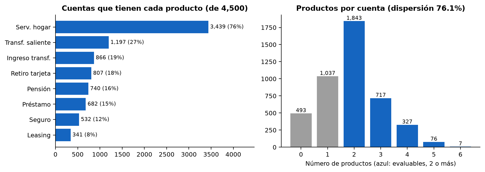
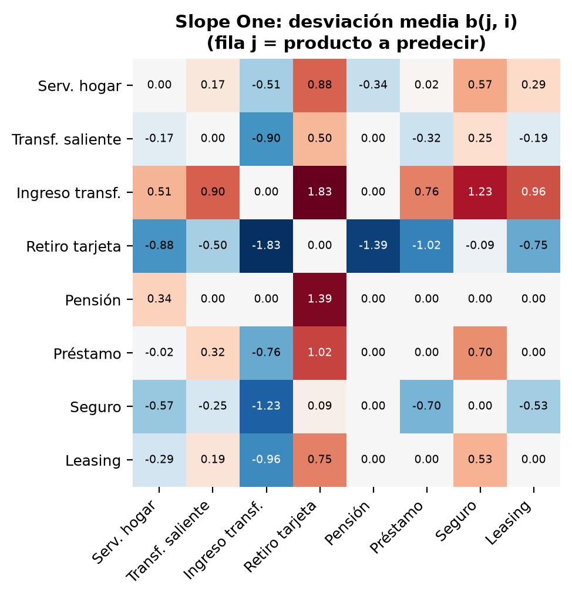
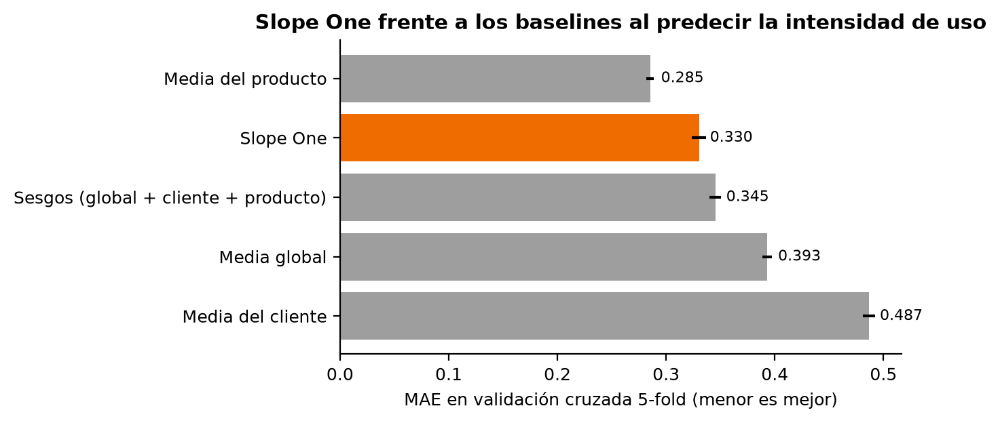
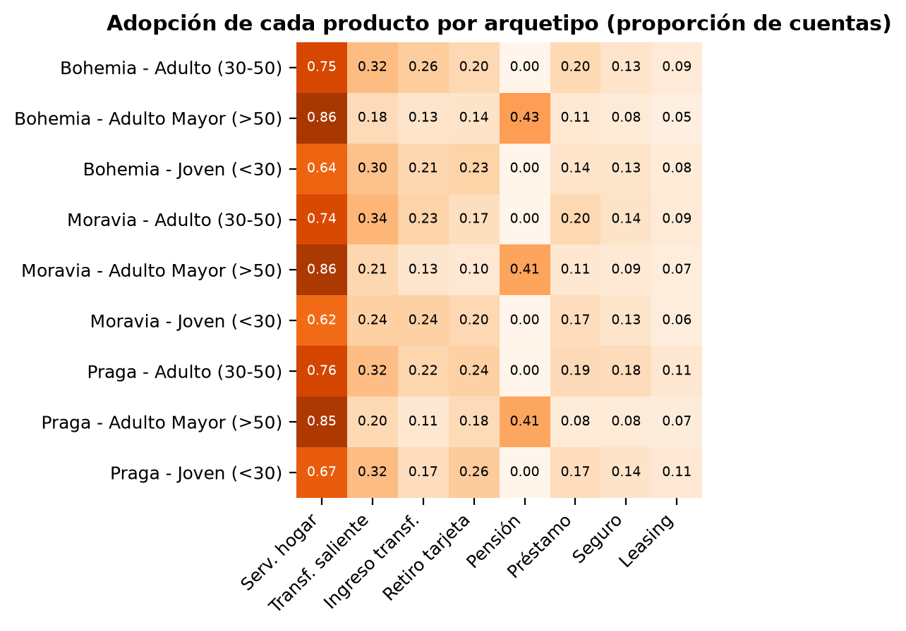
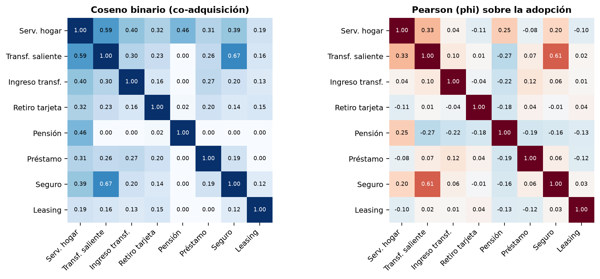
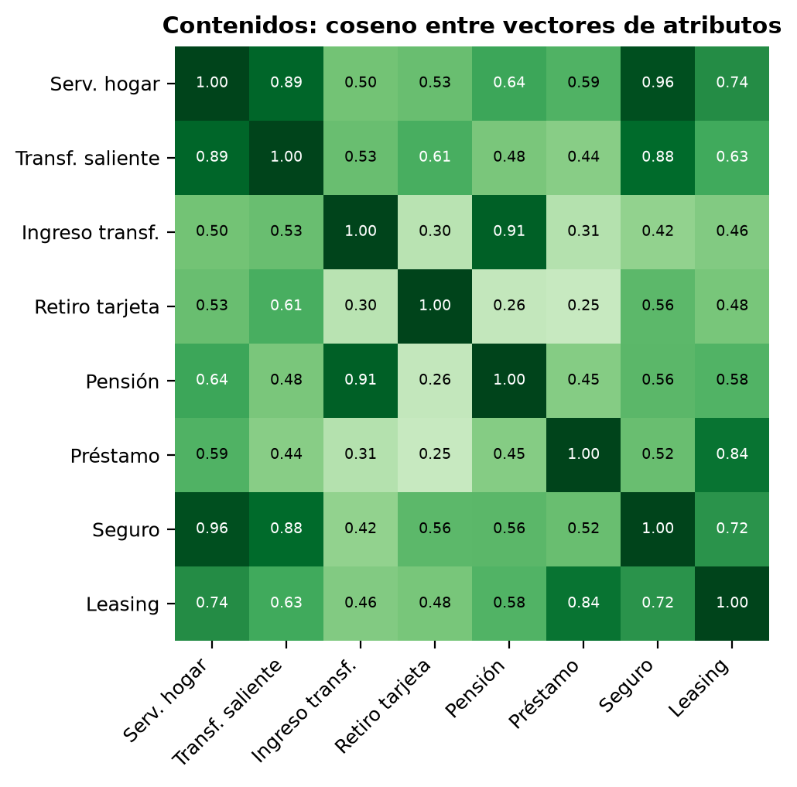
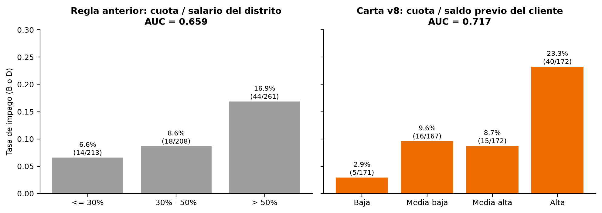
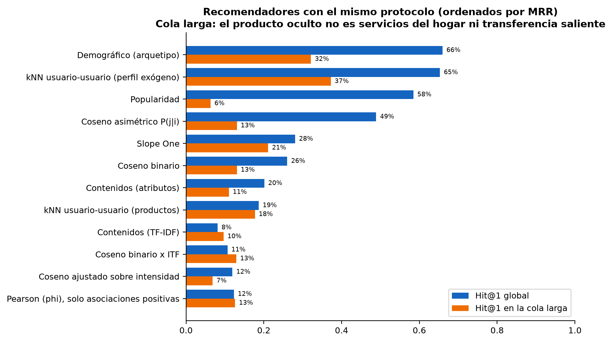

# UNIVERSIDAD TÉCNICA DE AMBATO
## FACULTAD DE INGENIERÍA EN SISTEMAS ELECTRÓNICA E INDUSTRIAL
### CARRERA DE SOFTWARE
### CICLO ACADÉMICO: AGOSTO 2026 – DICIEMBRE 2026

---

# INFORME DE GUÍA PRÁCTICA

---

## I. PORTADA

| Campo | Detalle |
| :--- | :--- |
| **Tema:** | Tomando como base los datos que están siendo tratados, genere al menos un sistema de recomendación de cada uno de los algoritmos revisados en clases (Financial_ijs):<br>1. Uno o varios DataFrames a partir de un Data Mart<br>2. Organizar<br>3. Clasificar<br>4. Filtrar la información<br>5. Generar un sistema de recomendación Slope One<br>6. Modelar productos, comportamientos, perfiles<br>7. Sistema de recomendación ítem a ítem (similitud de cosenos y Pearson)<br>8. Sistema de recomendación basado en contenidos |
| **Versión:** | 2.0 — rehecha sobre los DataFrames del Data Mart de la Carta v8, con evaluación común para todos los modelos (28/09/2026) |
| **Unidad de Organización Curricular:** | Unidad Profesional |
| **Nivel y Paralelo:** | Sexto Semestre – Software "A" |
| **Alumnos participantes:** | Cobos Taco Alison Marcela<br>Lagua Flores Henry Daniel |
| **Asignatura:** | Inteligencia de Negocios |
| **Docente:** | Ing. Rubén Nogales, Mg. |

---

## II. INFORME DE GUÍA PRÁCTICA

### 2.1 Objetivos

#### General:
Construir, sobre los datos del Data Mart Kimball de `Financial_ijs`, un sistema de recomendación de cada familia revisada en clase (Slope One, ítem a ítem con coseno y Pearson, basado en contenidos, demográfico y colaborativo usuario-usuario), evaluarlos con un mismo protocolo frente a la recomendación por popularidad y proponer un recomendador final gobernado por la regla de capacidad de pago de la Carta de Diseño.

#### Específicos:
1. Generar los DataFrames desde el Data Mart y organizarlos al nivel de la cuenta y su titular (puntos 1 y 2).
2. Definir con los datos un catálogo de productos que el cliente elige tener, y filtrar la información para construir las matrices de adopción e intensidad (puntos 3 y 4).
3. Implementar Slope One y validarlo con validación cruzada contra baselines adecuados (punto 5).
4. Modelar productos, comportamientos y perfiles con pruebas estadísticas (punto 6).
5. Implementar recomendadores ítem a ítem con coseno y Pearson y medir su aporte real (punto 7).
6. Implementar un recomendador basado en contenidos con atributos reales de los productos (punto 8).

### 2.2 Modalidad
Presencial, complementada con trabajo autónomo de programación y validación.

### 2.3 Tiempo de duración
* **Presenciales:** 2 horas
* **No presenciales:** 6 horas

### 2.4 Instrucciones
Tomando como base los DataFrames limpios que salen del Data Mart Kimball, desarrollar los 8 puntos de la consigna de forma secuencial, con código reproducible (semillas fijas), y evaluar cada recomendador con métricas y pruebas estadísticas.

### 2.5 Listado de equipos, materiales y recursos
* **Equipo:** computador personal con Windows 11 Pro, 32 GB de RAM.
* **Software:** Python 3.12 con pandas, NumPy, SciPy y Matplotlib; SQL Server (Data Mart); Visual Studio Code; Git.
* **Datos:** DataFrames generados desde `DM_Financial_Kimball_v2` por los scripts 32 y 33 (Informe 10).
* **TAC:**
  * [ ] Plataformas educativas
  * [x] Simuladores y laboratorios virtuales
  * [x] Aplicaciones educativas
  * [ ] Recursos audiovisuales
  * [ ] Gamificación
  * [x] Inteligencia Artificial
  * Otros: control de versiones con Git

### 2.6 Actividades por desarrollar
Los 8 puntos de la consigna, implementados en cinco scripts que se ejecutan en orden:

| Script | Puntos | Contenido |
| :--- | :--- | :--- |
| `scripts/37_rs_preparacion.py` | 1, 2, 3, 4 | DataFrames, unidad de análisis, catálogo, matrices de adopción e intensidad, perfiles y atributos |
| `scripts/38_rs_slope_one.py` | 5 | Slope One, trazabilidad, validación 5-fold y ranking |
| `scripts/39_rs_item_item.py` | 7 | Coseno binario, Pearson (phi), ITF, coseno ajustado, coseno asimétrico |
| `scripts/40_rs_perfiles_contenido.py` | 6, 8 | Productos, comportamientos, perfiles, contenidos, demográfico, kNN, utilidad y recomendación final |
| `scripts/41_rs_figuras.py` | — | Figuras generadas solo desde los resultados |
| `scripts/rs_comun.py` | — | Protocolo de evaluación común |

Todos los resultados quedan en `metricas_recomendadores.json`. **Ninguna cifra de este informe está escrita a mano en el código.**

---

### 2.7 Resultados obtenidos

#### Protocolo de evaluación común

Todos los recomendadores se evalúan igual, para poder compararlos entre sí:

1. Se toman las **2,970 cuentas** que tienen 2 o más productos.
2. A cada una se le **oculta un producto al azar**. El modelo se entrena sin esa información y ordena los productos que la cuenta no tiene.
3. Se mide si el producto oculto queda primero (**Hit@1**), entre los tres primeros (**Hit@3**) y su rango recíproco medio (**MRR**).
4. Se compara con la **popularidad**, que recomienda lo que más cuentas tienen, mediante la **prueba de McNemar**.
5. Además del resultado global, se mide la **cola larga**: los casos en que el producto oculto no es uno de los dos más populares (servicios del hogar y transferencia saliente). La popularidad acierta siempre esos dos y casi nunca los demás, así que la cola larga muestra si un modelo aporta algo que la popularidad no da.
6. Los modelos se comparan y se elige el mejor con una partición (**semilla 42**). El elegido se **confirma** con otra partición independiente (**semilla 2026**), con otros productos ocultos.

---

#### 2.7.1 Punto 1 — DataFrames a partir de un Data Mart

Los DataFrames provienen del Data Mart Kimball `DM_Financial_Kimball_v2` (Informes 09 y 10). El script 32 los extrae y el 33 completa sus datos faltantes:

| DataFrame | Filas | Origen en el Data Mart |
| :--- | ---: | :--- |
| `df_transacciones_completado` | 1,056,320 | `Fact_Transacciones` + `Dim_Operacion` + `Dim_Concepto_Movimiento` |
| `df_ordenes_clean` | 6,471 | `Fact_Ordenes` + `Dim_Orden` |
| `df_prestamos_clean` | 682 | `Fact_Prestamos` (incluye la capacidad de pago de la Carta v8) |
| `df_cliente_consolidado_clean` | 5,369 | `Dim_Cliente` + agregados de los tres hechos |

A partir de ellos, el script 37 genera los DataFrames propios de los recomendadores: `rs_adopcion.csv`, `rs_ratings.csv`, `rs_perfiles.csv`, `rs_productos.csv` y, al final, `rs_recomendaciones.csv`.

#### 2.7.2 Punto 2 — Organizar la información

* **Unidad de análisis: la cuenta y su titular (4,500).** Los productos pertenecen a la cuenta. Contar también a los 869 cotitulares duplicaría el consumo de las cuentas mancomunadas; por eso quedan fuera de las matrices.
* **Antigüedad de la cuenta.** Las cuentas tienen entre 12.1 y 72.0 meses de movimientos (mediana 35.9). Contar transacciones totales favorecería a las cuentas antiguas, así que toda intensidad se expresa **por mes de vida**.
* **Dos matrices cuenta × producto:**
  * **Adopción:** 1 si la cuenta tiene el producto, 0 si no. Base de los modelos de ranking.
  * **Intensidad:** monto mensual del producto, transformado a un rating de 1 a 5. Base de Slope One y del coseno ajustado.

#### 2.7.3 Punto 3 — Clasificar la información

Cada transacción, orden y préstamo se clasificó en un **catálogo de 8 productos que el cliente decide tener**, definido con los datos:

| Producto | Qué es | Origen | Cuentas | Penetración | Monto mensual mediano |
| :--- | :--- | :--- | ---: | ---: | ---: |
| Servicios del hogar | Pago domiciliado de servicios (`SIPO`) | Transacciones | 3,439 | 76.4% | 2,859.90 |
| Transferencia saliente | Transferencias a otros bancos | Transacciones | 1,197 | 26.6% | 1,409.44 |
| Ingreso por transferencia | Ingresos recibidos por transferencia | Transacciones | 866 | 19.2% | 3,965.92 |
| Retiro con tarjeta | Retiros en cajero con tarjeta (`VYBER KARTOU`) | Transacciones | 807 | 17.9% | 393.03 |
| Pensión | Abono de pensión (`DUCHOD`) | Transacciones | 740 | 16.4% | 5,497.21 |
| Préstamo | Préstamo del banco | Préstamos | 682 | 15.2% | 3,934.00 |
| Seguro | Pago de pólizas (`POJISTNE`) | Transacciones | 532 | 11.8% | 547.29 |
| Leasing | Orden permanente de leasing | Órdenes | 341 | 7.6% | 1,951.00 |

**Qué no es un producto y por qué:**
* **Depósito y retiro en efectivo en ventanilla:** los tienen las 4,500 cuentas, así que no distinguen a nadie.
* **Intereses, comisiones y sanciones por sobregiro:** los genera el banco automáticamente; el cliente no los elige.
* **Cuota del préstamo (`UVER`):** es consecuencia del préstamo. El producto "Préstamo" se toma de la tabla de préstamos.


*Figura 1: Catálogo de productos y número de productos por cuenta.*

#### 2.7.4 Punto 4 — Filtrar la información

| Filtro | Resultado |
| :--- | :--- |
| Cotitulares | Excluidos de las matrices (869); sus productos se registran en la cuenta del titular |
| Cuentas sin productos o con uno solo | 493 y 1,037 cuentas. Se recomiendan, pero no sirven para evaluar: la evaluación necesita ocultar un producto y conservar al menos otro |
| Dispersión | 8,604 celdas observadas de 36,000 posibles: **76.1% vacía** |
| Asimetría del monto mensual | 4.39 en bruto; **−0.99** tras aplicar $\ln(1 + x)$ |
| Escala de rating | $r = 1 + 4 \cdot \dfrac{\ln(1 + \text{monto}) - 0.6024}{10.9059 - 0.6024}$, entre 1 y 5 |
| Préstamos | Regla de utilidad (sección 2.7.8.C): el préstamo solo se ofrece con un monto acorde a la capacidad de pago |

---

#### 2.7.5 Punto 5 — Sistema de recomendación Slope One

**Fundamento.** Slope One (Lemire y Maclachlan, 2005) predice el rating de un producto $j$ a partir de la diferencia media $b(j, i)$ con cada producto $i$ que el cliente ya tiene, ponderando por el número de clientes que tienen ambos, $|S(j, i)|$:

$$b(j, i) = \frac{1}{|S(j, i)|} \sum_{u \in S(j, i)} (r_{u,j} - r_{u,i}) \qquad \hat r_{u,j} = \frac{\sum_{i} |S(j, i)| \, (r_{u,i} + b(j, i))}{\sum_{i} |S(j, i)|}$$

La matriz es antisimétrica: $b(j, i) = -b(i, j)$, con error numérico máximo de 0.


*Figura 2: Desviaciones medias b(j, i). Por ejemplo, b(Ingreso transf., Retiro tarjeta) = +1.826: quien tiene ambos mueve en ingresos por transferencia bastante más que en retiros con tarjeta.*

La pensión no comparte clientes con transferencia saliente, ingreso por transferencia, préstamo, seguro ni leasing ($|S| = 0$), así que para esos pares no hay desviación.

**Trazabilidad con dos clientes reales:**

*Cliente 45 (cuenta 37)*: tiene Servicios del hogar ($r = 3.7121$), Transferencia saliente (3.7544), Préstamo (4.0959) y Seguro (2.4847). Predicción para Ingreso por transferencia:

$$\hat r = \frac{690(3.7121 + 0.5141) + 307(3.7544 + 0.8960) + 210(4.0959 + 0.7584) + 137(2.4847 + 1.2250)}{690 + 307 + 210 + 137} = \frac{5{,}871.38}{1{,}344} = \mathbf{4.3686}$$

Al deshacer la escala, un rating de 4.3686 equivale a unos **10,700 al mes** en ingresos por transferencia. Slope One no solo sugiere el producto: estima su **intensidad esperada**.

*Cliente 2 (cuenta 2)*: tiene Servicios del hogar (4.1884), Ingreso por transferencia (4.6467) y Préstamo (3.9200). Predicción para Transferencia saliente:

$$\hat r = \frac{1197(4.1884 - 0.1669) + 307(4.6467 - 0.8960) + 233(3.9200 - 0.3241)}{1197 + 307 + 233} = \frac{6{,}803.05}{1{,}737} = \mathbf{3.9165}$$

| Cliente | Predicciones de Slope One (orden) |
| :--- | :--- |
| 2 | Pensión 4.53 · Transferencia saliente 3.92 · Leasing 3.85 · Seguro 3.53 · Retiro con tarjeta 3.16 |
| 45 | Ingreso por transferencia 4.37 · Pensión 4.06 · Leasing 3.51 · Retiro con tarjeta 2.92 |

**Validación cruzada 5-fold** sobre las 8,604 celdas observadas, frente a cuatro baselines:

| Modelo | MAE | Desv. entre pliegues | RMSE |
| :--- | ---: | ---: | ---: |
| **Media del producto** | **0.2853** | 0.0033 | 0.3899 |
| Slope One | 0.3303 | 0.0064 | 0.4720 |
| Sesgos (media global + cliente + producto) | 0.3453 | 0.0052 | 0.4820 |
| Media global | 0.3930 | 0.0044 | 0.5357 |
| Media del cliente | 0.4867 | 0.0056 | 0.6470 |


*Figura 3: MAE en validación cruzada 5-fold.*

**Interpretación honesta:**
* Slope One mejora a la media global (−16%) y a la media del cliente (−32%), pero es **peor que la media del producto** (+16% de error).
* **Motivo:** las intensidades de distintos productos casi no se relacionan. La correlación media entre productos, en valor absoluto, es de 0.26 (sección 2.7.7.B).
* **Excepción:** el ingreso por transferencia se relaciona fuertemente con la cuota del préstamo ($r = 0.89$, $n = 210$) y con el leasing ($r = 0.85$, $n = 71$). Quien recibe más ingresos toma créditos más grandes, y ahí Slope One sí aporta.
* **Como recomendador de qué producto ofrecer**, Slope One no es adecuado: acierta el producto oculto en el 28% de los casos, frente al 58% de la popularidad. Predice *cuánto* usaría un cliente un producto, no *si* lo va a tener. Por eso casi siempre coloca primero el ingreso por transferencia, que tiene los montos más altos (95% de acierto cuando el oculto es ese producto; cerca de 0% en los demás).

**Dictamen:** Slope One se usa para **dimensionar** la oferta (monto esperado), no para elegir el producto.

---

#### 2.7.6 Punto 6 — Modelar productos, comportamientos y perfiles

##### A. Productos

Cada producto se describe con atributos obtenidos de los datos: dirección del dinero, canal, contraparte, si es crédito, si es un pago fijo recurrente, regularidad mensual y monto típico (tabla del punto 3). Para los préstamos se modeló el catálogo por plazo:

| Plazo | Préstamos | Monto medio | Cuota media | Tasa de impago (B o D) | Cuota / saldo previo (mediana) |
| :--- | ---: | ---: | ---: | ---: | ---: |
| 12 meses | 131 | 53,636 | 4,470 | 8.4% | 9.4% |
| 24 meses | 138 | 99,218 | 4,134 | 12.3% | 8.4% |
| 36 meses | 130 | 144,048 | 4,001 | 11.5% | 8.7% |
| 48 meses | 138 | 205,593 | 4,283 | 11.6% | 9.0% |
| 60 meses | 145 | 244,451 | 4,074 | 11.7% | 9.6% |

El plazo **no** influye en el impago ($\chi^2 = 1.29$, gl = 4, p = 0.86): la cuota media es parecida en todos los plazos y lo que cambia es el monto total. El riesgo depende de la capacidad de pago del cliente, no del plazo elegido (Carta v8, problema 2).

##### B. Comportamientos

Se comparó el comportamiento de quienes tienen y no tienen cada producto, en desviaciones estándar (valores positivos: quien tiene el producto muestra más de ese comportamiento):

| Comportamiento | Serv. hogar | Transf. saliente | Ingreso transf. | Retiro tarjeta | Pensión | Préstamo | Seguro | Leasing |
| :--- | ---: | ---: | ---: | ---: | ---: | ---: | ---: | ---: |
| Depósito mensual en efectivo | −0.32 | +0.21 | **−1.13** | +0.62 | **−1.14** | +0.54 | +0.18 | +0.75 |
| Retiro mensual en ventanilla | **−0.81** | −0.01 | +0.06 | +0.75 | **−0.98** | +0.89 | −0.01 | **+1.00** |
| Saldo promedio | −0.58 | +0.09 | −0.28 | **+1.21** | **−1.06** | +0.64 | +0.06 | +0.79 |
| Sanciones por sobregiro | −0.30 | −0.12 | +0.01 | −0.11 | −0.18 | +0.29 | −0.04 | +0.09 |

**Hallazgo:** hay un efecto de **sustitución**. Quien recibe su pensión o sus ingresos por transferencia deposita mucho menos efectivo, y quien domicilia sus servicios retira menos en ventanilla. El comportamiento en efectivo es *consecuencia* de tener o no esos productos. Esto tiene una implicación metodológica importante en el punto 8 (kNN).

##### C. Perfiles

Se definieron 9 arquetipos: macro-región (Praga, Bohemia, Moravia) × edad (Joven < 30, Adulto 30–50, Adulto Mayor > 50).


*Figura 4: Proporción de cuentas de cada arquetipo que tiene cada producto.*

| Producto | χ² (gl = 8) | V de Cramér | p (Holm) |
| :--- | ---: | ---: | ---: |
| Pensión | 1,393.53 | **0.557** | 1.1 × 10⁻²⁹⁴ |
| Servicios del hogar | 196.63 | 0.209 | 2.3 × 10⁻³⁷ |
| Transferencia saliente | 88.92 | 0.141 | 4.6 × 10⁻¹⁵ |
| Ingreso por transferencia | 83.80 | 0.137 | 4.2 × 10⁻¹⁴ |
| Retiro con tarjeta | 62.26 | 0.118 | 6.7 × 10⁻¹⁰ |
| Préstamo | 58.15 | 0.114 | 3.2 × 10⁻⁹ |
| Seguro | 31.54 | 0.084 | 2.3 × 10⁻⁴ |
| Leasing | 23.00 | 0.072 | 3.4 × 10⁻³ |

La adopción de los 8 productos depende del arquetipo, incluso después de corregir por comparaciones múltiples (Holm). El efecto es muy fuerte en la pensión, que solo aparece en mayores de 50, y moderado en servicios del hogar (86% en mayores de 50 frente a 62–67% en jóvenes). El préstamo es más frecuente en adultos de 30 a 50 años (19–20%) que en mayores (8–11%).

---

#### 2.7.7 Punto 7 — Ítem a ítem (similitud de cosenos y Pearson)

##### A. Sobre la adopción

$$\cos(A, B) = \frac{|A \cap B|}{\sqrt{|A| \cdot |B|}} \qquad \phi(A, B) = \text{Pearson entre los vectores 0/1} \qquad \text{Lift}(A, B) = \frac{|A \cap B| \cdot N}{|A| \cdot |B|}$$


*Figura 5: Coseno binario (izquierda) y Pearson phi (derecha) entre productos.*

Asociaciones más fuertes (χ² por par, 28 pares, corrección de Holm; 20 significativas):

| Par | Cuentas con ambos | Coseno | Phi | Lift | Lectura |
| :--- | ---: | ---: | ---: | ---: | :--- |
| Transferencia saliente – Seguro | 531 | 0.665 | **+0.607** | **3.75** | 531 de los 532 que pagan seguro también hacen transferencias salientes |
| Servicios del hogar – Transferencia saliente | 1,197 | 0.590 | +0.334 | 1.31 | Todos los que transfieren también domicilian servicios |
| Servicios del hogar – Pensión | 740 | 0.464 | +0.246 | 1.31 | Todos los pensionistas domicilian servicios |
| Servicios del hogar – Seguro | 532 | 0.393 | +0.203 | 1.31 | Todos los que pagan seguro domicilian servicios |
| Transferencia saliente – Pensión | 0 | 0.000 | −0.267 | 0.00 | Ningún pensionista hace transferencias salientes |
| Pensión – Préstamo | 0 | 0.000 | −0.188 | 0.00 | Ningún pensionista tiene préstamo |

**ITF (frecuencia inversa), $\ln(N / n_j)$:** 0.27 servicios del hogar · 1.32 transferencia saliente · 1.65 ingreso por transferencia · 1.72 retiro con tarjeta · 1.81 pensión · 1.89 préstamo · 2.14 seguro · 2.58 leasing.

##### B. Sobre la intensidad

Pearson y coseno ajustado (Sarwar et al., 2001) se calcularon solo con los clientes que tienen ambos productos:

* La correlación media entre productos, en valor absoluto, es **0.26**: las intensidades casi no se relacionan.
* Las relaciones fuertes son pocas: ingreso por transferencia con préstamo ($r = 0.89$, $n = 210$) y con leasing ($0.85$, $n = 71$). La de retiro con tarjeta con pensión ($0.62$) se basa en solo 18 clientes.
* El coseno ajustado da valores extremos (por ejemplo −0.98 entre retiro con tarjeta y pensión) que también dependen de muestras muy pequeñas.

**Corrección respecto a la versión 1:** la versión anterior reportaba correlaciones de Pearson de hasta 0.9957 entre productos. Venían de contar transacciones totales: las cuentas antiguas acumulan más de todo, y eso crea una correlación falsa. Al expresar la intensidad por mes de vida, desaparecen.

##### C. Evaluación como recomendadores

| Modelo | Hit@1 | Hit@3 | MRR | Hit@1 cola larga | McNemar en cola larga (gana modelo / gana popularidad) |
| :--- | ---: | ---: | ---: | ---: | :--- |
| Popularidad | **58.5%** | 77.4% | **0.706** | 6.3% | — |
| Coseno asimétrico P(j\|i) | 48.9% | 72.2% | 0.644 | 13.1% | 142 / 53, p = 1.4 × 10⁻¹⁰ |
| Coseno binario | 26.0% | 70.9% | 0.512 | 13.1% | 142 / 53, p = 1.4 × 10⁻¹⁰ |
| Coseno binario × ITF | 10.7% | 47.5% | 0.369 | 12.9% | 144 / 57, p = 7.2 × 10⁻¹⁰ |
| Pearson (phi), solo asociaciones positivas | 12.3% | 44.8% | 0.363 | 12.6% | 157 / 74, p = 5.0 × 10⁻⁸ |
| Coseno ajustado sobre intensidad | 11.9% | 44.9% | 0.364 | 6.8% | 88 / 81, p = 0.64 |

**Interpretación:**
* **En global, ningún modelo ítem a ítem supera a la popularidad.** El coseno, por su fórmula, penaliza a los productos populares, y justamente los dos más comunes son los que más se ocultan. La ponderación ITF acentúa ese efecto.
* **En la cola larga, el coseno, el ITF y Pearson duplican a la popularidad** (≈13% frente a 6.3%, significativo). Es decir, descubren productos menos obvios que la popularidad nunca sugiere.
* **El coseno asimétrico P(j|i)** es la variante que mejor equilibra ambos objetivos: conserva la ventaja en la cola larga y cae menos en el global.
* **El coseno ajustado sobre intensidad** no aporta en la cola larga (p = 0.64), lo que confirma que la intensidad no se transfiere entre productos.

---

#### 2.7.8 Punto 8 — Sistema de recomendación basado en contenidos

##### A. Contenidos con atributos reales

Cada producto se representa con un vector de atributos: dirección (entrada/salida), canal, contraparte, si es crédito, si es recurrente fijo, regularidad mensual y monto típico escalado. El perfil de un cliente es el promedio de los vectores de sus productos, y se recomienda el producto más parecido a ese perfil (coseno).


*Figura 6: Coseno entre los vectores de atributos. Por ejemplo, seguro y servicios del hogar (0.96) son pagos recurrentes por transferencia a entidades externas; préstamo y leasing (0.84) son créditos con cuota fija.*

**Variante TF-IDF.** Se aplicó TF-IDF a un documento por producto armado con sus atributos del Data Mart. Por ejemplo, para el préstamo: *"salida orden o contrato banco crédito recurrente préstamo del banco"*.

**Corrección respecto a la versión 1:** la versión anterior aplicaba TF-IDF a cláusulas contractuales de 8 productos (hipoteca, PyME, vida, desgravamen, etc.) que **no existen en la base de datos**. Además, su matriz de similitud tenía valores distintos en la tabla y en la figura, ambos escritos a mano, y su validación "8 de 8" era circular. Aquí el contenido sale de los atributos reales de cada producto.

| Modelo | Hit@1 | Hit@3 | MRR | Hit@1 cola larga |
| :--- | ---: | ---: | ---: | ---: |
| Contenidos (atributos) | 20.1% | 62.7% | 0.469 | 11.0% |
| Contenidos (TF-IDF) | 8.1% | 64.5% | 0.383 | 9.7% |

El filtrado por contenidos supera a la popularidad en la cola larga (11.0% frente a 6.3%, p = 4.8 × 10⁻⁵), pero es débil. Con solo 8 productos, varios comparten casi los mismos atributos, y el contenido no distingue lo que cada cliente necesita.

##### B. Demográfico y colaborativo usuario-usuario

| Modelo | Hit@1 | Hit@3 | MRR | Hit@1 cola larga | Confirmación (semilla 2026): Hit@1 / MRR / cola |
| :--- | ---: | ---: | ---: | ---: | :--- |
| **Demográfico (arquetipo)** | **66.0%** | **86.2%** | **0.776** | 32.1% | 63.8% / 0.764 / 32.5% |
| kNN usuario-usuario (perfil exógeno) | 65.3% | 85.5% | 0.771 | **37.2%** | 63.8% / 0.760 / 36.0% |
| kNN usuario-usuario (productos) | 18.7% | 51.0% | 0.420 | 17.7% | 21.7% / 0.439 / 18.2% |
| Popularidad | 58.5% | 77.4% | 0.706 | 6.3% | 57.5% / 0.699 / 7.2% |

* **Demográfico:** recomienda lo que más tiene el arquetipo del cliente.
* **kNN por perfil exógeno:** busca los 30 titulares más parecidos en edad, sexo, macro-región, salario y desempleo del distrito y antigüedad de la cuenta, y recomienda lo que ellos tienen.

**Fuga de información detectada y corregida.** La primera versión del kNN por perfil usaba también depósitos, retiros y saldo, y acertaba el 75% (58% en la cola larga). Ese resultado era engañoso, por tres causas:
1. Los retiros incluían los retiros con tarjeta, que son el propio producto a predecir.
2. El saldo y las sanciones se calculan con todos los movimientos, incluidos los del producto oculto.
3. Los depósitos y retiros en efectivo son **consecuencia** del producto (sustitución, punto 6.B). Al ocultar un producto, su "sombra" sigue en esas variables.

Con variables exógenas, que no dependen de los productos, el acierto baja a 65%, y ese es el valor honesto. La versión con comportamiento se conserva en los resultados solo como referencia del sesgo.

##### C. Utilidad financiera: regla de capacidad de pago para préstamos

Se comparó la regla anterior (cuota / salario promedio del distrito) con la de la Carta v8 (cuota / saldo promedio del cliente antes del préstamo):


*Figura 7: Tasa de impago por tramo de cada regla.*

| Regla | Tramos (tasa de impago) | AUC para predecir el impago |
| :--- | :--- | ---: |
| Anterior: cuota / salario del distrito | ≤ 30%: 6.6% · 30–50%: 8.6% · > 50%: 16.9% | 0.659 |
| **Carta v8: cuota / saldo previo** | Baja: 2.9% · Media-baja: 9.6% · Media-alta: 8.7% · Alta: 23.3% ($\chi^2 = 38.58$, p = 2.1 × 10⁻⁸) | **0.717** |

La regla de la Carta v8 discrimina mejor, porque usa el dinero real del cliente y no el promedio de su distrito.

**Aplicación a los 3,818 titulares sin préstamo.** La cuota prudente es el 5.7% del saldo promedio, que es el límite de la banda Baja:
* Cuota prudente mediana: **1,873**, menos de la mitad de la cuota mediana de los préstamos otorgados (3,934). Solo **71** titulares podrían pagar un préstamo típico.
* Monto máximo prudente mediano: 22,475 a 12 meses · 44,949 a 24 · 67,424 a 36 · 89,898 a 48 · 112,373 a 60.
* **Conclusión:** el préstamo se ofrece siempre **con un monto máximo** calculado para cada cliente, no con el monto típico del banco.

---

#### 2.7.9 Evaluación comparativa y recomendador final


*Figura 8: Hit@1 global y en la cola larga de todos los modelos, con el mismo protocolo.*

**Elección del modelo.** El criterio se fijó antes de comparar: mayor MRR en la partición de selección. Resultó elegido el **Demográfico (arquetipo)**, con MRR 0.776, prácticamente empatado con el kNN por perfil exógeno (0.771). La partición de confirmación da lo mismo: 0.764 frente a 0.760. El kNN por perfil es mejor en la cola larga (37% frente a 32%) y queda como alternativa.

**Por qué ganan los modelos de perfil:**
* La adopción de estos productos depende mucho de la etapa de vida y la región del cliente (punto 6.C).
* La co-adquisición entre productos aporta poco más allá de la popularidad (punto 7).
* Estos modelos **resuelven el arranque en frío**: solo necesitan datos que el banco tiene desde la apertura de la cuenta.

**Recomendador final** (`dataframes/rs_recomendaciones.csv`, 4,500 titulares):
1. Ordena los productos que la cuenta no tiene con el modelo demográfico.
2. Aplica la regla de utilidad al préstamo: se incluye con cuota y monto máximo según la capacidad del cliente.
3. Entrega los 3 primeros.

| Recomendación | Veces en el top 3 | Veces en primer lugar |
| :--- | ---: | ---: |
| Transferencia saliente | 3,303 | 1,817 |
| Ingreso por transferencia | 3,083 | 464 |
| Retiro con tarjeta | 2,626 | 329 |
| Préstamo (con monto máximo) | 1,721 | 51 |
| Pensión | 1,065 | 766 |
| Servicios del hogar | 1,061 | 1,061 |
| Seguro | 374 | 7 |
| Leasing | 260 | 5 |

**Ejemplos:**
* **Cliente 2** (Praga, mayor de 50): domiciliar pensión → transferencias salientes → tarjeta de débito.
* **Cliente 45** (Bohemia, 30–50 años): recibir ingresos por transferencia → tarjeta de débito → leasing.

**Arquitectura propuesta:**
* **Qué producto ofrecer:** modelo demográfico o kNN por perfil.
* **Cuánto:** Slope One (intensidad esperada) y la regla de capacidad (monto máximo del préstamo).
* **Descubrir productos menos obvios:** P(j|i) como segunda lista, porque duplica a la popularidad en la cola larga.

---

#### 2.7.10 Correcciones respecto a la versión 1

| # | Versión 1 | Versión 2 |
| :-: | :--- | :--- |
| 1 | "Tarjeta de débito" eran en realidad los 282,657 retiros en efectivo (solo 8,034 con tarjeta) | Catálogo de 8 productos definido con los datos; "Retiro con tarjeta" usa solo `VYBER KARTOU` |
| 2 | Ratings a partir de conteos totales, sesgados por la antigüedad de la cuenta | Monto por mes de vida de la cuenta |
| 3 | "Préstamo" medido como número de cuotas pagadas (siempre una por mes) | Préstamo tomado de la tabla de préstamos; intensidad = cuota |
| 4 | Slope One "reducía el error 36%", comparado solo con la media del cliente | Comparado con 4 baselines: es peor que la media del producto (0.330 frente a 0.285) |
| 5 | Hit@1 de 91.79% con 5 productos, sin evaluar lo no obvio | Protocolo común con cola larga, McNemar y partición de confirmación |
| 6 | Pearson de 0.9957 entre productos; el cálculo "paso a paso" daba 0.9999 y se presentaba como 0.9957 | Pearson sobre intensidad mensual: correlación media absoluta de 0.26 |
| 7 | TF-IDF sobre 8 productos que no existen en la base (hipoteca, PyME, vida, desgravamen); tabla y figura con valores distintos | Contenidos con atributos reales de los 8 productos |
| 8 | kNN con AUC 0.7905 y Brier 0.1098 que ningún script calcula; puntaje 0.6002 repetido para dos productos distintos; variables con fuga | kNN evaluado con el protocolo común y con las fugas identificadas y eliminadas |
| 9 | Regla del 30% de cuota sobre salario distrital; χ² = 10.62 no reproducible (el cálculo da 13.03) | Se compara con la regla de la Carta v8 (AUC 0.717 frente a 0.659) y se adopta esta |
| 10 | Coseno entre plazos de crédito (−0.9991 entre 12 y 60 meses), sin significado con 3 variables estandarizadas | Catálogo de préstamos por plazo: el plazo no influye en el impago (p = 0.86) |
| 11 | Figuras con cifras escritas a mano | Todas las figuras se generan desde `metricas_recomendadores.json` |

---

### 2.8 Habilidades blandas empleadas en la práctica
* [ ] Liderazgo
* [x] Trabajo en equipo
* [ ] Comunicación asertiva
* [ ] La empatía
* [x] Pensamiento crítico
* [ ] Flexibilidad
* [ ] La resolución de conflictos
* [ ] Adaptabilidad
* [x] Responsabilidad

---

## III. CONCLUSIONES

1. **Un recomendador solo vale lo que dice su evaluación, y esta debe incluir baselines fuertes.** Con un mismo protocolo, la popularidad acierta el 58.5% del producto oculto, porque la mayoría de los ocultos son los dos productos más comunes. Varios modelos clásicos no la superan en global. La cola larga muestra el valor real: ahí los modelos ítem a ítem duplican a la popularidad (≈13% frente a 6.3%) y los de perfil la multiplican por cinco o seis (32–37%).
2. **En este banco, el perfil del cliente predice mejor que la co-adquisición.** El modelo demográfico (Hit@1 66.0%, MRR 0.776) y el kNN por perfil exógeno (65.3%, 0.771; 37% en la cola larga) son los mejores, confirmados con una segunda partición. La adopción depende de la etapa de vida: la pensión solo aparece en mayores de 50 y el préstamo es casi el doble de frecuente en adultos de 30 a 50 años que en mayores.
3. **Slope One predice intensidad, no preferencia.** Mejora a la media global y a la del cliente, pero no a la del producto, porque las intensidades casi no se relacionan entre productos (|r| medio 0.26). Su uso correcto es dimensionar la oferta, por ejemplo el monto esperado.
4. **Cuidar la fuga de información cambia las conclusiones.** Las variables de comportamiento en efectivo inflaban el acierto del kNN de 65% a 75%, por la sustitución entre efectivo y productos electrónicos. Solo con variables exógenas el resultado es defendible.
5. **La capacidad de pago debe gobernar la oferta de préstamos.** La regla cuota / saldo previo (AUC 0.717) supera a la de cuota / salario del distrito (0.659). Con ella, la mayoría de los clientes solo puede asumir préstamos bastante menores que los que el banco otorgó.

---

## IV. RECOMENDACIONES

1. **Desplegar el recomendador demográfico** con la regla de capacidad de pago, y usar el kNN por perfil exógeno y P(j|i) como listas complementarias para descubrir productos menos obvios.
2. **Registrar la fecha de adopción de cada producto.** Permitiría evaluar con datos anteriores a la adopción y usar el comportamiento sin causalidad inversa.
3. **Unificar la segmentación de edad** entre este informe (3 grupos) y el dashboard (4 grupos).
4. **Medir en una prueba A/B** si las recomendaciones de la cola larga (seguro, leasing, tarjeta) generan contrataciones, que es la métrica de negocio que esta evaluación fuera de línea no puede medir.

---

## V. BIBLIOGRAFÍA

* [1] D. Lemire and A. Maclachlan, "Slope One Predictors for Online Rating-Based Collaborative Filtering," in *Proc. SIAM Int. Conf. Data Mining (SDM)*, 2005, pp. 471–475.
* [2] B. Sarwar, G. Karypis, J. Konstan, and J. Riedl, "Item-based collaborative filtering recommendation algorithms," in *Proc. 10th Int. Conf. World Wide Web*, 2001, pp. 285–295.
* [3] M. Deshpande and G. Karypis, "Item-based top-N recommendation algorithms," *ACM Trans. Inf. Syst.*, vol. 22, no. 1, pp. 143–177, 2004.
* [4] E. Rich, "User modeling via stereotypes," *Cognitive Science*, vol. 3, no. 4, pp. 329–354, 1979.
* [5] G. Salton and C. Buckley, "Term-weighting approaches in automatic text retrieval," *Inf. Process. Manage.*, vol. 24, no. 5, pp. 513–523, 1988.
* [6] G. Adomavicius and A. Tuzhilin, "Toward the next generation of recommender systems," *IEEE Trans. Knowl. Data Eng.*, vol. 17, no. 6, pp. 734–749, 2005.
* [7] Q. McNemar, "Note on the sampling error of the difference between correlated proportions or percentages," *Psychometrika*, vol. 12, no. 2, pp. 153–157, 1947.
* [8] S. Holm, "A simple sequentially rejective multiple test procedure," *Scand. J. Statist.*, vol. 6, no. 2, pp. 65–70, 1979.
* [9] S. Kaufman, S. Rosset, and C. Perlich, "Leakage in data mining: formulation, detection, and avoidance," in *Proc. ACM SIGKDD*, 2011, pp. 556–563.

---

## VI. ANEXOS

### Anexo A. Cómo reproducir los resultados

```bash
python scripts/37_rs_preparacion.py
python scripts/38_rs_slope_one.py
python scripts/39_rs_item_item.py
python scripts/40_rs_perfiles_contenido.py
python scripts/41_rs_figuras.py
```

Requisito: los DataFrames de los scripts 32 y 33 (Informe 10). Los scripts solo usan pandas, NumPy, SciPy y Matplotlib. Scikit-learn se dejó de usar porque la política de control de aplicaciones de Windows bloqueaba una de sus librerías.

### Anexo B. Archivos generados

| Archivo | Contenido |
| :--- | :--- |
| `dataframes/rs_adopcion.csv` | Matriz 4,500 × 8 de adopción |
| `dataframes/rs_ratings.csv` | Monto mensual y rating 1–5 por cuenta y producto |
| `dataframes/rs_perfiles.csv` | Perfil demográfico y de comportamiento de cada titular |
| `dataframes/rs_productos.csv` | Atributos de los 8 productos |
| `dataframes/rs_recomendaciones.csv` | Top 3 por titular, con cuota y monto máximo del préstamo cuando corresponde |
| `metricas_recomendadores.json` | Todas las matrices, pruebas y evaluaciones |
| `img/recomendadores/fig_rs_01` a `fig_rs_08` | Figuras del informe |

### Anexo C. Archivos de la versión 1

Los scripts `04_calc_slope_one_matriz.py`, `05_rec_itf_ordenes.py`, `06_calc_pearson_diferenciado.py`, `07_calc_prestamos_coseno_utilidad.py`, `14` a `19`, `sistemas_recomendacion.py`, los generadores de figuras y del Word, y las figuras de `img/individual/` corresponden a la versión 1. Se conservan como antecedente, pero **ya no sustentan este informe**. Los archivos `04_Informe_Sistemas_de_Recomendacion.docx` y `.pdf` también son de la versión 1 y deben regenerarse a partir de este documento.
