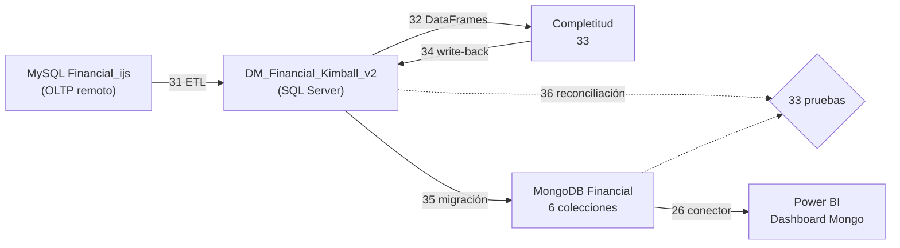

# UNIVERSIDAD TÉCNICA DE AMBATO
## FACULTAD DE INGENIERÍA EN SISTEMAS, ELECTRÓNICA E INDUSTRIAL
### CARRERA DE SOFTWARE — ASIGNATURA: INTELIGENCIA DE NEGOCIOS
### CICLO ACADÉMICO: AGOSTO 2026 – DICIEMBRE 2026

---

# INFORME 05 — ESPECIFICACIÓN TÉCNICA: MODELO DIMENSIONAL KIMBALL (SQL SERVER) Y SU DERIVACIÓN DOCUMENTAL (MONGODB)

**Autores:** Alison Marcela Cobos Taco / Henry Daniel Lagua Flores  
**Docente:** Ing. Ruben Nogales, Mg.  
**Caso de estudio:** `Financial_ijs` (PKDD'99 Financial Discovery Challenge)  
**Versión:** 2.0 — migración desde el Data Mart de la Carta v8, con reconciliación por desgloses (28/09/2026)  
**Scripts:** `scripts/35_migrar_kimball_a_mongodb.py` (migración) y `scripts/36_reconciliacion_kimball_mongo.py` (reconciliación)  
**Evidencia:** `metricas_migracion_mongo.json`, `metricas_reconciliacion_kimball_mongo.json` y tabla `Auditoria_Carga` del Data Mart

---

## 1. Resumen

| Dato | Valor |
| :--- | :--- |
| Origen | SQL Server `DM_Financial_Kimball_v2`, cargado y completado por los scripts 31 a 34 (Informes 09 y 10) |
| Destino | MongoDB `localhost:27017`, base `Financial` |
| Colecciones | 6, todas con validador `$jsonSchema` estricto |
| Documentos | 1,254,534 (ninguno rechazado por los validadores) |
| Duración de la migración | 119 s |
| Reconciliación Kimball ↔ MongoDB | **33 de 33 pruebas OK**: conteos, totales, desgloses y lo que ve el conector de Power BI |
| Respaldo | `Financial_mongo_dump.gz` (28.1 MB), regenerado y verificado con una restauración de prueba |

---

## 2. Justificación: persistencia políglota

| Capa | Motor | Modelo | Propósito |
| :--- | :--- | :--- | :--- |
| Analítica (fuente de verdad) | SQL Server `DM_Financial_Kimball_v2` | Constelación Kimball: 4 hechos, 8 dimensiones y 1 tabla puente | Integridad referencial, agregaciones multidimensionales, auditoría de cargas y análisis de riesgo |
| Servicio | MongoDB `Financial` | Documentos orientados a agregados: el **Cliente 360** y colecciones de apoyo | Consultar el perfil completo de un cliente, su cuenta, su préstamo y sus órdenes en una sola lectura por clave, sin `JOIN` |

**Fuente única de verdad:** MongoDB se genera **solo desde el Data Mart**. El script 35 no lee la base remota ni los CSV. Si una cifra difiere entre los dos motores, la de SQL Server es la correcta y el error está en la migración; el script 36 existe para detectarlo.

---

## 3. Flujo



---

## 4. Modelo documental

### 4.1 Colecciones y origen en Kimball

| Colección | Documentos | Grano | Origen en Kimball |
| :--- | ---: | :--- | :--- |
| `distritos` | 77 | Distrito | `Dim_Distrito` |
| `prestamos` | 682 | Préstamo | `Fact_Prestamos` + `Dim_Tiempo`, `Dim_Cuenta`, `Dim_Cliente`, `Dim_Distrito`, `Dim_Estado_Prestamo` |
| `ordenes` | 6,471 | Orden permanente | `Fact_Ordenes` + `Dim_Orden` y dimensiones conformadas |
| `FinancialMongo` | 5,369 | Cliente (Cliente 360) | `Dim_Cliente` + `Puente_Cuenta_Cliente` + `Dim_Cuenta` + distrito de residencia; préstamo y órdenes embebidos |
| `transacciones` | 1,056,320 | Movimiento | `Fact_Transacciones` + `Dim_Operacion` + `Dim_Concepto_Movimiento` |
| `saldos_mensuales` | 185,615 | Cuenta × mes | `Fact_Saldo_Cuenta_Mensual` |

### 4.2 Reglas del modelo dimensional que se conservan

| Regla (Carta v8) | Cómo se aplica en MongoDB |
| :--- | :--- |
| El cliente de los hechos es el **titular** de la cuenta | `id_cliente` de `prestamos`, `ordenes`, `transacciones` y `saldos_mensuales` es el titular. El préstamo y las órdenes se embeben solo en el Cliente 360 del titular, para no contarlos dos veces en cuentas mancomunadas |
| El distrito de los hechos es el **de la cuenta** | Cada préstamo, orden, transacción y saldo lleva `id_distrito` de la cuenta. En el Cliente 360, `cuenta.id_distrito` es el de la cuenta y `distrito` es el de residencia |
| Relación cuenta–cliente resuelta | Los 5,369 clientes, incluidos los 869 cotitulares, tienen su subdocumento `cuenta`, tomado de `Puente_Cuenta_Cliente` |
| El saldo es **semiaditivo** | La posición al corte se consulta en `saldos_mensuales` (una fila por cuenta y mes, con arrastre). Nunca se suma `saldo_cuenta` de `transacciones` a lo largo del tiempo |
| Dato original y dato completado | En `transacciones` conviven `operacion_fuente` / `k_symbol_fuente` (como vinieron del banco) y `concepto` (completado, con su `metodo` y `contraparte`) |
| Huecos estructurales | Se guardan como `null` (p. ej., `saldo_promedio_historico` de los cotitulares, `es_buen_pagador` de quien no tiene préstamo cerrado); no se rellenan con 0 |

### 4.3 Estructura de los documentos principales

**`FinancialMongo` (Cliente 360):**

```json
{
  "_id": 2, "id_cliente": 2,
  "datos_personales": { "sexo": "M", "fecha_nacimiento": "1945-02-04", "edad_al_corte_1998": 53, "tipo_disposicion": "OWNER" },
  "cuenta": { "id_cuenta": 2, "frecuencia_extracto": "Extracto mensual", "fecha_apertura": "1993-02-26",
              "id_distrito": 1, "tiene_credito_externo": false, "monto_credito_externo": 0.0 },
  "evaluacion_crediticia": { "tiene_prestamo": true, "es_buen_pagador": true, "calificacion": "Buen Pagador" },
  "perfil_analitico": { "macro_region": "Praga", "segmento_edad": "Adulto Mayor (>50)",
                        "arquetipo_demografico": "Praga - Adulto Mayor (>50)", "total_ordenes_activas": 2,
                        "saldo_promedio_historico": 36540.78 },
  "distrito": { "id_distrito": 1, "nombre": "Hl.m. Praha", "region": "Prague", "poblacion": 1204953,
                "salario_promedio": 12541.0, "tasa_desempleo": 0.0, "tasa_criminalidad": 85677.0,
                "imputacion": { "es_imputado": false, "metodo_imputacion": "Original PKDD99" } },
  "prestamo_asociado": {
    "id_prestamo": 4959,
    "condiciones": { "fecha_otorgamiento": "1994-01-05", "monto": 80952.0, "plazo_meses": 24, "cuota_mensual": 3373.0,
                     "saldo_pendiente_estimado": 0.0, "meses_transcurridos_al_corte": 59 },
    "evaluacion_riesgo": { "codigo_estado": "A", "condicion": "Cerrado", "descripcion": "Pagado sin problemas", "con_impago": false },
    "capacidad_pago": { "saldo_promedio_previo": 32590.76, "ratio_cuota_saldo_previo": 0.1035, "banda_capacidad": "Media-alta" }
  },
  "ordenes_recurrentes": [
    { "id_orden": 29402, "codigo": "UVER", "descripcion": "Cuota de Prestamo", "monto": 3373.0 },
    { "id_orden": 29403, "codigo": "SIPO", "descripcion": "Servicios del Hogar", "monto": 7266.0 }
  ]
}
```

**`transacciones`** (ejemplo de concepto inferido por cruce con órdenes):

```json
{
  "_id": 1096, "id_transaccion": 1096, "id_cuenta": 4, "id_cliente": 6, "id_distrito": 12,
  "fecha": "1996-07-13", "anio": 1996, "mes": 7, "dia": 13,
  "tipo_transaccion": "VYDAJ", "operacion_fuente": "PREVOD NA UCET", "k_symbol_fuente": "SIN_ESPECIFICAR",
  "canal": "Transferencia saliente", "tipo_operacion_traducido": "Egreso / Gasto",
  "concepto": { "codigo": "SIPO", "descripcion": "Servicios Basicos del Hogar",
                "metodo": "Cruce con ordenes", "contraparte": "Entidad externa registrada" },
  "monto_transaccion": 1285.0, "saldo_cuenta": 27280.0
}
```

**`saldos_mensuales`** (cuenta sobregirada al corte, sin movimientos en diciembre: saldo arrastrado):

```json
{ "_id": "91-199812", "id_cuenta": 91, "id_cliente": 108, "id_distrito": 17, "anio": 1998, "mes": 12,
  "saldo_fin_mes": -4188.0, "saldo_promedio_mes": -4188.0, "num_movimientos_mes": 0, "en_sobregiro": true }
```

**`distritos`** (distrito imputado):

```json
{ "_id": 69, "id_distrito": 69, "nombre": "Jesenik", "region": "north Moravia", "poblacion": 42821, "salario_promedio": 8173.0,
  "indicadores_1995": { "tasa_desempleo": 5.83, "tasa_criminalidad": 1326.0 },
  "indicadores_1996": { "tasa_desempleo": 7.0, "tasa_criminalidad": 1358.0 },
  "auditoria": { "es_imputado": true, "metodo_imputacion": "Razon 1995/1996 sobre dato 1996" } }
```

Las fechas se guardan como texto `AAAA-MM-DD`: así se ordenan cronológicamente y el conector de Power BI las convierte sin ambigüedad de zona horaria.

---

## 5. Gobernanza: validadores `$jsonSchema`

Cada colección se crea con su validador **antes** de insertar los datos (`validationLevel: strict`, `validationAction: error`), de modo que un documento incorrecto hace fallar la migración en lugar de guardarse.

| Colección | Qué exige el validador |
| :--- | :--- |
| `distritos` | Identificador, nombre, región y población; indicadores de 1995 numéricos; bloque `auditoria` con `es_imputado` booleano y `metodo_imputacion` |
| `prestamos` | Claves de préstamo, cuenta, cliente y distrito; monto, cuota y saldo pendiente ≥ 0; plazo en {12, 24, 36, 48, 60}; estado en {A, B, C, D}; condición Vigente / Cerrado; banda de capacidad en sus 4 valores |
| `ordenes` | Claves de orden, cuenta, cliente y distrito; monto ≥ 0; propósito en {SIPO, UVER, POJISTNE, LEASING, SIN_ESPECIFICAR} |
| `FinancialMongo` | Datos personales con sexo M/F y rol OWNER/DISPONENT; subdocumento `cuenta`; calificación en sus 3 valores; perfil con saldo numérico o `null`; distrito de residencia completo |
| `transacciones` | Claves y distrito; fecha con formato 1993–1998; año entre 1993 y 1998; tipo en {PRIJEM, VYDAJ, VYBER}; categoría en sus 4 valores; concepto completo; monto ≥ 0 |
| `saldos_mensuales` | Claves y distrito; mes entre 1 y 12; saldo numérico; marca de sobregiro booleana |

**Índices:** `transacciones` tiene un índice compuesto (`id_cuenta`, `fecha`, `_id`) que resuelve el último saldo de una cuenta con el mismo desempate que Kimball, además de índices por cliente, distrito y (año, categoría). Las demás colecciones se indexan por cuenta, cliente, distrito, estado, propósito o arquetipo según su uso.

---

## 6. Reconciliación Kimball ↔ MongoDB (33 de 33 pruebas OK)

El script 24 anterior comparaba solo totales generales y por eso no detectó que 349 cuentas quedaban en otra región en MongoDB. El script 36 compara también los desgloses que usa el dashboard:

| Grupo | Pruebas | Resultado |
| :--- | :--- | :-: |
| Conteos | Las 6 colecciones frente a sus tablas | 6 / 6 OK |
| Totales monetarios | Cartera ($103,261,740), cuotas ($2,858,033), saldo por cobrar ($46,620,926), órdenes ($21,229,041), transacciones ($6,257,862,197) y saldo neto al corte ($197,140,434) | 6 / 6 OK |
| Por región (distrito de la cuenta) | Cartera, saldo al corte, órdenes, transacciones y préstamos en mora | 5 / 5 OK |
| Por categoría, concepto, estado y capacidad | Movimientos y monto por categoría analítica; movimientos por concepto y por método; préstamos por estado; impagos por banda de capacidad; cuentas en sobregiro (39) | 7 / 7 OK |
| Clientes y distritos | Clientes por calificación, por arquetipo y por región de su cuenta (incluidos cotitulares); 869 sin saldo propio; 6,471 órdenes embebidas; distrito 69 imputado | 6 / 6 OK |
| Lo que ve Power BI | El conector del script 26, ejecutado igual que en Power BI: saldo al corte por región, monto por categoría y cartera por región | 3 / 3 OK |

Los valores esperados y obtenidos de cada prueba están en `metricas_reconciliacion_kimball_mongo.json` y en `Auditoria_Carga` (ejecución con prefijo `M`).

---

## 7. Métricas semiaditivas en MongoDB

El saldo es aditivo entre cuentas en un mismo instante, pero **no** a lo largo del tiempo. En MongoDB:

* **Posición al corte o por mes:** se suma `saldo_fin_mes` de `saldos_mensuales` filtrando un solo mes.

  ```javascript
  db.saldos_mensuales.aggregate([
    { $match: { anio: 1998, mes: 12 } },
    { $group: { _id: "$id_distrito", saldo_neto: { $sum: "$saldo_fin_mes" } } }
  ])
  ```

* **Nunca** se usa `$sum` sobre `transacciones.saldo_cuenta` en agrupaciones que abarquen varias fechas.
* Si se necesita el último saldo desde `transacciones`, se ordena por `fecha` y `_id` (el mismo desempate de Kimball) y se toma `$last`.

---

## 8. Respaldo y restauración

`Financial_mongo_dump.gz` contiene las 6 colecciones con sus validadores e índices. Se regeneró después de esta migración y se verificó restaurándolo en una base temporal: 1,254,534 documentos restaurados, 0 fallidos, validadores conservados.

```bash
mongorestore --gzip --archive=Financial_mongo_dump.gz --drop
```

Para regenerarlo después de una nueva migración:

```bash
mongodump --db=Financial --gzip --archive=Financial_mongo_dump.gz
```

---

## 9. Cómo ejecutar

```bash
python scripts/35_migrar_kimball_a_mongodb.py
```

```bash
python scripts/36_reconciliacion_kimball_mongo.py
```

El script 35 **recrea** las 6 colecciones de la base `Financial`: cualquier dato anterior en ellas se reemplaza. Requiere que el Data Mart esté cargado y completado (scripts 31 a 34).

---

## 10. Cambios respecto a la versión 1

| # | Versión 1 (script 22) | Versión 2 (script 35) |
| :-: | :--- | :--- |
| 1 | Las transacciones se cargaban desde un CSV | Todo se lee del Data Mart (fuente única de verdad) |
| 2 | `transacciones` y `ordenes` sin distrito: el conector usaba la residencia del cliente y **349 cuentas y 468 órdenes** quedaban en otra región | Cada documento lleva el distrito de la cuenta; la reconciliación por región da 5 / 5 OK |
| 3 | 3 tipos de operación en Kimball y 4 en MongoDB | La misma categoría analítica de 4 valores en ambos |
| 4 | Sin datos de capacidad de pago, saldo por cobrar, crédito externo ni saldos mensuales | Incluidos (colección nueva `saldos_mensuales`) |
| 5 | Los 869 cotitulares no tenían cuenta en el Cliente 360 | Todos tienen su `cuenta`, gracias a la tabla `Puente_Cuenta_Cliente` añadida al Data Mart |
| 6 | Saldo promedio de los cotitulares rellenado con 0 | `null` (hueco estructural) |
| 7 | `transacciones` sin validador y validadores aplicados después de insertar (`moderate`) | Las 6 colecciones con validador estricto desde su creación |
| 8 | Distrito 69 con 5.00 / 3,736 ("K-Means Clustered") | 5.83 / 1,326 ("Razon 1995/1996 sobre dato 1996"), igual que en Kimball |
| 9 | Reconciliación solo de totales (script 24) | Reconciliación de totales, desgloses y conector de Power BI (script 36) |

Los scripts 22, 23, 24 y 25 se conservan como antecedente, pero **ya no forman parte de la cadena**.

---

## 11. Pendientes

| # | Pendiente |
| :-: | :--- |
| 1 | Regenerar el proyecto Power BI de MongoDB (`dashboards/Dashboard_Financial_Mongo`). El conector (script 26) ya lee la estructura nueva, pero el modelo `.pbip` incrusta una copia anterior del conector y no incluye las columnas nuevas (capacidad de pago, concepto, saldos mensuales) |
| 2 | Actualizar la carga alternativa desde CSV (script 23), que genera un esquema plano anterior |
| 3 | Actualizar las Guías 06 y 07, que describen el esquema y la reconciliación de la versión 1 |
