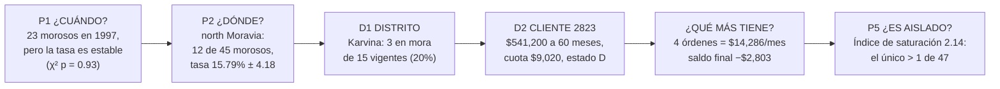
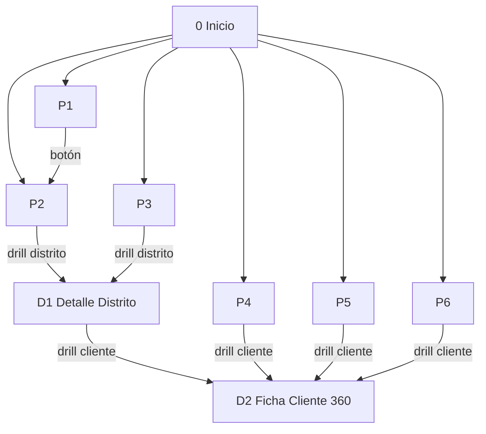

# UNIVERSIDAD TÉCNICA DE AMBATO
## FACULTAD DE INGENIERÍA EN SISTEMAS, ELECTRÓNICA E INDUSTRIAL
### CARRERA DE SOFTWARE — ASIGNATURA: INTELIGENCIA DE NEGOCIOS
### CICLO ACADÉMICO: AGOSTO 2026 – DICIEMBRE 2026

---

# GUÍA 07 — DASHBOARDS ARTICULADOS EN POWER BI: KIMBALL (SQL SERVER) Y MONGODB

**Autores:** Alison Marcela Cobos Taco / Henry Daniel Lagua Flores  
**Docente:** Ing. Ruben Nogales, Mg.  
**Caso de estudio:** `Financial_ijs` (PKDD'99)  
**Versión:** 2.0 (base académica, trazabilidad y evidencia estadística)  
**Archivos a entregar:** `Dashboard_Financial_Kimball.pbix` y `Dashboard_Financial_Mongo.pbix`

> Esta guía **reemplaza la maquetación de 2 páginas de la guía 06**. Las reglas de visualización del docente (sección 2 de la guía 06) se mantienen.

---

## 1. QUÉ PIDE EL DOCENTE Y CÓMO LO CUMPLIMOS

| Requisito del proyecto final | Cómo se cumple |
| :--- | :--- |
| Un dashboard desde la BD estructurada y otro desde MongoDB | `Dashboard_Financial_Kimball.pbix` (SQL Server `DM_Financial_Kimball_v2`) y `Dashboard_Financial_Mongo.pbix` (MongoDB `Financial`). |
| Todo responde a las preguntas de la Carta de Diseño | Cada visual tiene una fila en la **matriz de trazabilidad** (sección 4). Si un gráfico no responde una pregunta, no entra al tablero. |
| "Producto más vendido → su proveedor → lo de ese proveedor" | En banca, la cadena equivalente es **¿cuándo? → ¿dónde? → ¿qué distrito? → ¿qué cliente? → ¿qué más tiene ese cliente?** Cada paso se abre desde el anterior con *drill-through* (sección 5). |
| Todos los datos | Se usan los 3 hechos (préstamos, órdenes, transacciones) y todas las dimensiones. |
| Todo articulado, **no** "uno de ventas, otro de productos, otro de proveedores" | Las pestañas se organizan por **pregunta de negocio**, no por tabla. Todas comparten el modelo, los filtros sincronizados y los saltos de detalle. |
| Pestañas linkeadas | Navegador de páginas, botones de pregunta, *drill-through* Distrito → Cliente con botón Atrás y segmentadores sincronizados. |
| **Desviación estándar cuando la comparativa es grande** | Barras de error solo donde hay muchas observaciones: 682 préstamos (P2), 448 préstamos vigentes (P1, P2), 234 cerrados (P6) y 1,056,320 transacciones (P4). No se ponen en totales ni conteos, porque un total no tiene dispersión. |
| **Pastel = una sola variable en porcentajes** | Solo 2 donas: categoría de orden (5 clases, P5) y estado del préstamo (4 clases, D1). Las etiquetas muestran **porcentaje del total**. |
| **Sin gráficos 3D** | Ningún visual 3D. |
| **Cabeceras con los valores** | Cada pestaña abre con una franja de tarjetas KPI que muestran su valor real (sección 10). |
| **Gráfico de jerarquía (treemap) cuando hay mucha información** | Treemap Región → Distrito (8 regiones, 77 distritos) en P2. El **área más grande es la de mayor valor**: south Moravia es la región con más cartera ($19.68M) y Hl.m. Praha el distrito con más cartera ($12.93M). |
| **Todas las categorías en todos los años** | Matrices *Año × Categoría* con **todas** las categorías y los 6 años del dataset (1993–1998): estado del préstamo × año (P1) y tipo de operación × año (P4). Nuestros datos son de 1993–1998, no de 2025–2026. |

---

## 2. BASE ACADÉMICA DE CADA TIPO DE GRÁFICO

Cada regla del docente coincide con un resultado publicado. Estas son las fuentes que se citan en la defensa:

| # | Regla aplicada en el tablero | Fundamento | Referencia |
| :-: | :--- | :--- | :--- |
| R1 | Para comparar categorías: **columnas con X categórico, Y numérico y eje desde cero** | El ojo compara **posiciones sobre una escala común** con más exactitud que ángulos, áreas o volúmenes. Si el eje no empieza en cero, las diferencias se ven exageradas. | Cleveland & McGill (1984); Few (2012) |
| R2 | **Series temporales solo con líneas** | La línea codifica continuidad y pendiente, que es justo lo que se lee en una tendencia. Las barras separan los periodos como si fueran categorías sueltas. | Few (2012); Tufte (2001) |
| R3 | **Pastel/dona: una variable, parte de un todo, ≤ 5 clases, en porcentajes** | Leer ángulos y áreas es menos preciso (R1). El pastel solo sirve para responder "¿qué parte del total es…?" con pocas porciones, y la etiqueta en % compensa la imprecisión. | Few (2007); Cleveland & McGill (1984) |
| R4 | **Nada de 3D** | La perspectiva deforma ángulos y alturas, y agrega tinta que no representa datos (*chartjunk*). Experimentos con usuarios muestran lectura más lenta y con más errores. | Tufte (2001); Siegrist (1996) |
| R5 | **Treemap para jerarquías con muchas categorías** | Rellena el espacio con rectángulos anidados de área proporcional al valor. Muestra a la vez la jerarquía (región → distrito) y cuál es el elemento más grande. El color puede codificar una segunda medida (la tasa de mora). | Shneiderman (1992); Bruls, Huizing & van Wijk (2000) |
| R6 | **Barras de error ±1σ en comparativas con muchas observaciones** | La desviación estándar (σ) muestra la **dispersión de los individuos**. El error estándar (EE = σ/√n) muestra la **precisión del promedio o de la tasa**. Las dos se reportan y se interpretan de forma distinta (ver 2.1). | Cumming & Finch (2005); Cumming, Fidler & Vaux (2007) |
| R7 | **KPIs arriba a la izquierda y detalle abajo** | Un dashboard se lee de un vistazo: primero el estado general y después el porqué. Las tarjetas de cabecera responden la pregunta en un número. | Few (2006) |
| R8 | **Título que responde la pregunta** (p. ej. "north Moravia tiene la mayor tasa de mora: 15.79%") | El título dice qué debe concluir el lector en lugar de solo nombrar el gráfico. | Knaflic (2015) |
| R9 | **Un color fijo por categoría en todas las pestañas** y solo un color de alerta | El color categórico solo ayuda si significa lo mismo en todas partes. Un único color de alerta dirige la atención preatentiva. | Ware (2012); Few (2012) |

### 2.1 Cómo interpretar las barras de error (lo que se dice en clase)

El docente pide σ en las comparativas grandes. Lo aplicamos así, sin afirmar nada que los datos no sostengan:

| Qué se compara | Barra que se dibuja | Cómo se lee |
| :--- | :--- | :--- |
| **Promedios** (monto promedio de préstamo, ticket promedio de transacción) | **±1σ** (desviación estándar, lo que pide el docente). El tooltip muestra el **EE**. | Si las bandas de ±1σ se solapan, **la variación entre personas es mayor que la diferencia entre grupos**: la diferencia tiene poca relevancia práctica. La significancia estadística se confirma con ANOVA / t de Welch (sección 12). |
| **Tasas / proporciones** (mora, incumplimiento) | **±1 EE binomial** = √(p(1−p)/n), que es la desviación estándar de la tasa estimada. | Si las barras de ±1 EE se solapan, la diferencia **no es significativa** (Cumming & Finch, 2005). Si no se solapan, se confirma con χ² o Fisher (sección 12). |

> **Advertencia (Cumming et al., 2007):** con muestras muy grandes, dos grupos pueden tener bandas de ±1σ solapadas y aun así diferir de forma muy significativa. Pasa en P4: los tickets de *Ingreso* y *Retiro en efectivo* se solapan en ±1σ, pero t de Welch = 32.84 y p < 0.001 con n = 238,635. Por eso **nunca** decimos "no es significativo" basándonos solo en σ.

---

## 3. COHERENCIA VISUAL (MISMO SISTEMA EN LAS 9 PESTAÑAS Y EN LOS 2 ARCHIVOS)

| Elemento | Regla |
| :--- | :--- |
| Colores de estado del préstamo | **A** Pagado OK `#2E7D32` verde · **B** Incumplido `#8E1B1B` rojo oscuro · **C** Al día `#1565C0` azul · **D** En mora `#EF6C00` naranja |
| Colores de macro-región | Praga `#5E35B1` · Bohemia `#00897B` · Moravia `#F9A825` |
| Color de alerta | Solo el naranja `#EF6C00`, reservado para mora e índice de saturación > 1 |
| Orden de las categorías | De mayor a menor valor. Excepciones con orden natural: año (cronológico), segmento de edad (de joven a mayor) y estado (A-B-C-D) |
| Formato numérico | Moneda: `$#,0` (o `$0.00M` en tarjetas) · tasas: `0.00%` · conteos: `#,0` |
| Ejes | Y siempre desde 0 en columnas. Sin líneas de cuadrícula secundarias |
| Cantidad de visuales | Máximo 6 por pestaña (más la franja de KPIs) |
| Distribución | Franja de KPIs arriba, visual principal a la izquierda y detalle a la derecha y abajo (lectura en Z) |
| Títulos | Arriba, la pregunta de la carta. En cada visual, un título que ya da la respuesta (R8) |

En Power BI, el tema se aplica con *Vista → Temas → Personalizar el tema actual* y los colores por categoría se fijan en *Formato → Colores*. Una vez configurado Kimball, exporta el tema (*Guardar el tema actual*) e impórtalo en el archivo de Mongo para que los dos se vean iguales.

---

## 4. MATRIZ DE TRAZABILIDAD: PREGUNTA DE LA CARTA → VISUAL → RESPUESTA

Esta tabla es el control de que **todo responde a la carta**. Cada visual del tablero aparece aquí; si un visual no está en la tabla, no va en el tablero.

| Pregunta de la Carta de Diseño | Pestaña | Visual (tipo) | Regla | Respuesta con los datos | Evidencia |
| :--- | :-: | :--- | :-: | :--- | :--- |
| **P1** ¿Cómo evoluciona la morosidad activa año a año y cuál es la tasa de pérdida en préstamos cerrados? | P1 | Líneas: préstamos por estado A/B/C/D por año | R2 | Los préstamos en mora pasan de 2 (1994) a **23 (1997)**, junto con la colocación, que sube de 101 a 196 préstamos | Conteos |
| | P1 | Líneas + barras ±1 EE: tasa de mora por año de otorgamiento | R2, R6 | La tasa es **estable, entre 12.2% y 15.4%**, de 1994 a 1997. El aumento de morosos se debe al **volumen colocado**, no a un mayor riesgo por préstamo. 1998 da 2.53% porque son préstamos recientes que aún no tuvieron tiempo de caer en mora | χ² = 0.44, gl = 3, p = 0.93 |
| | P1 | Matriz Año × Estado (todas las categorías, todos los años) | — | Tabla completa de 6 años × 4 estados | Conteos |
| | P1 | Tarjeta | R7 | Tasa de incumplimiento en préstamos cerrados: **13.25%** (31 de 234) | Carta |
| **P2** ¿Qué distritos concentran el mayor riesgo crediticio y mora relativa? | P2 | **Treemap** Región → Distrito (área = cartera, color = tasa de mora) | R5 | Mayor área: **south Moravia $19.68M (19.1%)**. Distrito más grande: **Hl.m. Praha $12.93M** | Sumas |
| | P2 | Columnas + ±1 EE: tasa de mora por región | R1, R6 | Tasa más alta: **north Moravia 15.79% ± 4.18**, que además concentra 12 de los 45 morosos. Solo difiere de forma significativa de north Bohemia (0%) | χ² global: p = 0.239 (no significativo). Fisher north Moravia vs north Bohemia: p = 0.008 |
| | P2 | Columnas + ±1σ: monto promedio por macro-región | R1, R6 | Praga $153,957 · Moravia $153,497 · Bohemia $149,344. Las bandas de ±1σ (≈ $108–123 mil) se solapan: **el tamaño del préstamo no depende de la región** | ANOVA F = 0.12, p = 0.886 |
| | P2 | Columnas: Top 10 distritos por préstamos en mora | R1 | Hl.m. Praha 4; Karvina, Brno-mesto y Svitavy 3 cada uno | Conteos |
| **P3** ¿Qué porcentaje del saldo disponible está comprometido en la cartera? | P3 | Tarjetas | R7 | Cartera **$103.26M** / Depósitos **$197.14M** = **52.38%** | Carta |
| | P3 | Columnas agrupadas: cartera vs. saldo por macro-región | R1 | Moravia 54.7% · Praga 51.9% · Bohemia 50.9% | Sumas |
| | P3 | Columnas: ratio de absorción por región + línea de referencia 52.38% | R1 | Mayor exposición: **south Bohemia 60.55%**. Menor: north Bohemia 37.12% | Sumas |
| **P4** ¿Qué operaciones concentran el mayor flujo monetario y cómo varía el balance promedio? | P4 | Columnas: volumen por tipo de operación | R1 | **Ingreso/Depósito: 51.14%** del volumen ($3,200M). Egreso: 45.09% | Sumas |
| | P4 | Columnas + ±1σ: ticket promedio por operación | R1, R6 | Ingreso $14,416 ± 12,792 · Retiro $12,517 ± 6,593 · Egreso $4,447 ± 7,375 · Intereses $150 ± 81 | ANOVA F = 119,175, p < 0.001, η² = 0.25 (efecto grande) |
| | P4 | Líneas: volumen por operación y año + matriz Año × Operación (todas las categorías) | R2 | El volumen crece todos los años: $204M (1993) → $1,895M (1998) | Sumas |
| | P4 | Líneas: saldo promedio por año | R2 | Responde "cómo varía el balance promedio" | Promedios |
| **P5** ¿Qué cuentas tienen órdenes que saturan su saldo operativo habitual? | P5 | **Dona** (una variable, %): órdenes por categoría | R3 | Hogar **54.12%** · Sin especificar 21.31% · Préstamo 11.08% · Seguros 8.22% · Leasing 5.27% | Conteos |
| | P5 | Columnas: compromiso mensual por categoría | R1 | Hogar $13.97M (65.78% del monto) | Sumas |
| | P5 | Tabla con formato condicional: índice de saturación > 0.5 | R9 | **47 cuentas**. Solo la cuenta 2335 (cliente 2823) supera 1: **2.14** | Índice |
| **P6** ¿Qué clientes tienen impago histórico (Estado B) para denegarles nuevos productos? | P6 | Tabla de clientes con estado B | — | **31 clientes**. Monto en riesgo B + D: **$15,580,152** | Lista |
| | P6 | Columnas + ±1 EE: incumplimiento por segmento de edad | R1, R6 | 9.6% a 20%. Las barras se solapan: **la edad no predice el impago** (n = 10 en mayores de 60) | χ² = 1.68, p = 0.64 |
| | P6 | Columnas: incumplidos por región | R1 | north Moravia y south Moravia: 6 cada una | Conteos |

> **Nota sobre las órdenes:** la tabla fuente `orders` no tiene fecha de la orden (es una foto de las órdenes vigentes). Por eso en P5 aparecen **todas** las categorías (100% en la dona), pero no se pueden separar por año. Esto se dice en la exposición para no inventar una serie temporal.

---

## 5. HILO CONDUCTOR (LA CADENA DE PREGUNTAS)

El ejemplo del docente va del **producto más vendido** a **su proveedor** y luego a **lo que ofrece ese proveedor**. Nuestro tablero hace lo mismo: parte del problema del banco, la **mora**, y baja paso a paso hasta un cliente concreto. Cada paso está marcado como *descriptivo* (qué pasó) o *inferencial* (qué se puede generalizar):



| Paso | Pregunta | Respuesta | Tipo |
| :-: | :--- | :--- | :--- |
| 1 | ¿Cuándo crece la mora? | Los morosos por año de otorgamiento son 0, 2, 6, 10, **23**, 4. **La tasa por año** (12.2%–15.4% entre 1994 y 1997) **no cambia de forma significativa** (χ² = 0.44, p = 0.93). El problema es de **volumen**: se colocaron más préstamos con el mismo nivel de riesgo. | Inferencial |
| 2 | ¿En qué región? | **north Moravia** concentra 12 de los 45 morosos y tiene la tasa más alta (15.79% ± 4.18). Solo se distingue de forma significativa de north Bohemia (Fisher p = 0.008). En conjunto, la región no explica la mora (χ² p = 0.239). | Descriptivo + inferencial |
| 3 | ¿En qué distrito de esa región? | **Karvina**: 3 de 15 préstamos vigentes en mora. Es el distrito con más morosos de north Moravia. | Descriptivo |
| 4 | ¿Quién es el moroso? | Préstamos 5447, 6816 y 6959. El mayor es el del **cliente 2823**: $541,200 a 60 meses (el 3.er préstamo más grande del banco). | Descriptivo |
| 5 | ¿Qué más tiene ese cliente? | 4 órdenes por **$14,286/mes** (cuota $9,020, sin especificar $2,745, hogar $2,036, seguro $485). Su saldo promedio bajó de $25,368 (1996) a $3,354 (1997) y $723 (1998) y cerró en **−$2,803**. | Descriptivo |
| 6 | ¿Es un caso aislado? | Sus órdenes equivalen a **2.14 veces** su saldo promedio. Es el único con índice > 1 y encabeza la lista de 47 con índice > 0.5, que se usa como **alerta temprana**. | Descriptivo |

**Frase para la exposición:** *"Los datos no dicen que 1997 fue un año más riesgoso: la tasa se mantuvo y lo que creció fue la colocación. La región tampoco explica la mora por sí sola. Lo que sí separa al caso crítico es la capacidad de pago: el cliente 2823 comprometía en órdenes fijas el doble de su saldo. Por eso proponemos el índice de saturación como alerta."*

---

## 6. MAPA DE PESTAÑAS Y ENLACES

Los dos archivos `.pbix` tienen **las mismas 9 pestañas**. Así el docente puede comparar ambos motores pantalla por pantalla.

| # | Pestaña | Pregunta de la Carta | Enlaces de salida |
| :-: | :--- | :--- | :--- |
| 0 | **Inicio** | Panorama general (KPIs) | 6 botones → P1…P6 |
| 1 | **P1 · ¿Cuándo?** Evolución de la mora | P1 | Botón "Ver dónde ocurre →" P2 |
| 2 | **P2 · ¿Dónde?** Riesgo geográfico | P2 | Drill-through distrito → D1 |
| 3 | **P3 · ¿Cuánto?** Liquidez y absorción | P3 | Drill-through distrito → D1 |
| 4 | **P4 · ¿Cómo se mueve?** Flujo transaccional | P4 | Drill-through cliente → D2 |
| 5 | **P5 · ¿Quién está saturado?** Órdenes y capacidad de pago | P5 | Drill-through cliente → D2 |
| 6 | **P6 · ¿A quién no prestar?** Clientes con impago | P6 | Drill-through cliente → D2 |
| D1 | **Detalle Distrito** (drill-through) | P2 + P3 a nivel distrito | Drill-through cliente → D2, botón Atrás |
| D2 | **Ficha Cliente 360** (drill-through) | P4 + P5 + P6 a nivel cliente | Botón Atrás |



**Cuatro mecanismos de enlace (los cuatro deben aparecer en la defensa):**
1. **Navegador de páginas:** barra superior igual en todas las pestañas.
2. **Botones de pregunta:** en Inicio, cada botón lleva a su pregunta.
3. **Drill-through:** clic derecho en un distrito o un cliente → *Obtener detalles* → la página de detalle se abre ya filtrada.
4. **Segmentadores sincronizados:** *Año* y *Macro-región* conservan la selección al cambiar de pestaña.

---

## 7. PREPARACIÓN DE DATOS

### 7.1 Dashboard Kimball (SQL Server)
1. Verifica que `DM_Financial_Kimball_v2` esté poblada (script `scripts/etl_populate_kimball_v2.py` + `sql/03_WriteBack_Enriquecimiento_Kimball.sql`).
2. Ejecuta **`sql/04_Vistas_PowerBI_Kimball.sql`**. Crea dos vistas y al final muestra una consulta de control:
   * `vw_PBI_Saldo_Final_Cuenta`: último saldo de cada cuenta (medida **semiaditiva**). Control: **$197,140,434.00**.
   * `vw_PBI_Trans_Anual_Cuenta`: transacciones agregadas por cuenta, año y operación (1,056,320 → 54,298 filas). Control: **$6,257,862,197.00**.
3. En Power BI: *Obtener datos → SQL Server → `(localdb)\MSSQLLocalDB` → `DM_Financial_Kimball_v2` → Importar*. Selecciona:
   `Fact_Prestamos`, `Fact_Ordenes`, `vw_PBI_Trans_Anual_Cuenta`, `vw_PBI_Saldo_Final_Cuenta`, `Dim_Tiempo`, `Dim_Distrito`, `Dim_Cliente`, `Dim_Cuenta`, `Dim_Estado_Prestamo`, `Dim_Orden`, `Dim_Operacion`.

> ⚠️ **Corrección respecto a la guía 06:** la medida `CALCULATE(SUM(saldo_cuenta), LASTDATE(...))` solo suma las cuentas que tuvieron movimiento el último día y no da $197.14M. Usa la vista `vw_PBI_Saldo_Final_Cuenta`.

### 7.2 Dashboard MongoDB
1. Restaura la base `Financial` (`mongorestore --gzip --archive=Financial_mongo_dump.gz` o `python scripts/23_cargar_mongo_desde_csv.py`).
2. En Power BI: *Archivo → Opciones → Scripts de Python*. Apunta al Python que tiene `pymongo` y `pandas` (por ejemplo `C:\ProgramData\anaconda3`).
3. *Obtener datos → Más… → Script de Python* → pega **todo** `scripts/26_powerbi_mongo_dashboard.py` → marca las 7 tablas `m_*`.
   * Las transacciones y el saldo final se calculan **dentro de MongoDB** con *Aggregation Pipeline* (`$sort` + `$group`). Esto sirve como argumento técnico del lado NoSQL.
   * Probado: 7 tablas cargadas en ~10 s; los 5 totales de control cuadran con Kimball (**Δ = 0.00**).

---

## 8. MODELO DE DATOS (VISTA DE MODELO)

### 8.1 Kimball — constelación

| Dimensión (lado 1) | Se relaciona con (lado *) | Clave |
| :--- | :--- | :--- |
| `Dim_Distrito` | `Fact_Prestamos`, `Fact_Ordenes`, `vw_PBI_Trans_Anual_Cuenta`, `vw_PBI_Saldo_Final_Cuenta` | `sk_distrito` |
| `Dim_Cliente` | las mismas 4 tablas | `sk_cliente` |
| `Dim_Cuenta` | las mismas 4 tablas | `sk_cuenta` |
| `Dim_Estado_Prestamo` | `Fact_Prestamos` | `sk_estado_prestamo` |
| `Dim_Orden` | `Fact_Ordenes` | `sk_orden_tipo` |
| `Dim_Operacion` | `vw_PBI_Trans_Anual_Cuenta` | `sk_operacion` |
| `Dim_Tiempo` | `Fact_Prestamos` (activa), `Fact_Ordenes` (**inactiva**) | `sk_tiempo` |
| `Dim_Anio` *(tabla calculada)* | `Dim_Tiempo[anio]` y `vw_PBI_Trans_Anual_Cuenta[anio]` | `anio` |

**Tabla calculada** (*Modelado → Nueva tabla*):
```dax
Dim_Anio = DISTINCT ( SELECTCOLUMNS ( Dim_Tiempo, "anio", Dim_Tiempo[anio] ) )
```

> ⚠️ **Borra** las relaciones que Power BI detecta solo entre `Dim_Cliente → Dim_Distrito` y `Dim_Cuenta → Dim_Distrito`. Generan rutas ambiguas y, además, **el distrito de un hecho es el de la cuenta**, no el de residencia del cliente (difieren en 60 préstamos, 596 órdenes y 409 clientes con transacciones).
>
> La relación `Dim_Tiempo → Fact_Ordenes` va **inactiva** porque una orden permanente no es un evento anual. El segmentador *Año* filtra préstamos (año de otorgamiento) y transacciones (año del movimiento). El saldo final es al corte del 31/12/1998.

**Columnas calculadas:**
```dax
// En Dim_Distrito
Macro Region = SWITCH ( TRUE (),
    Dim_Distrito[region] = "Prague", "Praga",
    CONTAINSSTRING ( Dim_Distrito[region], "Moravia" ), "Moravia",
    "Bohemia" )

// En Dim_Cliente
Cliente = "Cliente " & Dim_Cliente[id_cliente_bk]
Segmento Edad = SWITCH ( TRUE (),
    Dim_Cliente[edad_corte] <= 25, "Joven (<=25)",
    Dim_Cliente[edad_corte] <= 40, "Adulto joven (26-40)",
    Dim_Cliente[edad_corte] <= 60, "Adulto (41-60)",
    "Mayor (>60)" )
```

### 8.2 MongoDB — estrella desnormalizada

| Dimensión (lado 1) | Se relaciona con (lado *) | Clave |
| :--- | :--- | :--- |
| `m_distritos` | `m_prestamos`, `m_ordenes`, `m_trans_anual`, `m_saldo_cuenta` | `id_distrito` |
| `m_clientes` | las mismas 4 tablas | `id_cliente` |
| `m_anios` | `m_prestamos`, `m_trans_anual` | `anio` |

En MongoDB **no existen** `Dim_Estado_Prestamo`, `Dim_Orden` ni `Dim_Operacion`. El estado, la categoría y la operación vienen **embebidos** en cada documento. Esa es la diferencia de modelado entre los dos dashboards y conviene mencionarla en la defensa. `m_distritos[macro_region]`, `m_clientes[cliente]` y `m_clientes[segmento_edad]` ya salen calculadas desde el script de Python.

---

## 9. MEDIDAS DAX

Crea una tabla vacía `_Medidas` (*Especificar datos → Cargar*) y pega las medidas. **Los nombres son idénticos en los dos archivos**, así que los visuales se configuran igual.

### 9.1 Kimball
```dax
Cartera Total = SUM ( Fact_Prestamos[monto_prestamo] )
Num Prestamos = COUNTROWS ( Fact_Prestamos )
Prestamos en Mora = CALCULATE ( [Num Prestamos], Dim_Estado_Prestamo[codigo_estado] = "D" )
Prestamos Vigentes = CALCULATE ( [Num Prestamos], Dim_Estado_Prestamo[codigo_estado] IN { "C", "D" } )
Prestamos Incumplidos = CALCULATE ( [Num Prestamos], Dim_Estado_Prestamo[codigo_estado] = "B" )
Prestamos Cerrados = CALCULATE ( [Num Prestamos], Dim_Estado_Prestamo[codigo_estado] IN { "A", "B" } )
Tasa Mora Vigente = DIVIDE ( [Prestamos en Mora], [Prestamos Vigentes] )
Tasa Incumplimiento = DIVIDE ( [Prestamos Incumplidos], [Prestamos Cerrados] )
Monto en Riesgo = CALCULATE ( SUM ( Fact_Prestamos[saldo_pendiente_estimado] ), Dim_Estado_Prestamo[codigo_estado] IN { "B", "D" } )
Monto Promedio Prestamo = AVERAGE ( Fact_Prestamos[monto_prestamo] )
Desv Est Prestamo = STDEV.S ( Fact_Prestamos[monto_prestamo] )
Prestamo Limite Superior = [Monto Promedio Prestamo] + [Desv Est Prestamo]
Prestamo Limite Inferior = [Monto Promedio Prestamo] - [Desv Est Prestamo]

Saldo Depositos = SUM ( vw_PBI_Saldo_Final_Cuenta[saldo_final] )
Ratio Absorcion = DIVIDE ( CALCULATE ( [Cartera Total], REMOVEFILTERS ( Dim_Anio ), REMOVEFILTERS ( Dim_Tiempo ) ), [Saldo Depositos] )

Volumen Transaccionado = SUM ( vw_PBI_Trans_Anual_Cuenta[monto_total] )
Num Transacciones = SUM ( vw_PBI_Trans_Anual_Cuenta[num_transacciones] )
Ticket Promedio Transaccion = DIVIDE ( [Volumen Transaccionado], [Num Transacciones] )
Desv Est Transaccion =
    VAR n = [Num Transacciones]
    VAR s = [Volumen Transaccionado]
    VAR sq = SUM ( vw_PBI_Trans_Anual_Cuenta[suma_cuadrados] )
    RETURN SQRT ( DIVIDE ( sq - s * s / n, n - 1 ) )
Transaccion Limite Superior = [Ticket Promedio Transaccion] + [Desv Est Transaccion]
Transaccion Limite Inferior = [Ticket Promedio Transaccion] - [Desv Est Transaccion]
Saldo Promedio Historico =
    DIVIDE ( SUMX ( vw_PBI_Trans_Anual_Cuenta, vw_PBI_Trans_Anual_Cuenta[saldo_promedio] * vw_PBI_Trans_Anual_Cuenta[num_transacciones] ), [Num Transacciones] )

Compromiso Ordenes = SUM ( Fact_Ordenes[monto_orden] )
Num Ordenes = COUNTROWS ( Fact_Ordenes )
Indice Saturacion = DIVIDE ( [Compromiso Ordenes], CALCULATE ( [Saldo Promedio Historico], REMOVEFILTERS ( Dim_Anio ), REMOVEFILTERS ( Dim_Operacion ) ) )
Clientes Saturados = COUNTROWS ( FILTER ( VALUES ( Dim_Cliente[sk_cliente] ), [Indice Saturacion] > 0.5 ) )
Clientes con Impago = CALCULATE ( DISTINCTCOUNT ( Fact_Prestamos[sk_cliente] ), Dim_Estado_Prestamo[codigo_estado] = "B" )
Clientes Totales = COUNTROWS ( Dim_Cliente )

Titulo Distrito = "Detalle del distrito: " & SELECTEDVALUE ( Dim_Distrito[nombre_distrito], "(varios)" )
Titulo Cliente = "Ficha 360 · " & SELECTEDVALUE ( Dim_Cliente[Cliente], "(varios clientes)" )
```

### 9.2 MongoDB (mismos nombres)
```dax
Cartera Total = SUM ( m_prestamos[monto_prestamo] )
Num Prestamos = COUNTROWS ( m_prestamos )
Prestamos en Mora = CALCULATE ( [Num Prestamos], m_prestamos[codigo_estado] = "D" )
Prestamos Vigentes = CALCULATE ( [Num Prestamos], m_prestamos[codigo_estado] IN { "C", "D" } )
Prestamos Incumplidos = CALCULATE ( [Num Prestamos], m_prestamos[codigo_estado] = "B" )
Prestamos Cerrados = CALCULATE ( [Num Prestamos], m_prestamos[codigo_estado] IN { "A", "B" } )
Tasa Mora Vigente = DIVIDE ( [Prestamos en Mora], [Prestamos Vigentes] )
Tasa Incumplimiento = DIVIDE ( [Prestamos Incumplidos], [Prestamos Cerrados] )
Monto en Riesgo = CALCULATE ( SUM ( m_prestamos[saldo_pendiente_estimado] ), m_prestamos[codigo_estado] IN { "B", "D" } )
Monto Promedio Prestamo = AVERAGE ( m_prestamos[monto_prestamo] )
Desv Est Prestamo = STDEV.S ( m_prestamos[monto_prestamo] )
Prestamo Limite Superior = [Monto Promedio Prestamo] + [Desv Est Prestamo]
Prestamo Limite Inferior = [Monto Promedio Prestamo] - [Desv Est Prestamo]

Saldo Depositos = SUM ( m_saldo_cuenta[saldo_final] )
Ratio Absorcion = DIVIDE ( CALCULATE ( [Cartera Total], REMOVEFILTERS ( m_anios ) ), [Saldo Depositos] )

Volumen Transaccionado = SUM ( m_trans_anual[monto_total] )
Num Transacciones = SUM ( m_trans_anual[num_transacciones] )
Ticket Promedio Transaccion = DIVIDE ( [Volumen Transaccionado], [Num Transacciones] )
Desv Est Transaccion =
    VAR n = [Num Transacciones]
    VAR s = [Volumen Transaccionado]
    VAR sq = SUM ( m_trans_anual[suma_cuadrados] )
    RETURN SQRT ( DIVIDE ( sq - s * s / n, n - 1 ) )
Transaccion Limite Superior = [Ticket Promedio Transaccion] + [Desv Est Transaccion]
Transaccion Limite Inferior = [Ticket Promedio Transaccion] - [Desv Est Transaccion]
Saldo Promedio Historico =
    DIVIDE ( SUMX ( m_trans_anual, m_trans_anual[saldo_promedio] * m_trans_anual[num_transacciones] ), [Num Transacciones] )

Compromiso Ordenes = SUM ( m_ordenes[monto_orden] )
Num Ordenes = COUNTROWS ( m_ordenes )
Indice Saturacion = DIVIDE ( [Compromiso Ordenes], CALCULATE ( [Saldo Promedio Historico], REMOVEFILTERS ( m_anios ), REMOVEFILTERS ( m_trans_anual[tipo_operacion] ) ) )
Clientes Saturados = COUNTROWS ( FILTER ( VALUES ( m_clientes[id_cliente] ), [Indice Saturacion] > 0.5 ) )
Clientes con Impago = CALCULATE ( DISTINCTCOUNT ( m_prestamos[id_cliente] ), m_prestamos[codigo_estado] = "B" )
Clientes Totales = COUNTROWS ( m_clientes )

Titulo Distrito = "Detalle del distrito: " & SELECTEDVALUE ( m_distritos[nombre_distrito], "(varios)" )
Titulo Cliente = "Ficha 360 · " & SELECTEDVALUE ( m_clientes[cliente], "(varios clientes)" )
```

**Formato:** `Tasa Mora Vigente`, `Tasa Incumplimiento`, `Ratio Absorcion` y `Indice Saturacion` → Porcentaje con 2 decimales (el índice también se puede mostrar como decimal: 2.14). Las medidas monetarias → Moneda sin decimales.

### 9.3 Valores de control (Año = Todos, sin filtros)

| Medida | Valor esperado en ambos |
| :--- | ---: |
| Cartera Total | $103,261,740 |
| Num Prestamos / Prestamos en Mora | 682 / 45 |
| Tasa Mora Vigente | 10.04% |
| Tasa Incumplimiento | 13.25% |
| Saldo Depositos | $197,140,434 |
| Ratio Absorcion | 52.38% |
| Volumen Transaccionado / Num Transacciones | $6,257,862,197 / 1,056,320 |
| Compromiso Ordenes / Num Ordenes | $21,229,041 / 6,471 |
| Clientes Saturados (índice > 0.5) | 47 |
| Clientes con Impago | 31 |
| Clientes Totales | 5,369 |

### 9.4 Medidas adicionales para barras de error, porcentajes y cabeceras

Agrégalas en los dos archivos. Donde el nombre de columna cambia entre modelos, se indica **Kimball / Mongo**.

```dax
// ---------- Error estándar de tasas (R6, barras ±1 EE) ----------
EE Mora = SQRT ( DIVIDE ( [Tasa Mora Vigente] * ( 1 - [Tasa Mora Vigente] ), [Prestamos Vigentes] ) )
Mora Limite Superior = [Tasa Mora Vigente] + [EE Mora]
Mora Limite Inferior = MAX ( 0, [Tasa Mora Vigente] - [EE Mora] )

EE Incumplimiento = SQRT ( DIVIDE ( [Tasa Incumplimiento] * ( 1 - [Tasa Incumplimiento] ), [Prestamos Cerrados] ) )
Incumplimiento Limite Superior = [Tasa Incumplimiento] + [EE Incumplimiento]
Incumplimiento Limite Inferior = MAX ( 0, [Tasa Incumplimiento] - [EE Incumplimiento] )

// ---------- Error estándar de promedios (se muestra en el tooltip) ----------
EE Prestamo = DIVIDE ( [Desv Est Prestamo], SQRT ( [Num Prestamos] ) )
EE Transaccion = DIVIDE ( [Desv Est Transaccion], SQRT ( [Num Transacciones] ) )

// ---------- Porcentajes (R3) ----------
// Kimball: REMOVEFILTERS ( Dim_Orden )      Mongo: REMOVEFILTERS ( m_ordenes[categoria_orden] )
Pct Ordenes = DIVIDE ( [Num Ordenes], CALCULATE ( [Num Ordenes], REMOVEFILTERS ( Dim_Orden ) ) )
// Kimball: REMOVEFILTERS ( Dim_Operacion )  Mongo: REMOVEFILTERS ( m_trans_anual[tipo_operacion] )
Pct Volumen = DIVIDE ( [Volumen Transaccionado], CALCULATE ( [Volumen Transaccionado], REMOVEFILTERS ( Dim_Operacion ) ) )
// Kimball: REMOVEFILTERS ( Dim_Distrito )   Mongo: REMOVEFILTERS ( m_distritos )
Pct Cartera = DIVIDE ( [Cartera Total], CALCULATE ( [Cartera Total], REMOVEFILTERS ( Dim_Distrito ) ) )

// ---------- Tarjetas de cabecera con el "ganador" (R7, R8) ----------
// Kimball: Dim_Distrito[region]             Mongo: m_distritos[region]
Region Mayor Mora =
    VAR t = TOPN ( 1, VALUES ( Dim_Distrito[region] ), [Tasa Mora Vigente], DESC )
    RETURN MAXX ( t, Dim_Distrito[region] ) & " · " & FORMAT ( MAXX ( t, [Tasa Mora Vigente] ), "0.00%" )

Region Mayor Cartera =
    VAR t = TOPN ( 1, VALUES ( Dim_Distrito[region] ), [Cartera Total], DESC )
    RETURN MAXX ( t, Dim_Distrito[region] ) & " · " & FORMAT ( MAXX ( t, [Pct Cartera] ), "0.0%" )

Region Mayor Absorcion =
    VAR t = TOPN ( 1, VALUES ( Dim_Distrito[region] ), [Ratio Absorcion], DESC )
    RETURN MAXX ( t, Dim_Distrito[region] ) & " · " & FORMAT ( MAXX ( t, [Ratio Absorcion] ), "0.00%" )

// Kimball: Dim_Operacion[tipo_operacion_traducido]   Mongo: m_trans_anual[tipo_operacion]
Operacion Mayor Volumen =
    VAR t = TOPN ( 1, VALUES ( Dim_Operacion[tipo_operacion_traducido] ), [Volumen Transaccionado], DESC )
    RETURN MAXX ( t, Dim_Operacion[tipo_operacion_traducido] ) & " · " & FORMAT ( MAXX ( t, [Pct Volumen] ), "0.00%" )

// Kimball: Dim_Orden[categoria_orden_traducida]      Mongo: m_ordenes[categoria_orden]
Categoria Principal Orden =
    VAR t = TOPN ( 1, VALUES ( Dim_Orden[categoria_orden_traducida] ), [Num Ordenes], DESC )
    RETURN MAXX ( t, Dim_Orden[categoria_orden_traducida] ) & " · " & FORMAT ( MAXX ( t, [Pct Ordenes] ), "0.00%" )
```

> ⚠️ **Categorías de operación entre los dos motores:** los totales de transacciones coinciden (Δ = 0), pero `Dim_Operacion` (Kimball) y `tipo_operacion_traducido` (Mongo, desde los CSV) pueden usar nombres o agrupaciones distintas. Antes de la defensa, compara en P4 los valores por categoría de los dos archivos. Si no coinciden, agrupa ambos por el código original `type` (PRIJEM / VYDAJ / VYBER) para que la comparación sea 1 a 1.

---

## 10. DISEÑO PESTAÑA POR PESTAÑA

> **Maquetas de referencia con datos reales:** `img/mockup_dashboard/` (generadas con `python scripts/28_mockup_dashboard.py`). Muestran la distribución, los colores y los valores que debe tener cada pestaña en Power BI.

**Plantilla común** (lienzo 16:9; hazla en Inicio y luego *Duplicar página*):
* **Franja 1:** la pregunta de la carta como título, el **navegador de páginas** (*Insertar → Botones → Navegador → Navegador de páginas*, con D1 y D2 ocultas), los segmentadores **Año** y **Macro-región** sincronizados y el botón **Restablecer filtros** (marcador).
* **Franja 2, cabecera de KPIs:** las tarjetas de la tabla de cada pestaña. Los valores indicados son con *Año = Todos*; al filtrar, cambian.
* **Cuerpo:** máximo 6 visuales, cada uno con un título que da la respuesta (R8).

### Pestaña 0 · Inicio: "¿Cómo está el banco?"
| Cabecera (KPI) | Valor |
| :--- | ---: |
| Cartera total | $103,261,740 |
| Saldo de depósitos al 31/12/1998 | $197,140,434 |
| Ratio de absorción | 52.38% |
| Tasa de mora vigente | 10.04% |
| Tasa de incumplimiento (cerrados) | 13.25% |
| Volumen transaccionado | $6,257,862,197 |

Cuerpo: **6 botones**, uno por pregunta de la carta (texto = la pregunta; *Acción → Navegación de página → P1…P6*), y un cuadro de texto con la **ruta de análisis** de la sección 5.

### Pestaña P1 · "¿Cómo evoluciona la morosidad año a año?"
| Cabecera | Valor |
| :--- | ---: |
| Préstamos otorgados | 682 |
| Préstamos en mora (D) | 45 |
| Tasa de mora vigente | 10.04% |
| Préstamos incumplidos (B) | 31 |
| Tasa de incumplimiento | 13.25% |

| Visual | Tipo | Configuración | Título-respuesta |
| :--- | :--- | :--- | :--- |
| V1 | **Líneas** | X: `anio` · Y: Num Prestamos · Leyenda: `codigo_estado` (A, B, C, D con los colores de la sección 3) | "Los morosos (D) pasan de 2 a 23 mientras la colocación se duplica" |
| V2 | **Líneas + barras de error** | X: `anio` · Y: Tasa Mora Vigente · *Análisis → Barras de error*: superior `Mora Limite Superior`, inferior `Mora Limite Inferior` | "La tasa de mora por año es estable (12–15%); 1998 es bajo porque sus préstamos son recientes" |
| V3 | **Matriz** | Filas: `anio` · Columnas: `codigo_estado` · Valores: Num Prestamos · Totales activados | "Todas las categorías, todos los años" |
| V4 | Botón | "Ver dónde ocurre →" → P2 | |

Valores de V3 (control):

| Año | A | B | C | D | Total |
| :-: | -: | -: | -: | -: | -: |
| 1993 | 16 | 4 | 0 | 0 | 20 |
| 1994 | 73 | 12 | 14 | 2 | 101 |
| 1995 | 45 | 6 | 33 | 6 | 90 |
| 1996 | 29 | 6 | 72 | 10 | 117 |
| 1997 | 40 | 3 | 130 | 23 | 196 |
| 1998 | 0 | 0 | 154 | 4 | 158 |
| **Total** | **203** | **31** | **403** | **45** | **682** |

### Pestaña P2 · "¿Qué distritos concentran el mayor riesgo crediticio?"
| Cabecera | Valor |
| :--- | ---: |
| Región con mayor mora (`Region Mayor Mora`) | north Moravia · 15.79% |
| Región con mayor cartera (`Region Mayor Cartera`) | south Moravia · 19.1% |
| Monto en riesgo (B + D) | $15,580,152 |
| Distritos con préstamos | 77 |

| Visual | Tipo | Configuración | Título-respuesta |
| :--- | :--- | :--- | :--- |
| V1 | **Treemap** (visual principal, mitad izquierda) | Categoría: `region` · Detalles: `nombre_distrito` · Valores: Cartera Total · *Colores → fx → Escala de degradado* por **Tasa Mora Vigente** (blanco → naranja) · Tooltip: Pct Cartera, Tasa Mora Vigente | "La mayor cartera está en south Moravia; los tonos naranjas marcan dónde es mayor la mora" |
| V2 | **Columnas + barras ±1 EE** | X: `region` · Y: Tasa Mora Vigente · Error: `Mora Limite Superior/Inferior` · orden descendente | "north Moravia tiene la mayor tasa (15.79%), pero solo difiere de forma significativa de north Bohemia" |
| V3 | **Columnas + barras ±1σ** | X: Macro Region · Y: Monto Promedio Prestamo · Error: `Prestamo Limite Superior/Inferior` · Tooltip: EE Prestamo | "El monto promedio no depende de la región (bandas solapadas; ANOVA p = 0.89)" |
| V4 | **Columnas** | X: `nombre_distrito` (filtro Top N = 10 por Prestamos en Mora) · Y: Prestamos en Mora | "Distritos con más préstamos en mora" |

Al hacer clic en *north Moravia* (V2), el treemap y V4 se filtran y Karvina queda primero. Clic derecho sobre Karvina → **Obtener detalles → D1**.

### Pestaña P3 · "¿Qué porcentaje de los depósitos está comprometido en préstamos?"
| Cabecera | Valor |
| :--- | ---: |
| Cartera total | $103,261,740 |
| Saldo de depósitos | $197,140,434 |
| Ratio de absorción | 52.38% |
| Región más expuesta (`Region Mayor Absorcion`) | south Bohemia · 60.55% |

| Visual | Tipo | Configuración | Título-respuesta |
| :--- | :--- | :--- | :--- |
| V1 | **Columnas agrupadas** | X: Macro Region · Y: Cartera Total y Saldo Depositos | "En las tres macro-regiones, la cartera equivale a poco más de la mitad de los depósitos" |
| V2 | **Columnas** | X: `region` · Y: Ratio Absorcion · *Análisis → Línea constante* = 0.5238 ("promedio banco") · orden descendente | "south Bohemia (60.55%) y east Bohemia (58.93%) superan el promedio; north Bohemia es la más holgada (37.12%)" |
| V3 | **Columnas** | X: `nombre_distrito` (Top 10 por Ratio Absorcion) · Y: Ratio Absorcion | "Distritos con mayor presión de liquidez" → drill-through D1 |

No lleva barras de error: el ratio es un **cociente de dos totales poblacionales** (cartera y saldo completos, no muestras), así que no tiene dispersión.

### Pestaña P4 · "¿Qué operaciones mueven más dinero y cómo varía el saldo?"
| Cabecera | Valor |
| :--- | ---: |
| Volumen transaccionado | $6,257,862,197 |
| Número de transacciones | 1,056,320 |
| Ticket promedio | $5,924.21 |
| Operación con mayor volumen (`Operacion Mayor Volumen`) | Ingreso / Depósito · 51.14% |

| Visual | Tipo | Configuración | Título-respuesta |
| :--- | :--- | :--- | :--- |
| V1 | **Columnas** | X: tipo de operación · Y: Volumen Transaccionado · Tooltip: Pct Volumen | "Ingresos y egresos mueven el 96% del dinero" |
| V2 | **Columnas + barras ±1σ** | X: tipo de operación · Y: Ticket Promedio Transaccion · Error: `Transaccion Limite Superior/Inferior` · Tooltip: EE Transaccion | "Depósitos y retiros en efectivo son las operaciones de mayor monto; los intereses son marginales ($150)" |
| V3 | **Líneas** | X: `anio` · Y: Volumen Transaccionado · Leyenda: tipo de operación | "Todas las operaciones crecen cada año" |
| V4 | **Matriz** | Filas: `anio` · Columnas: tipo de operación · Valores: Volumen Transaccionado | "Todas las categorías, todos los años" |
| V5 | **Líneas** | X: `anio` · Y: Saldo Promedio Historico | "Cómo varía el balance promedio" |
| V6 | Tabla | Cliente, Volumen, Num Transacciones (Top 20) | → drill-through D2 |

### Pestaña P5 · "¿Qué cuentas tienen órdenes que saturan su saldo?"
| Cabecera | Valor |
| :--- | ---: |
| Órdenes permanentes | 6,471 |
| Compromiso mensual | $21,229,041 |
| Categoría principal (`Categoria Principal Orden`) | Servicios del Hogar · 54.12% |
| Cuentas saturadas (índice > 0.5) | 47 |

| Visual | Tipo | Configuración | Título-respuesta |
| :--- | :--- | :--- | :--- |
| V1 | **Dona** (una variable) | Leyenda: categoría de orden · Valores: Num Ordenes · *Etiquetas de detalle → Contenido: Categoría, porcentaje del total* | "Más de la mitad de las órdenes (54.12%) son servicios del hogar" |
| V2 | **Columnas** | X: categoría de orden · Y: Compromiso Ordenes | "Servicios del hogar comprometen $13.97M al mes (65.78% del monto)" |
| V3 | **Tabla** | Cliente, distrito, Compromiso Ordenes, Saldo Promedio Historico, Indice Saturacion · Filtro de nivel visual: Indice > 0.5 · orden descendente · formato condicional: naranja si > 1 | "Un cliente compromete más del doble de su saldo" → drill-through D2 |

### Pestaña P6 · "¿A qué clientes no se les deben dar nuevos productos?"
| Cabecera | Valor |
| :--- | ---: |
| Clientes con impago histórico (B) | 31 |
| Tasa de incumplimiento | 13.25% |
| Monto en riesgo (B + D) | $15,580,152 |
| Préstamos cerrados evaluados | 234 |

| Visual | Tipo | Configuración | Título-respuesta |
| :--- | :--- | :--- | :--- |
| V1 | **Tabla** | Filtro de página: `codigo_estado` = B · Cliente, distrito, monto, cuota, saldo pendiente | "Lista negra: 31 clientes" → drill-through D2 |
| V2 | **Columnas + barras ±1 EE** | X: Segmento Edad (orden natural) · Y: Tasa Incumplimiento · Error: `Incumplimiento Limite Superior/Inferior` | "La edad no predice el impago (barras solapadas; χ² p = 0.64)" |
| V3 | **Columnas** | X: `region` · Y: Prestamos Incumplidos | "Los incumplidos se reparten entre regiones (5–6 en la mayoría)" |

### D1 · Detalle Distrito (drill-through, oculta)
**Configuración:** *Obtener detalles* → `Dim_Distrito[nombre_distrito]` (Mongo: `m_distritos[nombre_distrito]`) · **Mantener todos los filtros** activado · *Ocultar página*.

| Cabecera (dinámica) | Karvina |
| :--- | ---: |
| `Titulo Distrito` | Detalle del distrito: Karvina |
| Préstamos / en mora | 24 / 3 |
| Tasa de mora vigente | 20.00% |
| Cartera | $3,059,820 |
| Salario promedio · desempleo · criminalidad | De `Dim_Distrito` |

| Visual | Tipo | Configuración |
| :--- | :--- | :--- |
| V1 | **Dona** (una variable, %) | Estado del préstamo (4 clases) · Num Prestamos · etiquetas en % |
| V2 | **Líneas** | X: `anio` · Y: Num Prestamos, Prestamos en Mora del distrito |
| V3 | **Tabla** | Cliente, id_prestamo, monto, cuota, plazo, estado → clic derecho → **Obtener detalles → D2** |

### D2 · Ficha Cliente 360 (drill-through, oculta)
**Configuración:** *Obtener detalles* → `Dim_Cliente[Cliente]` (Mongo: `m_clientes[cliente]`) · **Mantener todos los filtros** · *Ocultar página*.

| Cabecera (dinámica) | Cliente 2823 |
| :--- | ---: |
| `Titulo Cliente` | Ficha 360 · Cliente 2823 |
| Préstamo · cuota · plazo · estado | $541,200 · $9,020 · 60 meses · D |
| Compromiso en órdenes | $14,286 / mes |
| Índice de saturación | 2.14 (en naranja) |
| Saldo final | −$2,803 |

| Visual | Tipo | Configuración |
| :--- | :--- | :--- |
| V1 | **Columnas** | X: categoría de orden · Y: Compromiso Ordenes |
| V2 | **Líneas** | X: `anio` · Y: Saldo Promedio Historico ($25,368 → $3,354 → $723) |
| V3 | **Columnas** | X: tipo de operación · Y: Volumen Transaccionado |
| V4 | Tarjeta de varias filas | Sexo, edad, segmento, calificación de pago |

---

## 11. PASOS DE CONFIGURACIÓN DE LOS ENLACES (RESUMEN)

1. **Drill-through:** en D1 y D2, *Obtener detalles* → campo → *Mantener todos los filtros = Activado*. Se usa con clic derecho sobre la barra o la fila.
2. **Botón de drill-through (opcional, más visible):** *Insertar → Botón → En blanco → Acción: Obtener detalles → Destino: Detalle Distrito*. Se activa al seleccionar un distrito en el visual.
3. **Navegador de páginas:** *Insertar → Botones → Navegador → Navegador de páginas*. Cópialo en todas las páginas.
4. **Sincronizar segmentaciones:** *Ver → Sincronizar segmentaciones* → marca las columnas *Sincronizar* y *Visible* en todas las páginas.
5. **Interacciones:** *Formato → Editar interacciones*. En P2, el visual de regiones debe **filtrar** (no resaltar) el Top 10 de distritos.
6. **Página de información sobre herramientas (tooltip):** crea una página pequeña "TT Distrito" (*Información de página → Permitir uso como información sobre herramientas*) con Tasa Mora Vigente y Cartera Total, y asígnala en los visuales de distrito.
7. **Marcador "Inicio limpio":** limpia todos los filtros, *Agregar marcador*, y enlázalo desde el botón *Restablecer filtros* de cada página.

---

## 12. EVIDENCIA ESTADÍSTICA COMPROBABLE

Todas las cifras y pruebas de esta guía se reproducen con un solo comando, sin SQL Server ni MongoDB:

```bash
python scripts/27_evidencia_estadistica_dashboard.py
```

El script lee los DataFrames del repositorio, imprime el resumen y guarda todo en `metricas_dashboard_07.json`.

| Afirmación del tablero | Prueba | Resultado | Conclusión |
| :--- | :--- | :--- | :--- |
| La tasa de mora no cambia entre cosechas 1994–1997 (P1) | χ² de independencia año × estado (C/D) | χ² = 0.441, gl = 3, **p = 0.932** | No significativa: la tasa es estable |
| La mora no depende de la región en conjunto (P2) | χ² región × estado (C/D) | χ² = 9.201, gl = 7, **p = 0.239** (4 de 16 celdas con esperado < 5) | No significativa en conjunto |
| north Moravia vs. north Bohemia (P2) | Prueba exacta de Fisher (por las celdas pequeñas) | **p = 0.008** | Significativa |
| north Moravia vs. south Moravia / Prague / east Bohemia | Fisher | p = 0.145 / 0.283 / 0.815 | No significativas |
| El monto promedio no depende de la macro-región (P2) | ANOVA de un factor (y Kruskal-Wallis por la asimetría) | F = 0.121, **p = 0.886**; Kruskal p = 0.979 | No significativa, coincide con el solapamiento de ±1σ |
| El ticket promedio depende del tipo de operación (P4) | ANOVA de un factor, n = 1,056,320 | F = 119,175, p < 0.001, **η² = 0.253** | Significativa, efecto grande (η² > 0.14; Cohen, 1988) |
| Ingreso vs. retiro en efectivo (±1σ solapadas) (P4) | t de Welch | t = 32.84, p < 0.001 | Significativa aunque las bandas σ se solapen (ver 2.1) |
| La edad no predice el impago (P6) | χ² segmento de edad × estado (A/B) | χ² = 1.685, gl = 3, **p = 0.640** | No significativa |
| Cuentas saturadas (P5) | Índice = Σ órdenes mensuales / saldo promedio histórico | 47 con índice > 0.5; 1 con índice > 1 (cuenta 2335: 2.135) | Indicador descriptivo de alerta |

**Criterio:** α = 0.05. Cuando más del 20% de las celdas de una tabla de contingencia tiene frecuencia esperada < 5, la conclusión se respalda con la prueba exacta de Fisher.

---

## 13. GUION DE LA DEFENSA (≈ 6 MINUTOS)

1. **Inicio (Kimball):** "Estas son las cifras de la carta: 10.04% de mora vigente, 13.25% de incumplimiento y 52.38% de absorción sobre $197.14M de depósitos."
2. **P1:** "Los morosos suben de 2 a 23, pero en la matriz se ve que la colocación también se duplicó. La tasa por año, con sus barras de error estándar, se mantiene entre 12 y 15% (χ², p = 0.93). El problema es de volumen, no de más riesgo por préstamo." → botón **Ver dónde ocurre**.
3. **P2:** "El treemap muestra que la mayor cartera está en south Moravia. El naranja más intenso está en north Moravia, que tiene la tasa más alta (15.79%). Sus barras solo se separan de las de north Bohemia (Fisher, p = 0.008). Y el monto promedio no cambia entre regiones: las bandas de ±1σ se solapan (ANOVA, p = 0.89)." Clic en north Moravia → Karvina → **drill-through**.
4. **D1 Karvina:** "3 de 15 préstamos vigentes en mora. El más grande es del cliente 2823." → **drill-through**.
5. **D2 Cliente 2823:** "$541,200 a 60 meses. Sus órdenes fijas suman $14,286 al mes, su saldo cayó de $25 mil a $723 y terminó en negativo."
6. **P5:** "Su índice de saturación es 2.14: es el único mayor a 1 entre las 47 cuentas en alerta. Este indicador sí separa el caso crítico, cosa que ni la región ni el año logran."
7. **P3, P4 y P6 (breve):** south Bohemia es la región más expuesta en liquidez (60.55%). Los depósitos mueven el 51% del dinero y el tipo de operación explica el 25% de la variación del ticket (η²). Los 31 clientes con impago son la lista de denegación, y la edad no predice el impago.
8. **Cambiar al .pbix de MongoDB** y repetir los pasos 3 a 5: los mismos números, pero obtenidos de documentos embebidos y *aggregation pipelines*.

---

## 14. LISTA DE VERIFICACIÓN ANTES DE ENTREGAR

**Preguntas y datos**
- [ ] Cada visual tiene su fila en la matriz de trazabilidad (sección 4).
- [ ] Los valores de control (secciones 9.3 y 10) coinciden en los dos archivos.
- [ ] `python scripts/27_evidencia_estadistica_dashboard.py` se ejecuta y da las cifras de la sección 12.

**Reglas del docente**
- [ ] Barras de error solo en comparativas con muchas observaciones: P1-V2, P2-V2, P2-V3, P4-V2 y P6-V2.
- [ ] Solo 2 donas (P5-V1 y D1-V1), cada una con una variable, ≤ 5 clases y etiquetas en %.
- [ ] Ningún visual 3D.
- [ ] Cada pestaña tiene su franja de KPIs con valores.
- [ ] Treemap Región → Distrito en P2, con área = cartera y color = tasa de mora.
- [ ] Matrices Año × Categoría con todas las categorías y todos los años (P1-V3 y P4-V4).
- [ ] Series temporales solo con líneas; comparativas con X categórico e Y numérico desde 0.

**Articulación**
- [ ] Los dos `.pbix` tienen las 9 pestañas con los mismos nombres y en el mismo orden, y el mismo tema de colores.
- [ ] Drill-through Distrito → D1 (desde P2 y P3) y Cliente → D2 (desde D1, P4, P5 y P6), y el botón Atrás funciona.
- [ ] Año y Macro-región sincronizados en todas las pestañas.
- [ ] `sql/04_Vistas_PowerBI_Kimball.sql` ejecutado y la consulta de control da los 3 valores esperados.

---

## 15. REFERENCIAS

* [1] W. S. Cleveland and R. McGill, "Graphical perception: Theory, experimentation, and application to the development of graphical methods," *Journal of the American Statistical Association*, vol. 79, no. 387, pp. 531–554, 1984.
* [2] S. Few, *Show Me the Numbers: Designing Tables and Graphs to Enlighten*, 2nd ed. Burlingame, CA, USA: Analytics Press, 2012.
* [3] S. Few, *Information Dashboard Design: The Effective Visual Communication of Data*. Sebastopol, CA, USA: O'Reilly, 2006.
* [4] S. Few, "Save the pies for dessert," *Visual Business Intelligence Newsletter*, Perceptual Edge, Aug. 2007.
* [5] E. R. Tufte, *The Visual Display of Quantitative Information*, 2nd ed. Cheshire, CT, USA: Graphics Press, 2001.
* [6] M. Siegrist, "The use or misuse of three-dimensional graphs to represent lower-dimensional data," *Behaviour & Information Technology*, vol. 15, no. 2, pp. 96–100, 1996.
* [7] B. Shneiderman, "Tree visualization with tree-maps: 2-d space-filling approach," *ACM Transactions on Graphics*, vol. 11, no. 1, pp. 92–99, 1992.
* [8] M. Bruls, K. Huizing and J. J. van Wijk, "Squarified treemaps," in *Data Visualization 2000 (Proc. Joint Eurographics and IEEE TCVG Symposium on Visualization)*, Vienna, Austria: Springer, 2000, pp. 33–42.
* [9] G. Cumming and S. Finch, "Inference by eye: Confidence intervals and how to read pictures of data," *American Psychologist*, vol. 60, no. 2, pp. 170–180, 2005.
* [10] G. Cumming, F. Fidler and D. L. Vaux, "Error bars in experimental biology," *Journal of Cell Biology*, vol. 177, no. 1, pp. 7–11, 2007.
* [11] C. N. Knaflic, *Storytelling with Data: A Data Visualization Guide for Business Professionals*. Hoboken, NJ, USA: Wiley, 2015.
* [12] C. Ware, *Information Visualization: Perception for Design*, 3rd ed. Waltham, MA, USA: Morgan Kaufmann, 2012.
* [13] J. Cohen, *Statistical Power Analysis for the Behavioral Sciences*, 2nd ed. Hillsdale, NJ, USA: Lawrence Erlbaum, 1988.
* [14] R. Kimball and M. Ross, *The Data Warehouse Toolkit*, 3rd ed. Indianapolis, IN, USA: Wiley, 2013.
