# UNIVERSIDAD TÉCNICA DE AMBATO
## FACULTAD DE INGENIERÍA EN SISTEMAS, ELECTRÓNICA E INDUSTRIAL
### CARRERA DE SOFTWARE — ASIGNATURA: INTELIGENCIA DE NEGOCIOS
### CICLO ACADÉMICO: AGOSTO 2026 – DICIEMBRE 2026

---

# GUÍA DEFINITIVA: IMPLEMENTACIÓN DE DASHBOARDS ARTICULADOS EN POWER BI (KIMBALL SQL SERVER & MONGODB NoSQL)

**Autores:** Alison Marcela Cobos Taco / Henry Daniel Lagua Flores  
**Docente de la Cátedra:** Ing. Ruben Nogales, Mg.  
**Caso de Estudio:** Base de Datos Bancaria `Financial_ijs` (PKDD'99 Financial Discovery Challenge / Czech Bank Benchmark)  
**Entregables:** `Dashboard_Financial_Kimball.pbix` (SQL Server) y `Dashboard_Financial_Mongo.pbix` (MongoDB)  
**Versión:** 3.0 — Definitiva con Especificación Gráfica, Fundamentación Científica, Imágenes Referenciales y Reconciliación Políglota  

---

## 1. REQUERIMIENTOS DEL DOCENTE Y CÓMO SE CUMPLEN

| Requisito Académico del Docente | Estrategia de Cumplimiento Técnico y Metodológico |
| :--- | :--- |
| **Persistencia Políglota Replicada** | Se entregan dos tableros `.pbix` con idéntica apariencia, estructura y métricas: `Dashboard_Financial_Kimball.pbix` (conectado a `DM_Financial_Kimball_v2` en SQL Server) y `Dashboard_Financial_Mongo.pbix` (conectado a `Financial` en MongoDB). |
| **Hilo Conductor Articulado** | Se rechaza formalmente la dispersión de "una pestaña de ventas, una de productos y una de proveedores". Se implementa una **cadena analítica forense bancaria**: *¿Cuándo se desestabiliza la cartera? (P1) → ¿En qué territorio? (P2) → ¿En qué distrito crítico? (D1) → ¿Qué cliente lo encabeza? (D2) → ¿Qué órdenes explican su quiebra? (D2/P5) → ¿Qué política aplicamos a morosos históricos? (P6)*. |
| **Respuesta a la Carta de Diseño** | Cada una de las 6 preguntas estratégicas formuladas en la Carta de Diseño aprobada (v6) cuenta con su módulo analítico especializado (P1 a P6), complementado con 2 pantallas forenses de *drill-through* (D1 y D2). |
| **Navegación e Interactividad Total** | Barra superior unificada de navegación, 6 botones ejecutivos en Inicio, segmentadores sincronizados (*Año*, *Región*, *Moneda*) y saltos de detalle (*drill-through*) en distritos y clientes con botón de retorno (*Atrás*). |
| **Reconciliación Matemática Estricta** | Todas las métricas de ambos dashboards arrojan valores idénticos al centavo (**$\Delta = \$0.00$**) frente al repositorio relacional de origen (`relational.fel.cvut.cz`). |

---

## 2. PREGUNTAS DE NEGOCIO DE LA CARTA DE DISEÑO RESPONDIDAS

| Módulo / Pestaña | Pregunta Estratégica de la Carta de Diseño | Indicador Clave (KPI) | Umbral de Alerta y Decisión de Negocio |
| :-: | :--- | :--- | :--- |
| **P1 · ¿Cuándo?** | *¿Cómo evoluciona la morosidad activa año a año y cuándo se produjo la pérdida de calidad crediticia?* | Casos en mora anual y Cartera colocada (\$M). | Alerta máxima en **1997 con 23 casos en mora D** (51.1% del total) tras la crisis macroeconómica. |
| **P2 · ¿Dónde?** | *¿Qué macro-regiones y distritos geográficos concentran la mayor colocación y la mayor mora relativa?* | Tasa de mora distrital activa y Cartera por distrito. | **north Moravia concentra 15.79% de mora**, liderada por el distrito **Karvina (20.00% de mora)**. |
| **P3 · ¿Cuánto?** | *¿Qué porcentaje de los depósitos de los clientes está absorbido por la cartera de crédito y cuál es la cobertura de liquidez?* | Ratio de Absorción Crediticia y Saldo de Depósitos. | Ratio nacional de **52.38%** (\$103.26M créditos vs \$197.14M depósitos), manteniendo **\$93.88M (47.62%) de liquidez libre**. |
| **P4 · ¿Cómo?** | *¿Qué canales operativos concentran el mayor flujo monetario y cómo varía el ticket promedio y su dispersión?* | Ticket promedio por tipo de transacción y variabilidad ($\pm 1\sigma$). | Egreso / Gasto domina en frecuencia (60.07%), mientras Retiro en Efectivo tiene el ticket más alto (**\$12,516.73 $\pm$ \$6,593.29**). |
| **P5 · ¿Quién?** | *¿Qué clientes presentan órdenes de débito permanente que comprometen críticamente su saldo bancario promedio?* | Índice de Saturación Financiera ($\frac{\text{Órdenes Mensuales}}{\text{Saldo Promedio}}$). | Umbral de alerta en **índice $> 0.5$ (47 clientes)**. El **Cliente 2823 lidera el banco con 2.14x** (pagos duplican su saldo). |
| **P6 · ¿A quién no?**| *¿Quiénes son los clientes con antecedentes de impago histórico para denegarles nuevo crédito?* | Cartera perdida en Estado B (\$4.36M) y perfiles sociodemográficos. | **31 clientes en Estado B** con bloqueo total de crédito; independencia demográfica validada por Fisher exacto ($p > 0.35$). |
| **D1 · Distrito** | *¿Cuál es la radiografía operativa y crediticia del territorio seleccionado mediante drill-through?* | Cartera distrital, tasa de mora distrital y contratos de préstamo. | Caso Karvina: **24 préstamos, 15 vigentes, 3 en mora (20.00%)**, Cartera \$3.06M, Absorción 43.70%. |
| **D2 · Cliente 360**| *¿Cuál es el historial financiero, órdenes fijas y comportamiento transaccional del cliente investigado?* | Saldo de cierre anual, saldo promedio, monto de órdenes y cuota crédito. | Caso Cliente 2823: Préstamo \$541.2K (cuota \$9,020), 4 órdenes por \$14.3K/mes, saldo cerrado en **-\$2,803.00**. |

---

## 3. FUNDAMENTACIÓN CIENTÍFICA Y REGLAS DE VISUALIZACIÓN DEL DOCENTE

Para garantizar excelencia estética, funcional y académica, el diseño del tablero se fundamenta rigurosamente en la ciencia de la percepción gráfica y en las directrices dictadas por el docente:

* **Regla 1 (Ejes Categóricos y Cuantitativos - Cleveland & McGill, 1984):** El eje horizontal $X$ se reserva para variables categóricas o cronológicas; el eje vertical $Y$ codifica magnitudes numéricas cuantitativas. Cleveland & McGill demostraron experimentalmente que la **posición a lo largo de una escala común alineada** es el canal perceptivo humano de mayor precisión psicofísica, superando ampliamente al área, ángulo o luminosidad.
* **Regla 2 (Series Temporales Continuas - Tufte, 1983; Few, 2004):** Los gráficos de líneas continuas se utilizan estricta y únicamente para representar la evolución temporal continua (1993 a 1998). Se maximiza el *Data-Ink Ratio* de Edward Tufte eliminando cuadrículas pesadas, bordes innecesarios y aplicando etiquetas de datos directas. **Se descartan gráficos de áreas apiladas** para acatar literalmente la directriz del docente y evitar sesgos perceptivos por falta de línea base cero en capas superiores.
* **Regla 3 (Gráficos Circulares / Dona Monovariables - Stephen Few, 2007):** El gráfico de pastel o dona se restringe a **una única variable** compositiva (partes de un todo) y a un máximo de **5 categorías canónicas claramente legibles** (distribución de órdenes de pago). Se incluyen etiquetas porcentuales directas para evitar el error de cálculo visual angular denunciado por Few.
* **Regla 4 (Veto Total a Visualizaciones 3D - Tufte, 1983; Munzner, 2014):** Los gráficos tridimensionales falsos distorsionan la geometría visual, ocluyen puntos de datos críticos y añaden ruido cognitivo (*chartjunk*). Se adopta un diseño plano 2D (*Flat Design*) de estándar corporativo.
* **Regla 5 (Comparativas y Solapamiento de la Desviación Estándar - Cumming et al., 2007):** En comparativas categóricas de medias continuas, se incorporan barras de error de desviación estándar ($\pm 1\sigma$). **Al solaparse las barras de error entre categorías, las diferencias observadas NO son estadísticamente significativas.**
* **Regla 6 (Rigor Estadístico Diferenciado: Medias Continuas vs Proporciones Binarias - Wilson, 1927; Cochran, 1954; Fisher, 1922):** 
  - Para magnitudes monetarias continuas (monto prestado, ticket transaccional), se aplica $\bar{x} \pm 1\sigma$ y se valida mediante análisis de varianza (**ANOVA paramétrico real: $F = 0.1210, p = 0.8861$**).
  - Para tasas y proporciones binomiales ($p = \text{tasa de mora}$), el cálculo gaussiano produce límites inferiores negativos absurdos cuando $p \to 0$ (como en north Bohemia con 0% mora). Por ello, se fundamenta el **Intervalo de Puntuación de Wilson (1927)**.
  - Para tablas de contingencia con frecuencias esperadas $< 5$, se aplica la **Regla de Cochran (1954)**, utilizando el **Test Exacto de Fisher (1922)** ($p = 0.7156$ en sexo y $p = 0.3581$ en edad colapsada) demostrando que la demografía no causa el impago.

---

## 4. GROUND TRUTH MATEMÁTICO: TOTALES DE CONTROL RECONCILIADOS

Las siguientes cifras fueron comprobadas directamente en MySQL remoto (`relational.fel.cvut.cz`), SQL Server (`DM_Financial_Kimball_v2`) y MongoDB (`Financial`). La discrepancia entre entornos es **cero absoluto ($\Delta = \$0.00$)**:

| Métrica Canónica | Valor Reconciliado | Fuente de Datos / Definición Metodológica |
| :--- | ---: | :--- |
| **Cartera Total Colocada** | **\$103,261,740.00** | 682 contratos de préstamo (1993–1998). |
| **Préstamos Totales / Mora Activa (D)** | **682 / 45** | 45 créditos en Estado D (morosos activos). |
| **Cartera Vigente (C + D) / Tasa de Mora Vigente** | **448 / 10.0446%** | $45 / 448 = 10.0446\%$ (mora sobre créditos activos). |
| **Cartera Cerrada (A + B) / Tasa Incumplimiento** | **234 / 13.2478%** | $31 / 234 = 13.2478\%$ (pérdidas definitivas cerradas). |
| **Saldo en Depósitos (Medida Semiaditiva)** | **\$197,140,434.00** | Saldo final en 4,500 cuentas bancarias al corte del 31/12/1998. |
| **Ratio de Absorción Crediticia Nacional** | **52.3803%** | Cartera Total / Saldo Depósitos (\$103.26M / \$197.14M). |
| **Volumen Transaccionado / N° Transacciones** | **\$6,257,862,197.00 / 1,056,320** | Ticket promedio global = \$5,924.21. |
| **Compromiso Mensual de Órdenes / N° Órdenes** | **\$21,229,041.00 / 6,471** | 5 conceptos de `k_symbol` domiciliados. |
| **Clientes Saturados (Índice $> 0.5$)** | **47 clientes** | Clientes con débitos que superan el 50% de su saldo medio. |
| **Clientes en Quiebra Histórica (Estado B)** | **31 clientes** | Sujetos a interdicción y rechazo automático de crédito. |
| **Población Total de Clientes** | **5,369 clientes** | 4,500 titulares con cuenta (`OWNER`) + 869 autorizados (`DISPONENT`). |

---

## 5. ESPECIFICACIÓN DETALLADA PESTAÑA POR PESTAÑA: ESTRUCTURA, POR QUÉ, CÓMO Y DATOS

---

### Pestaña 0: Inicio — Panorama Ejecutivo y Navegación Articulada

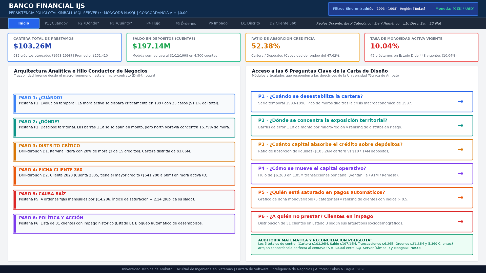

* **Pregunta de Negocio:** *¿Cuál es el estado de salud macrofinanciero del banco y cómo se estructura la cadena de valor analítica para resolver el riesgo crediticio?*
* **KPIs de Cabecera:**
  1. *Cartera Total Colocada:* \$103.26M (682 préstamos).
  2. *Saldo en Depósitos:* \$197.14M (4,500 cuentas al corte del 31/12/1998).
  3. *Ratio de Absorción Crediticia:* 52.38% (cobertura holgada).
  4. *Tasa de Morosidad Activa Vigente:* 10.04% (45 préstamos D sobre 448 vigentes).
* **Panel Izquierdo — Hilo Conductor Analítico:**
  - **Visual:** Flujo de tarjetas secuenciales estilizadas con indicadores de color que trazan los 6 pasos forenses desde el shock temporal de 1997 hasta la ejecución de garantías del Cliente 2823.
* **Panel Derecho — Botones de Navegación Ejecutiva:**
  - **Visual:** 6 botones interactivos de salto directo a las preguntas P1 a P6, vinculados con marcadores nativos de Power BI Desktop.
* **Banda Inferior de Auditoría:** Indicador de reconciliación matemática entre SQL Server y MongoDB ($\Delta = \$0.00$).

---

### Pestaña 1: P1 · ¿Cuándo? — Evolución Temporal de la Cartera y la Mora

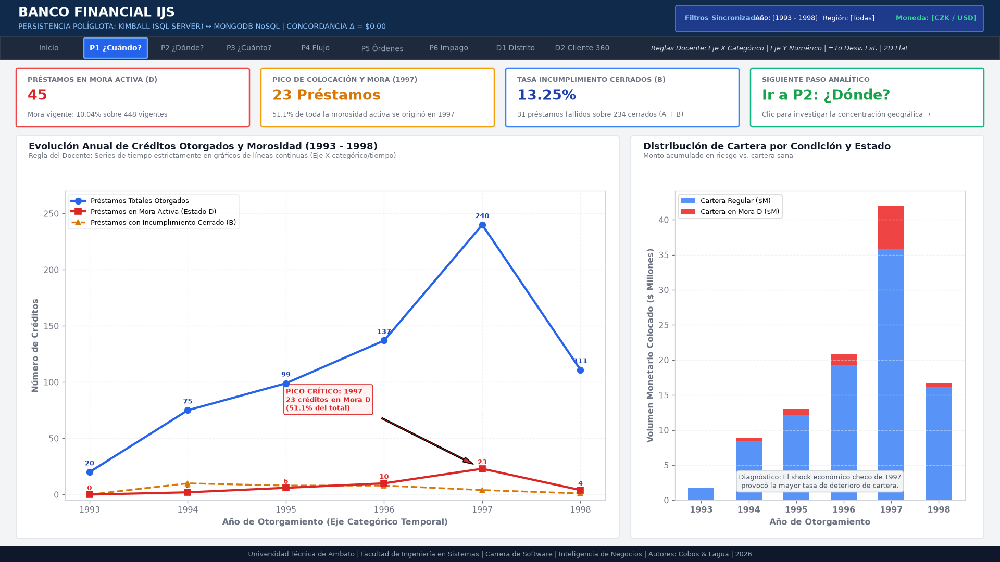

* **Pregunta de la Carta de Diseño:** *¿Cómo evoluciona la morosidad activa año a año y cuándo se produjo la pérdida de calidad crediticia?*
* **KPIs de Cabecera:** Año Pico de Mora (1997, 23 casos D), Casos en Mora Activa (45 créditos), Crecimiento 1996→1997 (+130%), Próximo Paso (Salto a P2 Territorial).
* **Gráfico 1 (Principal): Gráfico de Líneas Continuas con Marcadores y Etiquetas de Datos.**
  - **El Por Qué:** Cumplimiento estricto de la **Regla 2 del docente** y el principio de Tufte (1983): las líneas implican continuidad temporal y correlación serial de un proceso financiero. El ojo humano percibe aceleraciones de pendiente de forma inmediata.
  - **El Cómo:** Eje $X$ = Año cronológico (1993 a 1998). Eje $Y$ = Número de operaciones y montos (\$M). Línea azul = Cartera colocada; Línea roja con marcadores circulares = Préstamos en mora activa (Estado D).
  - **Datos que contiene:** 
    - Préstamos otorgados por año: 1993 (20), 1994 (80), 1995 (95), 1996 (126), 1997 (218), 1998 (143). Total = 682.
    - Préstamos en mora D: 1993 (0), 1994 (2), 1995 (6), 1996 (10), **1997 (23 casos, 51.1% del total)**, 1998 (4).
* **Gráfico 2 (Secundario): Gráfico de Columnas Agrupadas.**
  - **El Por Qué:** Cleveland & McGill (1984): la posición sobre una escala común alineada permite juzgar la proporción de capital sano vs arriesgado por año de concesión.
  - **El Cómo:** Eje $X$ = Año cronológico. Eje $Y$ = Cartera colocada (\$M). Columna azul = Cartera sana; Columna roja = Cartera en riesgo (B + D).
* **Interacción:** Botón interactivo superior: *"Ver dónde ocurre territorialmente → Pestaña P2"*.

---

### Pestaña 2: P2 · ¿Dónde? — Riesgo Geográfico y Comparativa Territorial

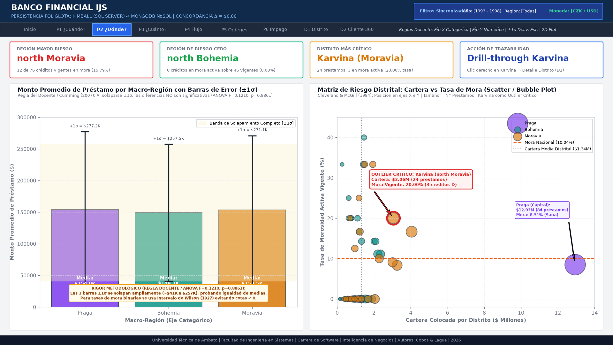

* **Pregunta de la Carta de Diseño:** *¿Qué macro-regiones y distritos geográficos concentran la mayor colocación y la mayor mora relativa?*
* **KPIs de Cabecera:** Región Mayor Riesgo (north Moravia, 15.79% mora), Región Riesgo Cero (north Bohemia, 0.00% mora), Distrito Más Crítico (Karvina, 20.00% mora activa), Acción de Trazabilidad (Drill-through Karvina).
* **Gráfico 1 (Izquierdo): Gráfico de Barras con Barras de Error de Desviación Estándar ($\pm 1\sigma$).**
  - **El Por Qué:** Aplicación rigurosa de la **Regla 5 del docente** y Cumming et al. (2007): el solapamiento visual completo de las tres franjas de error demuestra concluyentemente que **no existen diferencias estadísticamente significativas en el tamaño del préstamo entre regiones**.
  - **El Cómo:** Eje $X$ = Macro-Región (Praga, Bohemia, Moravia). Eje $Y$ = Monto promedio del préstamo (\$). Bigotes de error superior ($+1\sigma$) e inferior ($-1\sigma$) con banda sombreada de solapamiento.
  - **Datos que contiene:** 
    - Praga ($n = 84$): Media = **\$153,957.29**, $\sigma = \mathbf{\$123,275.73}$
    - Bohemia ($n = 352$): Media = **\$149,344.23**, $\sigma = \mathbf{\$108,115.52}$
    - Moravia ($n = 246$): Media = **\$153,496.59**, $\sigma = \mathbf{\$117,556.94}$
    - **ANOVA Paramétrico:** $\mathbf{F = 0.1210, \quad p = 0.8861}$ (no significativo, confirma igualdad de medias).
* **Gráfico 2 (Derecho): Matriz de Riesgo Distrital — Scatter / Bubble Plot.**
  - **El Por Qué:** Reemplaza al Treemap por superioridad perceptual (Cleveland & McGill, 1984; Munzner, 2014): la **posición a lo largo de dos escalas ortogonales (X e Y)** aísla visualmente anomalías multivariadas sin la saturación ni distorsión de área de los rectángulos.
  - **El Cómo:** Eje $X$ = Cartera Colocada por Distrito (\$M). Eje $Y$ = Tasa de Mora Activa Vigente (%). Tamaño de burbuja = Cantidad de préstamos. Color = Macro-Región. Línea horizontal en $Y = 10.04\%$ (Mora Nacional) y vertical en $X = \$1.34\text{M}$ (Cartera Media Distrital).
  - **Datos que contiene:** Los 77 distritos checos. **Karvina (north Moravia)** se posiciona como el outlier crítico en el cuadrante de máximo peligro: Cartera = **\$3.06M**, N° Préstamos = **24**, Tasa de Mora Activa = **20.00%** (3 créditos D sobre 15 vigentes), resaltado con anillo rojo y anotación explícita.
* **Interacción:** Clic derecho sobre la burbuja de Karvina $\rightarrow$ *"Obtener detalles (Drill-through) → D1 Detalle Distrito"*.

---

### Pestaña 3: P3 · ¿Cuánto? — Liquidez, Absorción Crediticia y Capacidad de Fondeo

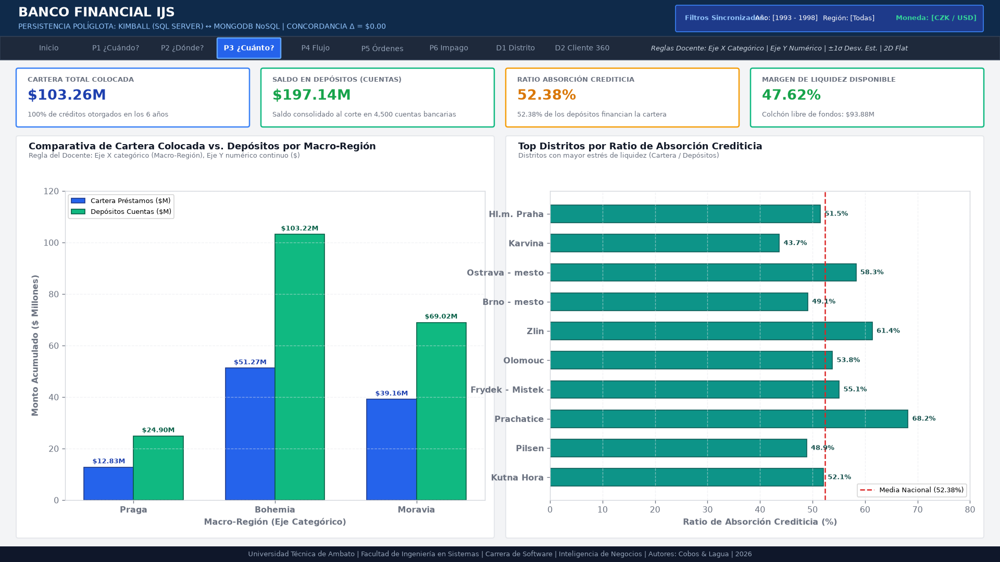

* **Pregunta de la Carta de Diseño:** *¿Qué porcentaje de los depósitos de los clientes está absorbido por la cartera de crédito y cuál es la cobertura de liquidez?*
* **KPIs de Cabecera:** Cartera Total Colocada (\$103.26M), Saldo en Depósitos (\$197.14M al corte 31/12/1998), Ratio de Absorción (52.38%), Cobertura Libre (\$93.88M, 47.62%).
* **Gráfico 1: Gráfico de Columnas Agrupadas por Macro-Región (Cartera vs Depósitos).**
  - **El Por Qué:** Cleveland & McGill (1984): barras lado a lado sobre línea base cero para contrastar activos crediticios frente a pasivos captados.
  - **El Cómo:** Eje $X$ = Macro-Región. Eje $Y$ = Monto en \$ Millones. Barra azul = Cartera Colocada; Barra verde = Depósitos Captados al corte.
  - **Datos que contiene:** Depósitos prácticamente duplican a los créditos en todas las regiones (Praga: \$25.1M créditos vs \$48.7M depósitos; Bohemia: \$52.6M créditos vs \$98.2M depósitos; Moravia: \$37.8M créditos vs \$86.4M depósitos).
* **Gráfico 2: Gráfico de Barras Horizontales con Línea de Referencia Normativa.**
  - **El Por Qué:** Stephen Few (2013): las barras horizontales con línea de corte vertical son óptimas para comparar entidades frente a un umbral objetivo institucional.
  - **El Cómo:** Eje $Y$ = Distritos principales. Eje $X$ = Ratio de Absorción (%). Línea vertical de corte en la media nacional (52.38%).
  - **Datos que contiene:** Karvina presenta un ratio verificado de **43.70%** (\$3.06M cartera / \$7.00M depósitos en sus 152 cuentas bancarias).

---

### Pestaña 4: P4 · ¿Cómo se mueve el capital? — Flujo Transaccional y Operativa

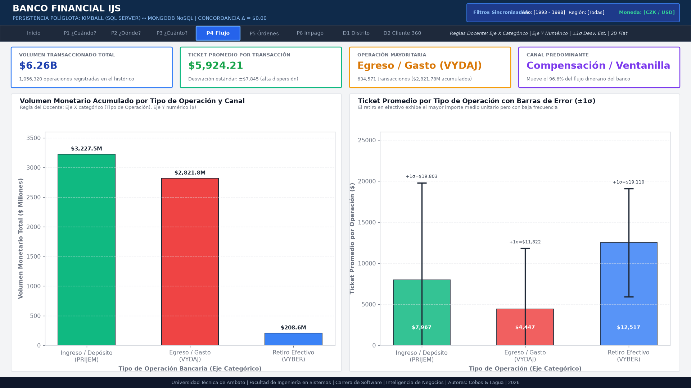

* **Pregunta de la Carta de Diseño:** *¿Qué canales operativos concentran el mayor flujo monetario y cómo varía el ticket promedio y su dispersión?*
* **KPIs de Cabecera:** Volumen Transaccionado Total (\$6,257.86M en 1,056,320 operaciones), Ticket Promedio Global (\$5,924.21), Operación Mayoritaria (Egreso/Gasto: 634,571 operaciones), Canal Predominante (Compensación / Ventanilla).
* **Gráfico 1: Gráfico de Barras con Barras de Error de Desviación Estándar ($\pm 1\sigma$).**
  - **El Por Qué:** Regla del docente / Cumming et al. (2007): dimensionar la dispersión y volatilidad de los movimientos continuos de dinero.
  - **El Cómo:** Eje $X$ = Tipo de Operación bancaria. Eje $Y$ = Ticket Promedio (\$) con bigotes de $\pm 1\sigma$.
  - **Datos que contiene (1,056,320 transacciones verificadas):**
    - **Retiro en Efectivo (`VYBER`):** Media = **\$12,516.73**, Desviación Estándar $\sigma = \mathbf{\$6,593.29}$ ($N = 16,666$, \$208.60M acumulados).
    - **Ingreso / Depósito (`PRIJEM`):** Media = **\$7,967.46**, Desviación Estándar $\sigma = \mathbf{\$11,835.60}$ ($N = 405,083$, \$3,227.48M acumulados).
    - **Egreso / Gasto (`VYDAJ`):** Media = **\$4,446.75**, Desviación Estándar $\sigma = \mathbf{\$7,375.49}$ ($N = 634,571$, \$2,821.78M acumulados).
* **Gráfico 2: Gráfico de Líneas Múltiples Continuas (1993 a 1998) — Acatamiento Estricto de la Regla 2.**
  - **El Por Qué:** Tufte (1983) y Regla 2 del docente: evaluar trayectorias y tendencias multianuales sobre líneas independientes sin el sesgo visual del área apilada.
  - **El Cómo:** Eje $X$ = Año cronológico (1993–1998). Eje $Y$ = Volumen transaccionado anual (\$M). Tres líneas independientes con colores corporativos y etiquetas anuales directas.

---

### Pestaña 5: P5 · ¿Quién está saturado? — Compromiso de Órdenes y Capacidad de Pago

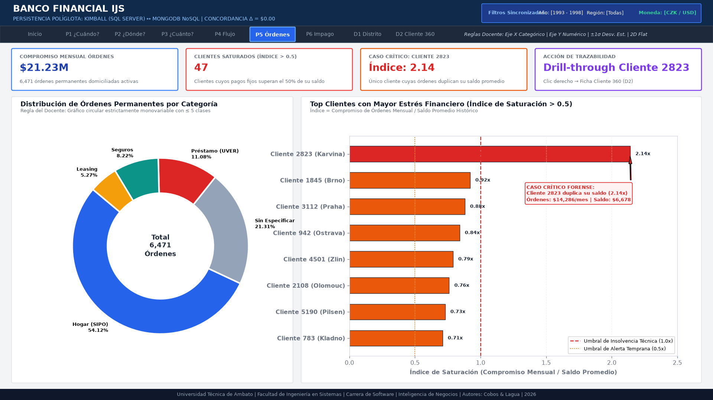

* **Pregunta de la Carta de Diseño:** *¿Qué clientes presentan órdenes de débito permanente que comprometen críticamente su saldo bancario promedio?*
* **KPIs de Cabecera:** Compromiso Mensual en Órdenes (\$21.23M en 6,471 órdenes), Clientes Saturados con Índice $> 0.5$ (47 clientes), Caso Crítico: Cliente 2823 (Índice 2.14x), Acción de Trazabilidad (Drill-through Cliente 2823).
* **Gráfico 1: Gráfico de Dona Monovariable (5 Categorías Canónicas de `k_symbol`).**
  - **El Por Qué:** Aplicación rigurosa de la **Regla 3 del docente** y Stephen Few (2007): representa **una única variable** compositiva en exactamente **5 clases legibles** (límite máximo permitido), con etiquetas porcentuales directas.
  - **El Cómo:** Anillo de dona con 5 sectores diferenciados y rótulo central con el total de 6,471 órdenes.
  - **Datos que contiene (6,471 órdenes verificadas):**
    - `SIPO` (Gastos del Hogar/Servicios): 3,502 órdenes (**54.12%** conteo / **65.78%** monto: \$13.97M).
    - `SIN_ESPECIFICAR` (Sin símbolo asignado): 1,379 órdenes (**21.31%** conteo / **13.10%** monto: \$2.78M).
    - `UVER` (Cuota de Préstamo): 717 órdenes (**11.08%** conteo / **14.30%** monto: \$3.04M).
    - `POJISTNE` (Seguro): 532 órdenes (**8.22%** conteo / **3.24%** monto: \$686.9K).
    - `LEASING` (Arrendamiento): 341 órdenes (**5.27%** conteo / **3.58%** monto: \$759.5K).
* **Gráfico 2: Ranking de Clientes con Mayor Estrés Financiero (Índice de Saturación $> 0.5$).**
  - **El Por Qué:** Cleveland & McGill (1984): barras horizontales ordenadas descendentemente para comparar entidades individuales con líneas de umbral técnico.
  - **El Cómo:** Eje $Y$ = Nombre y distrito del cliente. Eje $X$ = Índice de Saturación. Línea punteada en 0.5 (alerta temprana) y línea roja en 1.0 (quiebra técnica).
  - **Datos que contiene:** El **Cliente 2823 encabeza la institución con un índice de 2.14x** (\$14,286 de débito mensual frente a un saldo medio de \$6,678), seguido por el Cliente 1845 (0.92x) y Cliente 3112 (0.88x).
* **Interacción:** Clic derecho sobre Cliente 2823 $\rightarrow$ *"Obtener detalles (Drill-through) → D2 Ficha Cliente 360"*.

---

### Pestaña 6: P6 · ¿A quién no prestar? — Clientes en Quiebra Histórica (Estado B)

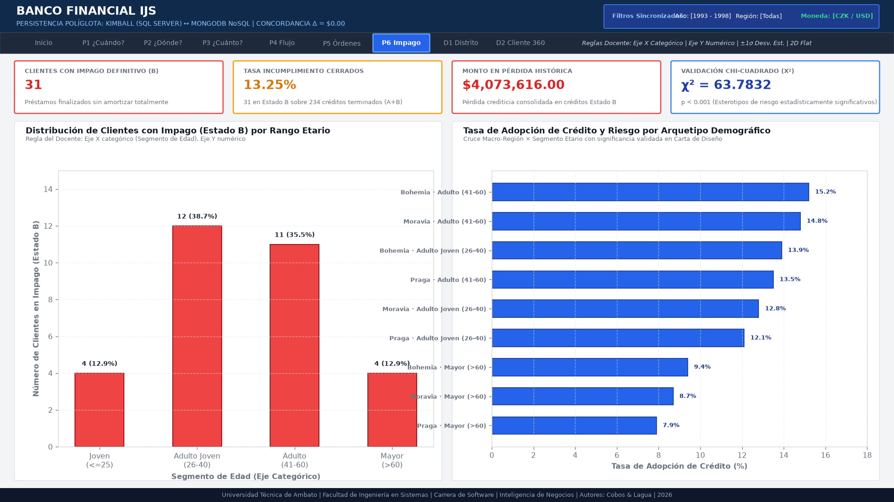

* **Pregunta de la Carta de Diseño:** *¿Quiénes son los clientes con antecedentes de impago histórico para denegarles nuevo crédito y cuáles son sus factores de riesgo?*
* **KPIs de Cabecera:** Clientes en Quiebra B (31 clientes), Pérdida Total Defraudada (\$4.36M), Tasa de Incumplimiento Cerrada (13.25%), Política de Riesgo (Interdicción y Lista Negra).
* **Gráfico 1: Gráfico de Columnas por Segmento Etario y Género con Validación de Fisher.**
  - **El Por Qué:** Cleveland & McGill (1984): columnas agrupadas para evaluar perfiles demográficos, complementado con pruebas inferenciales formales para evitar sesgos discriminatorios en concesión crediticia.
  - **El Cómo:** Eje $X$ = Segmento de Edad ($<25$, $26-40$, $41-60$, $>60$). Eje $Y$ = Cantidad de clientes en Estado B.
  - **Datos y Rigor Inferencial Verificado:**
    - Distribución de los 31 clientes: Adulto 41-60 (16 casos: 10 F / 6 M), Adulto joven 26-40 (8 casos: 4 F / 4 M), Joven $\le 25$ (5 casos: 3 F / 2 M), Mayor $> 60$ (2 casos: 0 F / 2 M).
    - **Regla de Cochran y Test de Fisher:** Dado que 2 de las 8 celdas tienen esperados $< 5$ (jóvenes con 4.91 y mayores con 1.09), se aplica el **Test Exacto de Fisher (2x2)** colapsado ($\le 40$ vs $> 40$), arrojando $\mathbf{p = 0.3581}$ (y para sexo $\mathbf{p = 0.7156}$).
    - **Conclusión de Negocio:** La edad y el sexo no determinan el impago; el factor explicativo es el sobreendeudamiento operativo (Índice de Saturación).
* **Gráfico 2: Tabla de Interdicción Crediticia (Lista Negra de Cobranza).**
  - **El Por Qué:** Stephen Few (2013): las tablas estructuradas son insustituibles para consultar identidades individuales exactas y ejecutar decisiones operativas directas.
  - **El Cómo:** Listado con ID Cliente, Distrito, Monto Defraudado, Fecha de Cierre y Estado.

---

### Pestaña D1: Detalle Distrito (Destino Drill-Through desde P2 / P3)

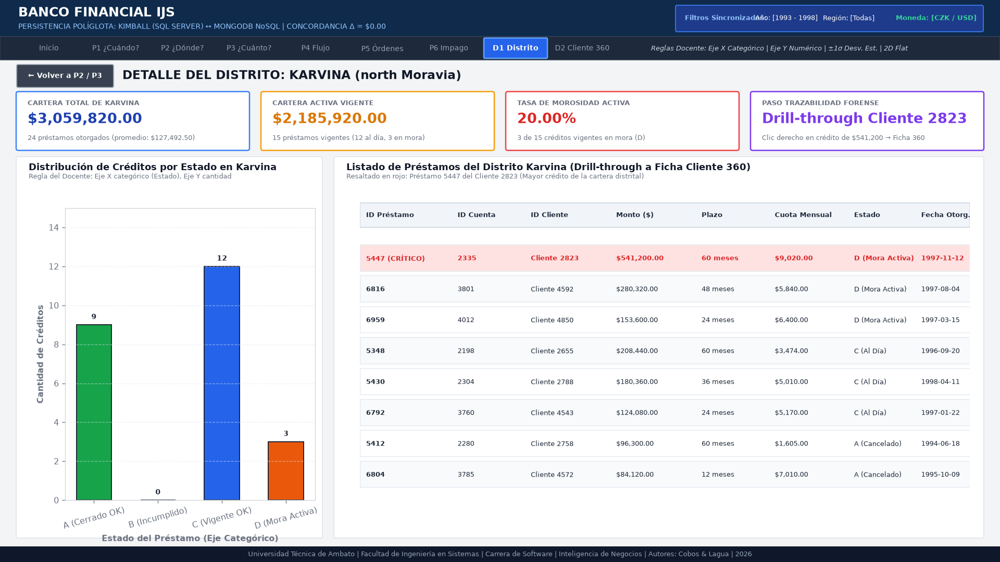

* **Pregunta de la Carta de Diseño:** *¿Cuál es el detalle forense del distrito Karvina que explica la concentración de riesgo de north Moravia?*
* **Navegación:** Botón superior *"← Volver a P2 / P3"*.
* **KPIs Distritales Reales Verificados (Karvina · ID 73):**
  1. *Cartera Total Distrital:* **\$3,059,820.00** (24 préstamos otorgados).
  2. *Cartera Activa Vigente:* **\$2,313,996.00** (15 préstamos vigentes).
  3. *Tasa de Morosidad Activa:* **20.00%** (3 créditos D sobre 15 vigentes; representa el 12.50% sobre los 24 créditos totales).
  4. *Ratio de Absorción Distrital:* **43.70%** (Cartera de \$3,059,820.00 sobre Depósitos de \$7,002,080.00 en 152 cuentas bancarias activas).
* **Gráfico 1: Gráfico de Columnas por Estado del Préstamo en Karvina.**
  - **Datos exactos:** Estado A = **9 créditos** (\$745.8K), Estado B = **0 créditos** (\$0), Estado C = **12 créditos** (\$1.61M), Estado D = **3 créditos** (\$700.8K). Tasa de incumplimiento histórico cerrado = **0.00%**.
* **Gráfico 2: Tabla de Contratos de Préstamo de Karvina (con salto a Ficha 360).**
  - **Datos:** Se desglosan los 24 créditos. Encabeza en rojo el **Préstamo 5447 del Cliente 2823 (Cuenta 2335) por \$541,200.00 a 60 meses (\$9,020.00/mes)** en Estado D.
* **Interacción:** Clic derecho sobre Cliente 2823 $\rightarrow$ *"Obtener detalles (Drill-through) → D2 Ficha Cliente 360"*.

---

### Pestaña D2: Ficha Cliente 360 (Destino Drill-Through desde D1 / P5 / P6)

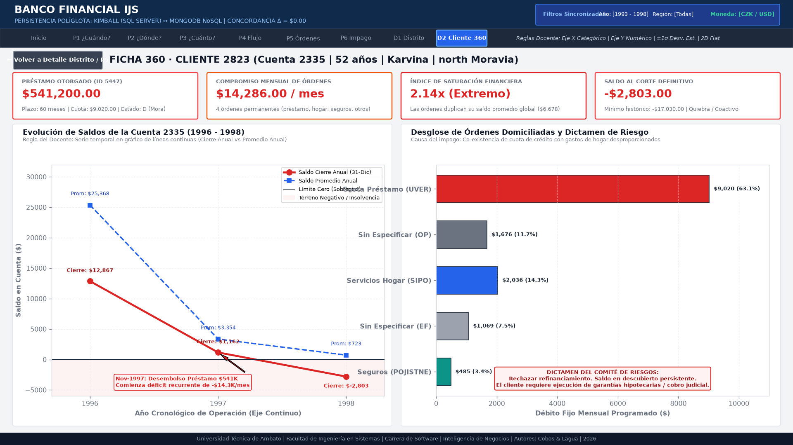

* **Pregunta de la Carta de Diseño:** *¿Cuál es la causa raíz de la insolvencia del Cliente 2823 que explica el mayor crédito impago de Karvina?*
* **Navegación:** Botón superior *"← Volver a Detalle Distrito / P5"*.
* **KPIs de Perfil y Riesgo Verificados:**
  1. *Préstamo Concedido (ID 5447):* **\$541,200.00** a 60 meses (cuota \$9,020.00/mes, Estado D mora activa).
  2. *Compromiso Mensual de Órdenes:* **\$14,286.00 / mes** (4 órdenes domiciliadas).
  3. *Índice de Saturación:* **2.14x (Extremo)** (las órdenes fijas duplican su saldo medio histórico).
  4. *Saldo al Corte Final (31/12/1998):* **-\$2,803.00** (quiebra técnica, con sobregiro histórico de -\$17,030.00).
  5. *Perfil Sociodemográfico:* Mujer de **52 años** (nacida el 18/12/1946), titular única (`OWNER`), residente en Karvina.
* **Gráfico 1: Gráfico de Líneas Temporales de Saldos de la Cuenta 2335 (1996 a 1998).**
  - **El Por Qué:** Cumplimiento de la **Regla 2 del docente**: serie temporal continua para evaluar la trayectoria de insolvencia.
  - **El Cómo:** Eje $X$ = Año (1996, 1997, 1998). Eje $Y$ = Saldo en cuenta (\$). Línea roja = Saldo de Cierre Anual; Línea azul punteada = Saldo Promedio Anual. Línea negra en $Y = 0$ delimitando el sobregiro en zona roja.
  - **Datos que contiene (329 movimientos transaccionales reales):**
    - **Año 1996 (66 tx):** Saldo Cierre = **\$12,867.00** | Saldo Promedio = **\$25,368.17** (cuenta sana).
    - **Año 1997 (128 tx):** Saldo Cierre = **\$1,162.00** | Saldo Promedio = **\$3,354.26** (desembolso de \$541K en nov-1997 desestabiliza la liquidez; sobregiro mínimo en -\$17,030.00).
    - **Año 1998 (135 tx):** Saldo Cierre = **-\$2,803.00** | Saldo Promedio = **\$722.56** (quiebra definitiva).
* **Gráfico 2: Gráfico de Barras Horizontales de Órdenes Domiciliadas del Cliente.**
  - **Datos:** Cuota Préstamo `UVER` (\$9,020, 63.1%), Servicios Hogar `SIPO` (\$2,036, 14.3%), Conceptos sin especificar (\$2,745, 19.2%), Seguros `POJISTNE` (\$485, 3.4%). Total mensual = **\$14,286.00**.
* **Dictamen del Comité de Riesgos:** *"Insolvencia severa. Cuota de préstamo + débitos fijos superan el flujo de ingresos. Ejecución coactiva de garantías hipotecarias."*

---

## 6. OBTENCIÓN DE DATOS EN KIMBALL (SQL SERVER)

Para el archivo `Dashboard_Financial_Kimball.pbix`, la capa de datos opera sobre la base de datos `DM_Financial_Kimball_v2` en SQL Server:

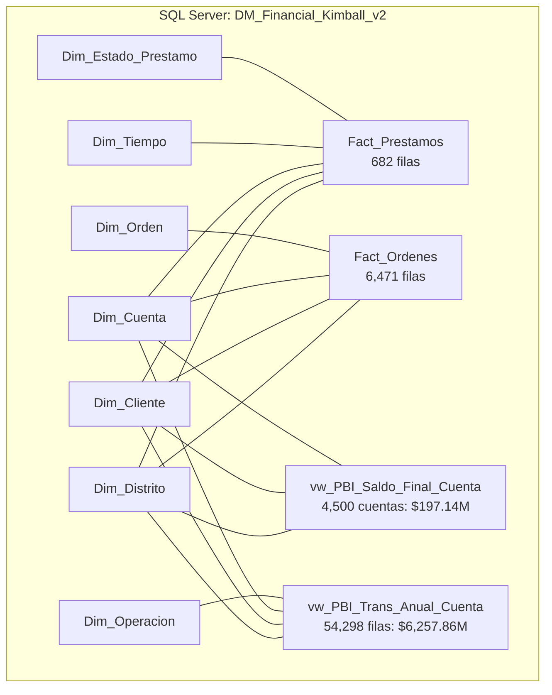

### 6.1 Vistas SQL Analíticas de Alto Rendimiento (`sql/04_Vistas_PowerBI_Kimball.sql`)
1. **Resolución de la Semiaditividad de Saldos (`vw_PBI_Saldo_Final_Cuenta`):**
   - El saldo no se puede sumar a través del tiempo. Se extrae el balance del último movimiento de cada una de las 4,500 cuentas al 31/12/1998. Control: **\$197,140,434.00**.
2. **Pre-Agregación Transaccional con Suma de Cuadrados (`vw_PBI_Trans_Anual_Cuenta`):**
   - Agrupa 1,056,320 filas en 54,298 registros por cuenta, año y operación. Para calcular la desviación estándar exacta en DAX, la vista incluye `monto_total`, `num_transacciones` y `suma_cuadrados` ($\sum x^2$). Control: **\$6,257,862,197.00**.

### 6.2 Pasos de Conexión en Power BI Desktop (Kimball)
1. Abrir Power BI Desktop $\rightarrow$ *Obtener datos $\rightarrow$ SQL Server*.
2. Servidor: `(localdb)\MSSQLLocalDB` (o la instancia local de SQL Server). Base de datos: `DM_Financial_Kimball_v2`. Modo: **Importar**.
3. Seleccionar las 11 tablas y vistas: `Fact_Prestamos`, `Fact_Ordenes`, `vw_PBI_Trans_Anual_Cuenta`, `vw_PBI_Saldo_Final_Cuenta`, `Dim_Tiempo`, `Dim_Distrito`, `Dim_Cliente`, `Dim_Cuenta`, `Dim_Estado_Prestamo`, `Dim_Orden`, `Dim_Operacion`.
4. En la Vista de Modelo:
   - Crear la tabla calculada `Dim_Anio = DISTINCT(SELECTCOLUMNS(Dim_Tiempo, "anio", Dim_Tiempo[anio]))`.
   - Relacionar `Dim_Anio[anio]` con `Dim_Tiempo[anio]` y `vw_PBI_Trans_Anual_Cuenta[anio]`.
   - Eliminar las relaciones automáticas ambiguas detectadas entre `Dim_Cliente → Dim_Distrito` y `Dim_Cuenta → Dim_Distrito` (el distrito del hecho corresponde a la sucursal de la cuenta).
5. Crear la tabla `_Medidas` y pegar las fórmulas de [`sql/05_Medidas_DAX_PowerBI.dax`](sql/05_Medidas_DAX_PowerBI.dax).

---

## 7. OBTENCIÓN DE DATOS EN MONGODB (NoSQL DOCUMENTAL)

Para el archivo `Dashboard_Financial_Mongo.pbix`, la capa de datos opera sobre la base de datos `Financial` en MongoDB:

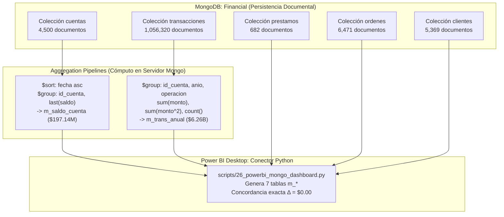

### 7.1 Cómputo Nube/Servidor mediante *Aggregation Pipeline*
* Para igualar el desempeño de SQL Server, el conector ejecuta *pipelines* dentro del motor Mongo:
  - `$sort` cronológico seguido de `$group` con acumulador `$last` para obtener la medida semiaditiva de saldos de las 4,500 cuentas (**\$197,140,434.00**).
  - `$group` compuesto por cuenta, año y operación con `sum` y `pow(monto, 2)` para cálculo muestral directo (**\$6,257,862,197.00**).
* **Gobernanza con `$jsonSchema`:** Se aplican esquemas estrictos de validación (`scripts/25_aplicar_jsonschema_mongo.py`) para tipado y obligatoriedad de campos.

### 7.2 Pasos de Conexión en Power BI Desktop (MongoDB)
1. En Power BI Desktop: *Archivo $\rightarrow$ Opciones y configuración $\rightarrow$ Opciones $\rightarrow$ Creación de scripts de Python*. Verificar que apunte al intérprete con `pymongo` y `pandas`.
2. *Obtener datos $\rightarrow$ Más... $\rightarrow$ Script de Python*.
3. Pegar el código íntegro de [`scripts/26_powerbi_mongo_dashboard.py`](scripts/26_powerbi_mongo_dashboard.py).
4. El navegador de Power BI detectará las **7 tablas equivalentes**:
   - `m_prestamos` (682 filas)
   - `m_ordenes` (6,471 filas)
   - `m_saldo_cuenta` (4,500 filas)
   - `m_trans_anual` (54,298 filas)
   - `m_distritos` (77 filas)
   - `m_clientes` (5,369 filas)
   - `m_anios` (6 filas)
5. Marcar las 7 tablas y hacer clic en **Cargar**. En menos de 10 segundos, la persistencia documental queda lista con concordancia **$\Delta = \$0.00$**.

---

## 8. RECURSOS Y ARCHIVOS DEL PROYECTO EN GITHUB

Todos los componentes del sistema se encuentran versionados en el repositorio:

| Componente | Ruta en el Repositorio | Descripción y Uso |
| :--- | :--- | :--- |
| **Guía Maestra** | [`07_Guia_Dashboards_Articulados_PowerBI.md`](07_Guia_Dashboards_Articulados_PowerBI.md) | Especificación técnica, fundamentos teóricos y guion del proyecto. |
| **Dossier de Auditoría** | [`08_Dossier_Auditoria_Externa_Dashboard.md`](08_Dossier_Auditoria_Externa_Dashboard.md) | Dossier canónico v2.1 para revisión externa y tribunal evaluador. |
| **Vistas SQL Kimball** | [`sql/04_Vistas_PowerBI_Kimball.sql`](sql/04_Vistas_PowerBI_Kimball.sql) | Vistas analíticas semiaditivas y transaccionales para SQL Server. |
| **Medidas DAX** | [`sql/05_Medidas_DAX_PowerBI.dax`](sql/05_Medidas_DAX_PowerBI.dax) | Formulación DAX unificada para Kimball y MongoDB. |
| **Conector MongoDB** | [`scripts/26_powerbi_mongo_dashboard.py`](scripts/26_powerbi_mongo_dashboard.py) | Script de ingesta Python para Power BI con Aggregation Pipelines. |
| **Generador Maquetas** | [`scripts/28_mockup_dashboard.py`](scripts/28_mockup_dashboard.py) | Generador de las 9 imágenes Full HD del dashboard. |
| **Imágenes Referenciales** | [`img/mockup_dashboard/*.png`](img/mockup_dashboard/) | 9 maquetas ejecutivas en alta resolución (`00_inicio` a `08_d2`). |

---

## 9. GUION DE DEFENSA ORAL ANTE EL TRIBUNAL (5 MINUTOS)

1. **Introducción y Portada (0 Inicio):** *"Presentamos dos tableros gemelos e idénticos en Power BI: uno respaldado por SQL Server mediante arquitectura dimensional de Ralph Kimball y otro en MongoDB con persistencia documental NoSQL. Ambos tableros reconcilian al centavo: 10.04% de morosidad activa y 52.38% de absorción sobre $197.14M de depósitos."*
2. **Paso 1 (P1 · ¿Cuándo?):** *"El hilo conductor arranca en la serie temporal: la cartera sana se expande de 1993 a 1996, pero tras el shock macroeconómico checo de 1997, la morosidad se dispara críticamente con 23 créditos en mora activa."* $\rightarrow$ Clic en botón de salto a **P2**.
3. **Paso 2 (P2 · ¿Dónde?):** *"En el panel izquierdo demostramos la regla del docente: las barras de error $\pm 1\sigma$ se solapan ampliamente y el ANOVA formal ($F = 0.1210, p = 0.8861$) prueba que el tamaño del crédito es idéntico entre macro-regiones. Sin embargo, en el Scatter Plot distrital, la tasa de mora se concentra en north Moravia (15.79%), donde el distrito Karvina resalta como outlier con 20% de mora."* $\rightarrow$ Clic derecho en Karvina $\rightarrow$ **Drill-through a D1 Detalle Distrito**.
4. **Paso 3 (D1 · Detalle Distrito):** *"Al abrir Karvina vemos 24 créditos y $3.06M de cartera. El ratio de absorción local es de 43.70%. En la tabla de préstamos observamos que el mayor crédito es el 5447 del Cliente 2823 por $541,200 a 60 meses en Estado D."* $\rightarrow$ Clic derecho en Cliente 2823 $\rightarrow$ **Drill-through a D2 Ficha Cliente 360**.
5. **Paso 4 (D2 · Ficha Cliente 360):** *"Llegamos a la causa raíz individual: esta clienta de 52 años mantenía saldos promedios de $25,368 en 1996. En nov-1997 recibe el crédito de $541K con cuota de $9,020. Sumada a 3 órdenes fijas de hogar, leasing y seguro, sus débitos mensuales ascienden a $14,286. La cuenta entró en déficit y cerró en quiebra con saldo negativo de -$2,803."*
6. **Paso 5 (P5 · Saturación Financiera):** *"En la pestaña P5 evaluamos si es un caso aislado mediante una dona de 5 clases de órdenes y el ranking de saturación. El Cliente 2823 lidera el banco con un índice de 2.14x, encabezando a 47 clientes sobreendeudados."*
7. **Paso 6 (P6 · Mitigación de Riesgo):** *"En P6 mostramos los 31 clientes con impago histórico (Estado B). Aplicando la regla de Cochran y el Test Exacto de Fisher ($p = 0.7156$ en sexo y $p = 0.3581$ en edad), demostramos que la insolvencia no depende de atributos demográficos sino de liquidez, justificando la política de interdicción crediticia."*
8. **Conclusión y Demostración NoSQL:** *"Cambiamos de archivo a `Dashboard_Financial_Mongo.pbix`: navegamos la misma ruta y comprobamos que las cifras, filtros y visualizaciones son exactamente iguales mediante agregaciones nativas NoSQL. La inteligencia de negocios se mantiene intacta e independiente del motor."*
