# UNIVERSIDAD TÉCNICA DE AMBATO
## FACULTAD DE INGENIERÍA EN SISTEMAS ELECTRÓNICA E INDUSTRIAL
### CARRERA DE SOFTWARE — ASIGNATURA: INTELIGENCIA DE NEGOCIOS
### CICLO ACADÉMICO: AGOSTO 2026 – DICIEMBRE 2026

---

# INFORME 09 — CARGA ETL: OLTP `Financial_ijs` → OLAP KIMBALL `DM_Financial_Kimball_v2`

**Autores:** Alison Marcela Cobos Taco / Henry Daniel Lagua Flores  
**Docente:** Ing. Ruben Nogales, Mg.  
**Base de diseño:** Carta de Diseño v8 (`01_Carta_de_Diseno_Financial_ijs.md`) e Informe 02 v2 (`02_Analisis_Arquitecturas_Kimball_Inmon.md`)  
**Script:** `scripts/31_etl_oltp_a_kimball.py`  
**Evidencia:** `metricas_carga_kimball.json` y tablas `Auditoria_Carga` / `Auditoria_Anomalias` del Data Mart

---

## 1. Resumen de la ejecución

| Dato | Valor |
| :--- | :--- |
| Identificador de ejecución | `20260928_214018` (última ejecución; incluye la tabla puente) |
| Fuente (OLTP) | MySQL `relational.fel.cvut.cz:3306` / `Financial_ijs` (usuario `guest`, solo lectura) |
| Destino (OLAP) | SQL Server `(localdb)\MSSQLLocalDB` / `DM_Financial_Kimball_v2` |
| Duración total | 124.2 segundos (extracción, transformación, carga y validación) |
| Filas extraídas | 1,079,914 (9 tablas) |
| Filas cargadas | 1,266,618 (7 dimensiones, 4 hechos y la tabla puente cuenta–cliente) |
| Pruebas de validación | **23 de 23 OK** |
| Anomalías de la fuente registradas | 2 |

---

## 2. Cómo ejecutar la carga

```bash
pip install pymysql pyodbc pandas numpy scipy
```

```bash
python scripts/31_etl_oltp_a_kimball.py --recrear
```

```bash
python scripts/31_etl_oltp_a_kimball.py
```

* **Con `--recrear`:** renombra la base Kimball existente como respaldo y crea desde cero `DM_Financial_Kimball_v2` y `EDW_Financial_Inmon` con los DDL del repositorio (`sql/01` y `sql/02`). Después carga y valida.
* **Sin parámetros:** vacía las tablas del Data Mart y vuelve a cargarlas. Se puede repetir las veces que se quiera con el mismo resultado; el historial de auditoría se conserva.

---

## 3. Preparación del entorno (ejecutada el 28/09/2026)

| Base de datos | Estado |
| :--- | :--- |
| `DM_Financial_Kimball_v2` | **Creada de nuevo** con `sql/01_DDL_Kimball_DM_Financial.sql` (Carta v8) y cargada por este ETL |
| `DM_Financial_Kimball_v2_respaldo_20260928` | Base Kimball anterior (modelo v7, cargado con `etl_populate_kimball_v2.py` y enriquecido con el *write-back*). Se conserva sin cambios como respaldo |
| `EDW_Financial_Inmon` | **Creada de nuevo** con `sql/02_DDL_Inmon_EDW_Financial.sql`: 13 tablas y 7 vistas, sin datos (arquitectura de referencia, Informe 02) |

---

## 4. Flujo del ETL

```mermaid
flowchart LR
    subgraph E["1. Extracción"]
        M["MySQL Financial_ijs<br>9 tablas · 1,079,414 filas"]
    end
    subgraph T["2. Transformación (pandas)"]
        T1["Normalización NULL / '' → SIN_ESPECIFICAR"]
        T2["Homologación checo → español"]
        T3["Derivaciones: sexo, nacimiento, edad,<br>etiqueta, capacidad de pago, saldo por cobrar"]
        T4["Foto mensual de saldos con arrastre"]
        T5["Titular OWNER y distrito de la cuenta<br>para cada hecho"]
    end
    subgraph C["3. Carga (pyodbc)"]
        D["7 dimensiones"] --> F["4 hechos"] --> V["Vistas sql/04"]
    end
    subgraph Q["4. Validación"]
        P["23 pruebas (Carta 12.3)"] --> A["Auditoria_Carga<br>Auditoria_Anomalias<br>metricas_carga_kimball.json"]
    end
    M --> T1 --> T2 --> T3 --> T4 --> T5 --> D
    V --> P
```



---

## 5. Qué información del OLTP pasó al OLAP

### 5.1 Resumen por tabla

| Tabla OLTP | Filas | Destino en el Data Mart | Filas destino |
| :--- | ---: | :--- | ---: |
| `districts` | 77 | `Dim_Distrito` | 77 |
| `accounts` | 4,500 | `Dim_Cuenta` | 4,500 |
| `clients` | 5,369 | `Dim_Cliente` | 5,369 |
| `disps` | 5,369 | `Puente_Cuenta_Cliente` (cuenta de cada cliente, titular o cotitular), rol en `Dim_Cliente` y titular (`sk_cliente`) de todos los hechos | 5,369 |
| `loans` | 682 | `Fact_Prestamos` (+ etiqueta de `Dim_Cliente`, + crédito externo de `Dim_Cuenta`) | 682 |
| `trans` | 1,056,320 | `Fact_Transacciones`, `Dim_Operacion` y `Fact_Saldo_Cuenta_Mensual` | 1,056,320 / 15 / 185,615 |
| `orders` | 6,471 | `Fact_Ordenes`, `Dim_Orden` y crédito externo de `Dim_Cuenta` | 6,471 / 5 |
| `tkeys` | 234 | No se carga: la etiqueta se deriva de `loans.status` (equivalencia verificada) | — |
| `cards` | 892 | No se carga: fuera del alcance (Carta v8, sección 4) | — |
| — (generada) | — | `Dim_Tiempo` (1993-01-01 a 1998-12-31) y `Dim_Estado_Prestamo` (A–D) | 2,191 / 4 |

### 5.2 Mapeo columna a columna

> Los textos traducidos se almacenan **sin tildes** en el Data Mart (por ejemplo, `Deposito en efectivo`, `Pension`), igual que en el modelo anterior, para evitar problemas de codificación entre MySQL, SQL Server, MongoDB y Power BI. Aquí se muestran con tildes solo para facilitar la lectura.

#### `Dim_Tiempo` (generada, no viene del OLTP)

| Destino | Regla |
| :--- | :--- |
| `fecha`, `anio`, `semestre`, `trimestre`, `mes`, `dia` | Calendario continuo del 01/01/1993 al 31/12/1998 (2,191 días) |
| `nombre_mes`, `dia_semana`, `nombre_dia` | En español; lunes = 1 |
| `es_fin_de_semana`, `es_fin_de_mes` | Marcas; el fin de mes es la fecha que usa la foto de saldos |

#### `Dim_Distrito` ← `districts`

| Origen | Destino | Transformación |
| :--- | :--- | :--- |
| `id` | `id_distrito_bk` | Directo |
| `A2` | `nombre_distrito` | Recorte de espacios |
| `A3` | `region` | Recorte de espacios |
| `A4` | `poblacion` | Directo |
| `A11` | `salario_promedio` | Decimal |
| `A12` / `A13` | `tasa_desempleo` (1995) / `tasa_desempleo_1996` | Decimal; `NULL` se conserva |
| `A15` / `A16` | `tasa_criminalidad` (1995) / `tasa_criminalidad_1996` | Decimal; `NULL` se conserva |
| — | `es_imputado`, `metodo_imputacion`, `fecha_enriquecimiento` | Quedan en `0` / `NULL`: los completa el *write-back* (ver huecos) |
| `A5`–`A10`, `A14` | — | **No se cargan:** municipios por tamaño, número de ciudades, % urbano y emprendedores por mil habitantes no responden a ninguna pregunta de la Carta |

#### `Dim_Cuenta` ← `accounts` (+ `orders`, `loans`)

| Origen | Destino | Transformación |
| :--- | :--- | :--- |
| `accounts.id` | `id_cuenta_bk` | Directo |
| `accounts.frequency` | `frecuencia_emision_estado` | `POPLATEK MESICNE` → Extracto mensual; `POPLATEK TYDNE` → Extracto semanal; `POPLATEK PO OBRATU` → Extracto después de cada transacción |
| `accounts.date` | `fecha_apertura` | Directo (`DATE`) |
| `accounts.district_id` | `sk_distrito` | Clave sustituta del distrito **de la cuenta** |
| `orders` (`UVER`) sin fila en `loans` | `tiene_credito_externo`, `monto_credito_externo` | 1 y suma mensual de esas órdenes: 35 cuentas, $177,154 |

#### `Dim_Cliente` ← `clients` (+ `disps`, `loans`)

| Origen | Destino | Transformación |
| :--- | :--- | :--- |
| `clients.id` | `id_cliente_bk` | Directo |
| `clients.birth_number` (`AAMMDD`) | `sexo`, `fecha_nacimiento` | Si el mes > 50: `F` y mes − 50; si no, `M`. Año = 1900 + AA |
| — | `edad_corte` | 1998 − año de nacimiento (corte 31/12/1998) |
| `disps.type` | `tipo_disposicion` | `OWNER` / `DISPONENT` |
| `loans.status` de la cuenta del cliente | `etiqueta_buen_pagador` | A → 1 (258 clientes), B → 0 (31), sin préstamo cerrado → `NULL` (5,080) |
| `clients.district_id` | `sk_distrito` | Distrito de **residencia** |
| — | `macro_region`, `segmento_edad`, `arquetipo_demografico`, `tiene_prestamo`, `total_ordenes_activas`, `saldo_promedio`, `calificacion_pago_desc` | Quedan en valores por defecto: los completa el *write-back* (ver huecos) |
| `clients.birth_number` | — | **No se carga** el valor original (minimización de datos personales) |

#### `Dim_Operacion` ← combinaciones de `trans.type` + `trans.operation` + `trans.k_symbol`

| Origen | Destino | Transformación |
| :--- | :--- | :--- |
| `type` | `tipo_original`, `tipo_movimiento` | `PRIJEM` → Ingreso, `VYDAJ` → Egreso, `VYBER` → Retiro |
| `operation` (NULL o `''` → `SIN_ESPECIFICAR`) | `operacion_original`, `operacion_traducida` | `VKLAD` → Depósito en efectivo; `PREVOD Z UCTU` → Transferencia entrante; `PREVOD NA UCET` → Transferencia saliente; `VYBER` → Retiro en efectivo; `VYBER KARTOU` → Retiro con tarjeta; sin operación → Abono bancario; `SLUZBY` y `SANKC. UROK` → Cargo bancario |
| `k_symbol` (NULL o `''` → `SIN_ESPECIFICAR`) | `k_symbol_original`, `concepto_traducido` | `DUCHOD` → Pensión; `UROK` → Intereses ganados; `SLUZBY` → Comisión por servicios; `SIPO` → Servicios del hogar; `POJISTNE` → Pago de seguro; `UVER` → Cuota de préstamo; `SANKC. UROK` → Interés sancionatorio por sobregiro |
| `type` + `k_symbol` | `categoria_analitica` | `PRIJEM` + `UROK` → Intereses Ganados; resto de `PRIJEM` → Ingreso / Depósito; `VYDAJ` → Egreso / Gasto; `VYBER` → Retiro en Efectivo |

Resultado: **15 filas**, una por combinación real de la fuente.

#### `Dim_Orden` y `Dim_Estado_Prestamo` (catálogos)

| Destino | Contenido |
| :--- | :--- |
| `Dim_Orden` | `SIPO` Servicios del Hogar · `UVER` Cuota de Préstamo · `POJISTNE` Pago de Seguros · `LEASING` Arrendamiento / Leasing · `SIN_ESPECIFICAR` (valor vacío en la fuente) Sin Especificar |
| `Dim_Estado_Prestamo` | A Cerrado, pagado sin problemas · B Cerrado, terminado con deuda · C Vigente, al día · D Vigente, en mora |

#### `Puente_Cuenta_Cliente` ← `disps`

| Origen | Destino | Transformación |
| :--- | :--- | :--- |
| `disps.account_id` | `sk_cuenta` | Clave sustituta de la cuenta |
| `disps.client_id` | `sk_cliente` | Clave sustituta del cliente (única: cada cliente tiene una sola cuenta) |
| `disps.type` | `tipo_disposicion` | `OWNER` / `DISPONENT` |

Resuelve la relación multivaluada cuenta–cliente: los hechos se unen solo al titular, y esta tabla permite llegar a los 869 cotitulares (por ejemplo, para el Cliente 360 de MongoDB). Se añadió al migrar a MongoDB (Informe 05).

#### `Fact_Prestamos` ← `loans` (+ `trans` previas, `disps`, `accounts`)

| Origen | Destino | Transformación |
| :--- | :--- | :--- |
| `loans.id` | `id_prestamo_bk` | Directo |
| `loans.date` | `sk_tiempo` | Fecha de otorgamiento |
| `loans.account_id` | `sk_cuenta`, `sk_cliente`, `sk_distrito` | Cuenta; **titular OWNER** de la cuenta; **distrito de la cuenta** |
| `loans.status` | `sk_estado_prestamo` | Catálogo A–D |
| `loans.amount`, `payments`, `duration` | `monto_prestamo`, `pago_mensual`, `plazo_meses` | Directo (`DECIMAL(12,2)`) |
| — | `meses_transcurridos_al_corte` | Meses entre el mes de otorgamiento y diciembre de 1998 |
| — | `saldo_pendiente_estimado` | C y D: max(0, monto − cuota × min(plazo, meses)); A y B: 0 (cerrados; la deuda de B no es estimable y se mide con el monto original). Total: $46,620,926 |
| `trans.balance` anteriores a `loans.date` | `saldo_promedio_previo` | Promedio de los saldos de la cuenta antes del préstamo (los 682 tienen historial) |
| — | `ratio_cuota_saldo_previo`, `banda_capacidad` | Cuota / saldo previo; Baja ≤ 5.7% · Media-baja ≤ 9.0% · Media-alta ≤ 12.3% · Alta |

#### `Fact_Transacciones` ← `trans`

| Origen | Destino | Transformación |
| :--- | :--- | :--- |
| `id` | `id_transaccion_bk` | Directo (desempate del último saldo del día) |
| `date` | `sk_tiempo` | Directo |
| `account_id` | `sk_cuenta`, `sk_cliente`, `sk_distrito` | Cuenta; titular OWNER; distrito de la cuenta |
| `type`, `operation`, `k_symbol` | `sk_operacion` | Combinación normalizada en `Dim_Operacion` |
| `amount`, `balance` | `monto_transaccion`, `saldo_cuenta` | Directo |
| `bank`, `account` | — | **No se cargan:** banco y cuenta de la contraparte no responden a ninguna pregunta y son datos de terceros |

#### `Fact_Saldo_Cuenta_Mensual` ← derivado de `trans`

| Destino | Regla |
| :--- | :--- |
| `sk_cuenta`, `sk_mes` | Cada cuenta desde su primer mes con movimientos hasta diciembre de 1998; `sk_mes` = último día del mes |
| `saldo_fin_mes` | Saldo del último movimiento del mes (orden por fecha e id); si no hubo movimientos, se arrastra el del mes anterior |
| `saldo_promedio_mes` | Promedio de los saldos del mes; si no hubo movimientos, igual al saldo arrastrado |
| `num_movimientos_mes`, `en_sobregiro` | Conteo del mes; 1 si el saldo de fin de mes es negativo |
| `sk_cliente`, `sk_distrito` | Titular OWNER y distrito de la cuenta |

Resultado: 185,615 filas; diciembre de 1998 suma $197,140,434 con 39 cuentas en sobregiro.

#### `Fact_Ordenes` ← `orders`

| Origen | Destino | Transformación |
| :--- | :--- | :--- |
| `id` | `id_orden_bk` | Directo |
| `account_id` | `sk_cuenta`, `sk_cliente`, `sk_distrito` | Cuenta; titular OWNER; distrito de la cuenta |
| `accounts.date` de la cuenta | `sk_tiempo_apertura_cuenta` | La orden no tiene fecha en la fuente: se usa la apertura de la cuenta como referencia, no apta para series temporales |
| `k_symbol` (vacío → `SIN_ESPECIFICAR`) | `sk_orden_tipo` | Catálogo `Dim_Orden` |
| `amount` | `monto_orden` | Directo |
| `bank_to`, `account_to` | — | **No se cargan** (datos de terceros sin uso analítico) |

---

## 6. Resultado de la validación

Pruebas del plan de validación de la Carta v8 (sección 12.3), ejecutadas automáticamente al final de la carga:

| # | Prueba | Esperado | Obtenido | Resultado |
| :-: | :--- | :--- | :--- | :-: |
| 1 | Préstamos por estado | A 203 · B 31 · C 403 · D 45 | A 203 · B 31 · C 403 · D 45 | OK |
| 1 | `trans` → `Fact_Transacciones` | 1,056,320 | 1,056,320 | OK |
| 1 | `orders` → `Fact_Ordenes` | 6,471 | 6,471 | OK |
| 1 | `clients` → `Dim_Cliente` | 5,369 | 5,369 | OK |
| 1 | `accounts` → `Dim_Cuenta` | 4,500 | 4,500 | OK |
| 1 | `districts` → `Dim_Distrito` | 77 | 77 | OK |
| 1 | `disps` → `Puente_Cuenta_Cliente` | 5,369 | 5,369 | OK |
| 2 | Monto de préstamos | $103,261,740.00 | $103,261,740.00 | OK |
| 2 | Monto de transacciones | $6,257,862,197.00 | $6,257,862,197.00 | OK |
| 2 | Monto de órdenes | $21,229,041.00 | $21,229,041.00 | OK |
| 3 | Saldo neto al corte (foto dic-1998) | $197,140,434.00 | $197,140,434.00 | OK |
| 3 | Cuentas en sobregiro al corte | 39 | 39 | OK |
| 3 | Filas de la foto mensual | 185,615 | 185,615 | OK |
| 4 | Claves nulas en hechos (FK declaradas) | 0 | 0 | OK |
| 5 | Movimientos por categoría | Ingreso 221,969 · Intereses 183,114 · Egreso 634,571 · Retiro 16,666 | Idéntico | OK |
| 5 | Filas de `Dim_Operacion` | 15 | 15 | OK |
| 6 | Cartera por región (8 regiones) | Calculada en la fuente con el distrito de la cuenta | Idéntica | OK |
| 6 | Saldo al corte por región (8 regiones) | Calculado en la fuente con el distrito de la cuenta | Idéntico | OK |
| 7 | Bandas de capacidad (préstamos, impagos) | Baja 171/5 · Media-baja 167/16 · Media-alta 172/15 · Alta 172/40 | Idéntico | OK |
| 7 | Cuentas con crédito externo | 35 | 35 | OK |
| 7 | Saldo por cobrar estimado C + D | $46,620,926.00 | $46,620,926.00 | OK |
| 8 | χ² mora × año 1994–1997 (p) | 0.93 | 0.93 | OK |
| 8 | χ² impago × cuartil de capacidad | 39.01 | 39.01 | OK |

Las pruebas 6 comparan contra la fuente, no contra el propio Data Mart: la cartera y el saldo por región se calculan en Python directamente desde `loans`, `trans` y `accounts.district_id`.

---

## 7. Anomalías de la fuente registradas

| Tabla | Clave | Descripción | Tratamiento |
| :--- | :--- | :--- | :--- |
| `districts` | 69 (Jesenik) | Desempleo y criminalidad 1995 en `NULL` (1996: 7.0 y 1,358) | Se carga `NULL`; la imputación corresponde al *write-back* |
| `clients` | 6275 | `tkey_id = 234` no existe en `tkeys` (ids 0–233) | No se usa `tkeys`; la etiqueta se deriva de `loans.status` |

Consulta para revisarlas:

```sql
SELECT * FROM DM_Financial_Kimball_v2.dbo.Auditoria_Anomalias WHERE id_ejecucion = '20260928_214018';
```

---

## 8. Huecos conocidos y pendientes

La carga del modelo dimensional está completa. Estos son los puntos que quedan abiertos, en el orden en que conviene resolverlos:

| # | Hueco | Situación actual | Qué falta |
| :-: | :--- | :--- | :--- |
| 1 | ~~Imputación del distrito 69~~ | **Resuelto en el Informe 10** (scripts 32 a 34): desempleo 5.83 y criminalidad 1,326, `es_imputado = 1` | — |
| 2 | ~~Atributos de enriquecimiento de `Dim_Cliente`~~ | **Resuelto en el Informe 10**: los 5,369 clientes enriquecidos; además, concepto completado de las 1,056,320 transacciones en `Dim_Concepto_Movimiento` | — |
| 3 | **Proyecto Power BI Kimball** | El modelo `.pbip` usa columnas que cambiaron de nombre: `Dim_Operacion.tipo_operacion_original`, `tipo_operacion_traducido` y `canal` (ahora `tipo_original`, `categoria_analitica`, etc.) y `Fact_Ordenes.sk_tiempo` (ahora `sk_tiempo_apertura_cuenta`) | Regenerar con `scripts/30_generar_powerbi_pbip.py` después de actualizarlo; agregar `Fact_Saldo_Cuenta_Mensual` y las medidas de capacidad |
| 4 | **Medidas DAX** (`sql/05`) | `Ratio Absorcion` todavía usa la cartera total (52.38%) y no hay medidas de capacidad de pago | Actualizarlas a la Carta v8 (cartera vigente: 40.73%) |
| 5 | **Vista agregada de transacciones** | `vw_PBI_Trans_Anual_Cuenta` funciona, pero ahora agrupa por las 15 operaciones (93,679 filas) | Evaluar si agrupar por `categoria_analitica` para reducir filas |
| 6 | **Réplica MongoDB** | `scripts/22_migrar_kimball_a_mongodb.py` todavía lee la estructura anterior | Actualizarlo para guardar el distrito de la cuenta y la categoría analítica, y volver a migrar |
| 7 | **Documentos 03 a 08 y README** | Siguen citando cifras del modelo anterior (por ejemplo, 52.38% y 3 categorías de operación) | Actualizarlos a la Carta v8 |
| 8 | **Tarjetas (`cards`)** | No cargadas | Fuera de alcance por decisión de la Carta; se incorporaría como `Dim_Tarjeta` |

---

## 9. Trazabilidad

| Evidencia | Dónde está | Qué contiene |
| :--- | :--- | :--- |
| Código del ETL | `scripts/31_etl_oltp_a_kimball.py` | Extracción, transformaciones, carga y pruebas |
| Estructura destino | `sql/01_DDL_Kimball_DM_Financial.sql` | 8 dimensiones (la 8.ª, `Dim_Concepto_Movimiento`, la llena la completitud del Informe 10), 4 hechos, 2 tablas de auditoría |
| Resumen de la ejecución | `metricas_carga_kimball.json` | Filas extraídas y cargadas, las 23 pruebas y las anomalías |
| Historial de validaciones | Tabla `Auditoria_Carga` | Una fila por prueba y ejecución |
| Historial de anomalías | Tabla `Auditoria_Anomalias` | Registros de la fuente que no cumplen una regla |
| Reglas de diseño | `01_Carta_de_Diseno_Financial_ijs.md` (v8) | Grano, reglas de cálculo, homologación y plan de validación |
