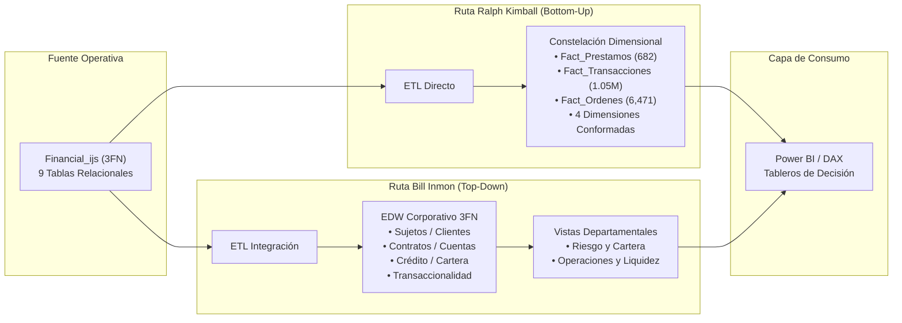

# Repositorio de Documentación de Inteligencia de Negocios
## Caso de Estudio: Banco Comercial Checo (`Financial_ijs`)

**Universidad Técnica de Ambato**  
**Facultad de Ingeniería en Sistemas, Electrónica e Industrial**  
**Carrera de Software — Ciclo Académico: Agosto 2026 – Diciembre 2026**  
**Asignatura:** Inteligencia de Negocios  
**Docente:** Ing. Ruben Nogales, Mg.  
**Integrantes:** Alison Marcela Cobos Taco / Henry Daniel Lagua Flores  

---

### 📂 Contenido del Repositorio

Este repositorio contiene la documentación metodológica, diseño analítico y modelado de arquitecturas de almacenamiento de datos corporativos (DW/BI) desarrollados durante las prácticas de la cátedra:

1. 📄 **[01. Carta de Diseño Oficial (v6 Definitiva)](01_Carta_de_Diseno_Financial_ijs.md)**  
   *Levantamiento de requisitos analíticos, formulación del problema de negocio bancario (morosidad activa del 10.04%, absorción de liquidez del 52.38%), definición formal de métricas, resolución de la relación cuenta-cliente (`OWNER`), estrategias de SCD, calidad de datos en staging y plan de validación.*

2. 📄 **[02. Análisis y Modelado de Arquitecturas: Ralph Kimball vs. Bill Inmon](02_Analisis_Arquitecturas_Kimball_Inmon.md)**  
   *Diseño comparativo entre el enfoque Bottom-Up (Data Mart Bus Architecture con esquema en constelación y dimensiones conformadas) y el enfoque Top-Down (Corporate Information Factory con EDW en 3FN y data marts derivados), Matriz de Bus Corporativa, Source-to-Target Mapping, y evaluación técnica de rendimiento.*

---

### 🏛️ Resumen de Arquitecturas Desarrolladas

---
*Documentación oficial generada bajo las metodologías y estándares de Ralph Kimball y Bill Inmon.*
