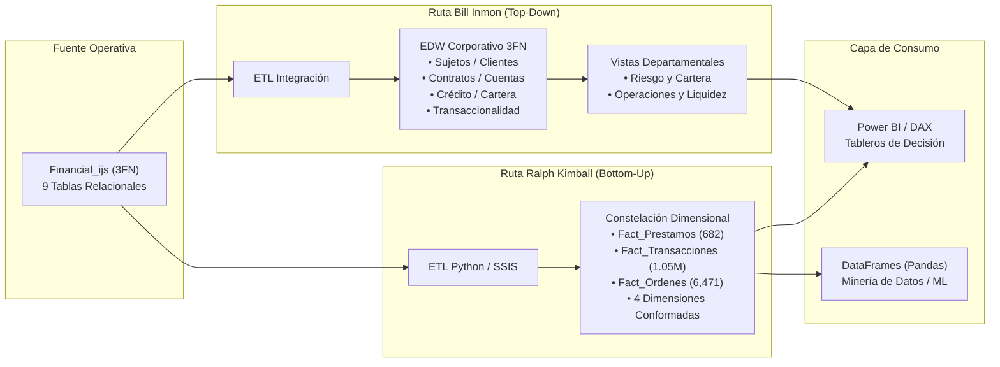

# Repositorio de Documentación de Inteligencia de Negocios
## Caso de Estudio: Banco Comercial Checo (`Financial_ijs`)

**Universidad Técnica de Ambato**  
**Facultad de Ingeniería en Sistemas, Electrónica e Industrial**  
**Carrera de Software — Ciclo Académico: Agosto 2026 – Diciembre 2026**  
**Asignatura:** Inteligencia de Negocios  
**Docente:** Ing. Ruben Nogales, Mg.  
**Integrantes:** Alison Marcela Cobos Taco / Henry Daniel Lagua Flores  

---

### 📂 Contenido del Repositorio

Este repositorio contiene la documentación metodológica oficial, el modelado de arquitecturas de almacenamiento de datos corporativos (DW/BI), los scripts DDL y los DataFrames analíticos para el caso de estudio `Financial_ijs`:

#### 1. Documentación Metodológica y Guías Prácticas
* 📄 **[01. Carta de Diseño Oficial (v6 Definitiva)](01_Carta_de_Diseno_Financial_ijs.md)**  
  *Levantamiento formal de requisitos analíticos, diagnóstico de negocio (morosidad activa del 10.04%, ratio de absorción de depósitos del 52.38%), especificación de métricas, resolución de la relación cuenta-cliente (`OWNER`), estrategias de Slowly Changing Dimensions (SCD), calidad de datos en staging y plan de validación.*
* 📄 **[02. Análisis y Modelado de Arquitecturas: Ralph Kimball vs. Bill Inmon](02_Analisis_Arquitecturas_Kimball_Inmon.md)**  
  *Diseño comparativo entre el enfoque Bottom-Up (Data Mart Bus Architecture con esquema en constelación) y el enfoque Top-Down (Corporate Information Factory con EDW en 3FN y data marts derivados), Matriz de Bus Corporativa, Source-to-Target Mapping y evaluación técnica de rendimiento.*

#### 2. Scripts DDL de Implementación Física (SQL Server)
* 💾 **[`sql/01_DDL_Kimball_DM_Financial.sql`](sql/01_DDL_Kimball_DM_Financial.sql)**  
  *Script DDL completo para la arquitectura dimensional de Ralph Kimball (`DM_Financial_Kimball_v2`). Define las 4 dimensiones conformadas (`Tiempo`, `Cuenta`, `Cliente`, `Distrito`), los catálogos específicos (`Estado_Prestamo`, `Operacion`, `Orden`) y las tablas de hechos atómicas (`Fact_Prestamos`, `Fact_Transacciones`, `Fact_Ordenes`) con tipos monetarios exactos `DECIMAL(12,2)`.*
* 💾 **[`sql/02_DDL_Inmon_EDW_Financial.sql`](sql/02_DDL_Inmon_EDW_Financial.sql)**  
  *Script DDL documental para la arquitectura corporativa de Bill Inmon (`EDW_Financial_Inmon`). Modela el repositorio central en Tercera Forma Normal (3FN) organizado por áreas temáticas y las vistas analíticas departamentales derivadas.*

#### 3. Pipelines de Carga y Generación (Python)
* ⚙️ **[`scripts/etl_populate_kimball_v2.py`](scripts/etl_populate_kimball_v2.py)**  
  *Pipeline ETL para extraer los datos desde la base de datos remota MySQL (`Financial_ijs`), aplicar reglas de limpieza (distritos, edad de corte, etiquetas de pago) y poblar el modelo Kimball en SQL Server.*
* ⚙️ **[`scripts/generar_4_dataframes.py`](scripts/generar_4_dataframes.py)**  
  *Script para extraer, transformar y exportar los **4 DataFrames analíticos** consolidados a partir de la base dimensional.*

#### 4. DataFrames Analíticos Exportados (`dataframes/`)
* 📊 **[`dataframes/df_prestamos.csv`](dataframes/df_prestamos.csv):** 682 filas $\times$ 24 columnas (Cartera de créditos, morosidad y riesgo).
* 📊 **[`dataframes/df_ordenes.csv`](dataframes/df_ordenes.csv):** 6,471 filas $\times$ 14 columnas (Débitos automáticos programados, bancos destino y categorías).
* 📊 **[`dataframes/df_cliente_consolidado.csv`](dataframes/df_cliente_consolidado.csv):** 5,369 filas $\times$ 29 columnas (Matriz Cliente 360 para clusterización y minería de datos).
* 📊 **[`dataframes/df_transacciones.csv.gz`](dataframes/df_transacciones.csv.gz):** 1,056,320 filas $\times$ 21 columnas (Movimientos contables completos en CSV comprimido Gzip).

---

### 🐍 Cómo Cargar los DataFrames en Python

```python
import pandas as pd

# 1. Cargar Préstamos
df_prestamos = pd.read_csv('dataframes/df_prestamos.csv')

# 2. Cargar Órdenes
df_ordenes = pd.read_csv('dataframes/df_ordenes.csv')

# 3. Cargar Cliente Consolidado (360)
df_cliente = pd.read_csv('dataframes/df_cliente_consolidado.csv')

# 4. Cargar Transacciones (Pandas descomprime el .csv.gz automáticamente en memoria)
df_trans = pd.read_csv('dataframes/df_transacciones.csv.gz')
print(f"Transacciones cargadas: {df_trans.shape[0]:,} filas x {df_trans.shape[1]} columnas")
```

---

### 🏛️ Diagrama de Arquitecturas Analíticas


