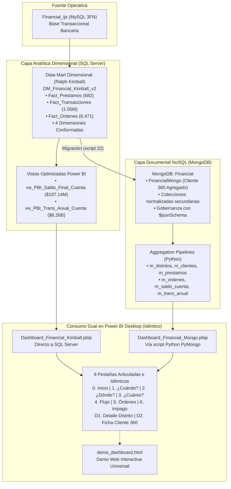

# Repositorio de Documentación de Inteligencia de Negocios
## Caso de Estudio: Banco Comercial Checo (`Financial_ijs`)

**Universidad Técnica de Ambato**  
**Facultad de Ingeniería en Sistemas, Electrónica e Industrial**  
**Carrera de Software — Ciclo Académico: Agosto 2026 – Diciembre 2026**  
**Asignatura:** Inteligencia de Negocios  
**Docente:** Ing. Ruben Nogales, Mg.  
**Integrantes:** Alison Marcela Cobos Taco / Henry Daniel Lagua Flores  

---

> ### 📊 DOCUMENTO PRINCIPAL DESTACADO: GUÍA DASHBOARD
> Para consultar la especificación completa del tablero de control gerencial, justificación teórica de cada gráfico, fundamentación psicofísica de percepción visual (Cleveland & McGill, Tufte, Few, Cumming, Wilson, Fisher, Cochran), datos exactos reconciliados, arquitectura de extracción Kimball SQL Server y MongoDB NoSQL, y maquetas visuales de las 9 pestañas:
> 
> 👉 **[GUÍA DEFINITIVA DEL DASHBOARD: IMPLEMENTACIÓN ARTICULADA EN POWER BI](Guia_Dashboard.md)** (Versión canónica: [`07_Guia_Dashboards_Articulados_PowerBI.md`](07_Guia_Dashboards_Articulados_PowerBI.md))
>
> 🌐 **Demo Interactiva en Vivo (Sin requerir Power BI Desktop):** Abra directamente con doble clic [`demo_dashboard.html`](demo_dashboard.html) en cualquier navegador web para navegar interactivamente por las 9 pestañas, probar los filtros y ejecutar los *drill-throughs* forenses.

---

### 📂 Contenido del Repositorio

Este repositorio contiene la documentación metodológica oficial, el modelado de arquitecturas de almacenamiento de datos corporativos (DW/BI y NoSQL), los scripts DDL, los DataFrames analíticos, las consultas M/DAX, los proyectos Power BI Desktop (`.pbip`), la demo interactiva web y las maquetas ejecutivas del Dashboard Gerencial para el caso de estudio `Financial_ijs`:

#### 1. Documentación Metodológica y Guías Oficiales
* 📘 **[Guía Dashboard: Implementación de Dashboards Articulados](Guia_Dashboard.md)** *(Acceso rápido)*  
  *Manual maestro de construcción del dashboard de 9 pestañas interconectadas mediante barra de navegación superior, botones ejecutivos, filtros sincronizados y doble nivel de Drill-through forense: P1…P6 → D1 (Detalle Distrito Karvina) → D2 (Ficha Cliente 360).*
* 📄 **[01. Carta de Diseño Oficial (v6 Definitiva)](01_Carta_de_Diseno_Financial_ijs.md)**  
  *Levantamiento formal de requisitos analíticos, diagnóstico de negocio (morosidad activa del 10.04%, ratio de absorción de depósitos del 52.38%), especificación de métricas, resolución de la relación cuenta-cliente (`OWNER`), estrategias de Slowly Changing Dimensions (SCD), calidad de datos en staging y plan de validación.*
* 📄 **[02. Análisis y Modelado de Arquitecturas: Ralph Kimball vs. Bill Inmon](02_Analisis_Arquitecturas_Kimball_Inmon.md)**  
  *Diseño comparativo entre el enfoque Bottom-Up (Data Mart Bus Architecture con esquema en constelación) y el enfoque Top-Down (Corporate Information Factory con EDW en 3FN y data marts derivados), Matriz de Bus Corporativa, Source-to-Target Mapping y evaluación técnica de rendimiento.*
* 📄 **[03. Informe de Guía Práctica: Limpieza y Transformación de Datos](03_Informe_Limpieza_y_Transformacion_de_Datos.md)**  
  *Guía práctica oficial de completitud de datos (enfoque híbrido OpenRefine + Python/Pandas/NumPy vectorizado), imputación causal vs. K-Means en distritos, resolución de contrapares bancarias, enriquecimiento semántico y validación de 0% nulos.*
* 📄 **[04. Informe de Guía Práctica: Sistemas de Recomendación](04_Informe_Sistemas_de_Recomendacion.md)**  
  *Guía práctica oficial de Sistemas de Recomendación bancarios estructurados bajo los paradigmas Demográfico (K-Means), Colaborativo (Slope One, Correlación de Pearson y Similitud de Coseno) y Basado en Contenido (Item-to-Item de Amazon con Frecuencia Inversa ITF), con formato CERO CÓDIGO sustentado en evidencias visuales y métricas formales.*
* 📄 **[05. Especificación Técnica: Modelo Dimensional Kimball (SQL Server) y Derivación Documental NoSQL (MongoDB)](05_Especificacion_Tecnica_Kimball_MongoDB.md)**  
  *Justificación arquitectónica de persistencia políglota, mapeo formal Kimball → MongoDB (Cliente 360 Agregado), gobernanza mediante `$jsonSchema` validator, y reconciliación cuantitativa rigurosa con delta de concordancia de $0.00.*
* 📄 **[06. Guía de Implementación del Dashboard en Power BI (Preliminar)](06_Guia_Implementacion_Dashboard_PowerBI_Kimball_Mongo.md)**  
  *Reglas de visualización del docente (Eje X categórico, Eje Y numérico, líneas continuas para series temporales, barras de error ±1σ para evaluar solapamiento muestral, gráficos de dona estrictamente monovariables con ≤ 5 clases, y prohibición total de 3D).*
* 📄 **[07. Guía Definitiva: Dashboards Articulados en Power BI (Kimball ↔ MongoDB)](07_Guia_Dashboards_Articulados_PowerBI.md)**  
  *Especificación canónica v3.1 (unión Alison + Henry): matriz de trazabilidad pregunta → visual → evidencia, base académica de cada gráfico (incluido el treemap), pruebas estadísticas reproducibles, maquetas calculadas desde los datos, obtención en SQL Server y MongoDB, y guion de defensa.*
* 📄 **[08. Dossier de Auditoría Externa y Blindaje Estadístico del Dashboard](08_Dossier_Auditoria_Externa_Dashboard.md)**  
  *Dossier canónico v2.1 para revisión externa y tribunal evaluador: reconciliación matemática exhaustiva, validación de hipótesis, test exacto de Fisher, ANOVA paramétrico y verificación forense de casos individuales (Cliente 2823 y Distrito Karvina).*

#### 2. Proyectos y Tableros Power BI Desktop (`dashboards/`)
* 📊 **[`demo_dashboard.html`](demo_dashboard.html) / [`dashboards/dashboard_interactivo.html`](dashboards/dashboard_interactivo.html):**  
  *Aplicación web interactiva completa (HTML5 / CSS3 / Chart.js) que replica con total fidelidad las 9 pestañas del dashboard, con selector de persistencia políglota, cálculo reactivo, badges de reconciliación y navegación articulada con drill-through.*
* 🗂️ **[`dashboards/Dashboard_Financial_Kimball/`](dashboards/Dashboard_Financial_Kimball/):**  
  *Proyecto oficial de Power BI Desktop (`.pbip`) configurado para consumir las vistas dimensionales de SQL Server (`DM_Financial_Kimball_v2`).*
* 🗂️ **[`dashboards/Dashboard_Financial_Mongo/`](dashboards/Dashboard_Financial_Mongo/):**  
  *Proyecto oficial de Power BI Desktop (`.pbip`) configurado para consumir las colecciones documentales de MongoDB (`Financial`).*

#### 3. Scripts DDL, Vistas y Medidas DAX (`sql/`)
* 💾 **[`sql/01_DDL_Kimball_DM_Financial.sql`](sql/01_DDL_Kimball_DM_Financial.sql):** Script DDL para el Data Mart dimensional de Ralph Kimball (`DM_Financial_Kimball_v2`) con tipos monetarios exactos `DECIMAL(12,2)`.
* 💾 **[`sql/02_DDL_Inmon_EDW_Financial.sql`](sql/02_DDL_Inmon_EDW_Financial.sql):** Script DDL para la arquitectura corporativa de Bill Inmon (`EDW_Financial_Inmon`) en Tercera Forma Normal (3FN).
* 💾 **[`sql/03_WriteBack_Enriquecimiento_Kimball.sql`](sql/03_WriteBack_Enriquecimiento_Kimball.sql):** Enriquecimiento de la dimensión cliente con arquetipos demográficos, solvencia y clusters.
* 💾 **[`sql/04_Vistas_PowerBI_Kimball.sql`](sql/04_Vistas_PowerBI_Kimball.sql):** Vistas analíticas optimizadas para Power BI: `vw_PBI_Saldo_Final_Cuenta` (resuelve el saldo semiaditivo en $197,140,434.00) y `vw_PBI_Trans_Anual_Cuenta` (agrega 1.05M transacciones a 54k filas preservando suma y suma de cuadrados para cálculo muestral exacto).
* 💾 **[`sql/05_Medidas_DAX_PowerBI.dax`](sql/05_Medidas_DAX_PowerBI.dax):** Catálogo formal de 25 medidas DAX optimizadas para ambos tableros con validaciones lógicas y formato de moneda.

#### 4. Pipelines ETL, Conectores NoSQL y Generadores (`scripts/`)
* ⚙️ **[`scripts/etl_populate_kimball_v2.py`](scripts/etl_populate_kimball_v2.py):** Pipeline ETL de carga dimensional desde MySQL hacia SQL Server.
* ⚙️ **[`scripts/22_migrar_kimball_a_mongodb.py`](scripts/22_migrar_kimball_a_mongodb.py):** Migración automatizada desde SQL Server hacia colecciones documentales en MongoDB.
* ⚙️ **[`scripts/24_reconciliacion_kimball_mongo.py`](scripts/24_reconciliacion_kimball_mongo.py):** Script de reconciliación matemática exhaustiva (Δ = $0.00 en todos los totales).
* ⚙️ **[`scripts/25_aplicar_jsonschema_mongo.py`](scripts/25_aplicar_jsonschema_mongo.py):** Aplicación de validadores estrictos `$jsonSchema` en MongoDB.
* ⚙️ **[`scripts/26_powerbi_mongo_dashboard.py`](scripts/26_powerbi_mongo_dashboard.py):** Conector Python para Power BI Desktop que extrae las 7 tablas agregadas directamente desde *Aggregation Pipelines* de MongoDB. Compatible con el esquema anidado (dump) y el plano (CSV).
* ⚙️ **[`scripts/27_evidencia_estadistica_dashboard.py`](scripts/27_evidencia_estadistica_dashboard.py):** Reproduce todas las cifras y pruebas estadísticas (χ², Fisher, ANOVA, Welch, error estándar) que citan los dashboards y las guarda en `metricas_dashboard_07.json`.
* ⚙️ **[`scripts/28_mockup_dashboard.py`](scripts/28_mockup_dashboard.py):** Genera las 9 maquetas del dashboard calculando cada cifra desde los DataFrames del repositorio (sin valores escritos a mano).
* ⚙️ **[`scripts/29_generar_dashboard_html.py`](scripts/29_generar_dashboard_html.py):** Generador del dashboard web interactivo.
* ⚙️ **[`scripts/30_generar_powerbi_pbip.py`](scripts/30_generar_powerbi_pbip.py):** Generador de los proyectos Power BI Desktop (`.pbip`).

#### 5. Maquetas Ejecutivas del Dashboard (`img/mockup_dashboard/`)
* 🖼️ **[`00_inicio.png`](img/mockup_dashboard/00_inicio.png):** Panorama general (KPIs ejecutivos, hilo conductor analítico y botones de navegación a P1…P6).
* 🖼️ **[`01_p1_cuando.png`](img/mockup_dashboard/01_p1_cuando.png):** Serie temporal continua (1993–1998) con el pico crítico de 1997 (23 créditos en mora D).
* 🖼️ **[`02_p2_donde.png`](img/mockup_dashboard/02_p2_donde.png):** Comparativa macro-regional con barras de error (±1σ) demostrando solapamiento muestral (ANOVA $p=0.8861$), y scatter plot distrital destacando a Karvina.
* 🖼️ **[`03_p3_cuanto.png`](img/mockup_dashboard/03_p3_cuanto.png):** Absorción de liquidez ($103.26M cartera vs $197.14M depósitos, ratio 52.38%).
* 🖼️ **[`04_p4_flujo.png`](img/mockup_dashboard/04_p4_flujo.png):** Flujo transaccional ($6.26B en 1.05M movimientos) y ticket promedio con ±1σ.
* 🖼️ **[`05_p5_ordenes.png`](img/mockup_dashboard/05_p5_ordenes.png):** Gráfico de dona monovariable (5 categorías de órdenes fijas) y top de clientes saturados (índice > 0.5).
* 🖼️ **[`06_p6_impago.png`](img/mockup_dashboard/06_p6_impago.png):** Perfil de los 31 clientes con impago histórico (Estado B) y validación de Fisher exacto ($p > 0.35$).
* 🖼️ **[`07_d1_distrito.png`](img/mockup_dashboard/07_d1_distrito.png):** Detalle forense de Karvina (20% de mora activa, 24 créditos) y destaque del crédito de $541,200.
* 🖼️ **[`08_d2_cliente360.png`](img/mockup_dashboard/08_d2_cliente360.png):** Ficha 360 del Cliente 2823 (Cuenta 2335, cuota mensual de $14,286, saldo negativo de -$2,803 e índice de saturación de 2.14x).

---

### 🏛️ Diagrama de Persistencia Políglota y Consumo en Power BI

```mermaid
flowchart TB
    subgraph Origen["Fuente Operativa"]
        OLTP["Financial_ijs (MySQL 3FN)<br>Base Transaccional Bancaria"]
    end

    subgraph DW["Capa Analítica Dimensional (SQL Server)"]
        DM_K["Data Mart Dimensional (Ralph Kimball)<br>DM_Financial_Kimball_v2<br>• Fact_Prestamos (682)<br>• Fact_Transacciones (1.05M)<br>• Fact_Ordenes (6,471)<br>• 4 Dimensiones Conformadas"]
        Vistas["Vistas Optimizadas Power BI<br>• vw_PBI_Saldo_Final_Cuenta ($197.14M)<br>• vw_PBI_Trans_Anual_Cuenta ($6.26B)"]
        DM_K --> Vistas
    end

    subgraph NoSQL["Capa Documental NoSQL (MongoDB)"]
        Mongo["MongoDB: Financial<br>• FinancialMongo (Cliente 360 Agregado)<br>• Colecciones normalizadas secundarias<br>• Gobernanza con $jsonSchema"]
        PyMongo["Aggregation Pipelines (Python)<br>• m_distritos, m_clientes, m_prestamos<br>• m_ordenes, m_saldo_cuenta, m_trans_anual"]
        Mongo --> PyMongo
    end

    subgraph PBI["Consumo Dual en Power BI Desktop (Idéntico)"]
        PB_Kimball["Dashboard_Financial_Kimball.pbip<br>Directo a SQL Server"]
        PB_Mongo["Dashboard_Financial_Mongo.pbip<br>Vía script Python PyMongo"]
        Demo_Web["demo_dashboard.html<br>Demo Web Interactiva Universal"]
        Tabs["9 Pestañas Articuladas e Idénticas<br>0. Inicio | 1. ¿Cuándo? | 2. ¿Dónde? | 3. ¿Cuánto?<br>4. Flujo | 5. Órdenes | 6. Impago<br>D1. Detalle Distrito | D2. Ficha Cliente 360"]
    end

    OLTP --> DM_K
    DM_K -- "Migración (script 22)" --> Mongo
    Vistas --> PB_Kimball
    PyMongo --> PB_Mongo
    PB_Kimball --> Tabs
    PB_Mongo --> Tabs
    Tabs -.-> Demo_Web
```
